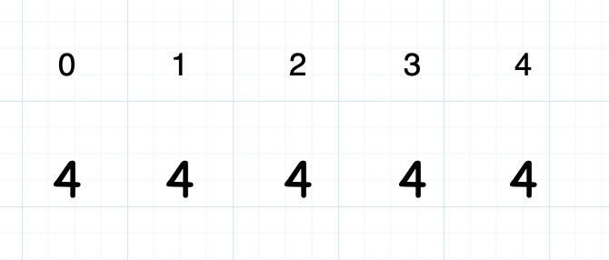

- [面试题 08.03. 魔术索引](#面试题-0803-魔术索引)
  - [题目](#题目)
  - [题解](#题解)
    - [方法一：二分剪枝](#方法一二分剪枝)
    - [评论区的讨论](#评论区的讨论)

------------------------------

# 面试题 08.03. 魔术索引

## 题目

魔术索引。 在数组 `A[0...n-1]` 中，有所谓的魔术索引，满足条件 `A[i] = i`。给定一个**有序**整数数组，编写一种方法找出魔术索引，若有的话，在数组A中找出一个魔术索引，如果没有，则返回-1。若有多个魔术索引，返回索引值最小的一个。

示例1:

```
 输入：nums = [0, 2, 3, 4, 5]
 输出：0
 说明: 0下标的元素为0
```

示例2:

```
 输入：nums = [1, 1, 1]
 输出：1
```

提示:

- nums长度在[1, 1000000]之间

--------------------

- 来源：力扣（LeetCode）
- 链接：https://leetcode-cn.com/problems/magic-index-lcci
- 著作权归领扣网络所有。商业转载请联系官方授权，非商业转载请注明出处。


## 题解

> 只想到了 $O(n)$ 复杂度的算法，就是遍历一遍。

### 方法一：二分剪枝

> 这个解法有点问题，看下面的评论。

**思路与算法**

此问题如果用暴力的方法来解决，我们只需要对原数组从前往后进行一次遍历，找到第一个可行的位置返回即可，这里不再赘述。
而本方法会进行一定程度的剪枝，在一些情况下会达到较优的时间复杂度，在最差情况下仍会退化成线性的时间复杂度，这里我们分两种情况讨论。

第一种情况是**数组中只有一个满足条件的答案**。我们假设这个答案为 $i$，那么意味着 $[0 \ldots i-1]$ 的值均小于自身的下标，$[i+1 \ldots n-1]$ 的值均大于自身的下标。我们将整个数组每个元素减去其自身所在的下标，那么最后的答案即为 $0$ 所在的下标，且在 $0$ 之前的元素均为负数，$0$ 之后的元素均为正数。以 $[-1,0,2,4,5]$ 为例，减去自身下标以后以后得到 $[-1,-1,0,1,1]$，整个数组是具有单调性的，直接二分查找即能在 $O(\log n)$ 的时间内找到答案 $0$ 所在的下标。

> ($[1, 2, 2, 4]$) 只有一个满足条件，即 $[2]$，但是 $[2]$ 前面的值都是大于下标的呀，减去下标后是 $[1, 1, 0, 1]$。

第二种情况是**数组中存在多个满足条件的答案**，此时我们发现整个数组不具有任何性质。以 $[0,0,2,2,5]$ 为例，我们仍进行一次将每个元素减去其自身下标的操作，得到 $[0,-1,0,-1,1]$。目标是要找到第一个出现的 $0$，而由于数组没有单调性，这里无法使用二分查找，但是我们可以依据此来进行一定程度的剪枝，我们剪枝的策略为：

- 每次我们选择数组的中间元素，如果当前中间元素是满足条件的答案，那么这个位置往后的元素我们都不再考虑，只要寻找左半部分是否有满足条件的答案即可。
- 否则我们需要查看左半部分是否有满足条件的答案，**如果没有的话我们仍然需要在右半边寻找**，使用的策略同上。

我们可以依靠此策略定义一个递归函数：`getAnswer(nums, left, right)` 返回数组 `nums` 的下标范围 `[left,right]` 中第一个满足条件的答案，如果没有返回 `-1`。每次选择中间的位置 `mid`，此时直接先递归调用数组左半部分 `getAnswer(nums, left, mid - 1)` 得到返回值 `leftAnswer`，如果存在则直接返回，如果不存在则比较 `nums[mid]` 和 `mid` 是否相等，如果相等则返回 `mid`，否则需要递归调用 `getAnswer(nums, mid + 1, right)`。

显然，此剪枝策略在 `[-1,0,1,2,4]` 这种答案为数组的最后一个元素的情况下会退化成线性的时间复杂度，但是在一些情况下会有不错的表现。

```go
func findMagicIndex(nums []int) int {
    return getAnswer(nums, 0, len(nums) - 1)
}

func getAnswer(nums []int, left, right int) int {
    if left > right {
        return -1
    }
    mid := (right - left) / 2 + left
    leftAnswer := getAnswer(nums, left, mid - 1)
    if leftAnswer != -1 {
        return leftAnswer
    } else if nums[mid] == mid {
        return mid
    }
    return getAnswer(nums, mid + 1, right)
}
```

**复杂度分析**

- 时间复杂度：最坏情况下会达到 $O(n)$ 的时间复杂度，其中 $n$ 为数组的长度。具体分析已经在上文中讲述，这里不再赘述。
- 空间复杂度：递归函数的空间取决于调用的栈深度，而最坏情况下我们会递归 $n$ 层，即栈深度为 $O(n)$，因此空间复杂度最坏情况下为 $O(n)$。

### 评论区的讨论

官方题解这所谓的二分递归，实际上还是从左到右把数组遍历了一遍吧，二分每次能排除一半元素，但这个实际上先搜左边，左边搜不到搜右边，感觉还是在做遍历，那倒不如在直接遍历上做一个跳跃性的优化。

```py
def findMagicIndex(self, nums: List[int]) -> int:
        i=0
        while i < len(nums):
            if i==nums[i]:
                return i
            if i<nums[i]:
                i=nums[i]
            else:
                i+=1
        return -1
```

> 为什么 `i < nums[i]` 时 `i` 可以直接跳到 `nums[i]`?
> 因为 `nums[i]` 后面的都是大于等于 `nums[i]` 的，所以索引 `[i .. nums[i]]` 之间的数也都大于它们的索引。看下图：



这个依赖于数组是升序的，降序不行。

--------------------

【求顶】今早发现打卡题的评论区有点不受控制了，所以就强行主动代表一下官方讲一下这题到底啥情况。

这题是《程序员面试金典》里面的一道题。在书里这题是有两个小问的，它们的描述很相似。第二个小问相当于本题，而第一个小问保证了题目给定的数组是【严格单调递增】的，就是不会有重复的数字。

所以第一个小问是经典的二分查找问题，时间复杂度为 $O(log n)$。而第二个小问相当于是前者的一个 follow up：面试官在看到你解决了问题之后，会问你如果数组中可以出现重复的元素应该怎么做，就变成了本题了。

面试官期望是你能分析出此时是没有 $O(log n)$ 的做法的，由于面试者手上已经有了第一个小问的二分代码，所以改成分治的形式（两边都要搜索）是比较方便的。当然也可以跳出原来的框架，直接使用普通的遍历方法或者【跳着】的遍历方法，都是很好的解决方案的。

如果对本题还有什么疑惑，可以在下面评论。