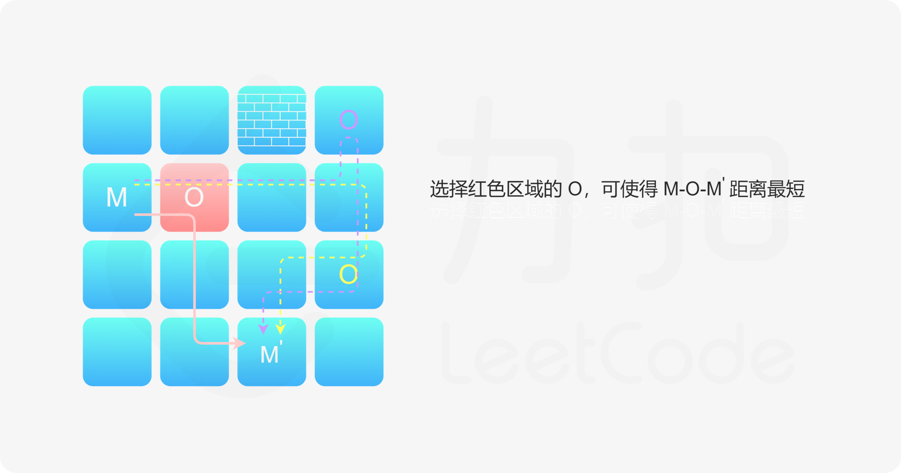

- [寻宝](#寻宝)
  - [题目](#题目)
  - [题解](#题解)
    - [方法一：状态压缩动态规划](#方法一状态压缩动态规划)

------------------------------

# 寻宝

## 题目

我们得到了一副藏宝图，藏宝图显示，在一个迷宫中存在着未被世人发现的宝藏。

迷宫是一个二维矩阵，用一个字符串数组表示。它标识了唯一的入口（用 'S' 表示），和唯一的宝藏地点（用 'T' 表示）。但是，宝藏被一些隐蔽的机关保护了起来。在地图上有若干个机关点（用 'M' 表示），只有所有机关均被触发，才可以拿到宝藏。

要保持机关的触发，需要把一个重石放在上面。迷宫中有若干个石堆（用 'O' 表示），每个石堆都有无限个足够触发机关的重石。但是由于石头太重，我们一次只能搬一个石头到指定地点。

迷宫中同样有一些墙壁（用 '#' 表示），我们不能走入墙壁。剩余的都是可随意通行的点（用 '.' 表示）。石堆、机关、起点和终点（无论是否能拿到宝藏）也是可以通行的。

我们每步可以选择向上/向下/向左/向右移动一格，并且不能移出迷宫。搬起石头和放下石头不算步数。那么，从起点开始，我们最少需要多少步才能最后拿到宝藏呢？如果无法拿到宝藏，返回 -1 。

示例 1：

```
输入： ["S#O", "M..", "M.T"]

输出：16

解释：最优路线为： S->O, cost = 4, 去搬石头 O->第二行的M, cost = 3, M机关触发 第二行的M->O, cost = 3, 我们需要继续回去 O 搬石头。 O->第三行的M, cost = 4, 此时所有机关均触发 第三行的M->T, cost = 2，去T点拿宝藏。 总步数为16。 
```


示例 2：

```
输入： ["S#O", "M.#", "M.T"]

输出：-1

解释：我们无法搬到石头触发机关
```

示例 3：

```
输入： ["S#O", "M.T", "M.."]

输出：17

解释：注意终点也是可以通行的。
```

限制：

- 1 <= maze.length <= 100
- 1 <= maze[i].length <= 100
- maze[i].length == maze[j].length
- S 和 T 有且只有一个
- 0 <= M的数量 <= 16
- 0 <= O的数量 <= 40，题目保证当迷宫中存在 M 时，一定存在至少一个 O 。

--------------------

- 来源：力扣（LeetCode）
- 链接：https://leetcode-cn.com/problems/xun-bao
- 著作权归领扣网络所有。商业转载请联系官方授权，非商业转载请注明出处。


## 题解

### 方法一：状态压缩动态规划

**题意概述**

一个人在迷宫中，要从起点 S 走到终点 T。迷宫有两类特殊点，分别是：

- M：机关点，需要用石头触发
- O：石头点，一次可以搬一块石头

只有当所有 M 点均被触发以后，终点才可到达，问起点走到终点的最小代价。

**思路与算法**

虽然迷宫有很多格子，但是我们实际上的走法只有几种：

- 从 S 走到 O，我们不会从 S 直接走到 M，因为触发机关要先搬石头
- 从 O 走到 M
- 从 M 走到 O
- 从 M 走到 T

有一点性质很重要，不论我们触发机关还是搬运石头，都不会改变迷宫的连通状态。因此，**两个点的最短距离一旦计算出，就不会再改变了**。 于是第一步，我们可以做一步预处理——我们计算所有特殊点（包括 M，O，S，T）互相之间的最短距离，即对这里面的每个点做一次 BFS。这样我们就不需要考虑其他点了。为什么要预处理出这些特殊点两两之间的距离，这个问题会在在下文中解释。

解决这个问题的关键是理解我们要以什么样的策略来取石头和触发机关：

- 在最开始，我们一定会从 S，经过某一个 O，到达某一个 M。那么对于特定的 M 来说，我们枚举 O 就可以计算 S-O-M 的最短距离。那么如果我们要从起点 S 到达 M，一定会选择这条距离最短的路。这样，我们首先得到了 S 到每一个 M 的最短距离。
    
- 假定我们已经从起点到达了某个 M 了，接下来需要去其他的 O 点搬石头接着触发其他的机关，这是一个 M-O-M' 的路线。同样的道理，对于给定的 M'，中间的 O 也是固定的。即给定 M 和 M'，我们可以确定一个 O，使得 M-O-M' 距离最短。我们同样可以记录下这个最短距离，即得到了所有 M 到 M' 的最短距离。
    
- 最后，所有 M 到 T 的距离在前面已经计算出了。

我们需要所有的 M 都被触发，M 的触发顺序不同会导致行走的路径长度不同。假设这里一共有 n 个 M，我们用 $d(i, j)$ 表示第 i 个 M 到第 j 个 M 经过某一个 O 的最短距离。因为这里的 n 不大于 16，我们可以使用一个 16 位的二进制数表示状态，这个二进制数的第 i 位为 1 表示第 i 个 M 已经触发，为 0 表示第 i 个 M 还未被触发，记这个二进制数为 $\rm mask$。记 $M_i$ 为第 i 个 M（下标从 1 开始），每一个 $\rm mask$ 都可以表示成两个集合，一个已触发集合、一个未触发集合，例如 $n = 16，mask = 0000~1100~0001~0001$ 的已触发集合就可以表示为 $T = \{ M_1, M_5, M_{11}, M_{12} \}$，剩下的元素都在未触发集合 $U - T$ 中。

我们定义 $f({\rm mask}, i)$ 表示当前在第 i 个 M 处，触发状态为 ${\rm mask}$ 的最小步数，如果当前 ${\rm mask}$ 代表的已触发集合为 T，未触发集合为 U - T，则我们可以推出这样的动态规划转移方程：

$$
f({\rm mask}, i) = \min_{j \in T, j \neq i } \{ f({\rm mask}~{\rm xor}~2^i, j) + d(j, i)\}
$$

其中 ${\rm mask}~{\rm xor}~2^i$ 表示把 $M_i$ 已触发的集合当中去掉，即 ${\rm mask}$ 这个状态可以由 ${\rm mask}~{\rm xor}~2^i$ 状态转移得到，转移时我们除了关注触发状态 $\rm mask$ 的变化，我们还关注是从哪一个 M 转移到了 $M_i$，我们可以枚举 $\rm mask$ 当中已触发的所有的 $M_j(j \neq i)$ 作为上一个位置，而 $d(j, i)$ 就是我们从 j 转移到 i 行走的最短步数，我们可以在预处理之后按照我们的策略得到所有的 $d(j, i)$（如果 i, j 不可达可以设为正无穷），然后 $O(1)$ 查询，这就是预处理的目的。

实际上，在实现的时候，如果我们用记忆化搜索的方式实现，那么我们用到的是上面的转移方程；如果我们使用循环实现的话，也可以使用下面的转移方程，写法类似递推：

$$
f({\rm mask} | 2^j, j) = \min \{ f({\rm mask}, i) + d(i, j) \}
$$

大家可以结合代码来理解。当然，写代码的时候需要注意的是：

- 由于本题的复杂度较高，使用 Python 等性能较差的语言实现时需要注意效率问题。
- 本题边界情况较多，比如迷宫没有 M、M 不可达等。

**题型小结**

这道题是一个非常经典的状态压缩动态规划模型：有 n 个任务 $\{M_1, M_2 \cdots M_n \}$，每两个任务之间有一个 $c(M_i, M_j)$ 表示在 $M_i$ 之后（下一个）做 $M_j$ 的花费，让你求解把 n 个任务都做完需要的最小花费。通常这个 n 会非常的小，因为需要构造 $2^n$ 种状态，$c(M_i, M_j)$ 可能是题目给出，也可能是可以在很短的时间内计算出来的一个值。这类问题的状态设计一般都是 $f({\rm mask}, i)$ 表示当前任务完成的状态是 $\rm mask$，当前位置是 i，考虑转移的时候我们只需要考虑当前任务的上一个任务即可。希望读者可以理解这里的思想，并尝试使用记忆化搜索和循环两种方式实现。

```go
var (
    dx = []int{1, -1, 0, 0}
    dy = []int{0, 0, 1, -1}
    n, m int
)
func minimalSteps(maze []string) int {
    n, m = len(maze), len(maze[0])
    // 机关 & 石头
    var buttons, stones [][]int
    // 起点 & 终点
    sx, sy, tx, ty := -1, -1, -1, -1
    for i := 0; i < n; i++ {
        for j := 0; j < m; j++ {
            switch maze[i][j] {
            case 'M':
                buttons = append(buttons, []int{i, j})
            case 'O':
                stones = append(stones, []int{i, j})
            case 'S':
                sx, sy = i, j
            case 'T':
                tx, ty = i, j
            }
        }
    }

    nb, ns := len(buttons), len(stones)
    startDist := bfs(sx, sy, maze)
    // 边界情况：没有机关
    if nb == 0 {
        return startDist[tx][ty]
    }
    // 从某个机关到其他机关 / 起点与终点的最短距离。
    dist := make([][]int, nb)
    for i := 0; i < nb; i++ {
        dist[i] = make([]int, nb + 2)
        for j := 0; j < nb + 2; j++ {
            dist[i][j] = -1
        }
    }
    // 中间结果
    dd := make([][][]int, nb)
    for i := 0; i < nb; i++ {
        dd[i] = bfs(buttons[i][0], buttons[i][1], maze)
        // 从某个点到终点不需要拿石头
        dist[i][nb + 1] = dd[i][tx][ty]
    }
    for i := 0; i < nb; i++ {
        tmp := -1
        for k := 0; k < ns; k++ {
            midX, midY := stones[k][0], stones[k][1]
            if dd[i][midX][midY] != -1 && startDist[midX][midY] != -1 {
                if tmp == -1 || tmp > dd[i][midX][midY] + startDist[midX][midY] {
                    tmp = dd[i][midX][midY] + startDist[midX][midY]
                }
            }
        }
        dist[i][nb] = tmp
        for j := i + 1; j < nb; j++ {
            mn := -1
            for k := 0; k < ns; k++ {
                midX, midY := stones[k][0], stones[k][1]
                if dd[i][midX][midY] != -1 && startDist[midX][midY] != -1 {
                    if mn == -1 || mn > dd[i][midX][midY] + dd[j][midX][midY] {
                        mn = dd[i][midX][midY] + dd[j][midX][midY]
                    }
                }
            }
            dist[i][j] = mn
            dist[j][i] = mn
        }
    }
    // 无法达成的情形
    for i := 0; i < nb; i++ {
        if dist[i][nb] == -1 || dist[i][nb + 1] == -1 {
            return -1
        }
    }
    // dp 数组， -1 代表没有遍历到
    dp := make([][]int, 1 << nb)
    for i := 0; i < (1 << nb); i++ {
        dp[i] = make([]int, nb)
        for j := 0; j < nb; j++ {
            dp[i][j] = -1
        }
    }
    for i := 0; i < nb; i++ {
        dp[1 << i][i] = dist[i][nb]
    }

    // 由于更新的状态都比未更新的大，所以直接从小到大遍历即可
    for mask := 1; mask < (1 << nb); mask++ {
        for i := 0; i < nb; i++ {
            // 当前 dp 是合法的
            if mask & (1 << i) != 0 {
                for j := 0; j < nb; j++ {
                    // j 不在 mask 里
                    if mask & (1 << j) == 0 {
                        next := mask | (1 << j)
                        if dp[next][j] == -1 || dp[next][j] > dp[mask][i] + dist[i][j] {
                            dp[next][j] = dp[mask][i] + dist[i][j]
                        }
                    }
                }
            }
        }
    }
    ret := -1
    finalMask := (1 << nb) - 1
    for i := 0; i < nb; i++ {
        if ret == -1 || ret > dp[finalMask][i] + dist[i][nb + 1] {
            ret = dp[finalMask][i] + dist[i][nb + 1]
        }
    }
    return ret
}

func bfs(x, y int, maze []string) [][]int {
    ret := make([][]int, n)
    for i := 0; i < n; i++ {
        ret[i] = make([]int, m)
        for j := 0; j < m; j++ {
            ret[i][j] = -1
        }
    }
    ret[x][y] = 0
    queue := [][]int{}
    queue = append(queue, []int{x, y})
    for len(queue) > 0 {
        p := queue[0]
        queue = queue[1:]
        curx, cury := p[0], p[1]
        for k := 0; k < 4; k++ {
            nx, ny := curx + dx[k], cury + dy[k]
            if inBound(nx, ny) && maze[nx][ny] != '#' && ret[nx][ny] == -1 {
                ret[nx][ny] = ret[curx][cury] + 1
                queue = append(queue, []int{nx, ny})
            }
        }
    }
    return ret
}

func inBound(x, y int) bool {
    return x >= 0 && x < n && y >= 0 && y < m
}
```

**复杂度分析**

假设迷宫的面积为 s，M 的数量为 m，O 的数量为 o。

- 时间复杂度：$O(ms + m^2o + 2^m m^2)$。单次 BFS 的时间代价为 $O(s)$，m 次 BFS 的时间代价为 $O(ms)$；预处理任意两个 M 经过 O 的最短距离的时间代价是 $O(m^2o)$；动态规划的时间代价是 $O(2^m m^2)$。
- 空间复杂度：$O(s + bs + 2^m m)$。BFS 队列的空间代价是 $O(s)$；预处理 $M_i$ 到各个点的最短距离的空间代价是 $O(bs)$；动态规划数组的空间代价是 $O(2^m m)$。
