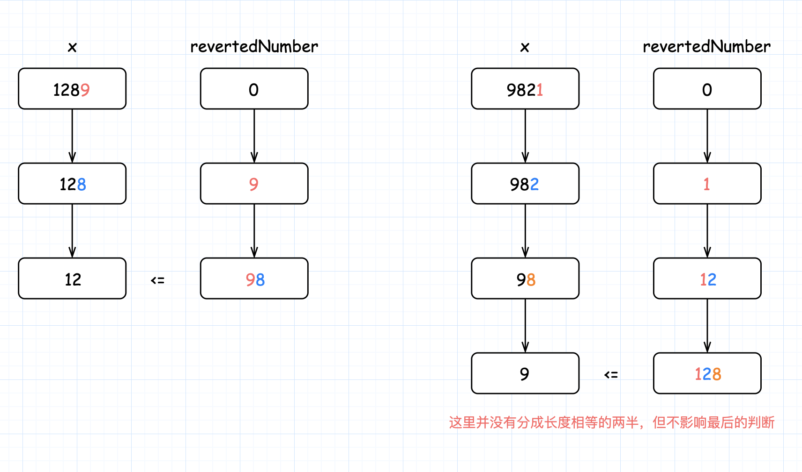

- [回文数](#回文数)
  - [题目](#题目)
  - [解答](#解答)


------------------------------

# 回文数

## 题目

判断一个整数是否是回文数。回文数是指正序（从左向右）和倒序（从右向左）读都是一样的整数。

示例 1:

```
输入: 121
输出: true
```

示例 2:

```
输入: -121
输出: false
解释: 从左向右读, 为 -121 。 从右向左读, 为 121- 。因此它不是一个回文数。
```

示例 3:

```
输入: 10
输出: false
解释: 从右向左读, 为 01 。因此它不是一个回文数。
```

进阶: 你能不将整数转为字符串来解决这个问题吗？

- 来源：力扣（LeetCode）
- 链接：https://leetcode-cn.com/problems/palindrome-number
- 著作权归领扣网络所有。商业转载请联系官方授权，非商业转载请注明出处。

## 解答

1. 方案1：
   - 把数字转成字符串，然后把字符串反转，比较两个字符串是否相同。(只需要比较前半部分和后半部分是否相等就行！)
   - 缺点：需要额外的空间来存储字符串。
2. 方案2：
   - 把数字反转（123 -> 321），比较两个数字是否相等。
   - 缺点：反转后的数字可能会溢出。（如果溢出是不是就意味着不是回文？？）
3. 方案3：
   - 只反转数字的一半，见下面的详细描述。

首先，我们应该处理一些临界情况。**所有负数都不可能是回文**，例如：`-123` 不是回文，因为 `-` 不等于 `3`。所以我们可以对所有负数返回 false。**除了 0 以外，所有个位是 0 的数字不可能是回文**，因为最高位不等于 0。所以我们可以对所有大于 0 且个位是 0 的数字返回 false。

现在，让我们来考虑如何反转后半部分的数字。

对于数字 `1221`，如果执行 `1221 % 10`，我们将得到最后一位数字 1，要得到倒数第二位数字，我们可以先通过除以 10 把最后一位数字从 1221 中移除，`1221 / 10 = 122`，再求出上一步结果除以 10 的余数，`122 % 10 = 2`，就可以得到倒数第二位数字。如果我们把最后一位数字乘以 10，再加上倒数第二位数字，`1 * 10 + 2 = 12`，就得到了我们想要的反转后的数字。如果继续这个过程，我们将得到更多位数的反转数字。

现在的问题是，**我们如何知道反转数字的位数已经达到原始数字位数的一半？**

由于整个过程我们不断将原始数字除以 10，然后给反转后的数字乘上 10，所以，**当原始数字小于或等于反转后的数字时，就意味着我们已经处理了一半位数的数字了**。




```go
func isPalindrome(x int) bool {
    // 特殊情况：
    // 如上所述，当 x < 0 时，x 不是回文数。
    // 同样地，如果数字的最后一位是 0，为了使该数字为回文，
    // 则其第一位数字也应该是 0
    // 只有 0 满足这一属性
    if x < 0 || (x % 10 == 0 && x != 0) {
        return false
    }

    revertedNumber := 0
    for x > revertedNumber {
        revertedNumber = revertedNumber * 10 + x % 10
        x /= 10
    }

    // 当数字长度为奇数时，我们可以通过 revertedNumber/10 去除处于中位的数字。
    // 例如，当输入为 12321 时，在 while 循环的末尾我们可以得到 x = 12，revertedNumber = 123，
    // 由于处于中位的数字不影响回文（它总是与自己相等），所以我们可以简单地将其去除。
    return x == revertedNumber || x == revertedNumber / 10
}
```

复杂度分析

- 时间复杂度：$O(\log n)$，对于每次迭代，我们会将输入除以 10，因此时间复杂度为 $O(\log n)$
- 空间复杂度：$O(1)$。我们只需要常数空间存放若干变量。
