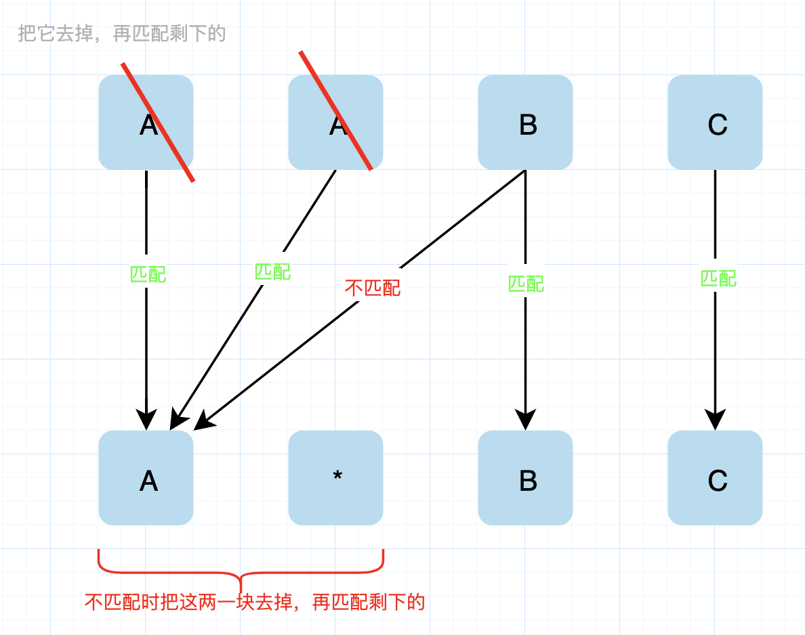

- [正则表达式匹配](#正则表达式匹配)
  - [题目](#题目)
  - [题解](#题解)
    - [回溯](#回溯)
      - [我的分析](#我的分析)
    - [动态规划](#动态规划)
      - [我的分析](#我的分析-1)


------------------------------

# 正则表达式匹配

## 题目

给你一个字符串 s 和一个字符规律 p，请你来实现一个支持 `'.'` 和 `'*'` 的正则表达式匹配。

- `'.'` 匹配任意单个字符
- `'*'` 匹配零个或多个前面的那一个元素

所谓匹配，是要涵盖 **整个** 字符串 s 的，而不是部分字符串。

说明:

- s 可能为空，且只包含从 a-z 的小写字母。
- p 可能为空，且只包含从 a-z 的小写字母，以及字符 `.` 和 `*`。

示例 1:

```
输入:
s = "aa"
p = "a"
输出: false
解释: "a" 无法匹配 "aa" 整个字符串。
```

示例 2:

```
输入:
s = "aa"
p = "a*"
输出: true
解释: 因为 '*' 代表可以匹配零个或多个前面的那一个元素, 在这里前面的元素就是 'a'。因此，字符串 "aa" 可被视为 'a' 重复了一次。
```

示例 3:

```
输入:
s = "ab"
p = ".*"
输出: true
解释: ".*" 表示可匹配零个或多个（'*'）任意字符（'.'）。
```

示例 4:

```
输入:
s = "aab"
p = "c*a*b"
输出: true
解释: 因为 '*' 表示零个或多个，这里 'c' 为 0 个, 'a' 被重复一次。因此可以匹配字符串 "aab"。
```

示例 5:

```
输入:
s = "mississippi"
p = "mis*is*p*."
输出: false
```

- 来源：力扣（LeetCode）
- 链接：https://leetcode-cn.com/problems/regular-expression-matching
- 著作权归领扣网络所有。商业转载请联系官方授权，非商业转载请注明出处。


## 题解

### 回溯

如果没有星号，我们的代码会像这样：

```py
def match(text, pattern):
    if not pattern: return not text
    # test 不为空， pattern[0] == text[0] || pattern[0] == '.'
    first_match = bool(text) and pattern[0] in {text[0], '.'}
    return first_match and match(text[1:], pattern[1:])
```

如果模式串中有星号，它会出现在第二个位置，即 $\text{pattern[1]}$ 。这种情况下，我们可以直接忽略模式串中这一部分，或者删除匹配串的第一个字符，前提是它能够匹配模式串当前位置字符，即 $\text{pattern[0]}$。如果两种操作中有任何一种使得剩下的字符串能匹配，那么初始时，匹配串和模式串就可以被匹配。

```java
class Solution {
    public boolean isMatch(String text, String pattern) {
        if (pattern.isEmpty()) return text.isEmpty();
        boolean first_match = (!text.isEmpty() &&
                               (pattern.charAt(0) == text.charAt(0) || pattern.charAt(0) == '.'));

        if (pattern.length() >= 2 && pattern.charAt(1) == '*'){
            return (isMatch(text, pattern.substring(2)) ||
                    (first_match && isMatch(text.substring(1), pattern)));
        } else {
            return first_match && isMatch(text.substring(1), pattern.substring(1));
        }
    }
}
```

复杂度分析

- 时间复杂度：用 T 和 P 分别表示匹配串和模式串的长度。在最坏情况下，函数 `match(text[i:], pattern[2j:])` 会被调用 $\binom{i+j}{i}$ 次，并留下长度为 $O(T - i)$ 和 $O(P - 2*j)$ 长度的字符串。因此，总时间为 $\sum_{i = 0}^T \sum_{j = 0}^{P/2} \binom{i+j}{i} O(T+P-i-2j)$。通过本文以外的一些知识，我们可以证明它的时间复杂度为 $O\big((T+P)2^{T + \frac{P}{2}}\big)$。
- 空间复杂度：对于 match 函数的每一次调用，我们都会产生如上所述的字符串，可能还会产生重复的字符串。如果内存没有被重复利用，那么即使只有总量为 $O(T^2 + P^2)$ 个不同的后缀，也会花费总共 $O\big((T+P)2^{T + \frac{P}{2}}\big)$ 的空间。


#### 我的分析



要么是 `a*` 干掉文本中的一个字符，要么是把自己干掉了。


### 动态规划

因为题目拥有 **最优子结构** ，一个自然的想法是将中间结果保存起来。我们通过用 $\text{dp(i,j)}$ 表示 $\text{text[i:]}$ 和 $\text{pattern[j:]}$ 是否能匹配。我们可以用更短的字符串匹配问题来表示原本的问题。

我们用 [方法 1] 中同样的回溯方法，除此之外，因为函数 `match(text[i:], pattern[j:])` 只会被调用一次，我们用 $\text{dp(i, j)}$ 来应对剩余相同参数的函数调用，这帮助我们节省了字符串建立操作所需要的时间，也让我们可以将中间结果进行保存。

自顶向下的方法

```java
enum Result {
    TRUE, FALSE
}

class Solution {
    Result[][] memo;

    public boolean isMatch(String text, String pattern) {
        memo = new Result[text.length() + 1][pattern.length() + 1];
        return dp(0, 0, text, pattern);
    }

    public boolean dp(int i, int j, String text, String pattern) {
        if (memo[i][j] != null) {
            return memo[i][j] == Result.TRUE;
        }
        boolean ans;
        if (j == pattern.length()){
            ans = i == text.length();
        } else{
            boolean first_match = (i < text.length() &&
                                   (pattern.charAt(j) == text.charAt(i) ||
                                    pattern.charAt(j) == '.'));

            if (j + 1 < pattern.length() && pattern.charAt(j+1) == '*'){
                ans = (dp(i, j+2, text, pattern) ||
                       first_match && dp(i+1, j, text, pattern));
            } else {
                ans = first_match && dp(i+1, j+1, text, pattern);
            }
        }
        memo[i][j] = ans ? Result.TRUE : Result.FALSE;
        return ans;
    }
}
```

自底向上的方法：

```java
class Solution {
    public boolean isMatch(String text, String pattern) {
        boolean[][] dp = new boolean[text.length() + 1][pattern.length() + 1];
        // 前面都匹配上了，最后设为 true。
        dp[text.length()][pattern.length()] = true;

        // 因为 [i][j] 依赖后面的结果，所以先从后面开始计算。
        for (int i = text.length(); i >= 0; i--){
            for (int j = pattern.length() - 1; j >= 0; j--){ // 这里 j 从 len-1 开始的。
                // 计算 [i][j] 是否匹配
                boolean first_match = (i < text.length() &&
                                       (pattern.charAt(j) == text.charAt(i) ||
                                        pattern.charAt(j) == '.'));
                if (j + 1 < pattern.length() && pattern.charAt(j+1) == '*'){
                    dp[i][j] = dp[i][j+2] || first_match && dp[i+1][j];
                } else {
                    dp[i][j] = first_match && dp[i+1][j+1];
                }
            }
        }
        return dp[0][0];
    }
}
```

#### 我的分析

为什么会有子结构呢？主要是在匹配 `*` 时，向下递归的过程中要么去掉 s 中的一个，要么去掉 p 中的两个字符，这两种操作可能是混合的，所以会出现某个时刻递归到重复的切片。