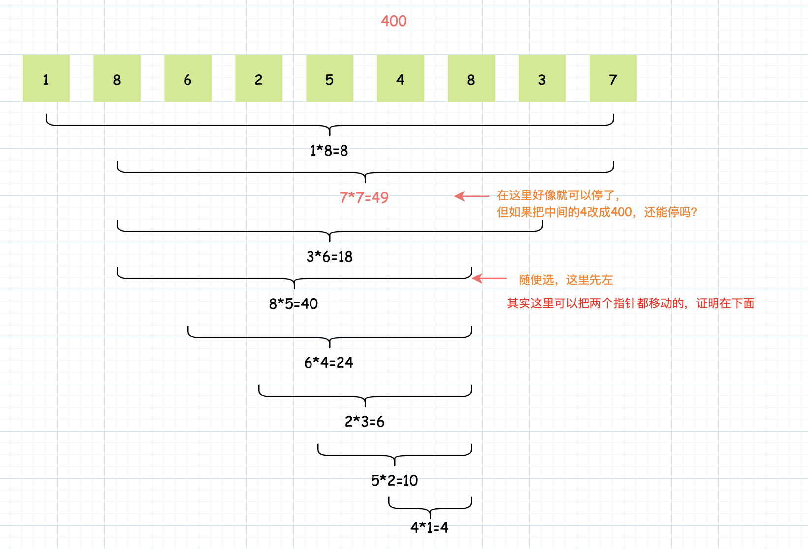
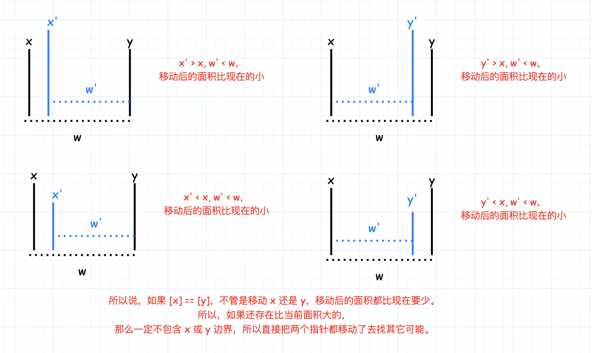

- [11. 盛最多水的容器](#11-盛最多水的容器)
  - [题目](#题目)
  - [题解](#题解)
    - [双指针](#双指针)
    - [我的补充](#我的补充)
    - [反证法](#反证法)

------------------------------

# 11. 盛最多水的容器

## 题目

给你 n 个非负整数 $a_1，a_2，...，a_n$，每个数代表坐标中的一个点 $(i, a_i)$ 。在坐标内画 n 条垂直线，垂直线 i 的两个端点分别为 $(i, a_i)$ 和 $(i, 0)$。找出其中的两条线，使得它们与 x 轴共同构成的容器可以容纳最多的水。

说明：你不能倾斜容器，且 n 的值至少为 2。


图中垂直线代表输入数组 $[1,8,6,2,5,4,8,3,7]$。在此情况下，容器能够容纳水（表示为蓝色部分）的最大值为 49。

示例：

```
输入：[1,8,6,2,5,4,8,3,7]
输出：49
```

- 来源：力扣（LeetCode）
- 链接：https://leetcode-cn.com/problems/container-with-most-water
- 著作权归领扣网络所有。商业转载请联系官方授权，非商业转载请注明出处。


## 题解

### 双指针

**说明**

本题是一道经典的面试题，最优的做法是使用「双指针」。如果读者第一次看到这题，不一定能想出双指针的做法。

**分析**

我们先从题目中的示例开始，一步一步地解释双指针算法的过程。稍后再给出算法正确性的证明。

题目中的示例为：

```go
[1, 8, 6, 2, 5, 4, 8, 3, 7]
 ^                       ^
```

在初始时，左右指针分别指向数组的左右两端，它们可以容纳的水量为 $\min(1, 7) * 8 = 8$

此时我们需要移动一个指针。移动哪一个呢？直觉告诉我们，应该移动对应数字较小的那个指针（即此时的左指针）。这是因为，由于容纳的水量是由

$$
两个指针指向的数字中较小值 * 指针之间的距离
$$

决定的。如果我们移动数字较大的那个指针，那么前者「两个指针指向的数字中较小值」不会增加，后者「指针之间的距离」会减小，那么这个乘积会减小。因此，我们移动数字较大的那个指针是不合理的。因此，我们移动 数字较小的那个指针。

> 有读者可能会产生疑问：我们可不可以同时移动两个指针？ 先别急，我们先假设 总是移动数字较小的那个指针 的思路是正确的，在走完流程之后，我们再去进行证明。

所以，我们将左指针向右移动：

```go
[1, 8, 6, 2, 5, 4, 8, 3, 7]
    ^                    ^
```

此时可以容纳的水量为 $\min(8, 7) * 7 = 49$。由于右指针对应的数字较小，我们移动右指针：

```go
[1, 8, 6, 2, 5, 4, 8, 3, 7]
    ^                 ^
```

此时可以容纳的水量为 $\min(8, 3) * 6 = 18$。由于右指针对应的数字较小，我们移动右指针：

```go
[1, 8, 6, 2, 5, 4, 8, 3, 7]
    ^              ^
```

此时可以容纳的水量为 $\min(8, 8) * 5 = 40$。两指针对应的数字相同，我们可以任意移动一个，例如左指针：

```go
[1, 8, 6, 2, 5, 4, 8, 3, 7]
       ^           ^
```

此时可以容纳的水量为 $\min(6, 8) * 4 = 24$。由于左指针对应的数字较小，我们移动左指针，并且可以发现，在这之后左指针对应的数字总是较小，因此我们会一直移动左指针，直到两个指针重合。在这期间，对应的可以容纳的水量为：$\min(2, 8) * 3 = 6$，$\min(5, 8) * 2 = 10$，$\min(4, 8) * 1 = 4$。

在我们移动指针的过程中，计算到的最多可以容纳的数量为 49，即为最终的答案。

**证明**

为什么双指针的做法是正确的？

> 双指针代表了什么？

双指针代表的是 **可以作为容器边界的所有位置的范围**。在一开始，双指针指向数组的左右边界，表示 **数组中所有的位置都可以作为容器的边界**，因为我们还没有进行过任何尝试。在这之后，我们每次将 **对应的数字较小的那个指针** 往 **另一个指针** 的方向移动一个位置，就表示我们认为 **这个指针不可能再作为容器的边界了**。

> 为什么对应的数字较小的那个指针不可能再作为容器的边界了？

在上面的分析部分，我们对这个问题有了一点初步的想法。这里我们定量地进行证明。

考虑第一步，假设当前左指针和右指针指向的数分别为 $x$ 和 $y$，不失一般性，我们假设 $x \leq y$。同时，两个指针之间的距离为 $t$。那么，它们组成的容器的容量为：

$$
\min(x, y) * t = x * t
$$

我们可以断定，**如果我们保持左指针的位置不变，那么无论右指针在哪里，这个容器的容量都不会超过 $x * t$ 了**。注意这里右指针只能向左移动，因为 我们考虑的是第一步，也就是 指针还指向数组的左右边界的时候。

我们任意向左移动右指针，指向的数为 $y_1$​，两个指针之间的距离为 $t_1$​，那么显然有 $t_1 < t$，并且 $\min(x, y_1) \leq \min(x, y)$：

- 如果 $y_1 \leq y$，那么 $\min(x, y_1) \leq \min(x, y)$；
- 如果 $y_1 > y$，那么 $\min(x, y_1) = x = \min(x, y)$。

因此有：

$$
\min(x, y_t) * t_1 < \min(x, y) * t
$$

即**无论我们怎么移动右指针，得到的容器的容量都小于移动前容器的容量**。也就是说，这个左指针对应的数不会作为容器的边界了，那么我们就可以丢弃这个位置，将左指针向右移动一个位置，此时新的左指针于原先的右指针之间的左右位置，才**可能**会作为容器的边界。

这样以来，我们将问题的规模减小了 1，被我们丢弃的那个位置就相当于消失了。此时的左右指针，就指向了一个新的、规模减少了的问题的数组的左右边界，因此，我们可以继续像之前 考虑第一步 那样考虑这个问题：

- 求出当前双指针对应的容器的容量；
- 对应数字较小的那个指针以后不可能作为容器的边界了，将其丢弃，并移动对应的指针。

> 最后的答案是什么？

答案就是我们每次以双指针为左右边界（也就是「数组」的左右边界）计算出的容量中的最大值。

```java
public class Solution {
    public int maxArea(int[] height) {
        int l = 0, r = height.length - 1;
        int ans = 0;
        while (l < r) {
            int area = Math.min(height[l], height[r]) * (r - l);
            ans = Math.max(ans, area);
            // 等于的时候可以同时更新两个指针：l++; r--;
            if (height[l] <= height[r]) {
                ++l;
            }
            else {
                --r;
            }
        }
        return ans;
    }
}
```

复杂度分析

- 时间复杂度：$O(N)$，双指针总计最多遍历整个数组一次。
- 空间复杂度：$O(1)$，只需要额外的常数级别的空间。


### 我的补充

最暴力的方法就是固定一个边界，然后移动另一个边界，找个最大面积的，然后再把固定的那个边界移动一格，再遍历另一个边界。复杂度是 $O(n^2)$。

现在要想缩短时间复杂度，那么就要看这个题有没有**特殊的地方**。面积的计算是$高度 * 宽度$，当我们移动指针的时候，宽度变小了，如果高度不能变大，那就不用遍历了，所以关键是怎么找更大的高度。当我们移动较大的那个边界时，不管移动后的那个边界是大是小，都不会比现在的面积更大（因为面积要看短板），证明可以见上面。所以移动较大的那个边界是没有意义的，这样我们就可以减少遍历的次数了。






### 反证法

参考自：<http://blog.csdn.net/a83610312/article/details/8548519>

我们从结果开始倒推。

假设我们已经找到了最大面积，边界是 `[x, y]`，那么在 x 左边是没有比 x 更高的了，因为如果有，那么 `[x, y]` 就构不成最大面积了。同样，在 y 右边也没有比 y 更高的了。


> 题目意思就不翻译了，大概是要找到条纵线然后这两条线以及X轴构成的容器能容纳最多的水。
>
> 下面以例子：   [4,6,2,6,7,11,2] 来讲解。
>
> 1.首先假设我们找到能取最大容积的纵线为 i , j (假定i<j)，那么得到的最大容积 C = min( ai , aj ) * ( j- i) ；
>
> 2.下面我们看这么一条性质：
>
> ①: 在 j 的右端没有一条线会比它高！ 假设存在 k |( j<k && ak > aj) ，那么  由 ak> aj，所以 min( ai,aj, ak) =min(ai,aj) ，所以由i, k构成的容器的容积C' = min(ai,aj ) * ( k-i) > C，与C是最值矛盾，所以得证j的后边不会有比它还高的线；
>
> ②:同理，在i的左边也不会有比它高的线；
>
> 这说明什么呢？如果我们目前得到的候选： 设为 x, y两条线（x< y)，那么能够得到比它更大容积的新的两条边必然在  [x,y]区间内并且 ax' > =ax , ay'>= ay;
>
> 3.所以我们从两头向中间靠拢，同时更新候选值；在收缩区间的时候优先从  x, y中较小的边开始收缩；
>
>  
>
> 直观的解释是：容积即面积，它受长和高的影响，当长度减小时候，高必须增长才有可能提升面积，所以我们从长度最长时开始递减，然后寻找更高的线来更新候补；