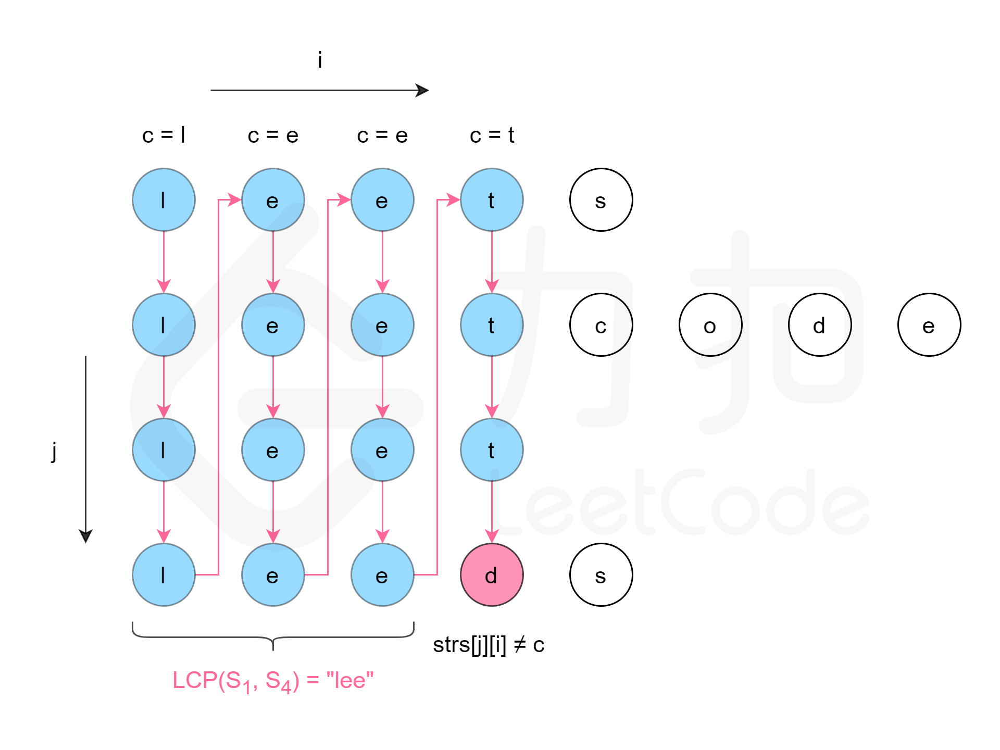

- [最长公共前缀](#最长公共前缀)
  - [题目](#题目)
  - [题解](#题解)
    - [方法一：横向扫描](#方法一横向扫描)
    - [方法二：纵向扫描](#方法二纵向扫描)
    - [方法三：分治](#方法三分治)
    - [方法四：二分查找](#方法四二分查找)

------------------------------

# 最长公共前缀

## 题目

编写一个函数来查找字符串数组中的最长公共前缀。

如果不存在公共前缀，返回空字符串 ""。

示例 1:

```
输入: ["flower","flow","flight"]
输出: "fl"
```

示例 2:

```
输入: ["dog","racecar","car"]
输出: ""
解释: 输入不存在公共前缀。
```

说明:

所有输入只包含小写字母 a-z 。

- 来源：力扣（LeetCode）
- 链接：https://leetcode-cn.com/problems/longest-common-prefix
- 著作权归领扣网络所有。商业转载请联系官方授权，非商业转载请注明出处。

## 题解

### 方法一：横向扫描

用 $\textit{LCP}(S_1 \ldots S_n)$ 表示字符串 $S_1 \ldots S_n$​ 的最长公共前缀。

可以得到以下结论：

$$
\textit{LCP}(S_1 \ldots S_n) = \textit{LCP}(\textit{LCP}(\textit{LCP}(S_1, S_2),S_3),\ldots S_n)
$$

基于该结论，可以得到一种查找字符串数组中的最长公共前缀的简单方法。依次遍历字符串数组中的每个字符串，对于每个遍历到的字符串，更新最长公共前缀，当遍历完所有的字符串以后，即可得到字符串数组中的最长公共前缀。


```go
func longestCommonPrefix(strs []string) string {
    if len(strs) == 0 {
        return ""
    }
    prefix := strs[0]
    count := len(strs)
    for i := 1; i < count; i++ {
        prefix = lcp(prefix, strs[i])
        if len(prefix) == 0 {
            break
        }
    }
    return prefix
}

func lcp(str1, str2 string) string {
    length := min(len(str1), len(str2))
    index := 0
    for index < length && str1[index] == str2[index] {
        index++
    }
    return str1[:index]
}

func min(x, y int) int {
    if x < y {
        return x
    }
    return y
}
```

**复杂度分析**

- 时间复杂度：$O(mn)$，其中 m 是字符串数组中的字符串的平均长度，n 是字符串的数量。最坏情况下，字符串数组中的每个字符串的每个字符都会被比较一次。
- 空间复杂度：$O(1)$。使用的额外空间复杂度为常数。

### 方法二：纵向扫描

方法一是横向扫描，依次遍历每个字符串，更新最长公共前缀。另一种方法是纵向扫描。纵向扫描时，从前往后遍历所有字符串的每一列，比较相同列上的字符是否相同，如果相同则继续对下一列进行比较，如果不相同则当前列不再属于公共前缀，当前列之前的部分为最长公共前缀。



```go
func longestCommonPrefix(strs []string) string {
    if len(strs) == 0 {
        return ""
    }
    for i := 0; i < len(strs[0]); i++ {
        for j := 1; j < len(strs); j++ {
            if i == len(strs[j]) || strs[j][i] != strs[0][i] {
                return strs[0][:i]
            }
        }
    }
    return strs[0]
}
```

复杂度分析

- 时间复杂度：$O(mn)$，其中 m 是字符串数组中的字符串的平均长度，n 是字符串的数量。最坏情况下，字符串数组中的每个字符串的每个字符都会被比较一次。
- 空间复杂度：$O(1)$。使用的额外空间复杂度为常数。


### 方法三：分治

注意到 LCP 的计算满足结合律，有以下结论：

$$
\textit{LCP}(S_1 \ldots S_n) = \textit{LCP}(\textit{LCP}(S_1 \ldots S_k), \textit{LCP} (S_{k+1} \ldots S_n))
$$

其中 $\textit{LCP}(S_1 \ldots S_n)$) 是字符串 $S_1 \ldots S_n$​ 的最长公共前缀，$1 < k < n$。

基于上述结论，可以使用分治法得到字符串数组中的最长公共前缀。对于问题 $\textit{LCP}(S_i\cdots S_j)$，可以分解成两个子问题 $\textit{LCP}(S_i \ldots S_{mid})$ 与 $\textit{LCP}(S_{mid+1} \ldots S_j)$，其中 $mid=\frac{i+j}{2}$​。对两个子问题分别求解，然后对两个子问题的解计算最长公共前缀，即为原问题的解。


```go
func longestCommonPrefix(strs []string) string {
    if len(strs) == 0 {
        return ""
    }
    var lcp func(int, int) string
    lcp = func(start, end int) string {
        if start == end {
            return strs[start]
        }
        mid := (start + end) / 2
        lcpLeft, lcpRight := lcp(start, mid), lcp(mid + 1, end)
        minLength := min(len(lcpLeft), len(lcpRight))
        for i := 0; i < minLength; i++ {
            if lcpLeft[i] != lcpRight[i] {
                return lcpLeft[:i]
            }
        }
        return lcpLeft[:minLength]
    }
    return lcp(0, len(strs)-1)
}

func min(x, y int) int {
    if x < y {
        return x
    }
    return y
}
```


复杂度分析

- 时间复杂度：$O(mn)$，其中 m 是字符串数组中的字符串的平均长度，n 是字符串的数量。时间复杂度的递推式是 $T(n)=2 \cdot T(\frac{n}{2})+O(m)$，通过计算可得 $T(n)=O(mn)$。
- 空间复杂度：$O(m \log n)$，其中 m 是字符串数组中的字符串的平均长度，n 是字符串的数量。空间复杂度主要取决于递归调用的层数，层数最大为 $\log n$，每层需要 m 的空间存储返回结果。


### 方法四：二分查找

显然，最长公共前缀的长度不会超过字符串数组中的最短字符串的长度。用 minLength 表示字符串数组中的最短字符串的长度，则可以在 $[0,\textit{minLength}]$ 的范围内通过二分查找得到最长公共前缀的长度。每次取查找范围的中间值 mid，判断每个字符串的长度为 mid 的前缀是否相同，如果相同则最长公共前缀的长度一定大于或等于 mid，如果不相同则最长公共前缀的长度一定小于 mid，通过上述方式将查找范围缩小一半，直到得到最长公共前缀的长度。


```go
func longestCommonPrefix(strs []string) string {
    if len(strs) == 0 {
        return ""
    }

    isCommonPrefix := func(length int) bool {
        str0, count := strs[0][:length], len(strs)
        for i := 1; i < count; i++ {
            if strs[i][:length] != str0 {
                return false
            }
        }
        return true
    }
    minLength := len(strs[0])
    for _, s := range strs {
        if len(s) < minLength {
            minLength = len(s)
        }
    }
    low, high := 0, minLength
    for low < high {
        mid := (high - low + 1) / 2 + low
        if isCommonPrefix(mid) {
            low = mid
        } else {
            high = mid - 1
        }
    }
    return strs[0][:low]
}
```

复杂度分析

- 时间复杂度：$O(mn \log m)$，其中 m 是字符串数组中的字符串的最小长度，n 是字符串的数量。二分查找的迭代执行次数是 $O(\log m)$，每次迭代最多需要比较 $mn$ 个字符，因此总时间复杂度是 $O(mn \log m)$。
- 空间复杂度：$O(1)$。使用的额外空间复杂度为常数。

