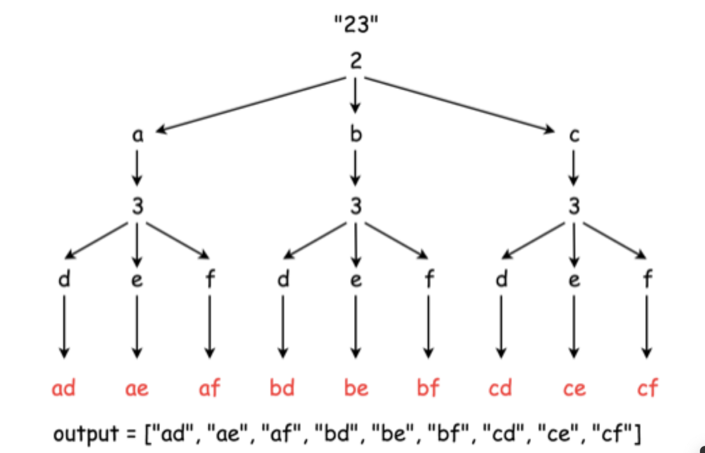

- [17. 电话号码的字母组合](#17-电话号码的字母组合)
  - [题目](#题目)
  - [题解](#题解)
    - [回溯](#回溯)
    - [我的解法](#我的解法)


------------------------------

# 17. 电话号码的字母组合

## 题目

给定一个仅包含数字 2-9 的字符串，返回所有它能表示的字母组合。

给出数字到字母的映射如下（与电话按键相同）。注意 1 不对应任何字母。


示例:

```
输入："23"
输出：["ad", "ae", "af", "bd", "be", "bf", "cd", "ce", "cf"].
```

说明: 尽管上面的答案是按字典序排列的，但是你可以任意选择答案输出的顺序。

- 来源：力扣（LeetCode）
- 链接：https://leetcode-cn.com/problems/letter-combinations-of-a-phone-number
- 著作权归领扣网络所有。商业转载请联系官方授权，非商业转载请注明出处。

## 题解

### 回溯

回溯是一种通过穷举所有可能情况来找到所有解的算法。如果一个候选解最后被发现并不是可行解，回溯算法会舍弃它，并在前面的一些步骤做出一些修改，并重新尝试找到可行解。

给出如下回溯函数 `backtrack(combination, next_digits)` ，它将一个目前已经产生的组合 `combination` 和接下来准备要输入的数字 `next_digits` 作为参数。

- 如果没有更多的数字需要被输入，那意味着当前的组合已经产生好了。
- 如果还有数字需要被输入：
    - 遍历下一个数字所对应的所有映射的字母。
    - 将当前的字母添加到组合最后，也就是 combination = combination + letter 。
    - 重复这个过程，输入剩下的数字： backtrack(combination + letter, next_digits[1:]) 。



```java
class Solution {
  Map<String, String> phone = new HashMap<String, String>() {{
    put("2", "abc");
    put("3", "def");
    put("4", "ghi");
    put("5", "jkl");
    put("6", "mno");
    put("7", "pqrs");
    put("8", "tuv");
    put("9", "wxyz");
  }};

  List<String> output = new ArrayList<String>();

  public void backtrack(String combination, String next_digits) {
    // if there is no more digits to check
    if (next_digits.length() == 0) {
      // the combination is done
      output.add(combination);
    }
    // if there are still digits to check
    else {
      // iterate over all letters which map 
      // the next available digit
      String digit = next_digits.substring(0, 1);
      String letters = phone.get(digit);
      for (int i = 0; i < letters.length(); i++) {
        String letter = phone.get(digit).substring(i, i + 1);
        // append the current letter to the combination
        // and proceed to the next digits
        backtrack(combination + letter, next_digits.substring(1));
      }
    }
  }

  public List<String> letterCombinations(String digits) {
    if (digits.length() != 0)
      backtrack("", digits);
    return output;
  }
}
```

### 我的解法

上面的太暴力了。可以这样：

遇到第一个数字 `2`，它对应的字母是 `abc`，列出一个列表：

```py
[a]
[b]
[c]
```

然后遇到第二个数字 `3`，它对应的字母是 `def`，这时，列表复制两份，把 `def` 分别添加到每份的末尾：

```py
[a, d]
[b, d]
[c, d]
# 复制一份
[a, e]
[b, e]
[c, e]
# 复制第二份
[a, f]
[b, f]
[c, f]
```

依此类推。

```go
func letterCombinations(digits string) []string {
	if digits == "" {
		return []string{}
	}
	ans := []string{""}
	mapping := []string{"0", "1", "abc", "def", "ghi", "jkl", "mno", "pqrs", "tuv", "wxyz"}
	for _, d := range digits {
		chars := mapping[d-'0']
		temp := make([]string, 0, len(chars)*len(ans))
		for _, s := range chars {
			for _, a := range ans {
				temp = append(temp, a+string(s))
			}
		}
		ans = temp
	}
	return ans
}
```