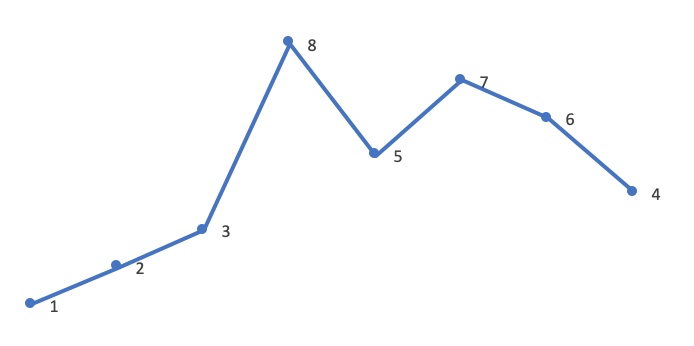

- [31. 下一个排列](#31-下一个排列)
  - [官方题解](#官方题解)
  - [题解2](#题解2)

------------------------------

# 31. 下一个排列

实现获取下一个排列的函数，算法需要将给定数字序列重新排列成字典序中下一个更大的排列。

如果不存在下一个更大的排列，则将数字重新排列成最小的排列（即升序排列）。

必须**原地**修改，只允许使用额外常数空间。

以下是一些例子，输入位于左侧列，其相应输出位于右侧列。

```
1,2,3 → 1,3,2
3,2,1 → 1,2,3
1,1,5 → 1,5,1
```

- 来源：力扣（LeetCode）
- 链接：https://leetcode-cn.com/problems/next-permutation
- 著作权归领扣网络所有。商业转载请联系官方授权，非商业转载请注明出处。


## 官方题解

> 链接：https://leetcode-cn.com/problems/next-permutation/solution/xia-yi-ge-pai-lie-by-leetcode/

官方题解写的不太容易理解，还是看下面的题解吧。


## 题解2

> 链接：https://leetcode-cn.com/problems/next-permutation/solution/xia-yi-ge-pai-lie-suan-fa-xiang-jie-si-lu-tui-dao-/

**算法推导**

如何得到这样的排列顺序？这是本文的重点。我们可以这样来分析：

1. 我们希望下一个数比当前数大，这样才满足“下一个排列”的定义。因此只需要将后面的「大数」与前面的「小数」交换，就能得到一个更大的数。比如 `123456`，将 5 和 6 交换就能得到一个更大的数 `123465`。
2. 我们还希望下一个数增加的幅度尽可能的小，这样才满足“下一个排列与当前排列紧邻“的要求。为了满足这个要求，我们需要：
    1. 在**尽可能靠右**的低位进行交换，需要从后向前查找
    2. 将一个 **尽可能小的「大数」** 与前面的「小数」交换。比如 123465，下一个排列应该把 5 和 4 交换而不是把 6 和 4 交换
    3. 将「大数」换到前面后，需要**将「大数」后面的所有数重置为升序**，升序排列就是最小的排列。以 123465 为例：首先按照上一步，交换 5 和 4，得到 123564；然后需要将 5 之后的数重置为升序，得到 123546。显然 123546 比 123564 更小，123546 就是 123465 的下一个排列

以上就是求“下一个排列”的分析过程。

**算法过程**

标准的“下一个排列”算法可以描述为：

1. 从后向前查找第一个相邻升序的元素对 `(i,j)`，满足 `A[i] < A[j]`。**此时 `[j,end)` 必然是降序**
2. 在 `[j,end)` 从后向前查找第一个满足 `A[i] < A[k]` 的 k。`A[i]`、`A[k]` 分别就是上文所说的「小数」、「大数」
3. 将 `A[i]` 与 `A[k]` 交换
4. 可以断定这时 `[j,end)` 必然是降序，**逆置 `[j,end)`，使其升序**
5. 如果在步骤 1 找不到符合的相邻元素对，说明当前 `[begin,end)` 为一个降序顺序，则直接跳到步骤 4

```go
func nextPermutation(nums []int) {
	if len(nums) <= 1 {
		return
	}

	i, j, k := len(nums)-2, len(nums)-1, len(nums)-1

	// find: A[i]<A[j]
	for i >= 0 && nums[i] >= nums[j] {
		i--
		j--
	}

	if i >= 0 { // 不是最后一个排列
		// find: A[i]<A[k]
		for nums[i] >= nums[k] {
			k--
		}
		// swap A[i], A[k]
		nums[i], nums[k] = nums[k], nums[i]
	}

	// reverse A[j:end]
	for i, j := j, len(nums)-1; i < j; i, j = i+1, j-1 {
		nums[i], nums[j] = nums[j], nums[i]
	}
}
```

**可视化**

以求 12385764 的下一个排列为例：



首先从后向前查找第一个相邻升序的元素对 `(i,j)`。这里 i=4，j=5，对应的值为 5，7：


然后在 [j,end) 从后向前查找第一个大于 `A[i]` 的值 `A[k]`。这里 `A[i]` 是 5，故 `A[k]` 是 6：


将 `A[i]` 与 `A[k]` 交换。这里交换 5、6：


这时 `[j,end)` 必然是降序，逆置 `[j,end)`，使其升序。这里逆置 `[7,5,4]`：


因此，12385764 的下一个排列就是 12386457。

最后再可视化地对比一下这两个相邻的排列（橙色是蓝色的下一个排列）：

