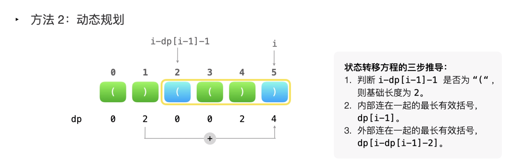
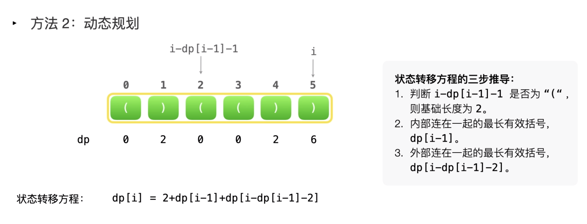

- [32. 最长有效括号](#32-最长有效括号)
  - [题目](#题目)
  - [题解](#题解)
    - [方法一：动态规划](#方法一动态规划)
      - [状态转移方程的推导](#状态转移方程的推导)
    - [方法二：栈](#方法二栈)
    - [方法三：不需要额外的空间](#方法三不需要额外的空间)

------------------------------

# 32. 最长有效括号

## 题目

给定一个只包含 '(' 和 ')' 的字符串，找出最长的包含有效括号的子串的长度。

示例 1:

```
输入: "(()"
输出: 2
解释: 最长有效括号子串为 "()"
```

示例 2:

```
输入: ")()())"
输出: 4
解释: 最长有效括号子串为 "()()"
```

- 来源：力扣（LeetCode）
- 链接：https://leetcode-cn.com/problems/longest-valid-parentheses
- 著作权归领扣网络所有。商业转载请联系官方授权，非商业转载请注明出处。


## 题解

> 链接：https://leetcode-cn.com/problems/longest-valid-parentheses/solution/zui-chang-you-xiao-gua-hao-by-leetcode-solution/
> 
> 这个题建议看下视频讲解，讲得很清楚的。

### 方法一：动态规划

**思路和算法**

我们定义 `dp[i]` 表示以下标 `i` 字符结尾的最长有效括号的长度。我们将 `dp` 数组全部初始化为 0 。显然有效的子串一定以 `)` 结尾，因此我们可以知道以 `(` 结尾的子串对应的 `dp` 值必定为 0 ，我们只需要求解 `)` 在 `dp` 数组中对应位置的值。

我们从前往后遍历字符串求解 `dp` 值，我们**每两个字符检查一次**：

1. `s[i]=‘)’` 且 `s[i−1]=‘(’`，也就是字符串形如 `……()`，我们可以推出：
$$
\textit{dp}[i]=\textit{dp}[i-2]+2
$$
我们可以进行这样的转移，是因为结束部分的 "()" 是一个有效子字符串，并且将之前有效子字符串的长度增加了 2 。

2. `s[i]=‘)’` 且 `s[i−1]=‘)’`，也就是字符串形如 `……))`，我们可以推出：
如果 `s[i−dp[i−1]−1]=‘(’`，那么
$$
\textit{dp}[i]=\textit{dp}[i-1]+\textit{dp}[i-\textit{dp}[i-1]-2]+2
$$

我们考虑如果倒数第二个 `)` 是一个有效子字符串的一部分（记作 `sub_s`），对于最后一个 `)` ，如果它是一个更长子字符串的一部分，那么它一定有一个对应的 `(` ，且它的位置在倒数第二个 `)` 所在的有效子字符串的前面（也就是 `sub_s` 的前面）。因此，如果子字符串 `sub_s` 的前面恰好是 `(` ，那么我们就用 2 加上 `sub_s` 的长度（`dp[i−1]`）去更新 `dp[i]`。同时，我们也会把有效子串 `“(sub_s)”` 之前的有效子串的长度也加上，也就是再加上 `dp[i−dp[i−1]−2]`。

最后的答案即为 `dp` 数组中的最大值。

```go
func longestValidParentheses(s string) int {
    maxAns := 0
    dp := make([]int, len(s))
    for i := 1; i < len(s); i++ {
        if s[i] == ')' {
            if s[i-1] == '(' {
                if i >= 2 {
                    dp[i] = dp[i - 2] + 2
                } else {
                    dp[i] = 2
                }
            } else if i - dp[i - 1] > 0 && s[i - dp[i - 1] - 1] == '(' {
                if i - dp[i - 1] >= 2 {
                    dp[i] = dp[i - 1] + dp[i - dp[i - 1] - 2] + 2
                } else {
                    dp[i] = dp[i - 1] + 2
                }
            }
            maxAns = max(maxAns, dp[i])
        }
    }
    return maxAns
}

func max(x, y int) int {
    if x > y {
        return x
    }
    return y
}
```

**复杂度分析**

- 时间复杂度： `O(n)`，其中 n 为字符串的长度。我们只需遍历整个字符串一次，即可将 `dp` 数组求出来。
- 空间复杂度： `O(n)`。我们需要一个大小为 n 的 `dp` 数组。


#### 状态转移方程的推导





假设当前 i 指向的是最后一个元素，那么需要找到跟它匹配的 `(`。`dp[i-1]` 是以 4 结尾的有效长度，它的值是 2，说明 3 和 4 凑成了有效字符串，那跟 5 匹配的肯定不是 3 和 4，只能是它们俩前面的那个（即 2），2正好是 `(`，是和 5 匹配的，所以 `dp[i-1] + 2` 就是从 2 到 5 的长度。如果 2 前面还有能连起来的，那也得把长度加进来，`[0, 1]` 正好可以加进来，2 的下标是 `i - dp[i-1] - 1`，那它前面那个就是 `i - dp[i-1] - 2` 了，所以 `dp[i - dp[i-1] - 2]` 就是 2 前面的有效字符串的长度。


### 方法二：栈

**思路和算法**

撇开方法一提及的动态规划方法，相信大多数人对于这题的第一直觉是找到每个可能的子串后判断它的有效性，但这样的时间复杂度会达到 $O(n^3)$，无法通过所有测试用例。但是通过栈，我们可以在遍历给定字符串的过程中去判断到目前为止扫描的子串的有效性，同时能得到最长有效括号的长度。

具体做法是我们始终保持栈底元素为当前已经遍历过的元素中「**最后一个没有被匹配的右括号的下标**」，这样的做法主要是考虑了边界条件的处理，**栈里其他元素维护左括号的下标**：

- 对于遇到的每个 `(` ，我们将它的下标放入栈中
- 对于遇到的每个 `)`，我们先弹出栈顶元素表示匹配了当前右括号：
    - 如果栈为空，说明当前的右括号为没有被匹配的右括号，我们将其下标放入栈中来更新我们之前提到的「最后一个没有被匹配的右括号的下标」
    - 如果栈不为空，当前右括号的下标减去栈顶元素即为「以该右括号为结尾的最长有效括号的长度」

我们从前往后遍历字符串并更新答案即可。

需要注意的是，如果一开始栈为空，第一个字符为左括号的时候我们会将其放入栈中，这样就不满足提及的「最后一个没有被匹配的右括号的下标」，为了保持统一，我们在一开始的时候往栈中放入一个值为 −1 的元素。

```go
func longestValidParentheses(s string) int {
    maxAns := 0
    stack := []int{}
    stack = append(stack, -1)
    for i := 0; i < len(s); i++ {
        if s[i] == '(' {
            stack = append(stack, i)
        } else {
            stack = stack[:len(stack)-1]
            if len(stack) == 0 {
                stack = append(stack, i)
            } else {
                maxAns = max(maxAns, i - stack[len(stack)-1])
            }
        }
    }
    return maxAns
}

func max(x, y int) int {
    if x > y {
        return x
    }
    return y
}
```

**复杂度分析**

- 时间复杂度： $O(n)$，n 是给定字符串的长度。我们只需要遍历字符串一次即可。
- 空间复杂度： $O(n)$。栈的大小在最坏情况下会达到 n，因此空间复杂度为 $O(n)$ 。

### 方法三：不需要额外的空间

**思路和算法**

在此方法中，我们利用两个计数器 `left` 和 `right` 。首先，我们从左到右遍历字符串，对于遇到的每个 `(`，我们增加 `left` 计数器，对于遇到的每个 `)` ，我们增加 `right` 计数器。每当 `left` 计数器与 `right` 计数器相等时，我们计算当前有效字符串的长度，并且记录目前为止找到的最长子字符串。当 `right` 计数器比 `left` 计数器大时，我们将 `left` 和 `right` 计数器同时变回 0。

这样的做法贪心地考虑了以当前字符下标结尾的有效括号长度，每次当右括号数量多于左括号数量的时候之前的字符我们都扔掉不再考虑，重新从下一个字符开始计算，但这样会漏掉一种情况，就是遍历的时候左括号的数量始终大于右括号的数量，即 `(()` ，这种时候最长有效括号是求不出来的。

解决的方法也很简单，我们只需要从右往左遍历用类似的方法计算即可，只是这个时候判断条件反了过来：

- 当 `left` 计数器比 `right` 计数器大时，我们将 `left` 和 `right` 计数器同时变回 0
- 当 `left` 计数器与 `right` 计数器相等时，我们计算当前有效字符串的长度，并且记录目前为止找到的最长子字符串

这样我们就能涵盖所有情况从而求解出答案。

```go
func longestValidParentheses(s string) int {
    left, right, maxLength := 0, 0, 0
    for i := 0; i < len(s); i++ {
        if s[i] == '(' {
            left++
        } else {
            right++
        }
        if left == right {
            maxLength = max(maxLength, 2 * right)
        } else if right > left {
            left, right = 0, 0
        }
    }
    left, right = 0, 0
    for i := len(s) - 1; i >= 0; i-- {
        if s[i] == '(' {
            left++
        } else {
            right++
        }
        if left == right {
            maxLength = max(maxLength, 2 * left)
        } else if left > right {
            left, right = 0, 0
        }
    }
    return maxLength
}

func max(x, y int) int {
    if x > y {
        return x
    }
    return y
}
```

**复杂度分析**

- 时间复杂度： $O(n)$，其中 n 为字符串长度。我们只要正反遍历两边字符串即可。
- 空间复杂度： $O(1)$。我们只需要常数空间存放若干变量。
