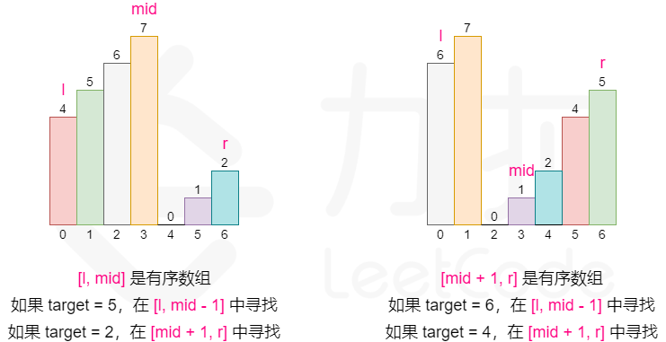
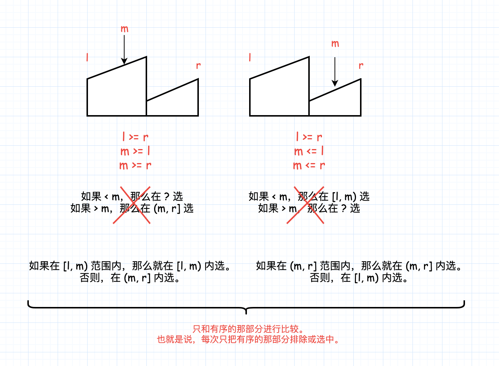

- [33. 搜索旋转排序数组](#33-搜索旋转排序数组)
  - [官方题解](#官方题解)
    - [方法一：二分搜索](#方法一二分搜索)

------------------------------

# 33. 搜索旋转排序数组

假设按照升序排序的数组在预先未知的某个点上进行了旋转。

( 例如，数组 `[0,1,2,4,5,6,7]` 可能变为 `[4,5,6,7,0,1,2]` )。

搜索一个给定的目标值，如果数组中存在这个目标值，则返回它的索引，否则返回 -1 。

你可以假设数组中不存在重复的元素。

你的算法时间复杂度必须是 $O(log n)$ 级别。

示例 1:

```
输入: nums = [4,5,6,7,0,1,2], target = 0
输出: 4
```

示例 2:

```
输入: nums = [4,5,6,7,0,1,2], target = 3
输出: -1
```

- 来源：力扣（LeetCode）
- 链接：https://leetcode-cn.com/problems/search-in-rotated-sorted-array
- 著作权归领扣网络所有。商业转载请联系官方授权，非商业转载请注明出处。


## 官方题解

> 链接：https://leetcode-cn.com/problems/search-in-rotated-sorted-array/solution/sou-suo-xuan-zhuan-pai-xu-shu-zu-by-leetcode-solut/

### 方法一：二分搜索

**思路和算法**

题目要求算法时间复杂度必须是 $O(\log n)$ 的级别，这提示我们可以使用二分搜索的方法。

但是数组本身不是有序的，进行旋转后只保证了数组的局部是有序的，这还能进行二分搜索吗？答案是可以的。

可以发现的是，我们将数组从中间分开成左右两部分的时候，一定有一部分的数组是有序的。拿示例来看，我们从 6 这个位置分开以后数组变成了 `[4, 5, 6]` 和 `[7, 0, 1, 2]` 两个部分，其中左边 `[4, 5, 6]` 这个部分的数组是有序的，其他也是如此。

这启示我们可以在常规二分搜索的时候查看当前 mid 为分割位置分割出来的两个部分 `[l, mid]` 和 `[mid + 1, r]` 哪个部分是有序的，并根据有序的那个部分确定我们该如何改变二分搜索的上下界，因为我们能够**根据有序的那部分判断出 target 在不在这个部分**：

- 如果 `[l, mid - 1]` 是有序数组，且 target 的大小满足 `[nums[l],nums[mid])`，则我们应该将搜索范围缩小至 `[l, mid - 1]`，否则在 `[mid + 1, r]` 中寻找。
- 如果 `[mid, r]` 是有序数组，且 target 的大小满足 `(nums[mid+1],nums[r]]`，则我们应该将搜索范围缩小至 `[mid + 1, r]`，否则在 `[l, mid - 1]` 中寻找。



我画的图：



需要注意的是，二分的写法有很多种，所以在判断 target 大小与有序部分的关系的时候可能会出现细节上的差别。

```py
class Solution:
    def search(self, nums: List[int], target: int) -> int:
        if not nums:
            return -1
        l, r = 0, len(nums) - 1
        while l <= r:
            mid = (l + r) // 2
            if nums[mid] == target:
                return mid
            if nums[0] <= nums[mid]:
                if nums[0] <= target < nums[mid]:
                    r = mid - 1
                else:
                    l = mid + 1
            else:
                if nums[mid] < target <= nums[len(nums) - 1]:
                    l = mid + 1
                else:
                    r = mid - 1
        return -1
```

**复杂度分析**

- 时间复杂度： $O(\log n)$，其中 n 为 `nums[]` 数组的大小。整个算法时间复杂度即为二分搜索的时间复杂度 $O(\log n)$。
- 空间复杂度： $O(1)$ 。我们只需要常数级别的空间存放变量。
