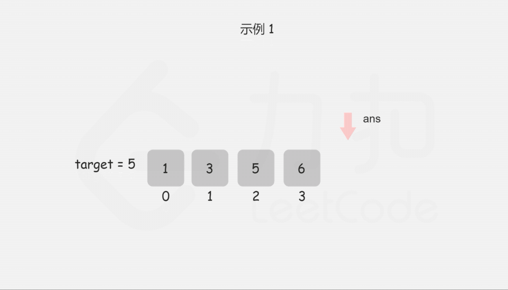

- [35. 搜索插入位置](#35-搜索插入位置)
  - [题目](#题目)
  - [题解](#题解)
    - [方法一：二分查找](#方法一二分查找)

------------------------------

# 35. 搜索插入位置

## 题目

给定一个排序数组和一个目标值，在数组中找到目标值，并返回其索引。如果目标值不存在于数组中，返回它将会被按顺序插入的位置。

你可以假设数组中无重复元素。

示例 1:

```
输入: [1,3,5,6], 5
输出: 2
```

示例 2:

```
输入: [1,3,5,6], 2
输出: 1
```

示例 3:

```
输入: [1,3,5,6], 7
输出: 4
```

示例 4:

```
输入: [1,3,5,6], 0
输出: 0
```

- 来源：力扣（LeetCode）
- 链接：https://leetcode-cn.com/problems/search-insert-position
- 著作权归领扣网络所有。商业转载请联系官方授权，非商业转载请注明出处。


## 题解

这是二分查找吧。。。


> 链接：https://leetcode-cn.com/problems/search-insert-position/solution/sou-suo-cha-ru-wei-zhi-by-leetcode-solution/

### 方法一：二分查找

**思路与算法**

假设题意是叫你在排序数组中寻找是否存在一个目标值，那么训练有素的读者肯定立马就能想到利用二分法在 $O(\log n)$ 的时间内找到是否存在目标值。但这题还多了个额外的条件，即如果不存在数组中的时候需要返回按顺序插入的位置，那我们还能用二分法么？答案是可以的，我们只需要稍作修改即可。

考虑这个插入的位置 pos，它成立的条件为：

$$
\textit{nums}[pos-1]<\textit{target}\le \textit{nums}[pos]
$$

其中 nums 代表排序数组。由于如果存在这个目标值，我们返回的索引也是 pos，因此我们可以将两个条件合并得出最后的目标：「在一个有序数组中找第一个大于等于 target 的下标」。

问题转化到这里，直接套用二分法即可，即不断用二分法逼近查找第一个大于等于 target 的下标 。下文给出的代码是笔者习惯的二分写法，ans 初值设置为数组长度可以省略边界条件的判断，因为存在一种情况是 target 大于数组中的所有数，此时需要插入到数组长度的位置。




```go
func searchInsert(nums []int, target int) int {
    n := len(nums)
    left, right := 0, n - 1
    ans := n
    for left <= right {
        mid := (right - left) >> 1 + left
        if target <= nums[mid] {
            ans = mid
            right = mid - 1
        } else {
            left = mid + 1
        }
    }
    return ans
}
```

**复杂度分析**

- 时间复杂度：$O(\log n)$，其中 n 为数组的长度。二分查找所需的时间复杂度为 $O(\log n)$。
- 空间复杂度：$O(1)$。我们只需要常数空间存放若干变量。
