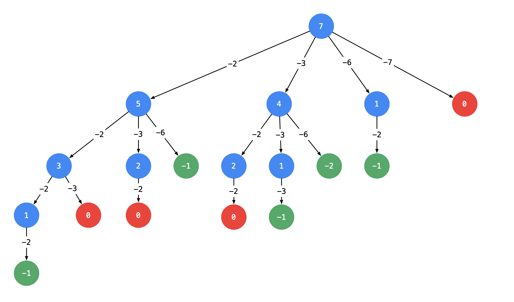
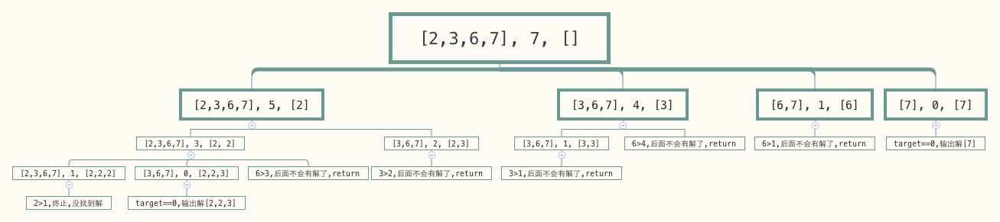

- [39. 组合总和](#39-组合总和)
	- [回溯算法 + 剪枝（回溯经典例题详解）](#回溯算法--剪枝回溯经典例题详解)
	- [以前的题解](#以前的题解)

------------------------------

# 39. 组合总和

给定一个**无重复元素**的数组 candidates 和一个目标数 target ，找出 candidates 中所有可以使数字和为 target 的组合。

candidates 中的数字可以无限制重复被选取。

说明：

- 所有数字（包括 target）都是正整数。
- 解集不能包含重复的组合。 

示例 1：

```
输入：candidates = [2,3,6,7], target = 7,
所求解集为：
[
  [7],
  [2,2,3]
]
```

示例 2：

```
输入：candidates = [2,3,5], target = 8,
所求解集为：
[
  [2,2,2,2],
  [2,3,3],
  [3,5]
]
```

提示：

- 1 <= candidates.length <= 30
- 1 <= candidates[i] <= 200
- candidate 中的每个元素都是独一无二的。
- 1 <= target <= 500

--------------------

- 来源：力扣（LeetCode）
- 链接：https://leetcode-cn.com/problems/combination-sum
- 著作权归领扣网络所有。商业转载请联系官方授权，非商业转载请注明出处。


## 回溯算法 + 剪枝（回溯经典例题详解）

> 链接：https://leetcode-cn.com/problems/combination-sum/solution/hui-su-suan-fa-jian-zhi-python-dai-ma-java-dai-m-2/

**思路分析**

根据示例 1：输入: `candidates = [2, 3, 6, 7]，target = 7`。

- 候选数组里有 `2`，如果找到了组合总和为 `7 - 2 = 5` 的所有组合，再在之前加上 `2` ，就是 `7` 的所有组合；
- 同理考虑 `3`，如果找到了组合总和为 `7 - 3 = 4` 的所有组合，再在之前加上 `3` ，就是 `7` 的所有组合，依次这样找下去。

基于以上的想法，可以画出如下的树形图。建议大家自己在纸上画出这棵树，**这一类问题都需要先画出树形图，然后编码实现**。

编码通过 **深度优先遍历** 实现，使用一个列表，在 深度优先遍历 变化的过程中，遍历所有可能的列表并判断当前列表是否符合题目的要求，成为「**回溯算法**」（个人理解，非形式化定义）。

回溯算法的总结我写在了「力扣」第 46 题（全排列）的题解 [《回溯算法入门级详解 + 经典例题列表（持续更新）》](https://leetcode-cn.com/problems/permutations/solution/hui-su-suan-fa-python-dai-ma-java-dai-ma-by-liweiw/) 中，如有需要请前往观看。

**画出树形图**

以输入：`candidates = [2, 3, 6, 7], target = 7` 为例：



**说明**：

- 以 `target = 7` 为 根结点 ，创建一个分支的时 **做减法** ；
- 每一个箭头表示：从父亲结点的数值减去边上的数值，得到孩子结点的数值。边的值就是题目中给出的 candidate 数组的每个元素的值；
- 减到 0 或者负数的时候停止，即：结点 0 和负数结点成为叶子结点；
- 所有从根结点到结点 0 的路径（只能从上往下，没有回路）就是题目要找的一个结果。

这棵树有 4 个叶子结点的值 0，对应的路径列表是 `[[2, 2, 3], [2, 3, 2], [3, 2, 2], [7]]`，而示例中给出的输出只有 `[[7], [2, 2, 3]]`。即：题目中要求每一个符合要求的解是 **不计算顺序** 的。下面我们分析为什么会产生重复。

**针对具体例子分析重复路径产生的原因（难点）**

> 友情提示：这一部分我的描述是晦涩难懂的，建议大家先自己观察出现重复的原因，进而思考如何解决。

产生重复的原因是：在每一个结点，做减法，展开分支的时候，由于题目中说 **每一个元素可以重复使用**，我们考虑了 **所有的** 候选数，因此出现了重复的列表。

一种简单的去重方案是借助哈希表的天然去重的功能，但实际操作一下，就会发现并没有那么容易。

可不可以在搜索的时候就去重呢？答案是可以的。遇到这一类相同元素不计算顺序的问题，我们在搜索的时候就需要 **按某种顺序搜索**。具体的做法是：每一次搜索的时候设置 **下一轮搜索的起点 begin**，请看下图。


即：从每一层的第 2 个结点开始，都不能再搜索产生同一层结点已经使用过的 candidate 里的元素。

> 友情提示：如果题目要求，结果集不计算顺序，那么就需要按顺序搜索。「力扣」第 47 题（ 全排列 II ）、「力扣」第 15 题（ 三数之和 ）也使用了类似的思想，使得结果集没有重复。

```java
import java.util.ArrayDeque;
import java.util.ArrayList;
import java.util.Deque;
import java.util.List;

public class Solution {

    public List<List<Integer>> combinationSum(int[] candidates, int target) {
        int len = candidates.length;
        List<List<Integer>> res = new ArrayList<>();
        if (len == 0) {
            return res;
        }

        Deque<Integer> path = new ArrayDeque<>();
        dfs(candidates, 0, len, target, path, res);
        return res;
    }

    /**
     * @param candidates 候选数组
     * @param begin      搜索起点
     * @param len        冗余变量，是 candidates 里的属性，可以不传
     * @param target     每减去一个元素，目标值变小
     * @param path       从根结点到叶子结点的路径，是一个栈
     * @param res        结果集列表
     */
    private void dfs(int[] candidates, int begin, int len, int target, Deque<Integer> path, List<List<Integer>> res) {
        // target 为负数和 0 的时候不再产生新的孩子结点
        if (target < 0) {
            return;
        }
        if (target == 0) {
            res.add(new ArrayList<>(path));
            return;
        }

        // 重点理解这里从 begin 开始搜索的语意
        for (int i = begin; i < len; i++) {
            path.addLast(candidates[i]);

            // 注意：由于每一个元素可以重复使用，下一轮搜索的起点依然是 i，这里非常容易弄错
            dfs(candidates, i, len, target - candidates[i], path, res);

            // 状态重置
            path.removeLast();
        }
    }
}
```

**复杂度分析**：

这个问题的复杂度分析是在我的能力之外的，这里给出我的思考。

我的结论是：时间复杂度与 candidate 数组的值有关：

- 如果 candidate 数组的值都很大，target 的值很小，那么树上的结点就比较少；
- 如果 candidate 数组的值都很小，target 的值很大，那么树上的结点就比较多。

所以时间复杂度与空间复杂度不确定。

**剪枝提速**

- 根据上面画树形图的经验，如果 target 减去一个数得到负数，那么减去一个更大的数依然是负数，同样搜索不到结果。基于这个想法，我们可以对输入数组进行**排序**，添加相关逻辑达到进一步剪枝的目的；
- 排序是为了提高搜索速度，对于解决这个问题来说非必要。但是搜索问题一般复杂度较高，能剪枝就尽量剪枝。实际工作中如果遇到两种方案拿捏不准的情况，都试一下。

```go
import java.util.ArrayDeque;
import java.util.ArrayList;
import java.util.Arrays;
import java.util.Deque;
import java.util.List;

public class Solution {

    public List<List<Integer>> combinationSum(int[] candidates, int target) {
        int len = candidates.length;
        List<List<Integer>> res = new ArrayList<>();
        if (len == 0) {
            return res;
        }

        // 排序是剪枝的前提
        Arrays.sort(candidates);
        Deque<Integer> path = new ArrayDeque<>();
        dfs(candidates, 0, len, target, path, res);
        return res;
    }

    private void dfs(int[] candidates, int begin, int len, int target, Deque<Integer> path, List<List<Integer>> res) {
        // 由于进入更深层的时候，小于 0 的部分被剪枝，因此递归终止条件值只判断等于 0 的情况
        if (target == 0) {
            res.add(new ArrayList<>(path));
            return;
        }

        for (int i = begin; i < len; i++) {
            // 重点理解这里剪枝，前提是候选数组已经有序，
            if (target - candidates[i] < 0) {
                break;
            }
            
            path.addLast(candidates[i]);
            dfs(candidates, i, len, target - candidates[i], path, res);
            path.removeLast();
        }
    }
}
```


## 以前的题解

```go
func CombinationSum2(candidates []int, target int) [][]int {
	sort.Ints(candidates)
	result := [][]int{}
	combinationSum2Help(nil, candidates, target, &result)
	return result
}

func combinationSum2Help(com []int, candidates []int, target int, result *[][]int) {
	if target == 0 {
		// 复制一份，不然执行 com = com[:len(com)-1] 时会覆盖com的元素
		comCopy := make([]int, len(com))
		copy(comCopy, com)
		*result = append(*result, comCopy)
		return
	}
	if target > 0 {
		// 拿取第一个放到结果里，然后递归再从当前位置开始拿，直到 target 为0说明找到了一个序列
		for i := 0; i < len(candidates); i++ {
			num := candidates[i]
			if target >= num {
				com = append(com, num)
				// 这里从 candidates[i:] 开始查找而不是 i+1， 因为 candidates 中的元素可以重复利用
				combinationSum2Help(com, candidates[i:], target-num, result)
				com = com[:len(com)-1]
				continue
			}
			return
		}
	}

	return
}
```

首先，我们先确认解的第一个元素，代码中 `for i := 0; i < len(candidates); i++` 遍历 `candidates` 中的元素并将其当做解的第一个值，那么我们再从 `candidates` 中找到相加等于 `target-num` 的组合就可以了，所以递归调用 `combinationSum2Help` 从 `candidates[i:]` 找出和等于 `target-num` 的组合。

这里从 `candidates[i:]` 开始查找而不是 `candidates[i+1:]` 是因为 `candidates` 中的元素可以重复利用，我们在递归时依然可能选中 `num` 作为解的一部分。

假如这里直接传的是 `candidates` 那么递归的时候就直接从开始位置查找了，那么我们可能会找到元素相同但顺序不同的组合，比如 `[1,2,3]` 和 `[2,1,3]` 这样的。

既然是递归，就得有终止条件，这里是 `if target == 0` ，当 `target == 0` 时意味着我们一路递归下来遇到的 `num` 们正好将 `target` 减完了，所以遇到的所有的 `num` 加起来正好等于 `target`，这正是我们要找的其中一个解。

为什么要先排序呢？在递归之前我们判断了 `target` 是否大于等于 `num`，如果 `target < num` 那么 `target` 也小于 `num` 之后的数，后面的数就不需要判断了，可以直接 `return` 了，如果没有排序的话，当 `target < num` 时还得继续判断 `num` 后面的数。

下面的图展示了调用 `CombinationSum2([2,3,6,7], 7)` 的过程：



每个节点包含三部分，分别是 `candidates` ，`target`, `com`。

每一层对应的是 `for i := 0; i < len(candidates); i++` 每次循环的情况，以第1层为例，`[2,3,6,7], 5, [2]` 表示遍历第一个元素，即 `num==2` 的情况，此时要递归调用`combinationSum2Help` 的参数： `candidates=[2,3,6,7]`, `target=5`, `com=[2]`。 第一层第二个节点中表示正在遍历第二个元素，即 `num=3` 的情况，此时要递归传递的参数分别是：`candidates=[3,6,7]`, `target=4`, `com=[3]`。

