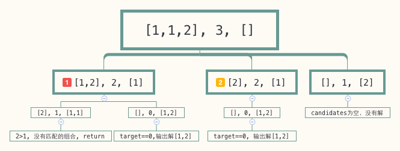

- [40. 组合总和 II](#40-组合总和-ii)
  - [官方题解](#官方题解)
    - [方法一：递归](#方法一递归)
  - [以前的题解](#以前的题解)

------------------------------

# 40. 组合总和 II

给定一个数组 candidates 和一个目标数 target ，找出 candidates 中所有可以使数字和为 target 的组合。

candidates 中的每个数字在每个组合中只能使用一次。

说明：

- 所有数字（包括目标数）都是正整数。
- 解集不能包含重复的组合。 

示例 1:

```
输入: candidates = [10,1,2,7,6,1,5], target = 8,
所求解集为:
[
  [1, 7],
  [1, 2, 5],
  [2, 6],
  [1, 1, 6]
]
```

示例 2:

```
输入: candidates = [2,5,2,1,2], target = 5,
所求解集为:
[
  [1,2,2],
  [5]
]
```

- 来源：力扣（LeetCode）
- 链接：https://leetcode-cn.com/problems/combination-sum-ii
- 著作权归领扣网络所有。商业转载请联系官方授权，非商业转载请注明出处。


## 官方题解

> 链接：https://leetcode-cn.com/problems/combination-sum-ii/solution/zu-he-zong-he-ii-by-leetcode-solution/

### 方法一：递归

**思路与算法**

由于我们需要求出所有和为 $\textit{target}$ 的组合，并且每个数只能使用一次，因此我们可以使用递归 + 回溯的方法来解决这个问题：

- 我们用 `dfs(pos,rest)` 表示递归的函数，其中 `pos` 表示我们当前递归到了数组 `candidates` 中的第 `pos` 个数，而 `rest` 表示我们还需要选择和为 `rest` 的数放入列表作为一个组合；
- 对于当前的第 `pos` 个数，我们有两种方法：选或者不选。如果我们选了这个数，那么我们调用 `dfs(pos+1,rest−candidates[pos])` 进行递归，注意这里必须满足 `rest >= candidates[pos]`。如果我们不选这个数，那么我们调用 `dfs(pos+1,rest)` 进行递归；
- 在某次递归开始前，如果 `rest` 的值为 0，说明我们找到了一个和为 $\textit{target}$ 的组合，将其放入答案中。每次调用递归函数前，如果我们选了那个数，就需要将其放入列表的末尾，该列表中存储了我们选的所有数。在回溯时，如果我们选了那个数，就要将其从列表的末尾删除。

上述算法就是一个标准的递归 + 回溯算法，但是它并不适用于本题。这是因为题目描述中规定了解集不能包含重复的组合，而**上述的算法中并没有去除重复的组合**。

> 例如当 `candidates=[2,2]`，`target=2` 时，上述算法会将列表 `[2]` 放入答案两次。

因此，我们需要改进上述算法，在求出组合的过程中就进行去重的操作。我们可以考虑将相同的数放在一起进行处理，也就是说，如果数 `x` 出现了 y 次，那么在递归时一次性地处理它们，即分别调用选择 $0, 1, \cdots, y$ 次 `x` 的递归函数。这样我们就不会得到重复的组合。具体地：

- 我们使用一个哈希映射（HashMap）统计数组 `candidates` 中每个数出现的次数。在统计完成之后，我们将结果放入一个列表 `freq` 中，方便后续的递归使用。
    - 列表 `freq` 的长度即为数组 `candidates` 中不同数的个数。其中的每一项对应着哈希映射中的一个键值对，即某个数以及它出现的次数。
- 在递归时，对于当前的第 `pos` 个数，它的值为 `freq[pos][0]`，出现的次数为 `freq[pos][1]`，那么我们可以调用
    $$
    \text{dfs}(\textit{pos}+1, \textit{rest} - i \times \textit{freq}[\textit{pos}][0])
    $$
    即我们选择了这个数 i 次。这里 i 不能大于这个数出现的次数，并且 $i \times \textit{freq}[\textit{pos}][0]$ 也不能大于 `rest`。同时，我们需要将 i 个 `freq[pos][0]` 放入列表中。

这样一来，我们就可以不重复地枚举所有的组合了。

我们还可以进行什么优化（剪枝）呢？一种比较常用的优化方法是，我们将 `freq` 根据数从小到大排序，这样我们在递归时会先选择小的数，再选择大的数。这样做的好处是，当我们递归到 `dfs(pos,rest)` 时，如果 `freq[pos][0]` 已经大于 `rest`，那么后面还没有递归到的数也都大于 `rest`，这就说明不可能再选择若干个和为 `rest` 的数放入列表了。此时，我们就可以直接回溯。

```java
class Solution {
    List<int[]> freq = new ArrayList<int[]>();
    List<List<Integer>> ans = new ArrayList<List<Integer>>();
    List<Integer> sequence = new ArrayList<Integer>();

    public List<List<Integer>> combinationSum2(int[] candidates, int target) {
        Arrays.sort(candidates);
        for (int num : candidates) {
            int size = freq.size();
            if (freq.isEmpty() || num != freq.get(size - 1)[0]) {
                freq.add(new int[]{num, 1});
            } else {
                ++freq.get(size - 1)[1];
            }
        }
        dfs(0, target);
        return ans;
    }

    public void dfs(int pos, int rest) {
        if (rest == 0) {
            ans.add(new ArrayList<Integer>(sequence));
            return;
        }
        if (pos == freq.size() || rest < freq.get(pos)[0]) {
            return;
        }

        dfs(pos + 1, rest);

        int most = Math.min(rest / freq.get(pos)[0], freq.get(pos)[1]);
        for (int i = 1; i <= most; ++i) {
            sequence.add(freq.get(pos)[0]);
            dfs(pos + 1, rest - i * freq.get(pos)[0]);
        }
        for (int i = 1; i <= most; ++i) {
            sequence.remove(sequence.size() - 1);
        }
    }
}
```

**复杂度分析**

- 时间复杂度：$O(2^n \times n)$，其中 n 是数组 `candidates` 的长度。在大部分递归 + 回溯的题目中，我们无法给出一个严格的渐进紧界，故这里只分析一个较为宽松的渐进上界。在最坏的情况下，数组中的每个数都不相同，那么列表 `freq` 的长度同样为 n。在递归时，每个位置可以选或不选，如果数组中所有数的和不超过 `target`，那么 $2^n$ 种组合都会被枚举到；在 `target` 小于数组中所有数的和时，我们并不能解析地算出满足题目要求的组合的数量，但我们知道每得到一个满足要求的组合，需要 $O(n)$ 的时间将其放入答案中，因此我们将 $O(2^n)$ 与 $O(n)$ 相乘，即可估算出一个宽松的时间复杂度上界。
    - 由于 $O(2^n \times n)$ 在渐进意义下大于排序的时间复杂度 $O(n \log n)$，因此后者可以忽略不计。
- 空间复杂度：$O(n)$。除了存储答案的数组外，我们需要 $O(n)$ 的空间存储列表 `freq`、递归中存储当前选择的数的列表、以及递归需要的栈。


## 以前的题解

```go
func CombinationSum2(candidates []int, target int) [][]int {
	sort.Ints(candidates)
	result := [][]int{}
	combinationSum2Help(candidates, target, nil, &result)
	return result
}

func combinationSum2Help(candidates []int, target int, com []int, result *[][]int) {
	if target > 0 {
		for i, c := range candidates {
			// 去掉重复的
            // candidates 中可以有重复的，这会递归中选中重复的，这里去重是保证 candidates 中重复的元素不会被过多的使用
			if i > 0 && c == candidates[i-1] {
				continue
			}
			if target >= c {
				com = append(com, c)
				combinationSum2Help(candidates[i+1:], target-c, com, result)
				com = com[:len(com)-1]
				continue
			}
			return
		}
	}
	if target == 0 {
		comCopy := make([]int, len(com))
		copy(comCopy, com)
		*result = append(*result, comCopy)
		return
	}
}
```

这里的思路基本和 [Combination Sum](combination_sum.md) 中的一样，有几处不同的地方：

- 递归调用时 `candidates` 传递的是 `candidates[i+1:]`。 因为题目中说 `candidates` 中的元素只能使用一次，既然我们选定了 `candidates[i]`， 那么下次就应该从 `candidates[i+1]` 开始检测。

- 多出了一个 `if i > 0 && c == candidates[i-1]` 的判断。这种情况出现在 `candidates` 中有重复的元素，比如 `combinations=[1, 1, 2], target=3`的情况：

  

  图中(1)表示遍历第一个元素1，此时 `candidates=[1,2], target=2, com=[1]`, 可以看到递归后可以得到一个解 `[1,2]`， 图中(2)当我们遍历第二个元素1时，也会得到解 [1,2]，这样的话就出现了重复解，因此代码中将情况(2)排除。

--------------------

**2020-09-10 修改**：

- 如果 `candidates = [1, 1, 2]`。
- 第一层循环时选择了第一个 1，那么递归时依然可以选择第二个 1.
- 而第一层循环时就不能再选择第二个 1 了，因为递归时会选择它，如果第一层再选择它，那么就会导致重复。
- 可以看看 Rust 的实现。
