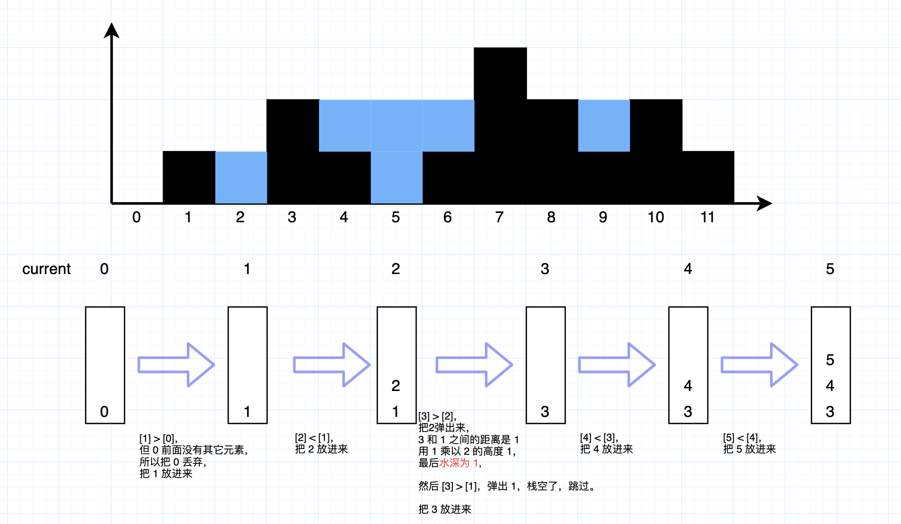
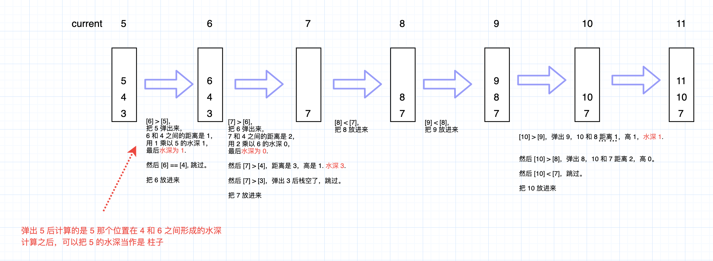
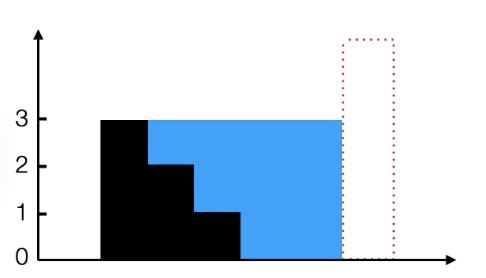
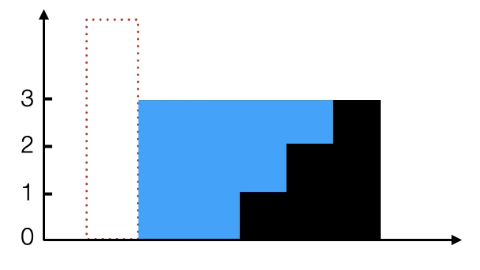
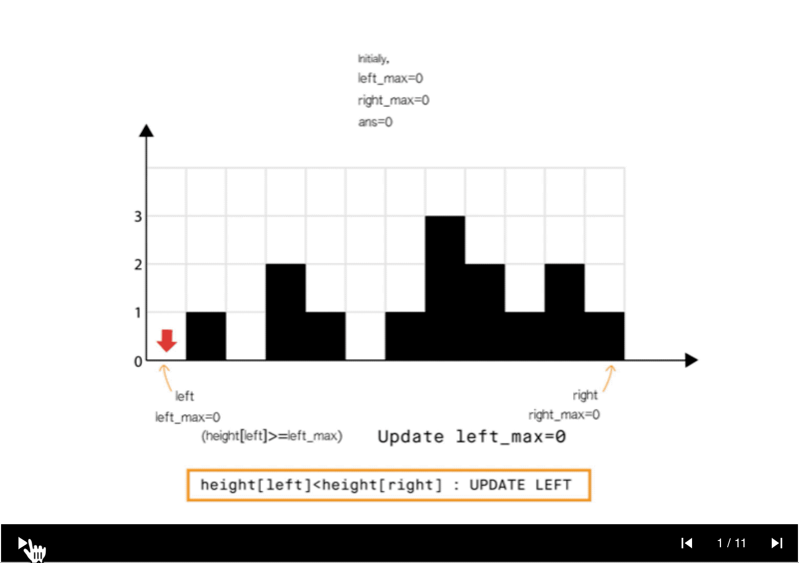

- [42. 接雨水](#42-接雨水)
  - [官方题解](#官方题解)
    - [方法 1：暴力](#方法-1暴力)
    - [方法 2：动态编程](#方法-2动态编程)
    - [方法 3：栈的应用](#方法-3栈的应用)
    - [方法 4：使用双指针](#方法-4使用双指针)

------------------------------

# 42. 接雨水

给定 n 个非负整数表示每个宽度为 1 的柱子的高度图，计算按此排列的柱子，下雨之后能接多少雨水。


上面是由数组 `[0,1,0,2,1,0,1,3,2,1,2,1]` 表示的高度图，在这种情况下，可以接 6 个单位的雨水（蓝色部分表示雨水）。 感谢 Marcos 贡献此图。

示例:

```
输入: [0,1,0,2,1,0,1,3,2,1,2,1]
输出: 6
```

- 来源：力扣（LeetCode）
- 链接：https://leetcode-cn.com/problems/trapping-rain-water
- 著作权归领扣网络所有。商业转载请联系官方授权，非商业转载请注明出处。

> 连最暴力的方法也没有想到 😥

## 官方题解

> 链接：https://leetcode-cn.com/problems/trapping-rain-water/solution/jie-yu-shui-by-leetcode/

### 方法 1：暴力

**直观想法**

直接按问题描述进行。对于数组中的每个元素，我们找出下雨后水能达到的最高位置，等于两边最大高度的较小值减去当前高度的值。

**算法**

- 初始化 $ans=0$
- 从左向右扫描数组：
    - 初始化 $\text{max\_left}=0$ 和 $\text{max\_right}=0$
    - 从当前元素向左扫描并更新：
        - $\text{max\_left}=\max(\text{max\_left},\text{height}[j])$
    - 从当前元素向右扫描并更新：
        - $\text{max\_right}=\max(\text{max\_right},\text{height}[j])$
    - 将 $\min(\text{max\_left},\text{max\_right}) - \text{height}[i]$ 累加到 $\text{ans}$ (这一步计算的是在 `[i]` 这个位置上的水深)

```c++
int trap(vector<int>& height)
{
    int ans = 0;
    int size = height.size();
    for (int i = 1; i < size - 1; i++) {
        int max_left = 0, max_right = 0;
        for (int j = i; j >= 0; j--) { //Search the left part for max bar size
            max_left = max(max_left, height[j]);
        }
        for (int j = i; j < size; j++) { //Search the right part for max bar size
            max_right = max(max_right, height[j]);
        }
        ans += min(max_left, max_right) - height[i];
    }
    return ans;
}
```

**复杂性分析**

- 时间复杂度：$O(n^2)$。数组中的每个元素都需要向左向右扫描。
- 空间复杂度 $O(1)$ 的额外空间。

> 这个每次计算的是一个格子的水深，纵向的。


### 方法 2：动态编程

**直观想法**

在暴力方法中，我们仅仅为了找到最大值每次都要向左和向右扫描一次。但是我们可以提前存储这个值。因此，可以通过动态编程解决。

这个概念可以见下图解释：


**算法**

- 找到数组中从下标 i 到最左端最高的条形块高度 $\text{left\_max}$。
- 找到数组中从下标 i 到最右端最高的条形块高度 $\text{right\_max}$。
- 扫描数组 $\text{height}$ 并更新答案：
    - 累加 $\min(\text{max\_left}[i],\text{max\_right}[i]) - \text{height}[i]$ 到 $ans$ 上

```c++
int trap(vector<int>& height)
{
	if(height == null)
		return 0;
    int ans = 0;
    int size = height.size();
    vector<int> left_max(size), right_max(size);
    left_max[0] = height[0];
    for (int i = 1; i < size; i++) {
        left_max[i] = max(height[i], left_max[i - 1]);
    }
    right_max[size - 1] = height[size - 1];
    for (int i = size - 2; i >= 0; i--) {
        right_max[i] = max(height[i], right_max[i + 1]);
    }
    for (int i = 1; i < size - 1; i++) {
        ans += min(left_max[i], right_max[i]) - height[i];
    }
    return ans;
}
```

**复杂性分析**

- 时间复杂度：$O(n)$。
    - 存储最大高度数组，需要两次遍历，每次 $O(n)$ 。
    - 最终使用存储的数据更新 $\text{ans}$ ，$O(n)$。
- 空间复杂度：$O(n)$ 额外空间。
    - 和方法 1 相比使用了额外的 $O(n)$ 空间用来放置 $\text{left\_max}$ 和 $\text{right\_max}$ 数组。


### 方法 3：栈的应用

**直观想法**

我们可以不用像方法 2 那样存储最大高度，而是用栈来跟踪可能储水的最长的条形块。使用栈就可以在一次遍历内完成计算。

我们在遍历数组时维护一个栈。如果当前的条形块小于或等于栈顶的条形块，我们将条形块的索引入栈，意思是当前的条形块被栈中的前一个条形块界定。如果我们发现一个条形块长于栈顶，我们可以确定栈顶的条形块被当前条形块和栈的前一个条形块界定(要把 3 个块参考进来理解)，因此我们可以弹出栈顶元素并且累加答案到 $\text{ans}$。

**算法**

- 使用栈来存储条形块的索引下标。
- 遍历数组：
    - 当栈非空且 $\text{height}[current]>\text{height}[st.top()]$
        - 意味着栈中元素可以被弹出。弹出栈顶元素 $\text{top}$。
        - 计算当前元素和栈顶元素的距离，准备进行填充操作 $\text{distance} = \text{current} - \text{st.top}() - 1$
        - 找出界定高度 $\text{bounded\_height} = \min(\text{height[current]}, \text{height[st.top()]}) - \text{height[top]}$
        - 往答案中累加积水量 $\text{ans} \mathrel{+}= \text{distance} \times \text{bounded\_height}$
    - 将当前索引下标入栈
    - 将 $\text{current}$ 移动到下个位置

```c++
int trap(vector<int>& height)
{
    int ans = 0, current = 0;
    stack<int> st;
    while (current < height.size()) {
        while (!st.empty() && height[current] > height[st.top()]) {
            int top = st.top();
            st.pop();
            if (st.empty())
                break;
            // - 1 是因为要把左右两个边界都去掉。
            int distance = current - st.top() - 1;
            int bounded_height = min(height[current], height[st.top()]) - height[top];
            ans += distance * bounded_height;
        }
        st.push(current++);
    }
    return ans;
}
```

**复杂性分析**

- 时间复杂度：$O(n)$。
    - 单次遍历 $O(n)$ ，每个条形块最多访问两次（由于栈的弹入和弹出），并且弹入和弹出栈都是 $O(1)$ 的。
- 空间复杂度：$O(n)$。 栈最多在阶梯型或平坦型条形块结构中占用 $O(n)$ 的空间。

下面是我根据代码算的过程：





> 这个每次计算是按横向的。
> 
> 视频中讲解：top 的前面一个比它高，而 current 也比 top 高，所以在 top 处会形成低洼。


### 方法 4：使用双指针

**直观想法**

和方法 2 相比，我们不从左和从右分开计算，我们想办法一次完成遍历。

从动态编程方法的示意图中我们注意到，只要 $\text{right\_max}[i]>\text{left\_max}[i]$ （元素 0 到元素 6），积水高度将由 `left_max` 决定，类似地 $\text{left\_max}[i]>\text{right\_max}[i]$（元素 8 到元素 11）。

所以我们可以认为如果一端有更高的条形块（例如右端），积水的高度依赖于当前方向的高度（从左到右）。当我们发现另一侧（右侧）的条形块高度不是最高的，我们则开始从相反的方向遍历（从右到左）。

> 上面这句这样理解：
> 
> 假设右边有一根非常高的柱子，那么低洼处的水深取决于左边的柱子高度：
> 
>
> 同样地,
>
> 假设左边有一根非常高的柱子，那么低洼处的水深取决于右边的柱子的高度：
> 

我们必须在遍历时维护 $\text{left\_max}$ 和 $\text{right\_max}$ ，但是我们现在可以使用两个指针交替进行，实现 1 次遍历即可完成。



**算法**

- 初始化 $\text{left}$ 指针为 0 并且 $\text{right}$ 指针为 size-1
- While $\text{left}< \text{right}$, do:
    - If $\text{height[left]} < \text{height[right]}$ （右边有一根很高的柱子，那么低洼处的水深取决于左边的值）
        - If $\text{height[left]} \geq \text{left\_max}$, 更新 $\text{left\_max}$ （如果 `height[left] >= left_max`，说明柱子是越来越高的）
        - Else 累加 $\text{left\_max}-\text{height[left]}$ 到 $\text{ans}$（否则是越来越低的，那么它的左边和 `[right]` 就会形成低洼处）
        - $\text{left} = \text{left} + 1$.
    - Else
        - If $\text{height[right]} \geq \text{right\_max}$, 更新 $\text{right\_max}$
        - Else 累加 $\text{right\_max}-\text{height[right]}$ 到 $\text{ans}$
        - $\text{right} = \text{right} - 1$.

```c++
int trap(vector<int>& height)
{
    int left = 0, right = height.size() - 1;
    int ans = 0;
    int left_max = 0, right_max = 0;
    while (left < right) {
        if (height[left] < height[right]) { 
            height[left] >= left_max ? (left_max = height[left]) : ans += (left_max - height[left]);
            ++left;
        }
        else {
            height[right] >= right_max ? (right_max = height[right]) : ans += (right_max - height[right]);
            --right;
        }
    }
    return ans;
}
```

**复杂性分析**

- 时间复杂度：$O(n)$。单次遍历的时间$O(n)$。
- 空间复杂度：$O(1)$ 的额外空间。$\text{left}$, $\text{right}$, $\text{left\_max}$ 和 $\text{right\_max}$ 只需要常数的空间。
