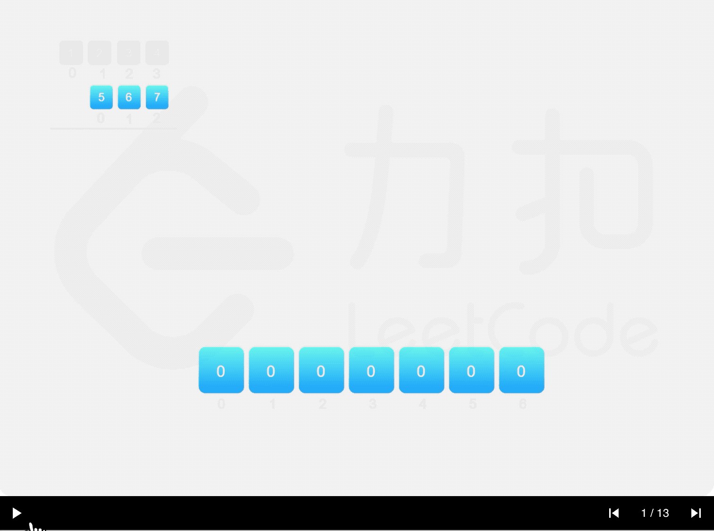

- [43. 字符串相乘](#43-字符串相乘)
  - [题目](#题目)
  - [题解](#题解)
    - [方法一：做加法](#方法一做加法)
    - [方法二：做乘法](#方法二做乘法)

------------------------------

# 43. 字符串相乘

## 题目

给定两个以字符串形式表示的非负整数 num1 和 num2，返回 num1 和 num2 的乘积，它们的乘积也表示为字符串形式。

示例 1:

```
输入: num1 = "2", num2 = "3"
输出: "6"
```

示例 2:

```
输入: num1 = "123", num2 = "456"
输出: "56088"
```

说明：

- num1 和 num2 的长度小于110。
- num1 和 num2 只包含数字 0-9。
- num1 和 num2 均不以零开头，除非是数字 0 本身。
- 不能使用任何标准库的大数类型（比如 BigInteger）或直接将输入转换为整数来处理。

--------------------

- 来源：力扣（LeetCode）
- 链接：https://leetcode-cn.com/problems/multiply-strings
- 著作权归领扣网络所有。商业转载请联系官方授权，非商业转载请注明出处。


## 题解

> 我是使用的方法1，不过我没有基于字符串来操作，应该是比他的要好一点。
> 链接：https://leetcode-cn.com/problems/multiply-strings/solution/zi-fu-chuan-xiang-cheng-by-leetcode-solution/

### 方法一：做加法

如果 $\textit{num}_1$ 和 $\textit{num}_2$ 之一是 $0$，则直接将 $0$ 作为结果返回即可。 

如果 $\textit{num}_1$ 和 $\textit{num}_2$ 都不是 $0$，则可以通过模拟「竖式乘法」的方法计算乘积。从右往左遍历乘数，将乘数的每一位与被乘数相乘得到对应的结果，再将每次得到的结果累加。这道题中，被乘数是 $\textit{num}_1$，乘数是 $\textit{num}_2$。 

需要注意的是，$\textit{num}_2$ 除了最低位以外，其余的每一位的运算结果都需要补 $0$。


对每次得到的结果进行累加，可以使用「[415. 字符串相加](https://leetcode-cn.com/problems/add-strings/)」的做法。

```go
func multiply(num1 string, num2 string) string {
    if num1 == "0" || num2 == "0" {
        return "0"
    }
    ans := "0"
    m, n := len(num1), len(num2)
    for i := n - 1; i >= 0; i-- {
        curr := ""
        add := 0
        for j := n - 1; j > i; j-- { // 补 0
            curr += "0"
        }
        y := int(num2[i] - '0')
        for j := m - 1; j >= 0; j-- {
            x := int(num1[j] - '0')
            product := x * y + add
            curr = strconv.Itoa(product % 10) + curr
            add = product / 10
        }
        for ; add != 0; add /= 10 {
            curr = strconv.Itoa(add % 10) + curr
        }
        ans = addStrings(ans, curr)
    }
    return ans
}

func addStrings(num1, num2 string) string {
    i, j := len(num1) - 1, len(num2) - 1
    add := 0
    ans := ""
    for ; i >= 0 || j >= 0 || add != 0; i, j = i - 1, j - 1 {
        x, y := 0, 0
        if i >= 0 {
            x = int(num1[i] - '0')
        }
        if j >= 0 {
            y = int(num2[j] - '0')
        }
        result := x + y + add
        ans = strconv.Itoa(result % 10) + ans
        add = result / 10
    }
    return ans
}
```

**复杂度分析**

- 时间复杂度：$O(mn+n^2)$，其中 $m$ 和 $n$ 分别是 $\textit{num}_1$ 和 $\textit{num}_2$ 的长度。需要从右往左遍历 $\textit{num}_2$，对于 $\textit{num}_2$ 的每一位，都需要和 $\textit{num}_1$ 的每一位计算乘积，因此计算乘积的总次数是 $mn$。字符串相加操作共有 $n$ 次，相加的字符串长度最长为 $m+n$，因此字符串相加的时间复杂度是 $O(mn+n^2)$。总时间复杂度是 $O(mn+n^2)$。 
- 空间复杂度：$O(m+n)$，其中 $m$ 和 $n$ 分别是 $\textit{num}_1$ 和 $\textit{num}_2$ 的长度。空间复杂度取决于存储中间状态的字符串，由于乘积的最大长度为 $m+n$，因此存储中间状态的字符串的长度不会超过 $m+n$。


### 方法二：做乘法

> 1. 乘积的最大位数。
> 2. 每一位相乘应该放置的位置。

方法一的做法是从右往左遍历乘数，将乘数的每一位与被乘数相乘得到对应的结果，再将每次得到的结果累加，整个过程中涉及到较多字符串相加的操作。如果使用数组代替字符串存储结果，则可以减少对字符串的操作。

令 $m$ 和 $n$ 分别表示 $\textit{num}_1$ 和 $\textit{num}_2$ 的长度，并且它们均不为 $0$，则 $\textit{num}_1$ 和 $\textit{num}_2$ 的乘积的长度为 $m+n-1$  或 $m+n$ 。简单证明如下： 

- 如果 $\textit{num}_1$ 和 $\textit{num}_2$ 都取最小值，则 $\textit{num}_1=10^{m-1}$，$\textit{num2}=10^{n-1}$，$\textit{num}_1 \times \textit{num}_2=10^{m+n-2}$，乘积的长度为 $m+n-1$ ；
- 如果 $\textit{num}_1$ 和 $\textit{num}_2$ 都取最大值，则 $\textit{num}_1=10^m-1$，$\textit{num}_2=10^n-1$，$\textit{num}_1 \times \textit{num}_2=10^{m+n}-10^m-10^n+1$，乘积显然小于 $10^{m+n}$ 且大于 $10^{m+n-1}$，因此乘积的长度为 $m+n$ 。

由于 $\textit{num}_1$ 和 $\textit{num}_2$ 的乘积的最大长度为 $m+n$ ，因此创建长度为 $m+n$  的数组 $\textit{ansArr}$  用于存储乘积。对于任意 $0 \le i < m$ 和 $0 \le j < n$，$\textit{num}_1[i] \times \textit{num}_2[j]$ 的结果位于 $\textit{ansArr}[i+j+1]$，如果 $\textit{ansArr}[i+j+1] \ge 10$，则将进位部分加到 $\textit{ansArr}[i+j]$。 

最后，将数组 $\textit{ansArr}$  转成字符串，如果最高位是 $0$ 则舍弃最高位。



```go
func multiply(num1 string, num2 string) string {
    if num1 == "0" || num2 == "0" {
        return "0"
    }
    m, n := len(num1), len(num2)
    ansArr := make([]int, m + n)
    for i := m - 1; i >= 0; i-- {
        x := int(num1[i]) - '0'
        for j := n - 1; j >= 0; j-- {
            y := int(num2[j] - '0')
            ansArr[i + j + 1] += x * y
        }
    }
    // 处理进位
    for i := m + n - 1; i > 0; i-- {
        ansArr[i - 1] += ansArr[i] / 10
        ansArr[i] %= 10
    }
    // 转成字符串
    ans := ""
    idx := 0
    if ansArr[0] == 0 {
        idx = 1
    }
    for ; idx < m + n; idx++ {
        ans += strconv.Itoa(ansArr[idx])
    }
    return ans
}
```

**复杂度分析**

- 时间复杂度：$O(mn)$，其中 $m$ 和 $n$ 分别是 $\textit{num}_1$ 和 $\textit{num}_2$ 的长度。需要计算 $\textit{num}_1$ 的每一位和 $\textit{num}_2$ 的每一位的乘积。 
- 空间复杂度：$O(m+n)$，其中 $m$ 和 $n$ 分别是 $\textit{num}_1$ 和 $\textit{num}_2$ 的长度。需要创建一个长度为 $m+n$  的数组存储乘积。 

**结语**

方法二还可以用另外一种方法改写。我们把两个数相乘看成是两个多项式相乘，因为任何一个数都可以表示成为

$$
\sum_{i = 0}^{n - 1} a_i \times 10^i
$$

的形式，也就相当于对多项式

$$
A(x) = \sum_{i = 0} ^ {n - 1} a_i x^i
$$

在 $x = 10$ 处求值。当两个数 $N_a$、$N_b$ 相乘的时候，我们也可以认为这两个数是两个多项式

$$
\left\{ \begin{aligned} & A(x) = \sum_{i = 0} ^ {n - 1} a_i x^i \\ & B(x) = \sum_{i = 0} ^ {m - 1} b_i x^i \end{aligned} \right.
$$

相乘的结果 $C(x) = A(x) \times B(x)$ 在 $x = 10$ 处求值。我们可以这样表示 $C(x)$：

$$
C(x) = \sum_{i = 0}^{n + m - 2} c_i x^i
$$

这里

$$
c_i = \sum_{k = 0} ^ {i} a_k b_{i - k}
$$

于是我们就可以顺序求解 $c_i$ ，每次 $O(i)$  地选取下标和为 $i$ 的一组 $(a_k, b_{i - k})$。求到 $c_i$ 序列之后，再处理进位即可得到答案。对比这两种做法：

- 顺序求解 $c_i$ 的过程相当于集中计算 $c_i$ 
- 而方法二相当于每对 $(a_i, b_j)$ 对 $c_{i + j}$ 算贡献（注意这里的 $a_i$ 并不是题目中的 ${\it num}_1[i]$，$a_i$ 下标越小，代表的位权越小，而 ${\it num}_1[i]$ 下标越小，代表的位权越大）

它们的本质是一样的，并且时间复杂度都是 $O(\max \{ n, m\} ^2)$。我们再仔细的观察 $c_i$ 的形式：

$$
c_i = \sum_{k = 0}^{i} a_k b_{i - k}
$$

它揭示了多项式乘法的另一面：$c_i$ 序列其实是 $a_i$ 序列和 $b_i$ 序列的卷积，即：

$$
\vec{c} = \vec{a} * \vec{b}
$$

至此，我们就可以用一种叫做快速傅立叶变换（Fast Fourier Transform，FFT）的方法来加速卷积的计算，使得时间复杂度降低到 $O(c \log c)$，这里 $c$ 是不小于 $n + m$ 的最小的 $2$ 的整数幂。由于这个方法并不在面试的考纲范围内，感兴趣的同学可以自行学习。
