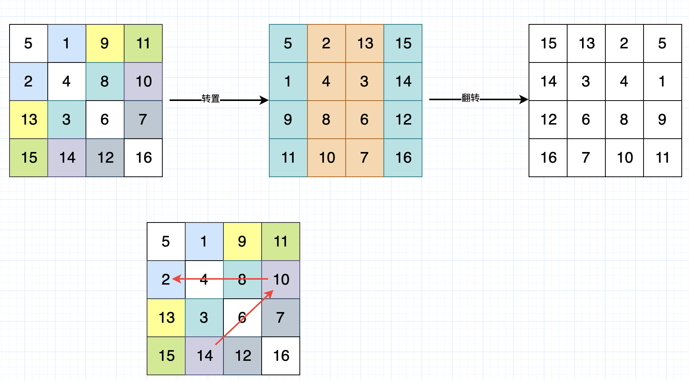
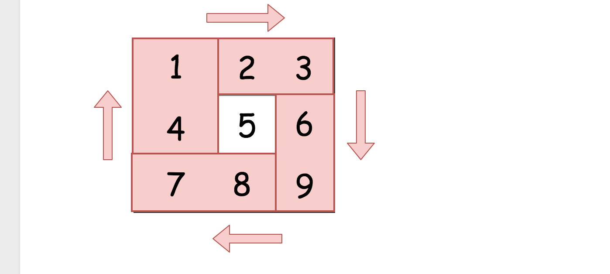
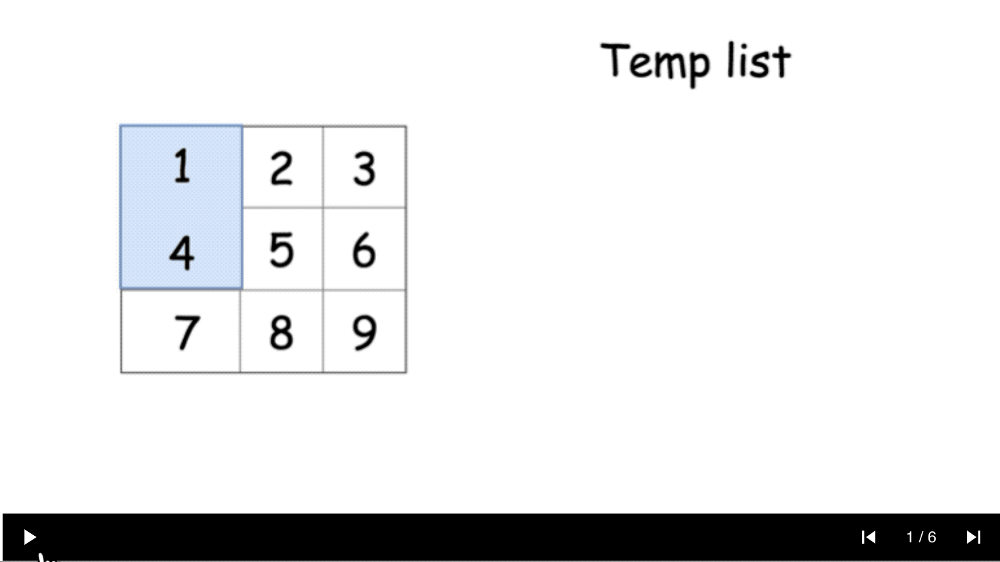
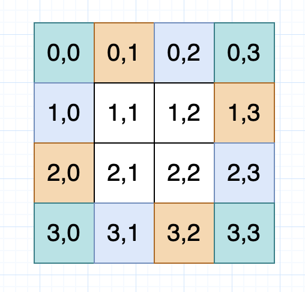

# 48. 旋转图像

给定一个 n × n 的二维矩阵表示一个图像。

将图像顺时针旋转 90 度。

说明：

你必须在**原地**旋转图像，这意味着你需要直接修改输入的二维矩阵。请不要使用另一个矩阵来旋转图像。

示例 1:

```
给定 matrix = 
[
  [1,2,3],
  [4,5,6],
  [7,8,9]
],

原地旋转输入矩阵，使其变为:
[
  [7,4,1],
  [8,5,2],
  [9,6,3]
]
```

示例 2:

```
给定 matrix =
[
  [ 5, 1, 9,11],
  [ 2, 4, 8,10],
  [13, 3, 6, 7],
  [15,14,12,16]
], 

原地旋转输入矩阵，使其变为:
[
  [15,13, 2, 5],
  [14, 3, 4, 1],
  [12, 6, 8, 9],
  [16, 7,10,11]
]
```

- 来源：力扣（LeetCode）
- 链接：https://leetcode-cn.com/problems/rotate-image
- 著作权归领扣网络所有。商业转载请联系官方授权，非商业转载请注明出处。


## 官方题解

> 链接：https://leetcode-cn.com/problems/rotate-image/solution/xuan-zhuan-tu-xiang-by-leetcode/

### 方法 1 ：转置加翻转

最直接的想法是先转置矩阵，然后翻转每一行。这个简单的方法已经能达到最优的时间复杂度$O(N^2)$。

```py
class Solution:
    def rotate(self, matrix):
        """
        :type matrix: List[List[int]]
        :rtype: void Do not return anything, modify matrix in-place instead.
        """
        n = len(matrix[0])        
        # transpose matrix
        for i in range(n):
            for j in range(i, n):
                matrix[j][i], matrix[i][j] = matrix[i][j], matrix[j][i] 
        
        # reverse each row
        for i in range(n):
            matrix[i].reverse()
```

- 时间复杂度：$O(N^2)$.
- 空间复杂度：$O(1)$ 由于旋转操作是 就地 完成的。

我画了个图来显示这个过程：




### 方法 2 ：旋转四个矩形

直观想法

方法 1 使用了两次矩阵操作，但是有只使用一次操作的方法完成旋转。

为了实现这一点，我们来研究每个元素在旋转的过程中如何移动。


这提供给我们了一个思路，将给定的矩阵分成四个矩形并且将原问题划归为旋转这些矩形的问题。



现在的解法很直接 - 可以在第一个矩形中移动元素并且在 长度为 4 个元素的临时列表中移动它们。



> 把这4个元素放在一个数组中，然后旋转这个数组。

```py
class Solution:
    def rotate(self, matrix):
        """
        :type matrix: List[List[int]]
        :rtype: void Do not return anything, modify matrix in-place instead.
        """
        n = len(matrix[0])
        for i in range(n // 2 + n % 2):
            for j in range(n // 2):
                tmp = [0] * 4
                row, col = i, j
                # store 4 elements in tmp
                for k in range(4):
                    tmp[k] = matrix[row][col]
                    row, col = col, n - 1 - row  # 这个是怎么推出来的呢？
                # rotate 4 elements   
                for k in range(4):
                    matrix[row][col] = tmp[(k - 1) % 4]
                    row, col = col, n - 1 - row
```

复杂度分析

- 时间复杂度：$O(N^2)$ 是两重循环的复杂度。
- 空间复杂度：$O(1)$ 由于我们在一次循环中的操作是 就地 完成的，并且我们只用了长度为 4 的临时列表做辅助。



```
row2 = col1
col2 + row1 = n-1
```

每个开始的点：假如 n == 3: `[0, 0], [1, 0]`。假如 n == 4: `[0, 0], [0, 1], [1, 0], [1, 1]`。

### 方法 3：在单次循环中旋转 4 个矩形

该想法和方法 2 相同，但是所有的操作可以在单次循环内完成并且这是更精简的方法。

```py
class Solution:
    def rotate(self, matrix):
        """
        :type matrix: List[List[int]]
        :rtype: void Do not return anything, modify matrix in-place instead.
        """
        n = len(matrix[0])        
        for i in range(n // 2 + n % 2):
            for j in range(n // 2):
                tmp = matrix[n - 1 - j][i]
                matrix[n - 1 - j][i] = matrix[n - 1 - i][n - j - 1]
                matrix[n - 1 - i][n - j - 1] = matrix[j][n - 1 -i]
                matrix[j][n - 1 - i] = matrix[i][j]
                matrix[i][j] = tmp
```

- 时间复杂度：$O(N^2)$ 是两重循环的复杂度。
- 空间复杂度：$O(1)$ 由于旋转操作是 就地 完成的。