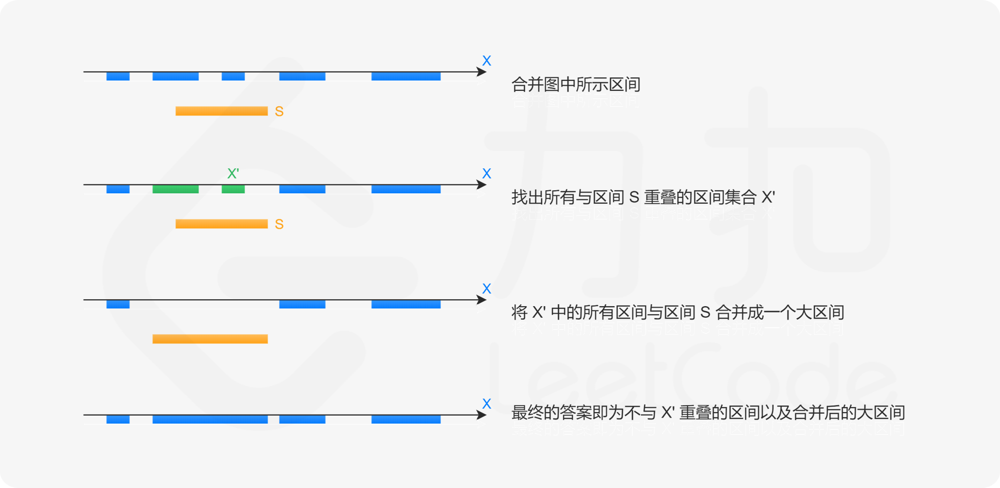

- [57. 插入区间](#57-插入区间)
  - [官方题解](#官方题解)
    - [方法一：模拟](#方法一模拟)


------------------------------

# 57. 插入区间

[链接](https://leetcode-cn.com/problems/insert-interval)

给出一个无重叠的 ，按照区间起始端点排序的区间列表。

在列表中插入一个新的区间，你需要确保列表中的区间仍然有序且不重叠（如果有必要的话，可以合并区间）。

示例 1:

```
输入: intervals = [[1,3],[6,9]], newInterval = [2,5]
输出: [[1,5],[6,9]]
```

示例 2:

```
输入: intervals = [[1,2],[3,5],[6,7],[8,10],[12,16]], newInterval = [4,8]
输出: [[1,2],[3,10],[12,16]]
解释: 这是因为新的区间 [4,8] 与 [3,5],[6,7],[8,10] 重叠。
```

## 官方题解

> 链接：https://leetcode-cn.com/problems/insert-interval/solution/cha-ru-qu-jian-by-leetcode-solution/

对于区间 $S_1 = [l_1, r_1]$ 和 $S_2 = [l_2, r_2]$，如果它们之间没有重叠（没有交集），说明要么 $S_1$ 在 $S_2$ 的左侧，此时有 $r_1 < l_2$；要么 $S_1$ 在 $S_2$ 的右侧，此时有 $l_1 > r_2$。

如果 $r_1 < l_2$ 和 $l_1 > r_2$ 二者均不满足，说明 $S_1$ 和 $S_2$ 必定有交集，它们的交集即为

$$
[\max(l_1, l_2), \min(r_1, r_2)]
$$

并集即为

$$
[\min(l_1, l_2), \max(r_1, r_2)]
$$

### 方法一：模拟

在给定的区间集合 $\mathcal{X}$ 互不重叠的前提下，当我们需要插入一个新的区间 $S = [\textit{left}, \textit{right}]$ 时，我们只需要：

- 找出所有与区间 S 重叠的区间集合 $\mathcal{X}'$; 
- 将 $\mathcal{X}'$ 中的所有区间连带上区间 S 合并成一个大区间；
- 最终的答案即为不与 $\mathcal{X}'$ 重叠的区间以及合并后的大区间。



这样做的正确性在于，给定的区间集合中任意两个区间都是没有交集的，因此所有需要合并的区间，就是所有与区间 S 重叠的区间。

并且，在给定的区间集合已经按照左端点排序的前提下，所有与区间 S 重叠的区间在数组 $\textit{intervals}$ 中下标范围是连续的，因此我们可以对所有的区间进行一次遍历，就可以找到这个连续的下标范围。

当我们遍历到区间 $[l_i, r_i]$ 时：

- 如果 $r_i < \textit{left}$，说明 $[l_i, r_i]$ 与 $S$ 不重叠并且在其左侧，我们可以直接将 $[l_i, r_i]$ 加入答案；
- 如果 $l_i > \textit{right}$，说明 $[l_i, r_i]$ 与 $S$ 不重叠并且在其右侧，我们可以直接将 $[l_i, r_i]$ 加入答案；
- 如果上面两种情况均不满足，说明 $[l_i, r_i]$ 与 $S$ 重叠，我们无需将 $[l_i, r_i]$ 加入答案。此时，我们需要将 $S$ 与 $[l_i, r_i]$ 合并，即将 $S$ 更新为其与 $[l_i, r_i]$ 的并集。

那么我们应当在什么时候将区间 $S$ 加入答案呢？由于我们需要保证答案也是按照左端点排序的，因此当我们遇到第一个 满足 $l_i > \textit{right}$ 的区间时，说明以后遍历到的区间不会与 $S$ 重叠，并且它们左端点一定会大于 $S$ 的左端点。此时我们就可以将 $S$ 加入答案。特别地，如果不存在这样的区间，我们需要在遍历结束后，将 $S$ 加入答案。

```go
func insert(intervals [][]int, newInterval []int) (ans [][]int) {
    left, right := newInterval[0], newInterval[1]
    merged := false
    for _, interval := range intervals {
        if interval[0] > right {
            // 在插入区间的右侧且无交集
            if !merged {
                ans = append(ans, []int{left, right})
                merged = true
            }
            ans = append(ans, interval)
        } else if interval[1] < left {
            // 在插入区间的左侧且无交集
            ans = append(ans, interval)
        } else {
            // 与插入区间有交集，计算它们的并集
            left = min(left, interval[0])
            right = max(right, interval[1])
        }
    }
    if !merged {
        ans = append(ans, []int{left, right})
    }
    return
}

func min(a, b int) int {
    if a < b {
        return a
    }
    return b
}

func max(a, b int) int {
    if a > b {
        return a
    }
    return b
}
```

复杂度分析

- 时间复杂度：$O(n)$，其中 n 是数组 $\textit{intervals}$ 的长度，即给定的区间个数。
- 空间复杂度：$O(1)$。除了存储返回答案的空间以外，我们只需要额外的常数空间即可。
