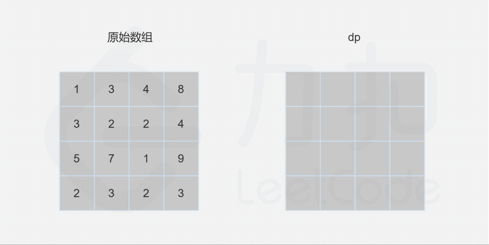

- [64. 最小路径和](#64-最小路径和)
  - [题目](#题目)
  - [题解](#题解)
    - [方法一：动态规划](#方法一动态规划)

------------------------------

# 64. 最小路径和

## 题目

给定一个包含非负整数的 m x n 网格，请找出一条从左上角到右下角的路径，使得路径上的数字总和为最小。

说明：每次只能向下或者向右移动一步。

示例:

```
输入:
[
  [1,3,1],
  [1,5,1],
  [4,2,1]
]
输出: 7
解释: 因为路径 1→3→1→1→1 的总和最小。
```

- 来源：力扣（LeetCode）
- 链接：https://leetcode-cn.com/problems/minimum-path-sum
- 著作权归领扣网络所有。商业转载请联系官方授权，非商业转载请注明出处。


## 题解

> 思路比较简单，在每个格子上都计算出最小值，选择上面或左面最小的那个值和当前元素相加就可以了。需要注意的是边界问题。
> 优化就是用滚动数组。

--------------------

> 链接：https://leetcode-cn.com/problems/minimum-path-sum/solution/zui-xiao-lu-jing-he-by-leetcode-solution/


### 方法一：动态规划

由于路径的方向只能是向下或向右，因此网格的第一行的每个元素只能从左上角元素开始向右移动到达，网格的第一列的每个元素只能从左上角元素开始向下移动到达，此时的路径是唯一的，因此每个元素对应的最小路径和即为对应的路径上的数字总和。

对于不在第一行和第一列的元素，可以从其上方相邻元素向下移动一步到达，或者从其左方相邻元素向右移动一步到达，元素对应的最小路径和等于其上方相邻元素与其左方相邻元素两者对应的最小路径和中的最小值加上当前元素的值。由于每个元素对应的最小路径和与其相邻元素对应的最小路径和有关，因此可以使用动态规划求解。

创建二维数组 $\textit{dp}$，与原始网格的大小相同，$\textit{dp}[i][j]$ 表示从左上角出发到 $(i,j)$ 位置的最小路径和。显然，$\textit{dp}[0][0]=\textit{grid}[0][0]$。对于 $\textit{dp}$ 中的其余元素，通过以下状态转移方程计算元素值。

- 当 $i>0$ 且 $j=0$ 时，$\textit{dp}[i][0]=\textit{dp}[i-1][0]+\textit{grid}[i][0]$。(第一列)
- 当 $i=0$ 且 $j>0$ 时，$\textit{dp}[0][j]=\textit{dp}[0][j-1]+\textit{grid}[0][j]$。(第一行)
- 当 $i>0$ 且 $j>0$ 时，$\textit{dp}[i][j]=\min(\textit{dp}[i-1][j],\textit{dp}[i][j-1])+\textit{grid}[i][j]$。

最后得到 $\textit{dp}[m-1][n-1]$ 的值即为从网格左上角到网格右下角的最小路径和。



```go
func minPathSum(grid [][]int) int {
    if len(grid) == 0 || len(grid[0]) == 0 {
        return 0
    }
    rows, columns := len(grid), len(grid[0])
    dp := make([][]int, rows)
    for i := 0; i < len(dp); i++ {
        dp[i] = make([]int, columns)
    }
    dp[0][0] = grid[0][0]
    for i := 1; i < rows; i++ {
        dp[i][0] = dp[i - 1][0] + grid[i][0]
    }
    for j := 1; j < columns; j++ {
        dp[0][j] = dp[0][j - 1] + grid[0][j]
    }
    for i := 1; i < rows; i++ {
        for j := 1; j < columns; j++ {
            dp[i][j] = min(dp[i - 1][j], dp[i][j - 1]) + grid[i][j]
        }
    }
    return dp[rows - 1][columns - 1]
}

func min(x, y int) int {
    if x < y {
        return x
    }
    return y
}
```

**复杂度分析**

- 时间复杂度：$O(mn)$，其中 m 和 n 分别是网格的行数和列数。需要对整个网格遍历一次，计算 $\textit{dp}$ 的每个元素的值。
- 空间复杂度：$O(mn)$，其中 m 和 n 分别是网格的行数和列数。创建一个二维数组 dp，和网格大小相同。

空间复杂度可以优化，例如每次只存储上一行的 $\textit{dp}$ 值，则可以将空间复杂度优化到 $O(n)$。


我写的使用滚动数组的解参考 rust 里的代码。

有人在评论区写的使用 grid 做 dp 的代码：

```rust
impl Solution {
    pub fn min_path_sum(mut grid: Vec<Vec<i32>>) -> i32 {
        let(mi,mj)=(grid.len(),grid[0].len());
        grid[0].iter_mut().fold(0,|s,x|{*x+=s;*x});
        for i in 1..mi{
            grid[i][0]+=grid[i-1][0];
            for j in 1..mj{
                grid[i][j]+=grid[i][j-1].min(grid[i-1][j])
            }
        }
        grid[mi-1][mj-1]
    }
}
```