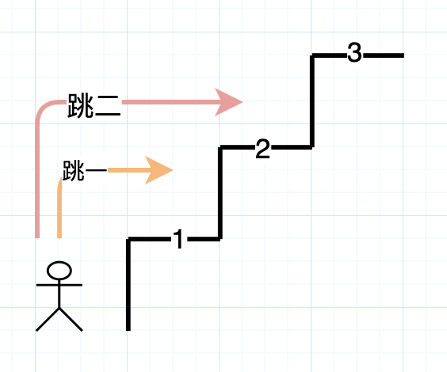
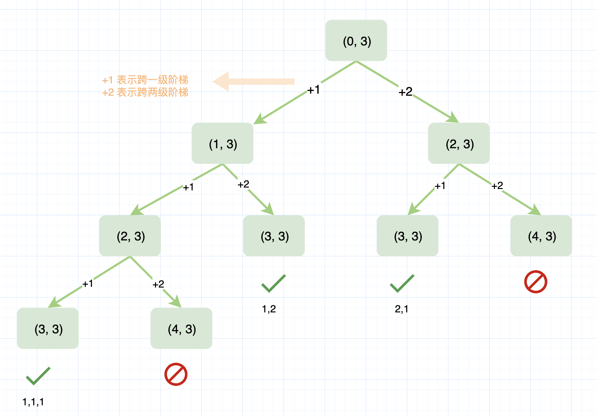

- [爬楼梯](#爬楼梯)
  - [题目](#题目)
  - [解法](#解法)
    - [暴力法](#暴力法)
    - [记忆化递归](#记忆化递归)
    - [动态规划](#动态规划)
    - [斐波那契数](#斐波那契数)


------------------------------

# 爬楼梯

## 题目

假设你正在爬楼梯。需要 n 阶你才能到达楼顶。

每次你可以爬 1 或 2 个台阶。你有多少种不同的方法可以爬到楼顶呢？

注意：给定 n 是一个正整数。

示例 1：

```
输入： 2
输出： 2
解释： 有两种方法可以爬到楼顶。
1.  1 阶 + 1 阶
2.  2 阶
```

示例 2：

```
输入： 3
输出： 3
解释： 有三种方法可以爬到楼顶。
1.  1 阶 + 1 阶 + 1 阶
2.  1 阶 + 2 阶
3.  2 阶 + 1 阶
```


来源：力扣（LeetCode）
链接：https://leetcode-cn.com/problems/climbing-stairs
著作权归领扣网络所有。商业转载请联系官方授权，非商业转载请注明出处。


## 解法

### 暴力法



用 `(i, n)` 表示从第 i 级到第 n 级共有多少种方法。`(0, n)`：第 0 级表示还没开始爬。

如果第一脚只爬一级，那么爬完剩下的楼梯的方法数就是：`(1, n)`。如果第一脚爬了两级，那么方法数就是：`(2, n)`。所以 `(0, n) = (1, n) + (2, n)`。

> 我绕不开的一个疑惑是：不应该是 (0, n) = 2 + (1, n) + (2, n) 吗？
> 
> 其实它定义了 (n, n) = 1, (n+1, n) = 0，意思是如果最后跨到了 n 级阶梯上，那么说明这种跳法有效，方法数就可以加一。如果最后一步跳出了 n 级阶梯，说明这种方式不行，那就返回 0.
> 也就是说，到最后才能知道这种跳法是不是满足。

有一个梯形图比较直观点：



实现：

```java
public class Solution {
    public int climbStairs(int n) {
        climb_Stairs(0, n);
    }
    public int climb_Stairs(int i, int n) {
        if (i > n) {
            return 0;
        }
        if (i == n) {
            return 1;
        }
        return climb_Stairs(i + 1, n) + climb_Stairs(i + 2, n);
    }
}
```

- 时间复杂度：$O(2^n)$，树形递归的大小为 $2^n$ 。
- 空间复杂度：$O(n)$，递归树的深度可以达到 $n$ 。


### 记忆化递归

```java
public class Solution {
    public int climbStairs(int n) {
        int memo[] = new int[n + 1];
        return climb_Stairs(0, n, memo);
    }
    public int climb_Stairs(int i, int n, int memo[]) {
        if (i > n) {
            return 0;
        }
        if (i == n) {
            return 1;
        }
        if (memo[i] > 0) {
            return memo[i];
        }
        memo[i] = climb_Stairs(i + 1, n, memo) + climb_Stairs(i + 2, n, memo);
        return memo[i];
    }
}
```

树中有一些重复计算的节点，比如 `(2, 3)` 就被计算了两次。所以用一个参数来缓存已经计算的结果。


- 时间复杂度：$O(n)$，树形递归的大小可以达到 $n$。
- 空间复杂度：$O(n)$，递归树的深度可以达到 $n$。

### 动态规划

第 i 阶可以由以下两种方法得到：

1. 在第 (i-1) 阶后向上爬一阶。
2. 在第 (i-2) 阶后向上爬 2 阶。

所以到达第 i 阶的方法总数就是到第 (i-1) 阶和第 (i-2) 阶的方法数之和。

令 `dp[i]` 表示能到达第 i 阶的方法总数：

$$
dp[i]=dp[i−1]+dp[i−2]
$$

```java
public class Solution {
    public int climbStairs(int n) {
        if (n == 1) {
            return 1;
        }
        int[] dp = new int[n + 1];
        dp[1] = 1; // (0, 1) 就一种方法
        dp[2] = 2; // (0, 2) 有两种方法
        for (int i = 3; i <= n; i++) {
            dp[i] = dp[i - 1] + dp[i - 2];
        }
        return dp[n];
    }
}
```


- 时间复杂度：O(n)，单循环到 n 。
- 空间复杂度：O(n)，dp 数组用了 n 的空间。


### 斐波那契数

在上述方法中，我们使用 dp 数组，其中 $dp[i]=dp[i−1]+dp[i−2]$。可以很容易通过分析得出 $dp[i]$ 其实就是第 i 个斐波那契数。

$$
Fib(n)=Fib(n−1)+Fib(n−2)
$$

现在我们必须找出以 1 和 2 作为第一项和第二项的斐波那契数列中的第 n 个数，也就是说 $Fib(1)=1$ 且 $Fib(2)=2$。

```java
public class Solution {
    public int climbStairs(int n) {
        if (n == 1) {
            return 1;
        }
        int first = 1;
        int second = 2;
        for (int i = 3; i <= n; i++) {
            int third = first + second;
            first = second;
            second = third;
        }
        return second;
    }
}
```


- 时间复杂度：$O(n)$，单循环到 n，需要计算第 n 个斐波那契数。
- 空间复杂度：$O(1)$，使用常量级空间。


后面还有利用矩阵求解的，看不懂了。