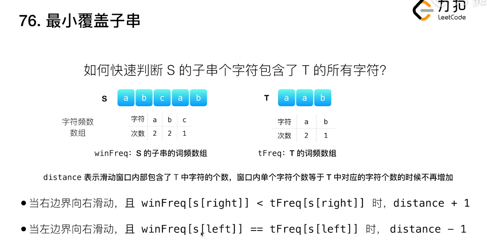

- [76. 最小覆盖子串](#76-最小覆盖子串)
  - [题目](#题目)
  - [题解](#题解)
    - [方法一：滑动窗口](#方法一滑动窗口)


------------------------------

# 76. 最小覆盖子串

## 题目

给你一个字符串 S、一个字符串 T，请在字符串 S 里面找出：包含 T 所有字符的最小子串。

示例：

```
输入: S = "ADOBECODEBANC", T = "ABC"
输出: "BANC"
```

说明：

- 如果 S 中不存这样的子串，则返回空字符串 ""。
- 如果 S 中存在这样的子串，我们保证它是唯一的答案。
- T 中可能包含重复字符。

--------------------

- 来源：力扣（LeetCode）
- 链接：https://leetcode-cn.com/problems/minimum-window-substring
- 著作权归领扣网络所有。商业转载请联系官方授权，非商业转载请注明出处。


## 题解

### 方法一：滑动窗口

> 链接：https://leetcode-cn.com/problems/minimum-window-substring/solution/zui-xiao-fu-gai-zi-chuan-by-leetcode-solution/

**思路和算法**

本问题要求我们返回字符串 s 中包含字符串 t 的全部字符的最小窗口。我们称包含 t 的全部字母的窗口为「可行」窗口。

我们可以用滑动窗口的思想解决这个问题，在滑动窗口类型的问题中都会有两个指针。一个用于「延伸」现有窗口的 r 指针，和一个用于「收缩」窗口的 l 指针。在任意时刻，只有一个指针运动，而另一个保持静止。我们在 s 上滑动窗口，通过移动 r 指针不断扩张窗口。当窗口包含 t 全部所需的字符后，如果能收缩，我们就收缩窗口直到得到最小窗口。


如何判断当前的窗口包含所有 t 所需的字符呢？我们可以用一个哈希表表示 t 中所有的字符以及它们的个数，用一个哈希表动态维护窗口中所有的字符以及它们的个数，如果这个动态表中包含 t 的哈希表中的所有字符，并且对应的个数都不小于 t 的哈希表中各个字符的个数，那么当前的窗口是「可行」的。

注意：这里 **t 中可能出现重复的字符**，所以我们要记录字符的个数。

考虑如何优化？ 如果 $s = {\rm XX \cdots XABCXXXX}$， $t = {\rm ABC}$，那么显然 ${\rm [XX \cdots XABC]}$ 是第一个得到的「可行」区间，得到这个可行区间后，我们按照「收缩」窗口的原则更新左边界，得到最小区间。我们其实做了一些无用的操作，就是更新右边界的时候「延伸」进了很多无用的 $\rm X$，更新左边界的时候「收缩」扔掉了这些无用的 $\rm X$，做了这么多无用的操作，只是为了得到短短的 $\rm ABC$。没错，其实在 s 中，有的字符我们是不关心的，我们只关心 t 中出现的字符，我们可不可以先预处理 s，扔掉那些 t 中没有出现的字符，然后再做滑动窗口呢？也许你会说，这样可能出现 $\rm XXABXXC$ 的情况，在统计长度的时候可以扔掉前两个 $\rm X$，但是不扔掉中间的 $\rm X$，怎样解决这个问题呢？优化后的时空复杂度又是多少？这里代码给出没有优化的版本，以上的三个问题留给读者思考，欢迎大家在评论区给出答案哟。

```go
func minWindow(s string, t string) string {
    ori, cnt := map[byte]int{}, map[byte]int{}
    for i := 0; i < len(t); i++ {
        ori[t[i]]++
    }

    sLen := len(s)
    len := math.MaxInt32 // 窗口最小宽度
    ansL, ansR := -1, -1

    // t 中的字符是否都在窗口内
    check := func() bool {
        for k, v := range ori {
            if cnt[k] < v {
                return false
            }
        }
        return true
    }
    for l, r := 0, 0; r < sLen; r++ {
        if r < sLen && ori[s[r]] > 0 { // 如果在 t 中存在
            cnt[s[r]]++
        }
        for check() && l <= r {
            // 如果当前窗口是最窄的，就更新。
            if (r - l + 1 < len) {
                len = r - l + 1
                ansL, ansR = l, l + len
            }
            if _, ok := ori[s[l]]; ok {
                cnt[s[l]] -= 1
            }
            l++
        }
    }
    if ansL == -1 {
        return ""
    }
    return s[ansL:ansR]
}
```



复杂度分析

- 时间复杂度：最坏情况下左右指针对 s 的每个元素各遍历一遍，哈希表中对 s 中的每个元素各插入、删除一次，对 t 中的元素各插入一次。每次检查是否可行会遍历整个 t 的哈希表，哈希表的大小与字符集的大小有关，设字符集大小为 C，则渐进时间复杂度为 $O(C\cdot |s| + |t|)$。
- 空间复杂度：这里用了两张哈希表作为辅助空间，每张哈希表最多不会存放超过字符集大小的键值对，我们设字符集大小为 C ，则渐进空间复杂度为 $O(C)$。

下面是使用了 distance 的解法：

```java
class Solution {
    public String minWindow(String s, String t) {
        if (s == null || s == "" || t == null || t == "" || s.length() < t.length()) {
            return "";
        }
        //维护两个数组，记录已有字符串指定字符的出现次数，和目标字符串指定字符的出现次数
        //ASCII表总长128
        int[] need = new int[128];
        int[] have = new int[128];

        //将目标字符串指定字符的出现次数记录
        for (int i = 0; i < t.length(); i++) {
            need[t.charAt(i)]++;
        }

        //分别为左指针，右指针，最小长度(初始值为一定不可达到的长度)
        //已有字符串中目标字符串指定字符的出现总频次以及最小覆盖子串在原字符串中的起始位置
        int left = 0, right = 0, min = s.length() + 1, count = 0, start = 0;
        while (right < s.length()) {
            char r = s.charAt(right);
            //说明该字符不被目标字符串需要，此时有两种情况
            // 1.循环刚开始，那么直接移动右指针即可，不需要做多余判断
            // 2.循环已经开始一段时间，此处又有两种情况
            //  2.1 上一次条件不满足，已有字符串指定字符出现次数不满足目标字符串指定字符出现次数，那么此时
            //      如果该字符还不被目标字符串需要，就不需要进行多余判断，右指针移动即可
            //  2.2 左指针已经移动完毕，那么此时就相当于循环刚开始，同理直接移动右指针
            if (need[r] == 0) {
                right++;
                continue;
            }
            //当且仅当已有字符串目标字符出现的次数小于目标字符串字符的出现次数时，count才会+1
            //是为了后续能直接判断已有字符串是否已经包含了目标字符串的所有字符，不需要挨个比对字符出现的次数
            if (have[r] < need[r]) {
                count++;
            }
            //已有字符串中目标字符出现的次数+1
            have[r]++;
            //移动右指针
            right++;
            //当且仅当已有字符串已经包含了所有目标字符串的字符，且出现频次一定大于或等于指定频次
            while (count == t.length()) {
                //当窗口的长度比已有的最短值小时，更改最小值，并记录起始位置
                if (right - left < min) {
                    min = right - left;
                    start = left;
                }
                char l = s.charAt(left);
                //如果左边即将要去掉的字符不被目标字符串需要，那么不需要多余判断，直接可以移动左指针
                if (need[l] == 0) {
                    left++;
                    continue;
                }
                //如果左边即将要去掉的字符被目标字符串需要，且出现的频次正好等于指定频次，那么如果去掉了这个字符，
                //就不满足覆盖子串的条件，此时要破坏循环条件跳出循环，即控制目标字符串指定字符的出现总频次(count）-1
                if (have[l] == need[l]) {
                    count--;
                }
                //已有字符串中目标字符出现的次数-1
                have[l]--;
                //移动左指针
                left++;
            }
        }
        //如果最小长度还为初始值，说明没有符合条件的子串
        if (min == s.length() + 1) {
            return "";
        }
        //返回的为以记录的起始位置为起点，记录的最短长度为距离的指定字符串中截取的子串
        return s.substring(start, start + min);
    }
}
```