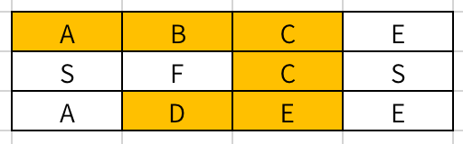
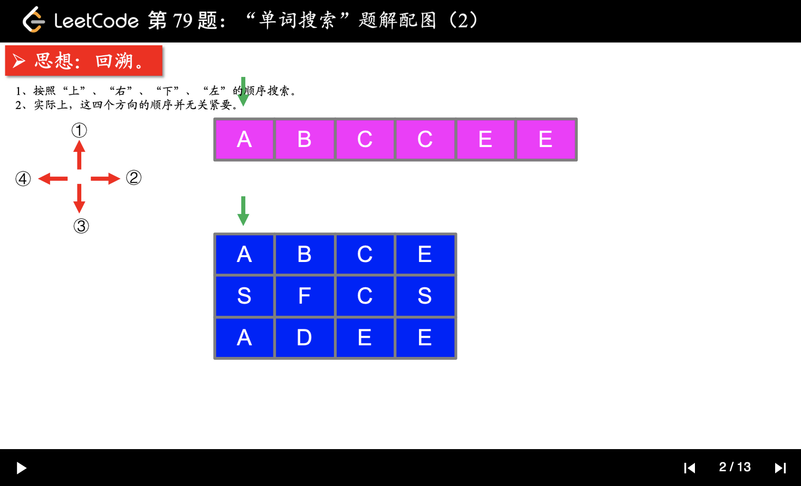
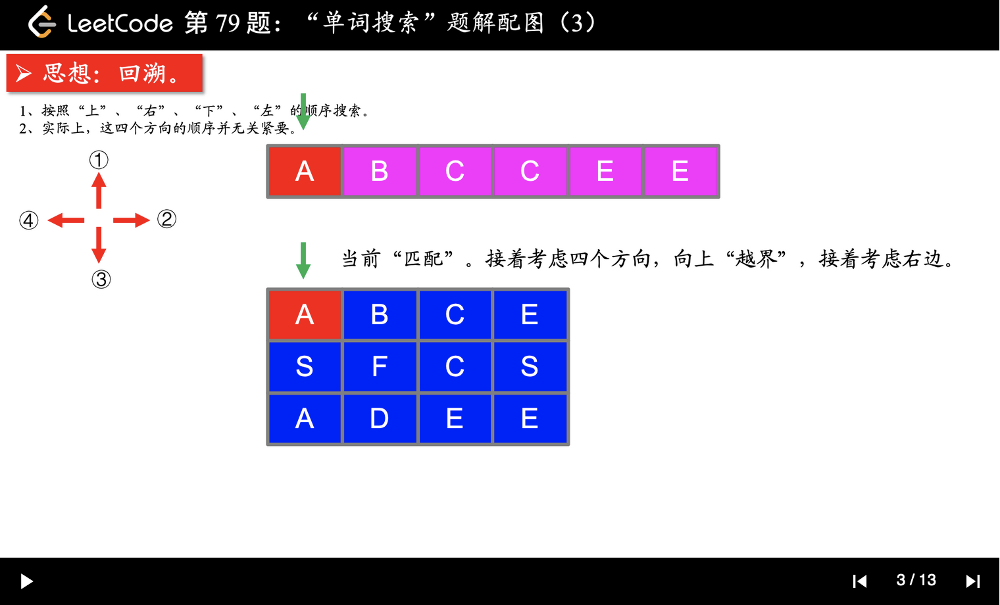
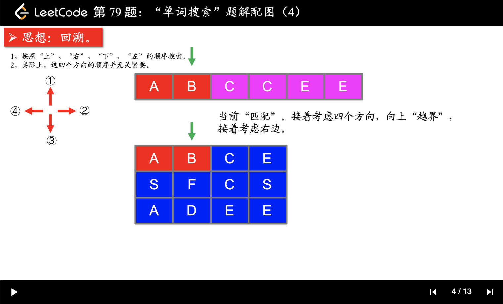
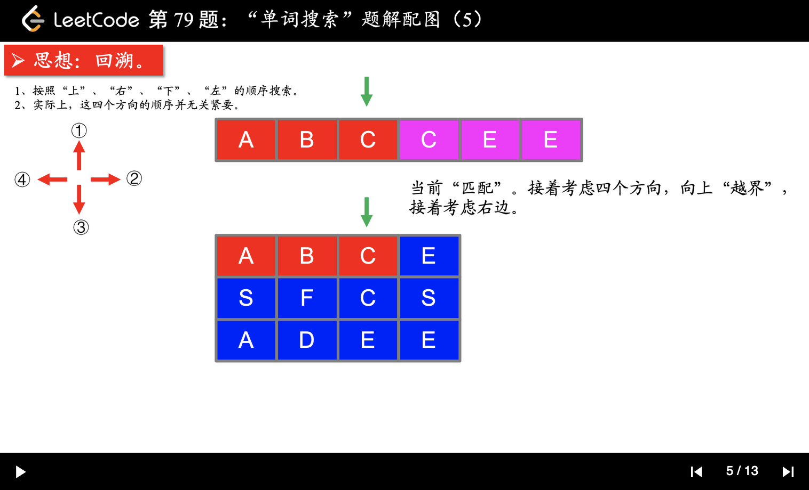
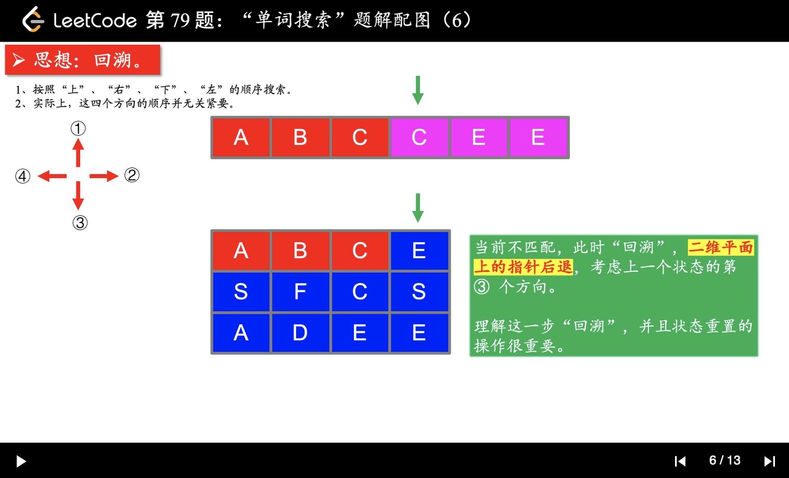
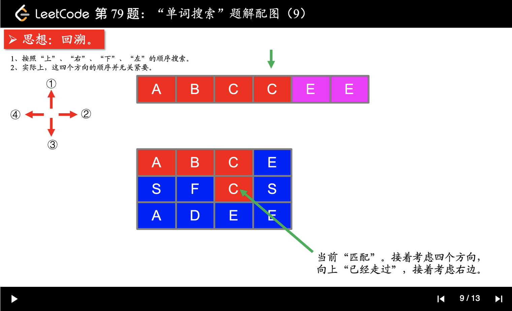

- [单词搜索](#单词搜索)
  - [题目](#题目)
  - [题解](#题解)
    - [在二维平面上使用回溯法](#在二维平面上使用回溯法)


------------------------------

# 单词搜索

## 题目

给定一个二维网格和一个单词，找出该单词是否存在于网格中。

单词必须按照字母顺序，**通过相邻的单元格内的字母构成**，其中“相邻”单元格是那些水平相邻或垂直相邻的单元格。同一个单元格内的字母不允许被重复使用。

 
示例:

```
board =
[
  ['A','B','C','E'],
  ['S','F','C','S'],
  ['A','D','E','E']
]

给定 word = "ABCCED", 返回 true
给定 word = "SEE", 返回 true
给定 word = "ABCB", 返回 false
```

提示：

- board 和 word 中只包含大写和小写英文字母。
- `1 <= board.length <= 200`
- `1 <= board[i].length <= 200`
- `1 <= word.length <= 10^3`

- 来源：力扣（LeetCode）
- 链接：https://leetcode-cn.com/problems/word-search
- 著作权归领扣网络所有。商业转载请联系官方授权，非商业转载请注明出处。

需要注意的是，组成单词的表格是相连的：



## 题解

### 在二维平面上使用回溯法

> https://leetcode-cn.com/problems/word-search/solution/zai-er-wei-ping-mian-shang-shi-yong-hui-su-fa-pyth/

这是一个使用回溯算法解决的问题，涉及的知识点有 DFS 和状态重置。









```py
from typing import List


class Solution:
    #         (x-1,y)
    # (x,y-1) (x,y) (x,y+1)
    #         (x+1,y)

    directions = [(0, -1), (-1, 0), (0, 1), (1, 0)]

    def exist(self, board: List[List[str]], word: str) -> bool:
        m = len(board)
        if m == 0:
            return False
        n = len(board[0])

        marked = [[False for _ in range(n)] for _ in range(m)]
        for i in range(m):
            for j in range(n):
                # 对每一个格子都从头开始搜索
                if self.__search_word(board, word, 0, i, j, marked, m, n):
                    return True
        return False

    def __search_word(self, board, word, index,
                      start_x, start_y, marked, m, n):
        # 先写递归终止条件
        if index == len(word) - 1:
            return board[start_x][start_y] == word[index]

        # 中间匹配了，再继续搜索
        if board[start_x][start_y] == word[index]:
            # 先占住这个位置，搜索不成功的话，要释放掉
            marked[start_x][start_y] = True
            for direction in self.directions:
                new_x = start_x + direction[0]
                new_y = start_y + direction[1]
                # 注意：如果这一次 search word 成功的话，就返回
                if 0 <= new_x < m and 0 <= new_y < n and \
                        not marked[new_x][new_y] and \
                        self.__search_word(board, word,
                                           index + 1,
                                           new_x, new_y,
                                           marked, m, n):
                    return True
            marked[start_x][start_y] = False
        return False
```

说明：

1. 偏移量数组在二维平面内是经常使用的，可以把它的设置当做一个技巧，并且在这个问题中，偏移量数组内的 4 个偏移的顺序无关紧要；说明：类似使用这个技巧的问题还有：「力扣」第 130 题：被围绕的区域、「力扣」第 200 题：岛屿数量。
2. 对于这种搜索算法，我认为理解 DFS 和状态重置并不难，代码编写也相对固定，难在代码的编写和细节的处理，建议多次编写，自己多总结多思考，把自己遇到的坑记下。
