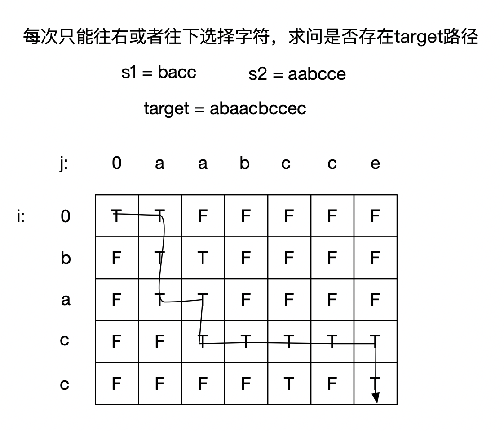

- [97. 交错字符串](#97-交错字符串)
  - [题目](#题目)
  - [题解](#题解)
    - [方法一：动态规划](#方法一动态规划)

------------------------------

# 97. 交错字符串

## 题目

给定三个字符串 s1, s2, s3, 验证 s3 是否是由 s1 和 s2 交错组成的。

示例 1:

```
输入: s1 = "aabcc", s2 = "dbbca", s3 = "aadbbcbcac"
输出: true
```

示例 2:

```
输入: s1 = "aabcc", s2 = "dbbca", s3 = "aadbbbaccc"
输出: false
```

- 来源：力扣（LeetCode）
- 链接：https://leetcode-cn.com/problems/interleaving-string
- 著作权归领扣网络所有。商业转载请联系官方授权，非商业转载请注明出处。

> s3 的长度必须是 s1 + s2 吗？
> 组成时的顺序有要求？


## 题解

> 动态规划时，如果遇到 `s3[k] == s1[i] && s3[k] == s2[j]` 时怎么处理呢？
> 看了下面的动态规划，它不是选定一个 k 然后来找合适的 i 和 j，因为可能 i 和 j 都合适，要到后面才能知道选哪个。
> 它是选定了 i 和 j，然后看这个是不是符合 k。

--------------------

> 链接：https://leetcode-cn.com/problems/interleaving-string/solution/jiao-cuo-zi-fu-chuan-by-leetcode-solution/

### 方法一：动态规划

记 $|s_1| = n$∣，$|s_2| = m$。

**思路与算法**

双指针法错在哪里？ 也许有同学看到这道题目的第一反应是使用双指针法解决这个问题，指针 $p_1$ 一开始指向 $s_1$ 的头部，指针 $p_2$ 一开始指向 $s_2$ 的头部，指针 $p_3$ ​指向 $s_3$​ 的头部，每次观察 $p_1$​ 和 $p_2$ 指向的元素哪一个和 $p_3$ 指向的元素相等，相等则匹配并后移指针。样例就是一个很好的反例，用这种方法判断 $s_1 = {\rm aabcc}，s_2 = {\rm dbbca}，s_3 = {\rm aadbbcbcac}$ 时，得到的结果是 False，实际应该是 True。

解决这个问题的正确方法是**动态规划**。 

首先如果 $|s_1| + |s_2| \neq |s_3|$，那 $s_3$ 必然不可能由 $s_1$ 和 $s_2$ 交错组成。在 $|s_1| + |s_2| = |s_3|$ 时，我们可以用动态规划来求解。

我们定义 $f(i, j)$ 表示 $s_1$ 的前 $i$ 个元素和 $s_2$ 的前 $j$ 个元素是否能交错组成 $s_3$ 的前 $i + j$ 个元素。

如果 $s_1$ 的第 $i$ 个元素和 $s_3$ 的第 $i + j$ 个元素相等，那么 $s_1$ 的前 $i$ 个元素和 $s_2$ 的前 $j$ 个元素是否能交错组成 $s_3$ 的前 $i + j$ 个元素取决于 $s_1$ 的前 $i - 1$ 个元素和 $s_2$ 的前 $j$ 个元素是否能交错组成 $s_3$ 的前 $i + j - 1$ 个元素，即此时 $f(i, j)$ 取决于 $f(i - 1, j)$，在此情况下如果 $f(i - 1, j)$ 为真，则 $f(i, j)$ 也为真。同样的，如果 $s_2$ 的第 $j$ 个元素和 $s_3$ 的第 $i + j$ 个元素相等并且 $f(i, j - 1)$ 为真，则 $f(i, j)$ 也为真。于是我们可以推导出这样的动态规划转移方程：

$$
f(i, j) = [f(i - 1, j) \, {\rm and} \, s_1(i - 1) = s_3(p)] \, {\rm or} \, [f(i, j - 1) \, {\rm and} \, s_2(j - 1) = s_3(p)]
$$

其中 $p = i + j - 1$。边界条件为 $f(0, 0) = {\rm True}$。至此，我们很容易可以给出这样一个实现：



图是从 [这里](https://leetcode-cn.com/problems/interleaving-string/solution/lei-si-lu-jing-wen-ti-zhao-zhun-zhuang-tai-fang-ch/) 复制过来的，帮助理解的。

```go
func isInterleave(s1 string, s2 string, s3 string) bool {
    n, m, t := len(s1), len(s2), len(s3)
    if (n + m) != t {
        return false
    }
    f := make([][]bool, n + 1)
    for i := 0; i <= n; i++ {
        f[i] = make([]bool, m + 1)
    }
    f[0][0] = true
    for i := 0; i <= n; i++ { // i 表示前 i 个，所以下标是 i-1; 同样地，j 也是表示前 j 个。
        for j := 0; j <= m; j++ {
            p := i + j - 1 // p 不是表示前 p 个了，而是 s3 的下标。
            if i > 0 {
                // 这个第二个 f[i][j] 应该可以不用的吧，后面是需要的。
                f[i][j] = f[i][j] || (f[i-1][j] && s1[i-1] == s3[p])
            }
            if j > 0 {
                f[i][j] = f[i][j] || (f[i][j-1] && s2[j-1] == s3[p])
            }
        }
    }
    return f[n][m]
}
```

不难看出这个实现的时间复杂度和空间复杂度都是 $O(nm)$。

使用滚动数组优化空间复杂度。 因为这里数组 f 的第 i 行只和第 i - 1 行相关，所以我们可以用滚动数组优化这个动态规划，这样空间复杂度可以变成 $O(m)$。敲黑板：我们又遇到「**滚动数组**」优化啦！不会的同学一定要学习哟。如果还没有做过这几个题建议大家做一下，都可以使用这个思想进行优化：

- [63. 不同路径 II](https://leetcode-cn.com/problems/unique-paths-ii/)
- [70. 爬楼梯](https://leetcode-cn.com/problems/climbing-stairs/)
- [剑指 Offer 46. 把数字翻译成字符串](https://leetcode-cn.com/problems/ba-shu-zi-fan-yi-cheng-zi-fu-chuan-lcof/)

下面给出滚动数组优化的代码。

```go
func isInterleave(s1 string, s2 string, s3 string) bool {
    n, m, t := len(s1), len(s2), len(s3)
    if (n + m) != t {
        return false
    }
    f := make([]bool, m + 1)
    f[0] = true
    for i := 0; i <= n; i++ {
        for j := 0; j <= m; j++ {
            p := i + j - 1
            if i > 0 {
                // 等号右面的 f[j] 就是 f[i-1][j]，因为这是第一次计算
                f[j] = f[j] && s1[i-1] == s3[p]
            }
            if j > 0 {
                // 等号右面的 f[j] 是上面计算的，或者是 f[0] = true 赋值的。
                f[j] = f[j] || f[j-1] && s2[j-1] == s3[p]
            }
        }
    }
    return f[m]
}
```