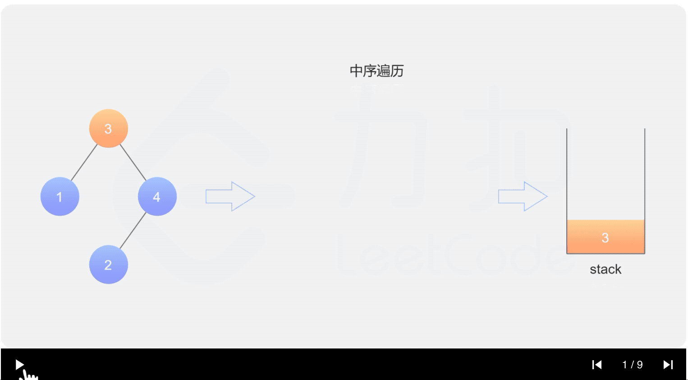
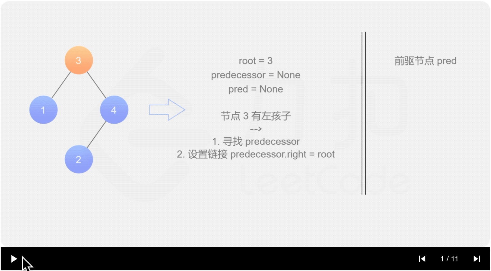

- [99. 恢复二叉搜索树](#99-恢复二叉搜索树)
  - [题目](#题目)
  - [题解](#题解)
    - [方法一：显式中序遍历](#方法一显式中序遍历)
    - [方法二：隐式中序遍历](#方法二隐式中序遍历)
    - [方法三：Morris 中序遍历](#方法三morris-中序遍历)

------------------------------

# 99. 恢复二叉搜索树

## 题目

二叉搜索树中的两个节点被错误地交换。

请在不改变其结构的情况下，恢复这棵树。

示例 1:

```
输入: [1,3,null,null,2]

   1
  /
 3
  \
   2

输出: [3,1,null,null,2]

   3
  /
 1
  \
   2
```

示例 2:

```
输入: [3,1,4,null,null,2]

  3
 / \
1   4
   /
  2

输出: [2,1,4,null,null,3]

  2
 / \
1   4
   /
  3
```

进阶:

- 使用 O(n) 空间复杂度的解法很容易实现。
- 你能想出一个只使用常数空间的解决方案吗？

--------------------

- 来源：力扣（LeetCode）
- 链接：https://leetcode-cn.com/problems/recover-binary-search-tree
- 著作权归领扣网络所有。商业转载请联系官方授权，非商业转载请注明出处。


## 题解

### 方法一：显式中序遍历

**思路与算法**

我们需要考虑两个节点被错误地交换后对原二叉搜索树造成了什么影响。对于二叉搜索树，我们知道如果对其进行**中序遍历**(左->中->右)，得到的值序列是**递增有序**的，而如果我们错误地交换了两个节点，等价于在这个值序列中交换了两个值，破坏了值序列的递增性。

我们来看下如果在一个递增的序列中交换两个值会造成什么影响。假设有一个递增序列 $a=[1,2,3,4,5,6,7]$。如果我们交换两个不相邻的数字，例如 2 和 6，原序列变成了 $a=[1,6,3,4,5,2,7]$，那么显然序列中有两个位置不满足 $a_i<a_{i+1}$，在这个序列中体现为 $6>3$，$5>2$，因此只要我们**找到这两个位置**，即可找到被错误交换的两个节点。如果我们交换两个相邻的数字，例如 2 和 3，此时交换后的序列只有一个位置不满足 $a_i<a_{i+1}$。因此整个值序列中不满足条件的位置或者有两个，或者有一个。

至此，解题方法已经呼之欲出了：

1. 找到二叉搜索树**中序遍历**得到值序列的不满足条件的位置。
2. 如果有两个，我们记为 $i$ 和 $j$（$i<j$ 且 $a_i>a_{i+1}\ \&\&\ a_j>a_{j+1}$)，那么对应被错误交换的节点即为 $a_i$ 对应的节点和 $a_{j+1}$ 对应的节点，我们分别记为 $x$ 和 $y$。
3. 如果有一个，我们记为 $i$，那么对应被错误交换的节点即为 $a_i$ 对应的节点和 $a_{i+1}$ 对应的节点，我们分别记为 $x$ 和 $y$。
4. 交换 $x$ 和 $y$ 两个节点即可。

实现部分，本方法开辟一个新数组 $\textit{nums}$ 来记录中序遍历得到的值序列，然后线性遍历找到两个位置 $i$ 和 $j$，并重新遍历原二叉搜索树修改对应节点的值完成修复(**不能记录下节点的指针，然后直接通过指针来修改吗？**)，具体实现可以看下面的代码。

```go
func recoverTree(root *TreeNode)  {
    nums := []int{}
    // 递归，中序遍历，把值放入 nums.
    var inorder func(node *TreeNode)
    inorder = func(node *TreeNode) {
        if node == nil {
            return
        }
        inorder(node.Left)
        nums = append(nums, node.Val)
        inorder(node.Right)
    }
    inorder(root)
    x, y := findTwoSwapped(nums)
    fmt.Println(x, y)
    recover(root, 2, x, y)
}

func findTwoSwapped(nums []int) (int, int) {
    x, y := -1, -1
    for i := 0; i < len(nums) - 1; i++ {
        if nums[i + 1] < nums[i] {
            // 只有一个的情况下，y 就是 [i+1].
            // 如果有两个，那么还要继续找 y.
            y = nums[i+1]
            if x == -1 {
                x = nums[i]
            } else {
                break
            }
        }
    }
    return x, y
}

func recover(root *TreeNode, count, x, y int) {
    if root == nil {
        return
    }
    if root.Val == x || root.Val == y {
        if root.Val == x {
            root.Val = y
        } else {
            root.Val = x
        }
        count--
        if count == 0 {
            return
        }
    }
    recover(root.Right, count, x, y)
    recover(root.Left, count, x, y)
}
```

**复杂度分析**

- 时间复杂度：$O(N)$，其中 $N$ 为二叉搜索树的节点数。中序遍历需要 $O(N)$ 的时间，判断两个交换节点在最好的情况下是 $O(1)$，在最坏的情况下是 $O(N)$，因此总时间复杂度为 $O(N)$。
- 空间复杂度：$O(N)$。我们需要用 $\textit{nums}$ 数组存储树的中序遍历列表。


### 方法二：隐式中序遍历

**思路与算法**

方法一是显式地将中序遍历的值序列保存在一个 $\textit{nums}$ 数组中，然后再去寻找被错误交换的节点，但我们也可以隐式地在中序遍历的过程就找到被错误交换的节点 $x$ 和 $y$。

具体来说，由于我们只关心中序遍历的值序列中每个相邻的位置的大小关系是否满足条件，且错误交换后最多两个位置不满足条件，因此在中序遍历的过程我们只需要维护当前中序遍历到的最后一个节点 $\textit{pred}$，然后在遍历到下一个节点的时候，看两个节点的值是否满足前者小于后者即可，如果不满足说明找到了一个交换的节点，且**在找到两次以后就可以终止遍历**。

这样我们就可以在中序遍历中直接找到被错误交换的两个节点 $x$ 和 $y$，不用显式建立 $\textit{nums}$ 数组。

中序遍历的实现有迭代和递归两种等价的写法，在本方法中提供迭代实现的写法。使用迭代实现中序遍历需要手动维护栈。



```go
func recoverTree(root *TreeNode)  {
    stack := []*TreeNode{}
    var x, y, pred *TreeNode
    for len(stack) > 0 || root != nil {
        for root != nil {
            stack = append(stack, root)
            root = root.Left
        }
        root = stack[len(stack)-1] // 中序中的一个节点
        stack = stack[:len(stack)-1]
        if pred != nil && root.Val < pred.Val {
            y = root
            if x == nil {
                x = pred
            } else {
                break
            }
        }
        pred = root
        root = root.Right
    }
    x.Val, y.Val = y.Val, x.Val
}
```

**复杂度分析**

- 时间复杂度：最坏情况下（即待交换节点为二叉搜索树最右侧的叶子节点）我们需要遍历整棵树，时间复杂度为 $O(N)$，其中 $N$ 为二叉搜索树的节点个数。
- 空间复杂度：$O(H)$，其中 $H$ 为二叉搜索树的高度。中序遍历的时候栈的深度取决于二叉搜索树的高度。


### 方法三：Morris 中序遍历

**思路与算法**

方法二中我们不再显示的用数组存储中序遍历的值序列，但是我们会发现我们仍需要 $O(H)$ 的栈空间，无法满足题目的进阶要求，那么该怎么办呢？这里向大家介绍一种不同于平常递归或迭代的遍历二叉树的方法：**Morris 遍历算法**，该算法能将**非递归**的中序遍历空间复杂度降为 $O(1)$。

Morris 遍历算法整体步骤如下（假设当前遍历到的节点为 $x$）：

1. 如果 $x$ 无左孩子，则访问 $x$ 的右孩子，即 $x = x.\textit{right}$。
2. 如果 $x$ 有左孩子，则找到 $x$ 左子树上最右的节点（即左子树中序遍历的最后一个节点，$x$ 在中序遍历中的前驱节点），我们记为 $\textit{predecessor}$。根据 $\textit{predecessor}$ 的右孩子是否为空，进行如下操作。
    - 如果 $\textit{predecessor}$ 的右孩子为空，则将其右孩子指向 $x$，然后访问 $x$ 的左孩子，即 $x = x.\textit{left}$。
    - 如果 $\textit{predecessor}$ 的右孩子不为空，则此时其右孩子指向 $x$，说明我们已经遍历完 $x$ 的左子树，我们将 $\textit{predecessor}$ 的右孩子置空，然后访问 $x$ 的右孩子，即 $x = x.\textit{right}$。
3. 重复上述操作，直至访问完整棵树。

其实整个过程我们就多做一步：将当前节点左子树中最右边的节点指向它，这样在左子树遍历完成后我们通过这个指向走回了 $x$，且能再通过这个知晓我们已经遍历完成了左子树，而不用再通过栈来维护，省去了栈的空间复杂度。

了解完这个算法以后，其他地方与方法二并无不同，我们同样也是维护一个 $\textit{pred}$ 变量去比较即可，具体实现可以看下面的代码，这里不再赘述。



```go
func recoverTree(root *TreeNode)  {
    var x, y, pred, predecessor *TreeNode

    for root != nil {
        if root.Left != nil {
            // predecessor 节点就是当前 root 节点向左走一步，然后一直向右走至无法走为止
            predecessor = root.Left
            for predecessor.Right != nil && predecessor.Right != root {
                predecessor = predecessor.Right
            }

            // 让 predecessor 的右指针指向 root，继续遍历左子树
            if predecessor.Right == nil {
                predecessor.Right = root
                root = root.Left
            } else { // 说明左子树已经访问完了，我们需要断开链接
                if pred != nil && root.Val < pred.Val { // 找到中序遍历中的一个节点 root 了。
                    y = root
                    if x == nil {
                        x = pred
                    }
                }
                pred = root
                predecessor.Right = nil
                root = root.Right
            }
        } else { // 如果没有左孩子，则直接访问右孩子
            if pred != nil && root.Val < pred.Val { // 找到中序遍历中的一个节点 root 了
                y = root
                if x == nil {
                    x = pred
                }
            }
            pred = root
            root = root.Right
        }
    }
    x.Val, y.Val = y.Val, x.Val
}
```


结合这张图来理解下。

**复杂度分析**

- 时间复杂度：$O(N)$，其中 $N$ 为二叉搜索树的高度。Morris 遍历中每个节点会被访问两次，因此总时间复杂度为 $O(2N)=O(N)$。
- 空间复杂度：$O(1)$。
