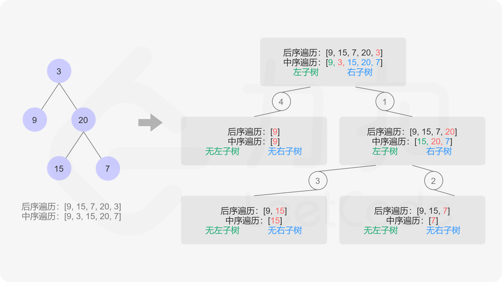

- [106. 从中序与后序遍历序列构造二叉树](#106-从中序与后序遍历序列构造二叉树)
  - [官方题解](#官方题解)
    - [方法一：递归](#方法一递归)
    - [方法二：迭代](#方法二迭代)

------------------------------

# 106. 从中序与后序遍历序列构造二叉树

根据一棵树的中序遍历与后序遍历构造二叉树。

注意: 你可以假设树中没有重复的元素。

例如，给出

```
中序遍历 inorder = [9,3,15,20,7]
后序遍历 postorder = [9,15,7,20,3]
```

返回如下的二叉树：

```
    3
   / \
  9  20
    /  \
   15   7
```

- 来源：力扣（LeetCode）
- 链接：https://leetcode-cn.com/problems/construct-binary-tree-from-inorder-and-postorder-traversal
- 著作权归领扣网络所有。商业转载请联系官方授权，非商业转载请注明出处。


## 官方题解

> 链接：https://leetcode-cn.com/problems/construct-binary-tree-from-inorder-and-postorder-traversal/solution/cong-zhong-xu-yu-hou-xu-bian-li-xu-lie-gou-zao-14/

### 方法一：递归

首先解决这道题我们需要明确给定一棵二叉树，我们是如何对其进行中序遍历与后序遍历的：

- 中序遍历的顺序是每次遍历左孩子，再遍历根节点，最后遍历右孩子。
- 后序遍历的顺序是每次遍历左孩子，再遍历右孩子，最后遍历根节点。

因此根据上文所述，我们可以发现后序遍历的数组最后一个元素代表的即为根节点。知道这个性质后，我们可以利用已知的根节点信息在中序遍历的数组中找到根节点所在的下标，然后根据其将中序遍历的数组分成左右两部分，左边部分即左子树，右边部分为右子树，针对每个部分可以用同样的方法继续递归下去构造。



算法

- 为了高效查找根节点元素在中序遍历数组中的下标，我们选择创建哈希表来存储中序序列，即建立一个（元素，下标）键值对的哈希表。
- 定义递归函数 `helper(in_left, in_right)` 表示当前递归到中序序列中当前子树的左右边界，递归入口为 `helper(0, n - 1)` ：
    - 如果 in_left > in_right，说明子树为空，返回空节点。(左边界在右边界右边了)
    - 选择后序遍历的最后一个节点作为根节点。
    - 利用哈希表 $O(1)$ 查询当根节点在中序遍历中下标为 `index`。从 `in_left` 到 `index - 1` 属于左子树，从 `index + 1` 到 `in_right` 属于右子树。
    - 根据后序遍历逻辑，递归创建右子树 `helper(index + 1, in_right)` 和左子树 `helper(in_left, index - 1)`。注意这里有需要先创建右子树，再创建左子树的依赖关系。可以理解为在后序遍历的数组中整个数组是先存储左子树的节点，再存储右子树的节点，最后存储根节点，如果按每次选择「后序遍历的最后一个节点」为根节点，则先被构造出来的应该为右子树。
    - 返回根节点 root。

```go
func buildTree(inorder []int, postorder []int) *TreeNode {
    idxMap := map[int]int{}
    for i, v := range inorder {
        idxMap[v] = i
    }
    var build func(int, int) *TreeNode
    build = func(inorderLeft, inorderRight int) *TreeNode {
        // 无剩余节点
        if inorderLeft > inorderRight {
            return nil
        }

        // 后序遍历的末尾元素即为当前子树的根节点
        val := postorder[len(postorder)-1]
        postorder = postorder[:len(postorder)-1]
        root := &TreeNode{Val: val}

        // 根据 val 在中序遍历的位置，将中序遍历划分成左右两颗子树
        // 由于我们每次都从后序遍历的末尾取元素，所以要先遍历右子树再遍历左子树
        inorderRootIndex := idxMap[val]
        root.Right = build(inorderRootIndex+1, inorderRight)
        root.Left = build(inorderLeft, inorderRootIndex-1)
        return root
    }
    return build(0, len(inorder)-1)
}
```

复杂度分析

- 时间复杂度：$O(n)$，其中 n 是树中的节点个数。
- 空间复杂度：$O(n)$。我们需要使用 $O(n)$ 的空间存储哈希表，以及 $O(h)$（其中 h 是树的高度）的空间表示递归时栈空间。这里 h < n，所以总空间复杂度为 $O(n)$。


### 方法二：迭代

> 这个完全没看懂。

迭代法是一种非常巧妙的实现方法。迭代法的实现基于以下两点发现。

- 如果将中序遍历反序，则得到反向的中序遍历，即每次遍历右孩子，再遍历根节点，最后遍历左孩子。
- 如果将后序遍历反序，则得到反向的前序遍历，即每次遍历根节点，再遍历右孩子，最后遍历左孩子。

「反向」的意思是交换遍历左孩子和右孩子的顺序，即反向的遍历中，右孩子在左孩子之前被遍历。

因此可以使用和「[105. 从前序与中序遍历序列构造二叉树](https://leetcode-cn.com/problems/construct-binary-tree-from-preorder-and-inorder-traversal/)」的迭代方法类似的方法构造二叉树。

对于后序遍历中的任意两个连续节点 $u$ 和 $v$（在后序遍历中，$u$ 在 $v$ 的前面），根据后序遍历的流程，我们可以知道 $u$ 和 $v$ 只有两种可能的关系：

- $u$ 是 $v$ 的右儿子。这是因为在遍历到 $u$ 之后，下一个遍历的节点就是 $u$ 的双亲节点，即 $v$；
- $v$ 没有右儿子，并且 $u$ 是 $v$ 的某个祖先节点（或者 $v$ 本身）的左儿子。如果 $v$ 没有右儿子，那么上一个遍历的节点就是 $v$ 的左儿子。如果 $v$ 没有左儿子，则从 $v$ 开始向上遍历 $v$ 的祖先节点，直到遇到一个有左儿子（且 $v$ 不在它的左儿子的子树中）的节点 $v_a$，那么 $u$ 就是 $v_a$ 的左儿子。

第二种关系看上去有些复杂。我们举一个例子来说明其正确性，并在例子中给出我们的迭代算法。

我们以树

```
        3
       / \
      9  20
     / \   \
    15 10   7
           / \
          5   8
               \
                4
```

为例，它的中序遍历和后序遍历分别为

```
inorder = [15, 9, 10, 3, 20, 5, 7, 8, 4]
postorder = [15, 10, 9, 5, 4, 8, 7, 20, 3]
```

我们用一个栈 stack 来维护「当前节点的所有还没有考虑过左儿子的祖先节点」，栈顶就是当前节点。也就是说，只有在栈中的节点才可能连接一个新的左儿子。同时，我们用一个指针 index 指向中序遍历的某个位置，初始值为 n - 1，其中 n 为数组的长度。index 对应的节点是「当前节点不断往右走达到的最终节点」，这也是符合反向中序遍历的，它的作用在下面的过程中会有所体现。

首先我们将根节点 3 入栈，再初始化 index 所指向的节点为 4，随后对于后序遍历中的每个节点，我们依次判断它是栈顶节点的右儿子，还是栈中某个节点的左儿子。

- 我们遍历 20。20 一定是栈顶节点 3 的右儿子。我们使用反证法，假设 20 是 3 的左儿子，因为 20 和 3 中间不存在其他的节点，那么 3 没有右儿子，index 应该恰好指向 3，但实际上为 4，因此产生了矛盾。所以我们将 20 作为 3 的右儿子，并将 20 入栈。
    - `stack = [3, 20]`
    - `index -> inorder[8] = 4`
- 我们遍历 7，8 和 4。同理可得它们都是上一个节点（栈顶节点）的右儿子，所以它们会依次入栈。
    - `stack = [3, 20, 7, 8, 4]`
    - `index -> inorder[8] = 4`
- 我们遍历 5，这时情况就不一样了。我们发现 index 恰好指向当前的栈顶节点 4，也就是说 4 没有右儿子，那么 5 必须为栈中某个节点的左儿子。那么如何找到这个节点呢？栈中的节点的顺序和它们在反向前序遍历中出现的顺序是一致的，而且每一个节点的左儿子都还没有被遍历过，**那么这些节点的顺序和它们在反向中序遍历中出现的顺序一定是相反的**。

> 这是因为栈中的任意两个相邻的节点，前者都是后者的某个祖先。并且我们知道，栈中的任意一个节点的左儿子还没有被遍历过，说明后者一定是前者右儿子的子树中的节点，那么后者就先于前者出现在反向中序遍历中。

因此我们可以把 index 不断向左移动，并与栈顶节点进行比较。如果 index 对应的元素恰好等于栈顶节点，那么说明我们在反向中序遍历中找到了栈顶节点，所以将 index 减少 1 并弹出栈顶节点，直到 index 对应的元素不等于栈顶节点。按照这样的过程，我们弹出的最后一个节点 x 就是 5 的双亲节点，这是因为 5 出现在了 x 与 x 在栈中的下一个节点的反向中序遍历之间，因此 5 就是 x 的左儿子。

回到我们的例子，我们会依次从栈顶弹出 4，8 和 7，并且将 index 向左移动了三次。我们将 5 作为最后弹出的节点 7 的左儿子，并将 5 入栈。

- `stack = [3, 20, 5]`
- `index -> inorder[5] = 5`

- 我们遍历 9。同理，index 恰好指向当前栈顶节点 5，那么我们会依次从栈顶弹出 5，20 和 3，并且将 index 向左移动了三次。我们将 9 作为最后弹出的节点 3 的左儿子，并将 9 入栈。
    - `stack = [9]`
    - `index -> inorder[2] = 10`
- 我们遍历 10，将 10 作为栈顶节点 9 的右儿子，并将 10 入栈。
    - `stack = [9, 10]`
    - `index -> inorder[2] = 10`
- 我们遍历 15。index 恰好指向当前栈顶节点 10，那么我们会依次从栈顶弹出 10 和 9，并且将 index 向左移动了两次。我们将 15 作为最后弹出的节点 9 的左儿子，并将 15 入栈。
    - `stack = [15]`
    - `index -> inorder[0] = 15`

此时遍历结束，我们就构造出了正确的二叉树。

算法

我们归纳出上述例子中的算法流程：

- 我们用一个栈和一个指针辅助进行二叉树的构造。初始时栈中存放了根节点（后序遍历的最后一个节点），指针指向中序遍历的最后一个节点；
- 我们依次枚举后序遍历中除了第一个节点以外的每个节点。如果 index 恰好指向栈顶节点，那么我们不断地弹出栈顶节点并向左移动 index，并将当前节点作为最后一个弹出的节点的左儿子；如果 index 和栈顶节点不同，我们将当前节点作为栈顶节点的右儿子；
- 无论是哪一种情况，我们最后都将当前的节点入栈。

最后得到的二叉树即为答案。

```go
func buildTree(inorder []int, postorder []int) *TreeNode {
    if len(postorder) == 0 {
        return nil
    }
    root := &TreeNode{Val: postorder[len(postorder)-1]}
    stack := []*TreeNode{root}
    inorderIndex := len(inorder) - 1
    for i := len(postorder) - 2; i >= 0; i-- {
        postorderVal := postorder[i]
        node := stack[len(stack)-1]
        if node.Val != inorder[inorderIndex] {
            node.Right = &TreeNode{Val: postorderVal}
            stack = append(stack, node.Right)
        } else {
            for len(stack) > 0 && stack[len(stack)-1].Val == inorder[inorderIndex] {
                node = stack[len(stack)-1]
                stack = stack[:len(stack)-1]
                inorderIndex--
            }
            node.Left = &TreeNode{Val: postorderVal}
            stack = append(stack, node.Left)
        }
    }
    return root
}
```

复杂度分析

- 时间复杂度：$O(n)$，其中 n 是树中的节点个数。
- 空间复杂度：$O(n)$，我们需要使用 $O(h)$（其中 h 是树的高度）的空间存储栈。这里 h < n，所以（在最坏情况下）总空间复杂度为 $O(n)$。
