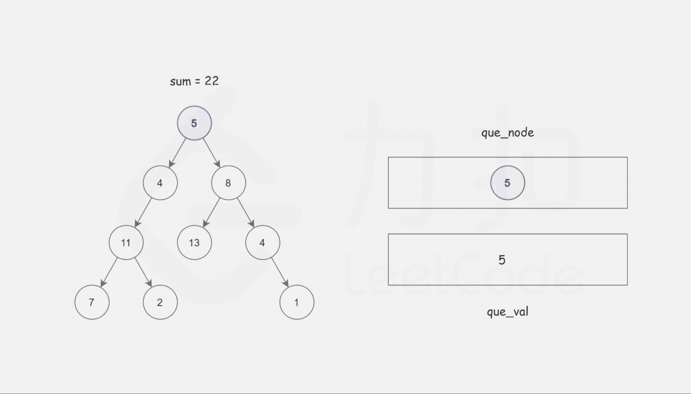

- [112. 路径总和](#112-路径总和)
  - [题目](#题目)
  - [题解](#题解)
    - [方法一：广度优先搜索](#方法一广度优先搜索)
    - [方法二：递归](#方法二递归)

------------------------------

# 112. 路径总和

## 题目

给定一个二叉树和一个目标和，判断该树中是否存在根节点到叶子节点的路径，这条路径上所有节点值相加等于目标和。

说明: 叶子节点是指没有子节点的节点。

示例: 
给定如下二叉树，以及目标和 sum = 22，

```
              5
             / \
            4   8
           /   / \
          11  13  4
         /  \      \
        7    2      1
```

返回 true, 因为存在目标和为 22 的根节点到叶子节点的路径 5->4->11->2。

- 来源：力扣（LeetCode）
- 链接：https://leetcode-cn.com/problems/path-sum
- 著作权归领扣网络所有。商业转载请联系官方授权，非商业转载请注明出处。

## 题解

- 深度遍历。
- 如果和已经超过 sum 但还是有子节点，那么就不用继续遍历了。
- 有可能在路径中间和叶子节点都有和等于 sum，但只有叶子节点才能满足。

------------------------------

> 链接：https://leetcode-cn.com/problems/path-sum/solution/lu-jing-zong-he-by-leetcode-solution/

**写在前面**

注意到本题的要求是，询问是否有从「根节点」到某个「叶子节点」经过的路径上的节点之和等于目标和。核心思想是对树进行一次遍历，在遍历时记录从根节点到当前节点的路径和，以防止重复计算。

> 需要特别注意的是，给定的 root 可能为空。

### 方法一：广度优先搜索

**思路及算法**

首先我们可以想到使用广度优先搜索的方式，记录从根节点到当前节点的路径和，以防止重复计算。

这样我们使用两个队列，分别存储将要遍历的节点，以及根节点到这些节点的路径和即可。



```go
func hasPathSum(root *TreeNode, sum int) bool {
    if root == nil {
        return false
    }
    queNode := []*TreeNode{}
    queVal := []int{}
    queNode = append(queNode, root)
    queVal = append(queVal, root.Val)
    for len(queNode) != 0 {
        now := queNode[0]
        queNode = queNode[1:]
        temp := queVal[0]
        queVal = queVal[1:]
        if now.Left == nil && now.Right == nil {
            if temp == sum {
                return true
            }
            continue
        }
        if now.Left != nil {
            queNode = append(queNode, now.Left)
            queVal = append(queVal, now.Left.Val + temp)
        }
        if now.Right != nil {
            queNode = append(queNode, now.Right)
            queVal = append(queVal, now.Right.Val + temp)
        }
    }
    return false
}
```

**复杂度分析**

- 时间复杂度：$O(N)$，其中 N 是树的节点数。对每个节点访问一次。
- 空间复杂度：$O(N)$，其中 N 是树的节点数。空间复杂度主要取决于队列的开销，队列中的元素个数不会超过树的节点数。


### 方法二：递归

**思路及算法**

观察要求我们完成的函数，我们可以归纳出它的功能：询问是否存在从当前节点 root 到叶子节点的路径，满足其路径和为 sum。

假定从根节点到当前节点的值之和为 val，我们可以将这个大问题转化为一个小问题：是否存在从当前节点的子节点到叶子的路径，满足其路径和为 sum - val。

不难发现这满足递归的性质，若当前节点就是叶子节点，那么我们直接判断 sum 是否等于 val 即可（因为路径和已经确定，就是当前节点的值，我们只需要判断该路径和是否满足条件）。若当前节点不是叶子节点，我们只需要递归地询问它的子节点是否能满足条件即可。

```go
func hasPathSum(root *TreeNode, sum int) bool {
    if root == nil {
        return false
    }
    if root.Left == nil && root.Right == nil {
        return sum == root.Val
    }
    return hasPathSum(root.Left, sum - root.Val) || hasPathSum(root.Right, sum - root.Val)
}
```

**复杂度分析**

- 时间复杂度：$O(N)$，其中 N 是树的节点数。对每个节点访问一次。
- 空间复杂度：$O(H)$，其中 H 是树的高度。空间复杂度主要取决于递归时栈空间的开销，最坏情况下，树呈现链状，空间复杂度为 $O(N)$。平均情况下树的高度与节点数的对数正相关，空间复杂度为 $O(\log N)$。
