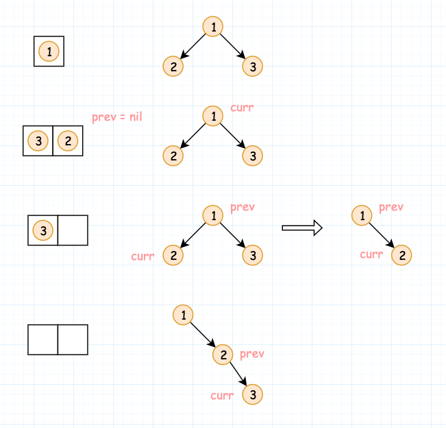
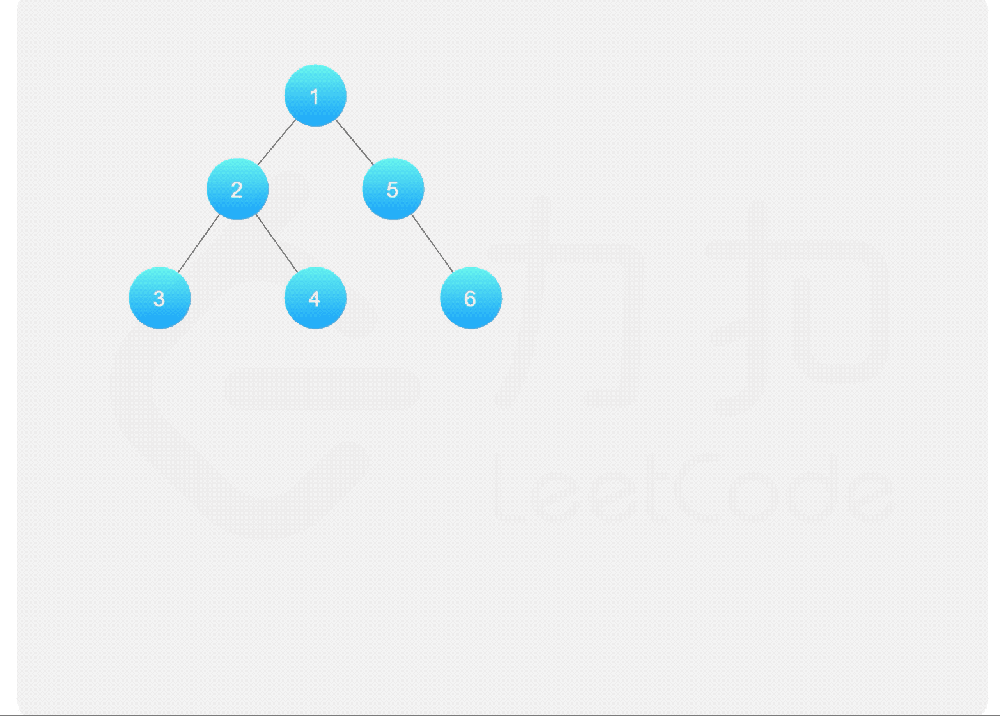

- [114. 二叉树展开为链表](#114-二叉树展开为链表)
  - [题目](#题目)
  - [题解](#题解)
    - [方法一：前序遍历](#方法一前序遍历)
    - [方法二：前序遍历和展开同步进行](#方法二前序遍历和展开同步进行)
    - [方法三：寻找前驱节点](#方法三寻找前驱节点)

------------------------------

# 114. 二叉树展开为链表

## 题目

给定一个二叉树，**原地**将它展开为一个单链表。

例如，给定二叉树

```
    1
   / \
  2   5
 / \   \
3   4   6
```

将其展开为：

```
1
 \
  2
   \
    3
     \
      4
       \
        5
         \
          6
```

- 来源：力扣（LeetCode）
- 链接：https://leetcode-cn.com/problems/flatten-binary-tree-to-linked-list
- 著作权归领扣网络所有。商业转载请联系官方授权，非商业转载请注明出处。


## 题解

> 链接：https://leetcode-cn.com/problems/flatten-binary-tree-to-linked-list/solution/er-cha-shu-zhan-kai-wei-lian-biao-by-leetcode-solu/

### 方法一：前序遍历

将二叉树展开为单链表之后，单链表中的节点顺序即为二叉树的前序遍历访问各节点的顺序。因此，可以对二叉树进行前序遍历，获得各节点被访问到的顺序。由于将二叉树展开为链表之后会破坏二叉树的结构，因此在前序遍历结束之后更新每个节点的左右子节点的信息，将二叉树展开为单链表。

对二叉树的前序遍历不熟悉的读者请自行练习「[144. 二叉树的前序遍历](https://leetcode-cn.com/problems/binary-tree-preorder-traversal/)」。

前序遍历可以通过递归或者迭代的方式实现。以下代码通过递归实现前序遍历。

```go
func flatten(root *TreeNode)  {
    // 把所有节点按前序遍历的顺序放到 list 中。
    list := preorderTraversal(root)
    // 把 list 中的节点变成单链表。
    for i := 1; i < len(list); i++ {
        prev, curr := list[i-1], list[i]
        prev.Left, prev.Right = nil, curr
    }
}

func preorderTraversal(root *TreeNode) []*TreeNode {
    list := []*TreeNode{}
    if root != nil {
        list = append(list, root)
        list = append(list, preorderTraversal(root.Left)...)
        list = append(list, preorderTraversal(root.Right)...)
    }
    return list
}
```

以下代码通过迭代实现前序遍历。

```go
func flatten(root *TreeNode)  {
    // 前序遍历的结果
    list := []*TreeNode{}
    // 存储中间结点
    stack := []*TreeNode{}
    node := root
    for node != nil || len(stack) > 0 {
        // 把中间节点和左子节点都放入 list 和 stack 中。
        for node != nil {
            list = append(list, node)
            stack = append(stack, node)
            node = node.Left
        }
        // 弹出 stack 中最后一个节点，继续访问它的右子节点。
        node = stack[len(stack)-1]
        node = node.Right
        stack = stack[:len(stack)-1]
    }

    // 把前序访问顺序的节点变成单链表。
    for i := 1; i < len(list); i++ {
        prev, curr := list[i-1], list[i]
        prev.Left, prev.Right = nil, curr
    }
}
```

**复杂度分析**

- 时间复杂度：$O(n)$，其中 n 是二叉树的节点数。前序遍历的时间复杂度是 $O(n)$，前序遍历之后，需要对每个节点更新左右子节点的信息，时间复杂度也是 $O(n)$。
- 空间复杂度：$O(n)$，其中 n 是二叉树的节点数。空间复杂度取决于栈（递归调用栈或者迭代中显性使用的栈）和存储前序遍历结果的列表的大小，栈内的元素个数不会超过 n，前序遍历列表中的元素个数是 n。


### 方法二：前序遍历和展开同步进行

使用方法一的前序遍历，由于将节点展开之后会破坏二叉树的结构而丢失子节点的信息，因此前序遍历和展开为单链表分成了两步。能不能在不丢失子节点的信息的情况下，将前序遍历和展开为单链表同时进行？

之所以会在破坏二叉树的结构之后丢失子节点的信息，是因为在对左子树进行遍历时，没有存储右子节点的信息，在遍历完左子树之后才获得右子节点的信息。只要对前序遍历进行修改，在遍历左子树之前就获得左右子节点的信息，并存入栈内，子节点的信息就不会丢失，就可以将前序遍历和展开为单链表同时进行。

该做法不适用于递归实现的前序遍历，只适用于迭代实现的前序遍历。修改后的前序遍历的具体做法是，每次从栈内弹出一个节点作为当前访问的节点，获得该节点的子节点，如果子节点不为空，则**依次将右子节点和左子节点压入栈内**（注意入栈顺序）。

展开为单链表的做法是，维护上一个访问的节点 prev，每次访问一个节点时，令当前访问的节点为 curr，将 prev 的左子节点设为 null 以及将 prev 的右子节点设为 curr，然后将 curr 赋值给 prev，进入下一个节点的访问，直到遍历结束。需要注意的是，初始时 prev 为 null，只有在 prev 不为 null 时才能对 prev 的左右子节点进行更新。

```go
func flatten(root *TreeNode)  {
    if root == nil {
        return
    }
    stack := []*TreeNode{root}
    var prev *TreeNode
    for len(stack) > 0 {
        curr := stack[len(stack)-1]
        stack = stack[:len(stack)-1]
        if prev != nil {
            prev.Left, prev.Right = nil, curr
        }
        left, right := curr.Left, curr.Right
        if right != nil {
            stack = append(stack, right)
        }
        if left != nil {
            stack = append(stack, left)
        }
        prev = curr
    }
}
```



虽然上面是把左右子节点都放入了 stack 中，但在把中间节点处理完之后就立马处理左子节点了，所以其实真正留在 stack 中的就只有右子节点了。

所以是边处理边把右子节点放在 stack 中，然后再处理右子节点。

**复杂度分析**

- 时间复杂度：$O(n)$，其中 n 是二叉树的节点数。前序遍历的时间复杂度是 $O(n)$，前序遍历的同时对每个节点更新左右子节点的信息，更新子节点信息的时间复杂度是 $O(1)$，因此总时间复杂度是 $O(n)$。
- 空间复杂度：$O(n)$，其中 n 是二叉树的节点数。空间复杂度取决于栈的大小，栈内的元素个数不会超过 n。


### 方法三：寻找前驱节点

前两种方法都借助前序遍历，前序遍历过程中需要使用栈存储节点。有没有空间复杂度是 $O(1)$ 的做法呢？

注意到前序遍历访问各节点的顺序是根节点、左子树、右子树。如果一个节点的左子节点为空，则该节点不需要进行展开操作。如果一个节点的左子节点不为空，则该节点的左子树中的最后一个节点被访问之后，该节点的右子节点被访问。该节点的左子树中最后一个被访问的节点是左子树中的最右边的节点，也是该节点的前驱节点。因此，问题转化成寻找当前节点的前驱节点。

具体做法是，对于当前节点，如果其左子节点不为空，则在其左子树中找到最右边的节点，作为前驱节点，将当前节点的右子节点赋给前驱节点的右子节点，然后将当前节点的左子节点赋给当前节点的右子节点，并将当前节点的左子节点设为空。对当前节点处理结束后，继续处理链表中的下一个节点，直到所有节点都处理结束。



```go
func flatten(root *TreeNode)  {
    curr := root
    for curr != nil {
        if curr.Left != nil {
            next := curr.Left
            // 寻找前驱节点
            predecessor := next
            for predecessor.Right != nil {
                predecessor = predecessor.Right
            }
            // 把当前节点的右子树作为前驱节点的右子树。
            predecessor.Right = curr.Right
            // 把当前节点的左子树作为右子树。
            curr.Left, curr.Right = nil, next
        }
        // 当前节点的左子节点已经没有了，继续遍历右子节点。
        curr = curr.Right
    }
}
```

**复杂度分析**

- 时间复杂度：$O(n)$，其中 n 是二叉树的节点数。展开为单链表的过程中，需要对每个节点访问一次，在寻找前驱节点的过程中，每个节点最多被额外访问一次。
- 空间复杂度：$O(1)$。
