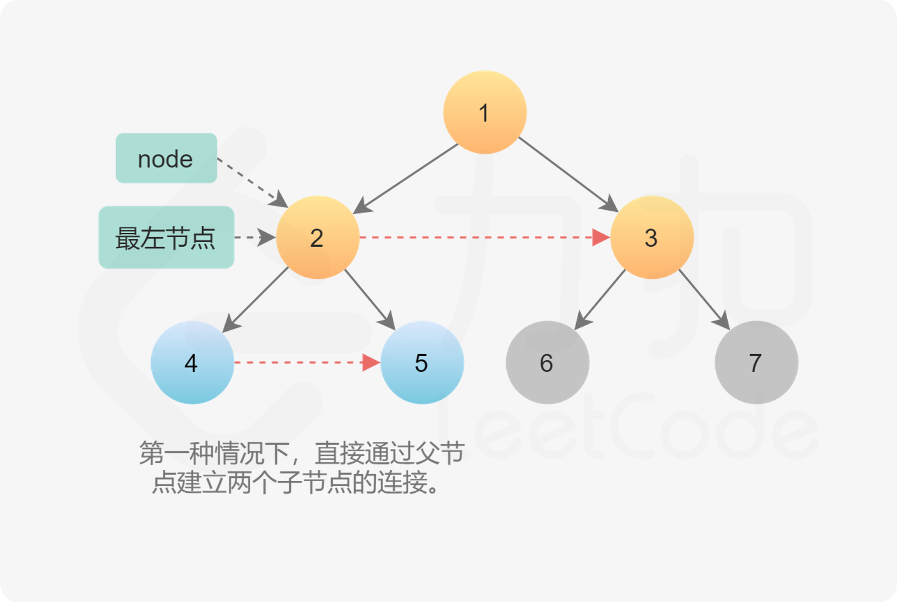

- [116. 填充每个节点的下一个右侧节点指针](#116-填充每个节点的下一个右侧节点指针)
  - [官方题解](#官方题解)
    - [方法一：层次遍历](#方法一层次遍历)
    - [方法二：使用已建立的 next 指针](#方法二使用已建立的-next-指针)

------------------------------

# 116. 填充每个节点的下一个右侧节点指针

给定一个**完美二叉树**，其所有叶子节点都在同一层，每个父节点都有两个子节点。二叉树定义如下：

```c
struct Node {
  int val;
  Node *left;
  Node *right;
  Node *next;
}
```

填充它的每个 next 指针，让这个指针指向其下一个右侧节点。如果找不到下一个右侧节点，则将 next 指针设置为 NULL。

初始状态下，所有 next 指针都被设置为 NULL。

 
示例：


```
输入：{"$id":"1","left":{"$id":"2","left":{"$id":"3","left":null,"next":null,"right":null,"val":4},"next":null,"right":{"$id":"4","left":null,"next":null,"right":null,"val":5},"val":2},"next":null,"right":{"$id":"5","left":{"$id":"6","left":null,"next":null,"right":null,"val":6},"next":null,"right":{"$id":"7","left":null,"next":null,"right":null,"val":7},"val":3},"val":1}

输出：{"$id":"1","left":{"$id":"2","left":{"$id":"3","left":null,"next":{"$id":"4","left":null,"next":{"$id":"5","left":null,"next":{"$id":"6","left":null,"next":null,"right":null,"val":7},"right":null,"val":6},"right":null,"val":5},"right":null,"val":4},"next":{"$id":"7","left":{"$ref":"5"},"next":null,"right":{"$ref":"6"},"val":3},"right":{"$ref":"4"},"val":2},"next":null,"right":{"$ref":"7"},"val":1}

解释：给定二叉树如图 A 所示，你的函数应该填充它的每个 next 指针，以指向其下一个右侧节点，如图 B 所示。
```

提示：

- 你只能使用常量级额外空间。
- 使用递归解题也符合要求，本题中递归程序占用的栈空间不算做额外的空间复杂度。

--------------------

- 来源：力扣（LeetCode）
- 链接：https://leetcode-cn.com/problems/populating-next-right-pointers-in-each-node
- 著作权归领扣网络所有。商业转载请联系官方授权，非商业转载请注明出处。


## 官方题解

> 链接：https://leetcode-cn.com/problems/populating-next-right-pointers-in-each-node/solution/tian-chong-mei-ge-jie-dian-de-xia-yi-ge-you-ce-2-4/

### 方法一：层次遍历

题目本身希望我们将二叉树的每一层节点都连接起来形成一个链表。因此直观的做法我们可以对二叉树进行层次遍历，在层次遍历的过程中将我们将二叉树每一层的节点拿出来遍历并连接。

层次遍历基于广度优先搜索，它与广度优先搜索的不同之处在于，广度优先搜索每次只会取出一个节点来拓展，而层次遍历会每次将队列中的所有元素都拿出来拓展，这样能保证每次从队列中拿出来遍历的元素都是属于同一层的，因此我们可以在遍历的过程中修改每个节点的 next 指针，同时拓展下一层的新队列。


```go
func connect(root *Node) *Node {
    if root == nil {
        return root
    }

    // 初始化队列同时将第一层节点加入队列中，即根节点
    queue := []*Node{root}

    // 循环迭代的是层数
    for len(queue) > 0 {
        tmp := queue
        queue = nil

        // 遍历这一层的所有节点
        for i, node := range tmp {
            // 连接
            if i+1 < len(tmp) {
                node.Next = tmp[i+1]
            }

            // 拓展下一层节点
            if node.Left != nil {
                queue = append(queue, node.Left)
            }
            if node.Right != nil {
                queue = append(queue, node.Right)
            }
        }
    }

    // 返回根节点
    return root
}
```

- 时间复杂度：$O(N)$。每个节点会被访问一次且只会被访问一次，即从队列中弹出，并建立 next 指针。
- 空间复杂度：$O(N)$。这是一棵完美二叉树，它的最后一个层级包含 $N/2$ 个节点。广度优先遍历的复杂度取决于一个层级上的最大元素数量。这种情况下空间复杂度为 $O(N)$。


### 方法二：使用已建立的 next 指针

一棵树中，存在两种类型的 next 指针。

第一种情况是连接同一个父节点的两个子节点。它们可以通过同一个节点直接访问到，因此执行下面操作即可完成连接。

```java
node.left.next = node.right
```


第二种情况在不同父亲的子节点之间建立连接，这种情况不能直接连接。


如果每个节点有指向父节点的指针，可以通过该指针找到 next 节点。如果不存在该指针，则按照下面思路建立连接：

> 第 N 层节点之间建立 next 指针后，再建立第 N+1 层节点的 next 指针。可以通过 next 指针访问同一层的所有节点，因此可以使用第 N 层的 next 指针，为第 N+1 层节点建立 next 指针。

**算法**

1. 从根节点开始，由于第 0 层只有一个节点，所以不需要连接，直接为第 1 层节点建立 next 指针即可。该算法中需要注意的一点是，当我们为第 N 层节点建立 next 指针时，处于第 N−1 层。当第 N 层节点的 next 指针全部建立完成后，移至第 N 层，建立第 N+1 层节点的 next 指针。
2. 遍历某一层的节点时，这层节点的 next 指针已经建立。因此我们只需要知道这一层的最左节点，就可以按照链表方式遍历，不需要使用队列。
3. 上面思路的伪代码如下：
    ```java
    leftmost = root
    while (leftmost.left != null) {
        head = leftmost
        while (head.next != null) {
            1) Establish Connection 1
            2) Establish Connection 2 using next pointers
            head = head.next
        }
        leftmost = leftmost.left
    }
    ```
    
4. 两种类型的 next 指针。
    1. 第一种情况两个子节点属于同一个父节点，因此直接通过父节点建立两个子节点的 next 指针即可。`node.left.next = node.right`
    
    2. 第二种情况是连接不同父节点之间子节点的情况。更具体地说，连接的是第一个父节点的右孩子和第二父节点的左孩子。由于已经在父节点这一层建立了 next 指针，因此可以直接通过第一个父节点的 next 指针找到第二个父节点，然后在它们的孩子之间建立连接。`node.right.next = node.next.left`
    
5. 完成当前层的连接后，进入下一层重复操作，直到所有的节点全部连接。进入下一层后需要更新最左节点，然后从新的最左节点开始遍历该层所有节点。因为是完美二叉树，因此最左节点一定是当前层最左节点的左孩子。如果当前最左节点的左孩子不存在，说明已经到达该树的最后一层，完成了所有节点的连接。
    

```go
func connect(root *Node) *Node {
    if root == nil {
        return root
    }

    // 每次循环从该层的最左侧节点开始
    for leftmost := root; leftmost.Left != nil; leftmost = leftmost.Left {
        // 通过 Next 遍历这一层节点，为下一层的节点更新 Next 指针
        for node := leftmost; node != nil; node = node.Next {
            // 左节点指向右节点
            node.Left.Next = node.Right

            // 右节点指向下一个左节点
            if node.Next != nil {
                node.Right.Next = node.Next.Left
            }
        }
    }

    // 返回根节点
    return root
}
```

- 时间复杂度：$O(N)$，每个节点只访问一次。
- 空间复杂度：$O(1)$，不需要存储额外的节点。