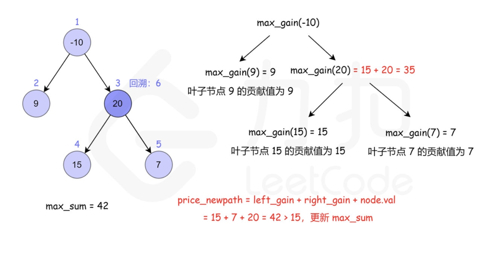
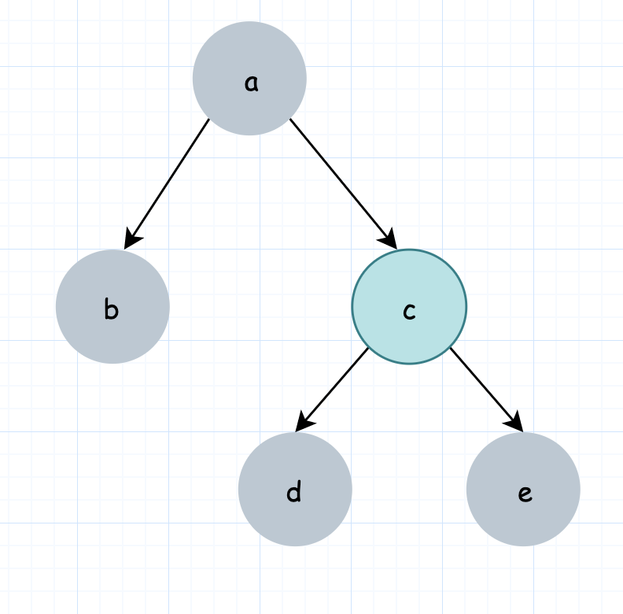

- [124. 二叉树中的最大路径和](#124-二叉树中的最大路径和)
  - [题目](#题目)
  - [题解](#题解)
    - [方法一：递归](#方法一递归)

------------------------------

# 124. 二叉树中的最大路径和

## 题目

给定一个非空二叉树，返回其最大路径和。

本题中，路径被定义为一条从树中任意节点出发，达到任意节点的序列。该路径至少包含一个节点，且不一定经过根节点。

示例 1:

```
输入: [1,2,3]

       1
      / \
     2   3

输出: 6
```

示例 2:

```
输入: [-10,9,20,null,null,15,7]

   -10
   / \
  9  20
    /  \
   15   7

输出: 42
```

- 来源：力扣（LeetCode）
- 链接：https://leetcode-cn.com/problems/binary-tree-maximum-path-sum
- 著作权归领扣网络所有。商业转载请联系官方授权，非商业转载请注明出处。


## 题解

### 方法一：递归

链接：https://leetcode-cn.com/problems/binary-tree-maximum-path-sum/solution/er-cha-shu-zhong-de-zui-da-lu-jing-he-by-leetcode-/

首先，考虑实现一个简化的函数 `maxGain(node)`，该函数计算二叉树中的一个节点的最大贡献值，具体而言，就是在以该节点为根节点的子树中寻找以该节点为起点的一条路径，使得该路径上的节点值之和最大。

具体而言，该函数的计算如下。

- 空节点的最大贡献值等于 0。
- 非空节点的最大贡献值等于节点值与其子节点中的最大贡献值之和（对于叶节点而言，最大贡献值等于节点值）。

例如，考虑如下二叉树。

```
   -10
   / \
  9  20
    /  \
   15   7
```

叶节点 9、15、7 的最大贡献值分别为 9、15、7。

得到叶节点的最大贡献值之后，再计算非叶节点的最大贡献值。节点 20 的最大贡献值等于 $20+\max(15,7)=35$，节点 −10 的最大贡献值等于 $-10+\max(9,35)=25$。

上述计算过程是递归的过程，因此，对根节点调用函数 maxGain，即可得到每个节点的最大贡献值。

根据函数 maxGain 得到每个节点的最大贡献值之后，如何得到二叉树的最大路径和？对于二叉树中的一个节点，该节点的最大路径和取决于该节点的值与该节点的左右子节点的最大贡献值，如果子节点的最大贡献值为正，则计入该节点的最大路径和，否则不计入该节点的最大路径和。维护一个全局变量 maxSum 存储最大路径和，在递归过程中更新 maxSum 的值，最后得到的 maxSum 的值即为二叉树中的最大路径和。



```go
func maxPathSum(root *TreeNode) int {
    maxSum := math.MinInt32
    var maxGain func(*TreeNode) int
    maxGain = func(node *TreeNode) int {
        if node == nil {
            return 0
        }

        // 递归计算左右子节点的最大贡献值
        // 只有在最大贡献值大于 0 时，才会选取对应子节点
        leftGain := max(maxGain(node.Left), 0)
        rightGain := max(maxGain(node.Right), 0)

        // 节点的最大路径和取决于该节点的值与该节点的左右子节点的最大贡献值
        priceNewPath := node.Val + leftGain + rightGain

        // 更新答案
        maxSum = max(maxSum, priceNewPath)

        // 返回节点的最大贡献值
        return node.Val + max(leftGain, rightGain)
    }
    maxGain(root)
    return maxSum
}

func max(x, y int) int {
    if x > y {
        return x
    }
    return y
}
```

复杂度分析

- 时间复杂度：$O(N)$，其中 N 是二叉树中的节点个数。对每个节点访问不超过 2 次。
- 空间复杂度：$O(N)$，其中 N 是二叉树中的节点个数。空间复杂度主要取决于递归调用层数，最大层数等于二叉树的高度，最坏情况下，二叉树的高度等于二叉树中的节点个数。




如果 c 在最大路径中，那么可能的路径有：

1. a -> c -> d.
2. a -> c -> e.
3. d -> c -> e.

前两种都需要 c 上面的节点参与，第三种在遍历到 c 时就能确认：`c.val + max(c.left.gain, 0) + max(c.right.gain, 0)`。如果出现负数，那就不让那个节点参与到路径中来，直接当作 0.


