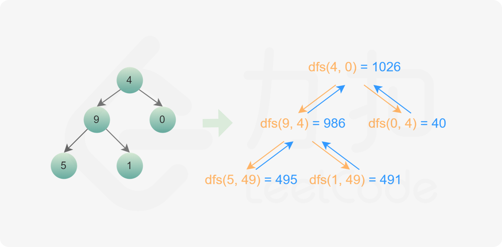

- [129. 求根到叶子节点数字之和](#129-求根到叶子节点数字之和)
  - [官方题解](#官方题解)
    - [方法一：深度优先搜索](#方法一深度优先搜索)
    - [方法二：广度优先搜索](#方法二广度优先搜索)

------------------------------

# 129. 求根到叶子节点数字之和

给定一个二叉树，它的每个结点都存放一个 `0-9` 的数字，每条从根到叶子节点的路径都代表一个数字。

例如，从根到叶子节点路径 `1->2->3` 代表数字 123。

计算从根到叶子节点生成的所有数字之和。

说明: 叶子节点是指没有子节点的节点。

示例 1:

```
输入: [1,2,3]
    1
   / \
  2   3
输出: 25
解释:
从根到叶子节点路径 1->2 代表数字 12.
从根到叶子节点路径 1->3 代表数字 13.
因此，数字总和 = 12 + 13 = 25.
```

示例 2:

```
输入: [4,9,0,5,1]
    4
   / \
  9   0
 / \
5   1
输出: 1026
解释:
从根到叶子节点路径 4->9->5 代表数字 495.
从根到叶子节点路径 4->9->1 代表数字 491.
从根到叶子节点路径 4->0 代表数字 40.
因此，数字总和 = 495 + 491 + 40 = 1026.
```

- 来源：力扣（LeetCode）
- 链接：https://leetcode-cn.com/problems/sum-root-to-leaf-numbers
- 著作权归领扣网络所有。商业转载请联系官方授权，非商业转载请注明出处。


## 官方题解

> 链接：https://leetcode-cn.com/problems/sum-root-to-leaf-numbers/solution/qiu-gen-dao-xie-zi-jie-dian-shu-zi-zhi-he-by-leetc/

**前言**

这道题中，二叉树的每条从根节点到叶子节点的路径都代表一个数字。其实，每个节点都对应一个数字，等于其父节点对应的数字乘以 10 再加上该节点的值（这里假设根节点的父节点对应的数字是 0）。只要计算出每个叶子节点对应的数字，然后计算所有叶子节点对应的数字之和，即可得到结果。可以通过深度优先搜索和广度优先搜索实现。

### 方法一：深度优先搜索

深度优先搜索是很直观的做法。从根节点开始，遍历每个节点，如果遇到叶子节点，则将叶子节点对应的数字加到数字之和。如果当前节点不是叶子节点，则计算其子节点对应的数字，然后对子节点递归遍历。



```go
func dfs(root *TreeNode, prevSum int) int {
    if root == nil {
        return 0
    }
    sum := prevSum*10 + root.Val
    if root.Left == nil && root.Right == nil {
        return sum
    }
    return dfs(root.Left, sum) + dfs(root.Right, sum)
}

func sumNumbers(root *TreeNode) int {
    return dfs(root, 0)
}
```

复杂度分析

- 时间复杂度：$O(n)$，其中 n 是二叉树的节点个数。对每个节点访问一次。
- 空间复杂度：$O(n)$，其中 n 是二叉树的节点个数。空间复杂度主要取决于递归调用的栈空间，递归栈的深度等于二叉树的高度，最坏情况下，二叉树的高度等于节点个数，空间复杂度为 $O(n)$。

### 方法二：广度优先搜索

使用广度优先搜索，需要维护两个队列，分别存储节点和节点对应的数字。

初始时，将根节点和根节点的值分别加入两个队列。每次从两个队列分别取出一个节点和一个数字，进行如下操作：

- 如果当前节点是叶子节点，则将该节点对应的数字加到数字之和；
- 如果当前节点不是叶子节点，则获得当前节点的非空子节点，并根据当前节点对应的数字和子节点的值计算子节点对应的数字，然后将子节点和子节点对应的数字分别加入两个队列。

搜索结束后，即可得到所有叶子节点对应的数字之和。

```go
type pair struct {
    node *TreeNode
    num  int
}

func sumNumbers(root *TreeNode) (sum int) {
    if root == nil {
        return
    }
    queue := []pair{{root, root.Val}}
    for len(queue) > 0 {
        p := queue[0]
        queue = queue[1:]
        left, right, num := p.node.Left, p.node.Right, p.num
        if left == nil && right == nil {
            sum += num
        } else {
            if left != nil {
                queue = append(queue, pair{left, num*10 + left.Val})
            }
            if right != nil {
                queue = append(queue, pair{right, num*10 + right.Val})
            }
        }
    }
    return
}
```

复杂度分析

- 时间复杂度：$O(n)$，其中 n 是二叉树的节点个数。对每个节点访问一次。
- 空间复杂度：$O(n)$，其中 n 是二叉树的节点个数。空间复杂度主要取决于队列，每个队列中的元素个数不会超过 n。