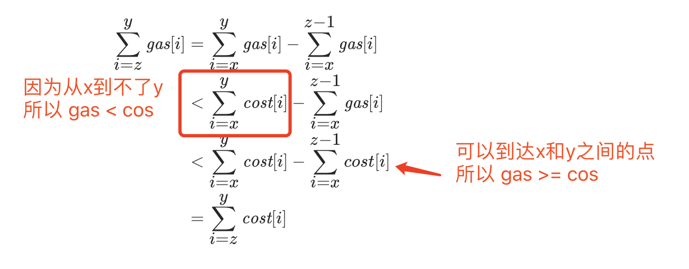
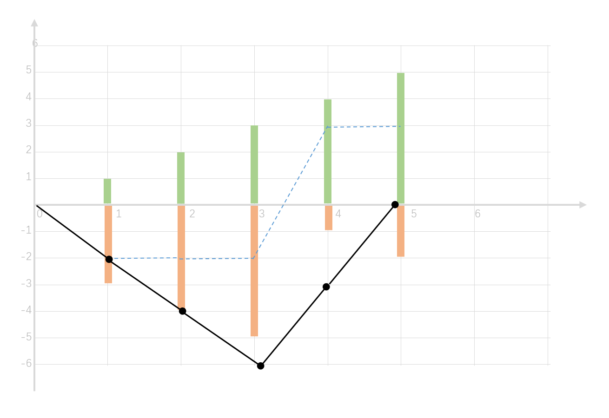

- [134. 加油站](#134-加油站)
  - [官方题解](#官方题解)
    - [方法一：一次遍历](#方法一一次遍历)
  - [其它题解1](#其它题解1)


------------------------------

# 134. 加油站

在一条环路上有 N 个加油站，其中第 i 个加油站有汽油 `gas[i]` 升。

你有一辆油箱容量无限的的汽车，从第 i 个加油站开往第 i+1 个加油站需要消耗汽油 `cost[i]` 升。你从其中的一个加油站出发，开始时油箱为空。

如果你可以绕环路行驶一周，则返回出发时加油站的编号，否则返回 -1。

说明: 

- 如果题目有解，该答案即为唯一答案。
- 输入数组均为非空数组，且长度相同。
- 输入数组中的元素均为非负数。

示例 1:

```
输入: 
gas  = [1,2,3,4,5]
cost = [3,4,5,1,2]

输出: 3

解释:
从 3 号加油站(索引为 3 处)出发，可获得 4 升汽油。此时油箱有 = 0 + 4 = 4 升汽油
开往 4 号加油站，此时油箱有 4 - 1 + 5 = 8 升汽油
开往 0 号加油站，此时油箱有 8 - 2 + 1 = 7 升汽油
开往 1 号加油站，此时油箱有 7 - 3 + 2 = 6 升汽油
开往 2 号加油站，此时油箱有 6 - 4 + 3 = 5 升汽油
开往 3 号加油站，你需要消耗 5 升汽油，正好足够你返回到 3 号加油站。
因此，3 可为起始索引。
```

示例 2:

```
输入: 
gas  = [2,3,4]
cost = [3,4,3]

输出: -1

解释:
你不能从 0 号或 1 号加油站出发，因为没有足够的汽油可以让你行驶到下一个加油站。
我们从 2 号加油站出发，可以获得 4 升汽油。 此时油箱有 = 0 + 4 = 4 升汽油
开往 0 号加油站，此时油箱有 4 - 3 + 2 = 3 升汽油
开往 1 号加油站，此时油箱有 3 - 3 + 3 = 3 升汽油
你无法返回 2 号加油站，因为返程需要消耗 4 升汽油，但是你的油箱只有 3 升汽油。
因此，无论怎样，你都不可能绕环路行驶一周。
```

- 来源：力扣（LeetCode）
- 链接：https://leetcode-cn.com/problems/gas-station
- 著作权归领扣网络所有。商业转载请联系官方授权，非商业转载请注明出处。


## 官方题解

> 链接：https://leetcode-cn.com/problems/gas-station/solution/jia-you-zhan-by-leetcode-solution/

### 方法一：一次遍历

最容易想到的解法是：从头到尾遍历每个加油站，并检查以该加油站为起点，最终能否行驶一周。我们可以通过减小被检查的加油站数目，来降低总的时间复杂度。

假设我们此前发现，从加油站 $x$ 出发，每经过一个加油站就加一次油，第一个无法到达的加油站是 $y$（不妨设 $x<y$）。这就说明：

$$
\sum_{i=x}^{y}\textit{gas}[i] < \sum_{i=x}^{y}\textit{cost}[i] \\ \sum_{i=x}^{j}gas[i] \ge \sum_{i=x}^{j}cost[i] ~ \text{(For all $j \in [x, y)$) }
$$

第一个式子表明无法到达加油站 $y$，第二个式子表明可以到达 $y$ 之前的所有加油站。

现在，考虑任意一个位于 x,y 之间的加油站 $z$，我们现在考察从该加油站出发，能否到达加油站 $y$，也就是要判断 $\sum_{i=z}^{y}\textit{gas}[i]$ 与 $\sum_{i=z}^{y}\textit{cost}[i]$ 之间的大小关系。

根据上面的式子，我们得到：




这就说明：从 x,y 之间的任何一个加油站出发，都无法到达加油站 $y$。

在发现了这一个性质后，算法就很清楚了：我们首先检查第 0 个加油站，并试图找到第一个无法到达的加油站 $x$；如果能找到，下一次就从加油站 x+1 开始检查。最终，我们只遍历了原数组一次。

```go
func canCompleteCircuit(gas []int, cost []int) int {
    // i 表示起点
    for i, n := 0, len(gas); i < n; {
        // cnt 表示相对于 i 的距离
        sumOfGas, sumOfCost, cnt := 0, 0, 0
        for cnt < n {
            j := (i + cnt) % n
            sumOfGas += gas[j]
            sumOfCost += cost[j]
            if sumOfCost > sumOfGas {
                // 说明从 i 开始到不了 j
                break
            }
            cnt++
        }
        if cnt == n {
            // 表示从 i 开始绕了一圈了
            return i
        } else {
            // 没有绕一圈，那就从 j+1 开始检查
            i += cnt + 1
        }
    }
    return -1
}
```

复杂度分析

- 时间复杂度：$O(N)$，其中 N 为数组的长度。我们对数组进行了单次遍历。
- 空间复杂度：$O(1)$。


## 其它题解1

> 链接：https://leetcode-cn.com/problems/gas-station/solution/shi-yong-tu-de-si-xiang-fen-xi-gai-wen-ti-by-cyayc/

以该题为例：

```
gas  = [1,2,3,4,5]
cost = [3,4,5,1,2]
```

下图的黑色折线图即总油量剩余值，若要满足题目的要求：跑完全程再回到起点，总油量剩余值的任意部分都需要在X轴以上，且跑到终点时：总剩余汽油量 >= 0。

为了让黑色折线图任意部分都在 X 轴以上，我们需要向上移动黑色折线图，直到所有点都在X轴或X轴以上。此时，处在X轴的点即为出发点。即黑色折线图的最低值的位置：index = 3。



```
柱状图
绿色：可添加的汽油 gas[i]
橙色：消耗的汽油 cose[i]

折线图：
虚线（蓝色）：当前加油站的可用值
实线（黑色）：从0开始的总剩余汽油量(就是蓝线的累加值)
```

```java
public int canCompleteCircuit(int[] gas, int[] cost) {
    int len = gas.length;
    int spare = 0;
    int minSpare = Integer.MAX_VALUE;
    int minIndex = 0;

    for (int i = 0; i < len; i++) {
        spare += gas[i] - cost[i];
        if (spare < minSpare) {
            minSpare = spare;
            minIndex = i;
        }
    }

    return spare < 0 ? -1 : (minIndex + 1) % len;
}
```
