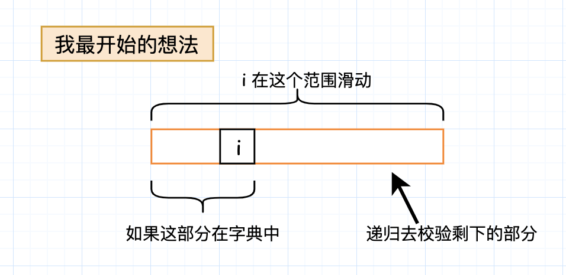
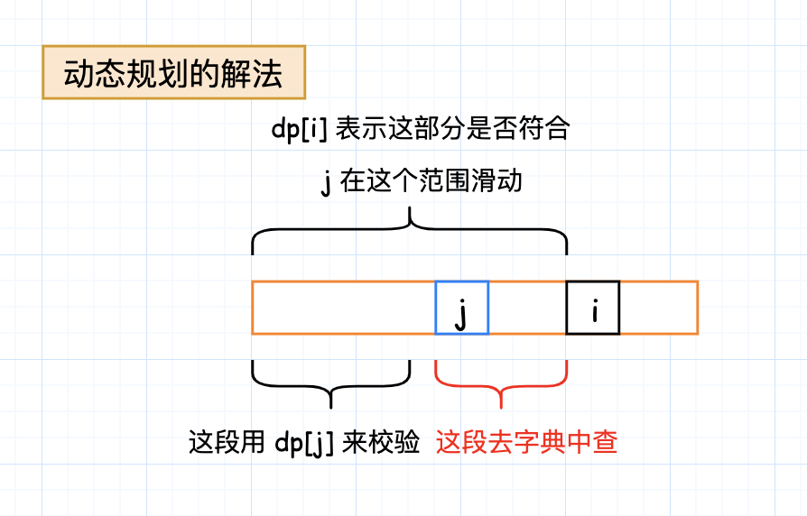

- [139. 单词拆分](#139-单词拆分)
  - [题目](#题目)
  - [题解](#题解)
    - [方法一：动态规划](#方法一动态规划)
    - [我的分析](#我的分析)


------------------------------

# 139. 单词拆分

## 题目

给定一个非空字符串 s 和一个包含非空单词列表的字典 wordDict，判定 s 是否可以被空格拆分为一个或多个在字典中出现的单词。

说明：

- 拆分时可以重复使用字典中的单词。(但是 s 中的字母不能重复使用)
- 你可以假设字典中没有重复的单词。

示例 1：

```
输入: s = "leetcode", wordDict = ["leet", "code"]
输出: true
解释: 返回 true 因为 "leetcode" 可以被拆分成 "leet code"。
```

示例 2：

```
输入: s = "applepenapple", wordDict = ["apple", "pen"]
输出: true
解释: 返回 true 因为 "applepenapple" 可以被拆分成 "apple pen apple"。
     注意你可以重复使用字典中的单词。
```

示例 3：

```
输入: s = "catsandog", wordDict = ["cats", "dog", "sand", "and", "cat"]
输出: false
```

- 来源：力扣（LeetCode）
- 链接：https://leetcode-cn.com/problems/word-break
- 著作权归领扣网络所有。商业转载请联系官方授权，非商业转载请注明出处。


## 题解

### 方法一：动态规划

链接：https://leetcode-cn.com/problems/word-break/solution/dan-ci-chai-fen-by-leetcode-solution/

**思路和算法**

我们定义 $\textit{dp}[i]$ 表示字符串 s 前 i 个字符组成的字符串 $s[0..i-1]$ 是否能被空格拆分成若干个字典中出现的单词。从前往后计算考虑转移方程，每次转移的时候我们需要枚举包含位置 $i-1$ 的最后一个单词，看它是否出现在字典中以及除去这部分的字符串是否合法即可。公式化来说，我们需要枚举 $s[0..i-1]$ 中的分割点 j ，看 $s[0..j-1]$ 组成的字符串 $s_1$​（默认 $j = 0$ 时 $s_1$​ 为空串）和 $s[j..i-1]$ 组成的字符串 $s_2$​ 是否都合法，如果两个字符串均合法，那么按照定义 $s_1$​ 和 $s_2$​ 拼接成的字符串也同样合法。由于计算到 $\textit{dp}[i]$ 时我们已经计算出了 $\textit{dp}[0..i-1]$ 的值，因此字符串 $s_1$​ 是否合法可以直接由 $dp[j]$ 得知，剩下的我们只需要看 $s_2$​ 是否合法即可，因此我们可以得出如下转移方程：

$$
\textit{dp}[i]=\textit{dp}[j]\ \&\&\ \textit{check}(s[j..i-1])
$$

其中 $\textit{check}(s[j..i-1])$ 表示子串 $s[j..i-1]$ 是否出现在字典中。

对于检查一个字符串是否出现在给定的字符串列表里一般可以考虑哈希表来快速判断，同时也可以做一些简单的**剪枝**，枚举分割点的时候**倒着枚举**，如果分割点 j 到 i 的长度已经大于字典列表里最长的单词的长度，那么就结束枚举，但是需要注意的是下面的代码给出的是不带剪枝的写法。

对于边界条件，我们定义 $\textit{dp}[0]=true$ 表示空串且合法。

有能力的读者也可以考虑怎么结合字典树 Trie 来实现，这里不再展开。

```go
func wordBreak(s string, wordDict []string) bool {
    wordDictSet := make(map[string]bool)
    for _, w := range wordDict {
        wordDictSet[w] = true
    }
    dp := make([]bool, len(s) + 1)
    dp[0] = true
    for i := 1; i <= len(s); i++ {
        for j := 0; j < i; j++ {
            if dp[j] && wordDictSet[s[j:i]] {
                dp[i] = true
                break
            }
        }
    }
    return dp[len(s)]
}
```

复杂度分析

- 时间复杂度：$O(n^2)$ ，其中 n 为字符串 s 的长度。我们一共有 $O(n)$ 个状态需要计算，每次计算需要枚举 $O(n)$ 个分割点，哈希表判断一个字符串是否出现在给定的字符串列表需要 $O(1)$ 的时间，因此总时间复杂度为 $O(n^2)$。
- 空间复杂度：$O(n)$ ，其中 n 为字符串 s 的长度。我们需要 $O(n)$ 的空间存放 $\textit{dp}$ 值以及哈希表亦需要 $O(n)$ 的空间复杂度，因此总空间复杂度为 $O(n)$。


### 我的分析



