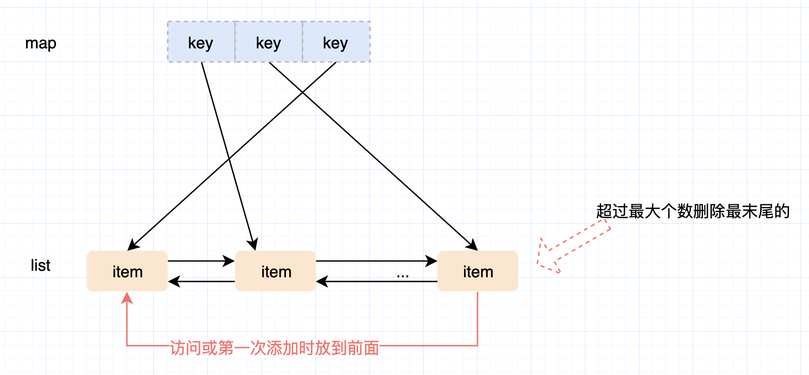

# LRU 缓存机制

运用你所掌握的数据结构，设计和实现一个 LRU (最近最少使用) 缓存机制。它应该支持以下操作： 获取数据 get 和 写入数据 put 。

获取数据 `get(key)` - 如果密钥 (key) 存在于缓存中，则获取密钥的值（总是正数），否则返回 -1。
写入数据 `put(key, value)` - 如果密钥已经存在，则变更其数据值；如果密钥不存在，则插入该组「密钥/数据值」。当缓存容量达到上限时，它应该在写入新数据之前删除最久未使用的数据值，从而为新的数据值留出空间。

进阶:

你是否可以在 O(1) 时间复杂度内完成这两种操作？


示例:

```go
LRUCache cache = new LRUCache( 2 /* 缓存容量 */ );

cache.put(1, 1);
cache.put(2, 2);
cache.get(1);       // 返回  1
cache.put(3, 3);    // 该操作会使得密钥 2 作废
cache.get(2);       // 返回 -1 (未找到)
cache.put(4, 4);    // 该操作会使得密钥 1 作废
cache.get(1);       // 返回 -1 (未找到)
cache.get(3);       // 返回  3
cache.get(4);       // 返回  4
```

来源：力扣（LeetCode）
链接：https://leetcode-cn.com/problems/lru-cache
著作权归领扣网络所有。商业转载请联系官方授权，非商业转载请注明出处。

