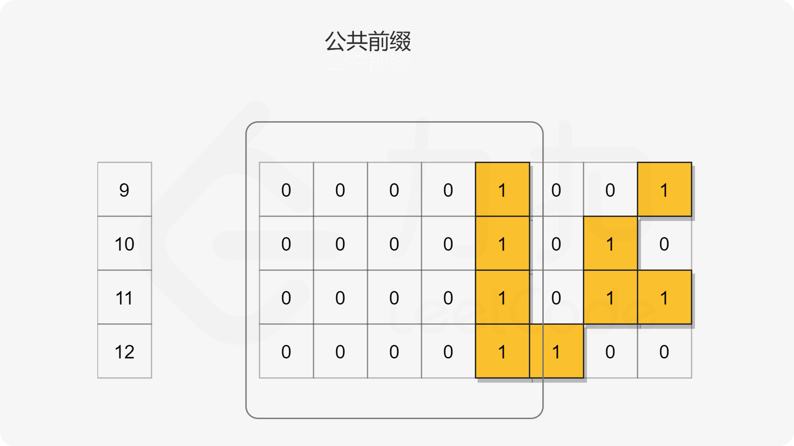

- [201. 数字范围按位与](#201-数字范围按位与)
  - [官方题解](#官方题解)
    - [方法一：位移](#方法一位移)
    - [方法二：Brian Kernighan 算法](#方法二brian-kernighan-算法)

------------------------------

# 201. 数字范围按位与

给定范围 `[m, n]`，其中 `0 <= m <= n <= 2147483647`，返回此范围内所有数字的按位与（包含 m, n 两端点）。

示例 1: 

```
输入: [5,7]
输出: 4
```

示例 2:

```
输入: [0,1]
输出: 0
```

- 来源：力扣（LeetCode）
- 链接：https://leetcode-cn.com/problems/bitwise-and-of-numbers-range
- 著作权归领扣网络所有。商业转载请联系官方授权，非商业转载请注明出处。

## 官方题解

> 链接：https://leetcode-cn.com/problems/bitwise-and-of-numbers-range/solution/shu-zi-fan-wei-an-wei-yu-by-leetcode-solution/

**概述**

最直观的解决方案就是迭代范围内的每个数字，依次执行按位与运算，得到最终的结果，但此方法在 `[m,n]` 范围较大的测试用例中会因超出时间限制而无法通过，因此我们需要另寻他路。

我们观察按位与运算的性质。对于一系列的位，例如 `[1, 1, 0, 1, 1]`，**只要有一个零值的位，那么这一系列位的按位与运算结果都将为零**。

回到本题，首先我们可以对范围内的每个数字用二进制的字符串表示，例如 $9=00001001_{(2)}$，然后我们将每个二进制字符串的位置对齐。



在上图的例子中，我们可以发现，对所有数字执行按位与运算的结果是所有对应二进制字符串的**公共前缀**再用零补上后面的剩余位。

那么这个规律是否正确呢？我们可以进行简单的证明。假设对于所有这些二进制串，前 $i$ 位均相同，第 $i+1$ 位开始不同，由于 $[m,n]$ 连续，所以第 $i+1$ 位在 $[m,n]$ 的数字范围从小到大列举出来一定是前面全部是 0，后面全部是 1，在上图中对应 `[9,11]` 均为 0，`[12,12]` 均为 1。并且一定存在连续的两个数 $x$ 和 $x+1$，满足 $x$ 的第 $i+1$ 位为 0，后面全为 1，$x+1$ 的第 $i+1$ 位为 1，后面全为 0，对应上图中的例子即为 11 和 12。这种形如 $0111 \ldots$ 和 $1000 \ldots$ 的二进制串的按位与的结果一定为 $0000 \ldots$，因此第 $i+1$ 位开始的剩余位均为 0，前 $i$ 位由于均相同，因此按位与结果不变。最后的答案即为二进制字符串的公共前缀再用零补上后面的剩余位。

进一步来说，所有这些二进制字符串的公共前缀也即指定范围的起始和结束数字 m 和 n 的公共前缀（即在上面的示例中分别为 9 和 12）。

> m 和 n 的公共前缀就是所有数的公共前缀吗？

因此，最终我们可以将问题重新表述为：给定两个整数，我们要找到它们对应的二进制字符串的公共前缀。

### 方法一：位移

**思路**

鉴于上述问题的陈述，我们的目的是求出两个给定数字的二进制字符串的公共前缀，这里给出的第一个方法是采用位移操作。

我们的想法是将两个数字不断向右移动，直到数字相等，即**数字被缩减为它们的公共前缀**。然后，通过将公共前缀向左移动，将零添加到公共前缀的右边以获得最终结果。


**算法**

如上述所说，算法由两个步骤组成：

1. 我们通过右移，将两个数字压缩为它们的公共前缀。在迭代过程中，我们计算执行的右移操作数。
2. 将得到的公共前缀左移相同的操作数得到结果。

```go
func rangeBitwiseAnd(m int, n int) int {
    shift := 0
    for m < n {
        m, n = m >> 1, n >> 1
        shift++
    }
    return m << shift
}
```

**复杂度分析**

- 时间复杂度：$O(\log n)$。算法的时间复杂度取决于 m 和 n 的二进制位数，由于 $m \le n$，因此时间复杂度取决于 n 的二进制位数。
- 空间复杂度：$O(1)$。我们只需要常数空间存放若干变量。

### 方法二：Brian Kernighan 算法

**思路与算法**

还有一个位移相关的算法叫做「Brian Kernighan 算法」，它用于清除二进制串中最右边的 1。

Brian Kernighan 算法的关键在于我们每次对 `number` 和 `number−1` 之间进行按位与运算后，`number` 中最右边的 1 会被抹去变成 0。(`n & (n-1)`)


基于上述技巧，我们可以用它来计算两个二进制字符串的公共前缀。

其思想是，对于给定的范围 `[m,n]（m<n）`，我们可以对数字 n 迭代地应用上述技巧，清除最右边的 1，直到它**小于或等于 m**(只等于是不行的)，此时非公共前缀部分的 1 均被消去。因此最后我们返回 n 即可。


在上图所示的示例（`m=9, n=12`）中，公共前缀是 `00001`。在对数字 n 应用 Brian Kernighan 算法后，后面三位都将变为零，最后我们返回 n 即可。

```go
func rangeBitwiseAnd(m int, n int) int {
    for m < n {
        n &= (n - 1)
    }
    return n
}
```

> 这么简单呀。。。

**复杂度分析**

- 时间复杂度：$O(\log n)$。和位移方法类似，算法的时间复杂度取决于 m 和 n 二进制展开的位数。尽管和位移方法具有相同的渐近复杂度，但 Brian Kernighan 的算法需要的迭代次数会更少，因为它跳过了两个数字之间的所有零位。
- 空间复杂度：$O(1)$。我们只需要常数空间存放若干变量。

**结语**

「[461. 汉明距离](https://leetcode-cn.com/problems/hamming-distance)」可以作为另一个练习应用 Brian Kernighan 算法的题目。
