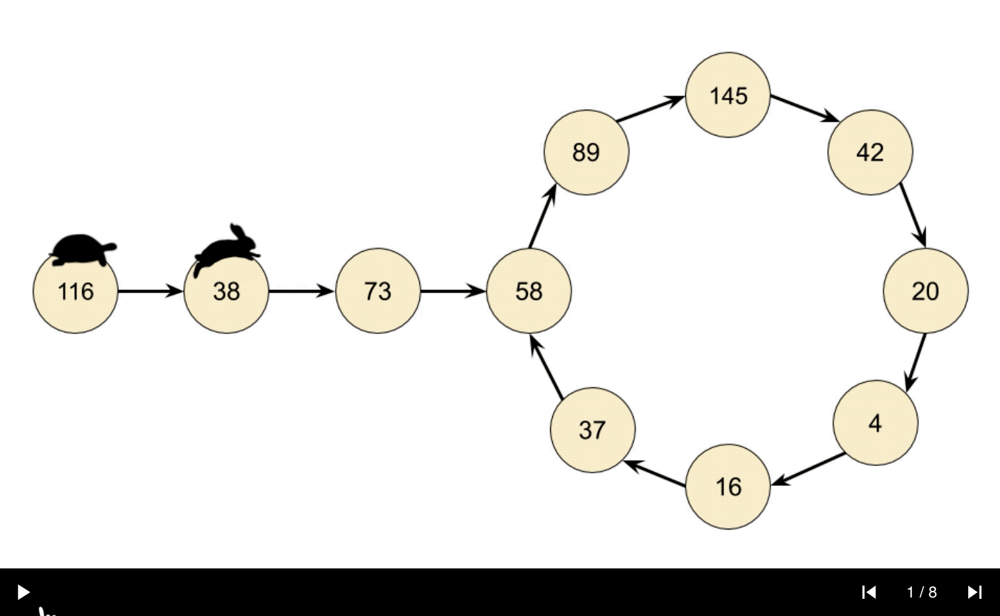

- [202. 快乐数](#202-快乐数)
  - [官方题解](#官方题解)
    - [方法一：用 HashSet 检测循环](#方法一用-hashset-检测循环)
    - [方法二：快慢指针法](#方法二快慢指针法)
    - [方法三：数学](#方法三数学)

------------------------------

# 202. 快乐数

编写一个算法来判断一个数 n 是不是快乐数。

「快乐数」定义为：对于一个正整数，每一次将该数替换为它每个位置上的数字的平方和，然后重复这个过程直到这个数变为 1，也可能是 无限循环 但始终变不到 1。如果 可以变为  1，那么这个数就是快乐数。

如果 n 是快乐数就返回 True ；不是，则返回 False 。

 

示例：

```
输入：19
输出：true
```

解释：

- $1^2$ + $9^2$ = 82
- $8^2$ + $2^2$ = 68
- $6^2$ + $8^2$ = 100
- $1^2$ + $0^2$ + $0^2$ = 1

--------------------

- 来源：力扣（LeetCode）
- 链接：https://leetcode-cn.com/problems/happy-number
- 著作权归领扣网络所有。商业转载请联系官方授权，非商业转载请注明出处。


## 官方题解

### 方法一：用 HashSet 检测循环

我们可以先举几个例子。我们从 7 开始。则下一个数字是 49（因为 $7^2=49$），然后下一个数字是 97（因为 $4^2+9^2=97$）。我们可以不断重复该的过程，直到我们得到 1。


再举一个例子，让我们从 116 开始。通过反复通过平方和计算下一个数字，我们最终得到 58，再继续计算之后，我们又回到 58。由于我们回到了一个已经计算过的数字，可以知道有一个循环，因此不可能达到 1。


根据我们的探索，我们猜测会有以下三种可能。

1. 最终会得到 1。
2. 最终会进入循环。
3. 值会越来越大，最后接近无穷大。

第三个情况比较难以检测和处理。我们怎么知道它会继续变大，而不是最终得到 1 呢？我们可以仔细想一想，每一位数的最大数字的下一位数是多少。


| Digits |    Largest    | Next |
| :----- | :-----------: | ---: |
| 1      |       9       |   81 |
| 2      |      99       |  162 |
| 3      |      999      |  243 |
| 4      |     9999      |  324 |
| 13     | 9999999999999 | 1053 |

对于 3 位数的数字，它不可能大于 243。这意味着它要么被困在 243 以下的循环内，要么跌到 1。4 位或 4 位以上的数字在每一步都会丢失一位(::丢失一位是什么意思::)，直到降到 3 位为止。所以我们知道，最坏的情况下，算法可能会在 243 以下的所有数字上循环，然后回到它已经到过的一个循环或者回到 1。但它不会无限期地进行下去，所以我们排除第三种选择。

即使在代码中你不需要处理第三种情况，你仍然需要理解为什么它永远不会发生，这样你就可以证明为什么你不处理它。

**算法**：

算法分为两部分，我们需要设计和编写代码。

1. 给一个数字 n，它的下一个数字是什么？
2. 按照一系列的数字来判断我们是否进入了一个循环。

第 1 部分我们按照题目的要求做数位分离，求平方和。

第 2 部分可以使用 HashSet 完成。每次生成链中的下一个数字时，我们都会检查它是否已经在 HashSet 中。

- 如果它不在 HashSet 中，我们应该添加它。
- 如果它在 HashSet 中，这意味着我们处于一个循环中，因此应该返回 false。

我们使用 HashSet 而不是向量、列表或数组的原因是因为我们反复检查其中是否存在某数字。检查数字是否在哈希集中需要 $O(1)$ 的时间，而对于其他数据结构，则需要 $O(n)$ 的时间。选择正确的数据结构是解决这些问题的关键部分。

```go
func isHappy(n int) bool {
    m := map[int]bool{}
    for ; n != 1 && !m[n]; n, m[n] = step(n), true { }
    return n == 1
}

func step(n int) int {
    sum := 0
    for n > 0 {
        sum += (n%10) * (n%10)
        n = n/10
    }
    return sum
}
```

**复杂度分析**

确定这个问题的时间复杂度对于一个 “简单” 级别的问题来说是一个挑战。如果您对这些问题还不熟悉，可以尝试只计算 `getNext(n)`(上面的 `step(n)`) 函数的时间复杂度。

- 时间复杂度：$O(243 \cdot 3 + \log n + \log\log n + \log\log\log n)... = O(\log n)$。
    - 查找给定数字的下一个值的成本为 $O(\log n)$，因为我们正在处理数字中的每位数字，而数字中的位数由 $\log n$ 给定。(以 10 为底？)
    - 要计算出总的时间复杂度，我们需要仔细考虑循环中有多少个数字，它们有多大。
    - 我们在上面确定，一旦一个数字低于 243，它就不可能回到 243 以上。因此，我们就可以用 243 以下最长循环的长度来代替 243，不过，因为常数无论如何都无关紧要，所以我们不会担心它。
    - 对于高于 243 的 n，我们需要考虑循环中每个数高于 243 的成本。通过数学运算，我们可以证明在最坏的情况下，这些成本将是 $O(\log n) + O(\log \log n) + O(\log \log \log n)...$。幸运的是，$O(\log n)$ 是占主导地位的部分，而其他部分相比之下都很小（总的来说，它们的总和小于$\log n$），所以我们可以忽略它们。
- 空间复杂度：$O(\log n)$。与时间复杂度密切相关的是衡量我们放入 HashSet 中的数字以及它们有多大的指标。对于足够大的 n，大部分空间将由 n 本身占用。我们可以很容易地优化到 $O(243 \cdot 3) = O(1)$，方法是只保存集合中小于 243 的数字，因为对于较高的数字，无论如何都不可能返回到它们。


### 方法二：快慢指针法

通过反复调用 `getNext(n)` 得到的链是一个隐式的链表。隐式意味着我们没有实际的链表节点和指针，但数据仍然形成链表结构。起始数字是链表的头 “节点”，链中的所有其他数字都是节点。next 指针是通过调用 `getNext(n)` 函数获得。

意识到我们实际有个链表，那么这个问题就可以转换为检测一个链表是否有环。因此我们在这里可以使用弗洛伊德循环查找算法。这个算法是两个奔跑选手，一个跑的快，一个跑得慢。在龟兔赛跑的寓言中，跑的快的称为 “乌龟”，跑得快的称为 “兔子”。

不管乌龟和兔子在循环中从哪里开始，它们最终都会相遇。这是因为兔子每走一步就向乌龟靠近一个节点（在它们的移动方向上）。



算法：

我们不是只跟踪链表中的一个值，而是跟踪两个值，称为快跑者和慢跑者。在算法的每一步中，慢速在链表中前进 1 个节点，快跑者前进 2 个节点（对 getNext(n) 函数的嵌套调用）。

如果 n 是一个快乐数，即没有循环，那么快跑者最终会比慢跑者先到达数字 1。

如果 n 不是一个快乐的数字，那么最终快跑者和慢跑者将在同一个数字上相遇。

```go
func isHappy(n int) bool {
    slow, fast := n, step(n)
    for fast != 1 && slow != fast {
        slow = step(slow)
        fast = step(step(fast))
    }
    return fast == 1
}

func step(n int) int {
    sum := 0
    for n > 0 {
        sum += (n%10) * (n%10)
        n = n/10
    }
    return sum
}
```

**复杂度分析**

- 时间复杂度：$O(\log n)$。该分析建立在对前一种方法的分析的基础上，但是这次我们需要跟踪两个指针而不是一个指针来分析，以及在它们相遇前需要绕着这个循环走多少次。
    - 如果没有循环，那么快跑者将先到达 1，慢跑者将到达链表中的一半。我们知道最坏的情况下，成本是 $O(2 \cdot \log n) = O(\log n)$。
    - 一旦两个指针都在循环中，在每个循环中，快跑者将离慢跑者更近一步。一旦快跑者落后慢跑者一步，他们就会在下一步相遇。假设循环中有 k 个数字。如果他们的起点是相隔 k-1 的位置（这是他们可以开始的最远的距离），那么快跑者需要 k-1 步才能到达慢跑者，这对于我们的目的来说也是不变的。因此，主操作仍然在计算起始 n 的下一个值，即 $O(\log n)$。
- 空间复杂度：$O(1)$，对于这种方法，我们不需要哈希集来检测循环。指针需要常数的额外空间。


### 方法三：数学

前两种方法是你在面试中应该想到的。第三种方法不是你在面试中会写的，而是针对对数学好奇的人，因为它很有趣。

下一个值可能比自己大的最大数字是什么？根据我们之前的分析，我们知道它必须低于 243。因此，我们知道任何循环都必须包含小于 243 的数字，用这么小的数字，编写一个能找到所有周期的强力程序并不困难。

如果这样做，您会发现只有一个循环：$4 \rightarrow 16 \rightarrow 37 \rightarrow 58 \rightarrow 89 \rightarrow 145 \rightarrow 42 \rightarrow 20 \rightarrow 4$。所有其他数字都在进入这个循环的链上，或者在进入 1 的链上。

因此，我们可以硬编码一个包含这些数字的散列集，如果我们达到其中一个数字，那么我们就知道在循环中。

```go
func isHappy(n int) bool {
    cycle := map[int]bool{4: true, 6: true, 37: true, 58: true, 89: true, 145: true, 42: true, 20: true}
    for n != 1 && !cycle[n] {
        n = step(n)
    }
    return n == 1
}

func step(n int) int {
    sum := 0
    for n > 0 {
        sum += (n%10) * (n%10)
        n = n/10
    }
    return sum
}
```

**复杂度分析**

- 时间复杂度：$O(\log n)$。和上面一样。
- 空间复杂度：$O(1)$，我们没有保留我们所遇到的数字的历史记录。硬编码哈希集的大小是固定的。
