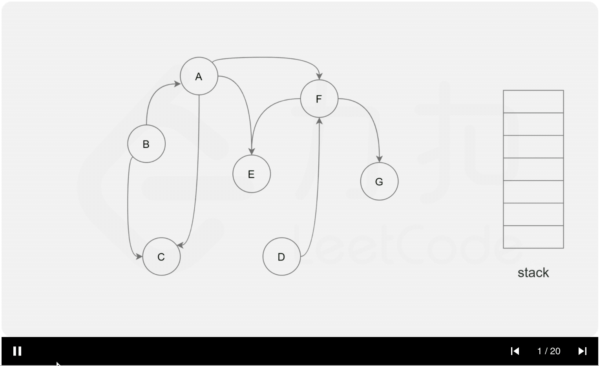
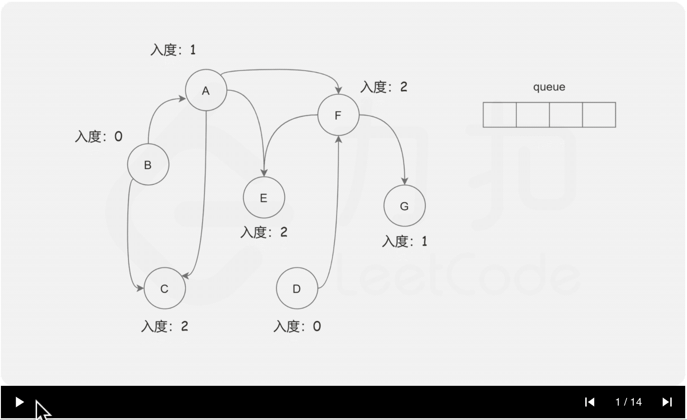

- [207. 课程表](#207-课程表)
  - [题目](#题目)
  - [题解](#题解)
    - [方法一：深度优先搜索](#方法一深度优先搜索)
    - [方法二: 广度优先搜索](#方法二-广度优先搜索)

------------------------------

# 207. 课程表

## 题目

你这个学期必须选修 numCourse 门课程，记为 0 到 numCourse-1 。

在选修某些课程之前需要一些先修课程。 例如，想要学习课程 0 ，你需要先完成课程 1 ，我们用一个匹配来表示他们：`[0,1]`

给定课程总量以及它们的先决条件，请你判断是否可能完成所有课程的学习？

 

示例 1:

```
输入: 2, [[1,0]] 
输出: true
解释: 总共有 2 门课程。学习课程 1 之前，你需要完成课程 0。所以这是可能的。
```

示例 2:

```
输入: 2, [[1,0],[0,1]]
输出: false
解释: 总共有 2 门课程。学习课程 1 之前，你需要先完成​课程 0；并且学习课程 0 之前，你还应先完成课程 1。这是不可能的。
```
 

提示：

- 输入的先决条件是由 边缘列表 表示的图形，而不是 邻接矩阵 。详情请参见[图的表示法](http://blog.csdn.net/woaidapaopao/article/details/51732947)。
- 你可以假定输入的先决条件中没有重复的边。
- 1 <= numCourses <= $10^5$

--------------------

- 来源：力扣（LeetCode）
- 链接：https://leetcode-cn.com/problems/course-schedule
- 著作权归领扣网络所有。商业转载请联系官方授权，非商业转载请注明出处。


## 题解

> 链接：https://leetcode-cn.com/problems/course-schedule/solution/ke-cheng-biao-by-leetcode-solution/

**前言**

> 本题和 [210. 课程表 II](https://leetcode-cn.com/problems/course-schedule-ii/) 是几乎一样的题目。如果在过去完成过该题，那么只要将代码中的返回值从「非空数组 / 空数组」修改成「True / False」就可以通过本题。

本题是一道经典的「拓扑排序」问题。

给定一个包含 $n$ 个节点的有向图 $G$，我们给出它的节点编号的一种排列，如果满足：

> 对于图 $G$ 中的任意一条有向边 $(u, v)$，$u$ 在排列中都出现在 $v$ 的前面。

那么称该排列是图 $G$ 的「拓扑排序」。根据上述的定义，我们可以得出两个结论：

- 如果图 $G$ 中存在环（即图 $G$ 不是「有向无环图」），那么图 $G$ 不存在拓扑排序。这是因为假设图中存在环 $x_1, x_2, \cdots, x_n, x_1$，那么 $x_1$ 在排列中必须出现在 $x_n$ 的前面，但 $x_n$ 同时也必须出现在 $x_1$ 的前面，因此不存在一个满足要求的排列，也就不存在拓扑排序；
- 如果图 $G$ 是有向无环图，那么它的拓扑排序可能不止一种。举一个最极端的例子，如果图 $G$ 值包含 $n$ 个节点却没有任何边，那么任意一种编号的排列都可以作为拓扑排序。

有了上述的简单分析，我们就可以将本题建模成一个求拓扑排序的问题了：

- 我们将每一门课看成一个节点；
- 如果想要学习课程 $A$ 之前必须完成课程 $B$，那么我们从 $B$ 到 $A$ 连接一条有向边。这样以来，在拓扑排序中，$B$ 一定出现在 $A$ 的前面。

求出该图是否存在拓扑排序，就可以判断是否有一种符合要求的课程学习顺序。事实上，由于求出一种拓扑排序方法的最优时间复杂度为 $O(n+m)$，其中 $n$ 和 $m$ 分别是有向图 $G$ 的节点数和边数，方法见 [210. 课程表 II 的官方题解](https://leetcode-cn.com/problems/course-schedule-ii/solution/ke-cheng-biao-ii-by-leetcode-solution/)。而判断图 $G$ 是否存在拓扑排序，至少也要对其进行一次完整的遍历，时间复杂度也为 $O(n+m)$。因此**不可能存在一种仅判断图是否存在拓扑排序的方法，它的时间复杂度在渐进意义上严格优于 $O(n+m)$**。这样一来，我们使用和 [210. 课程表 II](https://leetcode-cn.com/problems/course-schedule-ii/) 完全相同的方法，但无需使用数据结构记录实际的拓扑排序。为了叙述的完整性，下面的两种方法与 [210. 课程表 II 的官方题解](https://leetcode-cn.com/problems/course-schedule-ii/solution/ke-cheng-biao-ii-by-leetcode-solution/) 完全相同，但在「算法」部分后的「优化」部分说明了如何省去对应的数据结构。


### 方法一：深度优先搜索

**思路**

我们可以将深度优先搜索的流程与拓扑排序的求解联系起来，用一个栈来存储所有已经搜索完成的节点。

> 对于一个节点 $u$，如果它的所有相邻节点都已经搜索完成，那么在搜索回溯到 $u$ 的时候，$u$ 本身也会变成一个已经搜索完成的节点。这里的「相邻节点」指的是从 $u$ 出发通过一条有向边可以到达的所有节点。

假设我们当前搜索到了节点 $u$，如果它的所有相邻节点都已经搜索完成，那么这些节点都已经在栈中了，此时我们就可以把 $u$ 入栈。可以发现，如果我们从栈顶往栈底的顺序看，由于 $u$ 处于栈顶的位置，那么 $u$ 出现在所有 $u$ 的相邻节点的前面。因此对于 $u$ 这个节点而言，它是满足拓扑排序的要求的。

这样一来，我们对图进行一遍深度优先搜索。当每个节点进行回溯的时候，我们把该节点放入栈中。最终从栈顶到栈底的序列就是一种拓扑排序。

**算法**

对于图中的任意一个节点，它在搜索的过程中有三种状态，即：

- 「未搜索」：我们还没有搜索到这个节点；
- 「搜索中」：我们搜索过这个节点，但还没有回溯到该节点，即该节点还没有入栈，还有相邻的节点没有搜索完成）；
- 「已完成」：我们搜索过并且回溯过这个节点，即该节点已经入栈，并且所有该节点的相邻节点都出现在栈的更底部的位置，满足拓扑排序的要求。

通过上述的三种状态，我们就可以给出使用深度优先搜索得到拓扑排序的算法流程，在每一轮的搜索搜索开始时，我们任取一个「未搜索」的节点开始进行深度优先搜索。

- 我们将当前搜索的节点 $u$ 标记为「搜索中」，遍历该节点的每一个相邻节点 $v$：
    - 如果 $v$ 为「未搜索」，那么我们开始搜索 $v$，待搜索完成回溯到 $u$；
    - 如果 $v$ 为「搜索中」，那么我们就找到了图中的一个环，因此是不存在拓扑排序的；
    - 如果 $v$ 为「已完成」，那么说明 $v$ 已经在栈中了，而 $u$ 还不在栈中，因此 $u$ 无论何时入栈都不会影响到 $(u, v)$ 之前的拓扑关系，以及不用进行任何操作。
- 当 $u$ 的所有相邻节点都为「已完成」时，我们将 $u$ 放入栈中，并将其标记为「已完成」。

在整个深度优先搜索的过程结束后，如果我们没有找到图中的环，那么栈中存储这所有的 $n$ 个节点，从栈顶到栈底的顺序即为一种拓扑排序。

下面的幻灯片给出了深度优先搜索的可视化流程。图中的「白色」「黄色」「绿色」节点分别表示「未搜索」「搜索中」「已完成」的状态。



**优化**

由于我们只需要判断是否存在一种拓扑排序，而栈的作用仅仅是存放最终的拓扑排序结果，因此我们可以**只记录每个节点的状态，而省去对应的栈**。

```go
func canFinish(numCourses int, prerequisites [][]int) bool {
    var (
        edges = make([][]int, numCourses)
        visited = make([]int, numCourses)
        result []int
        valid = true
        dfs func(u int)
    )

    dfs = func(u int) {
        visited[u] = 1 // 搜索中
        for _, v := range edges[u] { // 与 u 相邻的所有节点
            if visited[v] == 0 {
                dfs(v)
                if !valid {
                    return
                }
            } else if visited[v] == 1 { // 成环了
                valid = false
                return
            }
        }
        visited[u] = 2 // 搜索完成
        result = append(result, u) // 这个可以省略
    }

    for _, info := range prerequisites {
        // info[1] -> info[0]，先完成 [1] 才能完成 [0]。
        edges[info[1]] = append(edges[info[1]], info[0])
    }

    for i := 0; i < numCourses && valid; i++ {
        if visited[i] == 0 { // 如果还未搜索
            dfs(i)
        }
    }
    return valid
}
```

复杂度分析

- 时间复杂度: $O(n+m)$，其中 $n$ 为课程数，$m$ 为先修课程的要求数。这其实就是对图进行深度优先搜索的时间复杂度。
- 空间复杂度: $O(n+m)$。题目中是以列表形式给出的先修课程关系，为了对图进行深度优先搜索，我们需要存储成邻接表的形式，空间复杂度为 $O(n+m)$。在深度优先搜索的过程中，我们需要最多 $O(n)$ 的栈空间（递归）进行深度优先搜索，因此总空间复杂度为 $O(n+m)$。


### 方法二: 广度优先搜索

**思路**

方法一的深度优先搜索是一种「逆向思维」：**最先被放入栈中的节点是在拓扑排序中最后面的节点**。我们也可以使用正向思维，顺序地生成拓扑排序，这种方法也更加直观。

我们考虑拓扑排序中最前面的节点，该节点一定不会有任何**入边**，也就是它没有任何的先修课程要求。当我们将一个节点加入答案中后，我们就可以移除它的所有**出边**，代表着它的相邻节点少了一门先修课程的要求。如果某个相邻节点变成了「没有任何入边的节点」，那么就代表着这门课可以开始学习了。按照这样的流程，我们不断地将没有入边的节点加入答案，直到答案中包含所有的节点（得到了一种拓扑排序）或者**不存在没有入边的节点（图中包含环）**。

上面的想法类似于广度优先搜索，因此我们可以将广度优先搜索的流程与拓扑排序的求解联系起来。

**算法**

我们使用一个队列来进行广度优先搜索。初始时，所有入度为 $0$ 的节点都被放入队列中，它们就是可以作为拓扑排序最前面的节点，并且它们之间的相对顺序是无关紧要的。

在广度优先搜索的每一步中，我们取出队首的节点 $u$：

- 我们将 $u$ 放入答案中；
- 我们移除 $u$ 的所有出边，也就是将 $u$ 的所有相邻节点的入度减少 $1$。如果某个相邻节点 $v$ 的入度变为 $0$，那么我们就将 $v$ 放入队列中。

在广度优先搜索的过程结束后。如果答案中包含了这 $n$ 个节点，那么我们就找到了一种拓扑排序，否则说明图中存在环，也就不存在拓扑排序了。

下面的幻灯片给出了广度优先搜索的可视化流程。



**优化**

由于我们只需要判断是否存在一种拓扑排序，因此我们省去存放答案数组，而是只用一个变量记录被放入答案数组的节点个数。在广度优先搜索结束之后，我们判断该变量的值是否等于课程数，就能知道是否存在一种拓扑排序。

```go
func canFinish(numCourses int, prerequisites [][]int) bool {
    var (
        edges = make([][]int, numCourses)
        indeg = make([]int, numCourses)
        result []int
    )

    for _, info := range prerequisites {
        // info[1] -> info[0]
        edges[info[1]] = append(edges[info[1]], info[0])
        // info[0] 的入度增一
        indeg[info[0]]++
    }

    q := []int{}
    // 把入度为 0 的节点放入 q
    for i := 0; i < numCourses; i++ {
        if indeg[i] == 0 {
            q = append(q, i)
        }
    }

    for len(q) > 0 {
        // 弹出一个入度为 0 的节点
        u := q[0]
        q = q[1:]
        result = append(result, u) // 这个可以只用一个变量来计数
        for _, v := range edges[u] {
            indeg[v]--
            if indeg[v] == 0 {
                q = append(q, v)
            }
        }
    }
    return len(result) == numCourses
}
```

**复杂度分析**

- 时间复杂度: $O(n+m)$，其中 $n$ 为课程数，$m$ 为先修课程的要求数。这其实就是对图进行广度优先搜索的时间复杂度。
- 空间复杂度: $O(n+m)$。题目中是以列表形式给出的先修课程关系，为了对图进行广度优先搜索，我们需要存储成邻接表的形式，空间复杂度为 $O(n+m)$。在广度优先搜索的过程中，我们需要最多 $O(n)$ 的队列空间（迭代）进行广度优先搜索。因此总空间复杂度为 $O(n+m)$。
