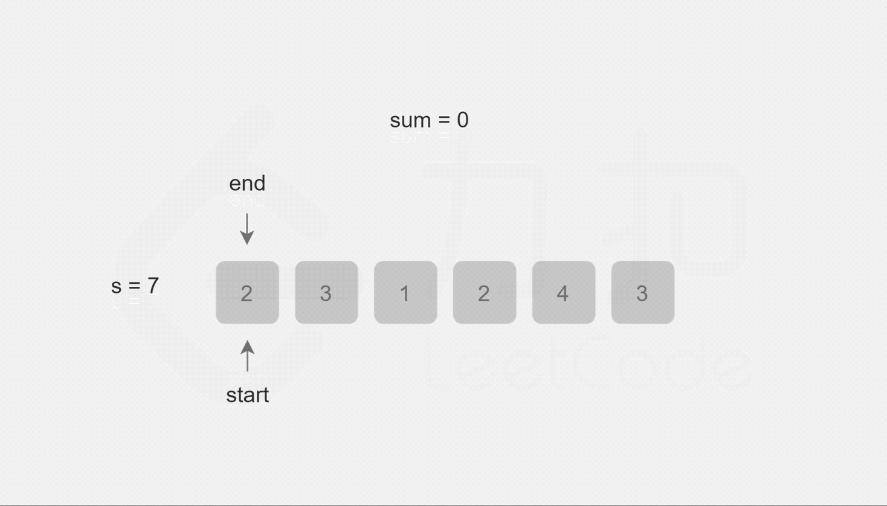

- [209. 长度最小的子数组](#209-长度最小的子数组)
  - [题目](#题目)
  - [题解](#题解)
    - [方法一：暴力法](#方法一暴力法)
    - [方法二：前缀和 + 二分查找](#方法二前缀和--二分查找)
    - [方法三：双指针](#方法三双指针)

------------------------------

# 209. 长度最小的子数组

## 题目

给定一个含有 n 个正整数的数组和一个正整数 s ，找出该数组中满足其和 ≥ s 的长度最小的连续子数组，并返回其长度。如果不存在符合条件的连续子数组，返回 0。

示例: 

```
输入: s = 7, nums = [2,3,1,2,4,3]
输出: 2
解释: 子数组 [4,3] 是该条件下的长度最小的连续子数组。
```

进阶:

如果你已经完成了O(n) 时间复杂度的解法, 请尝试 O(n log n) 时间复杂度的解法。

- 来源：力扣（LeetCode）
- 链接：https://leetcode-cn.com/problems/minimum-size-subarray-sum
- 著作权归领扣网络所有。商业转载请联系官方授权，非商业转载请注明出处。

## 题解

刚开始是想用最小连续子数组那种解法，不过可能是之前做过滑动窗口的题，所以想用滑动窗口试试，没想到一次就成功了，耶✌🏻。

> 链接：https://leetcode-cn.com/problems/minimum-size-subarray-sum/solution/chang-du-zui-xiao-de-zi-shu-zu-by-leetcode-solutio/

### 方法一：暴力法

暴力法是最直观的方法。初始化子数组的最小长度为无穷大，枚举数组 $\text{nums}$ 中的每个下标作为子数组的开始下标，对于每个开始下标 $i$，需要找到大于或等于 $i$ 的最小下标 $j$，使得从 $\text{nums}[i]$ 到 $\text{nums}[j]$ 的元素和大于或等于 $s$，并更新子数组的最小长度（此时子数组的长度是 $j-i+1$）。

注意：使用 Python 语言实现方法一会超出时间限制。

```go
func minSubArrayLen(s int, nums []int) int {
    n := len(nums)
    if n == 0 {
        return 0
    }
    ans := math.MaxInt32
    for i := 0; i < n; i++ {
        sum := 0
        for j := i; j < n; j++ {
            sum += nums[j]
            if sum >= s {
                ans = min(ans, j - i + 1)
                break
            }
        }
    }
    if ans == math.MaxInt32 {
        return 0
    }
    return ans
}

func min(x, y int) int {
    if x < y {
        return x
    }
    return y
}
```

复杂度分析

- 时间复杂度：$O(n^2)$，其中 $n$ 是数组的长度。需要遍历每个下标作为子数组的开始下标，对于每个开始下标，需要遍历其后面的下标得到长度最小的子数组。
- 空间复杂度：$O(1)$。

### 方法二：前缀和 + 二分查找

方法一的时间复杂度是 $O(n^2)$，因为在确定每个子数组的开始下标后，找到长度最小的子数组需要 $O(n)$ 的时间。如果使用二分查找，则可以将时间优化到 $O(\log n)$。

为了使用二分查找，需要额外创建一个数组 $\text{sums}$ 用于存储数组 $\text{nums}$ 的前缀和，其中 $\text{sums}[i]$ 表示从 $\text{nums}[0]$ 到 $\text{nums}[i-1]$ 的元素和。得到前缀和之后，对于每个开始下标 i，可通过二分查找得到大于或等于 i 的最小下标 $\textit{bound}$，使得 $\text{sums}[\textit{bound}]-\text{sums}[i-1] \ge s$，并更新子数组的最小长度（此时子数组的长度是 $\textit{bound}-(i-1)$）。

因为这道题保证了数组中每个元素都为正，所以前缀和一定是递增的，这一点保证了二分的正确性。**如果题目没有说明数组中每个元素都为正，这里就不能使用二分来查找这个位置了**。

在很多语言中，都有现成的库和函数来为我们实现这里二分查找大于等于某个数的第一个位置的功能，比如 C++ 的 `lower_bound`，Java 中的 `Arrays.binarySearch`，C# 中的 `Array.BinarySearch`，Python 中的 `bisect.bisect_left`。但是有时面试官可能会让我们自己实现一个这样的二分查找函数，这里给出一个 C# 的版本，供读者参考：

```c#
private int LowerBound(int[] a, int l, int r, int target) 
{
    int mid = -1, originL = l, originR = r;
    while (l < r) 
    {
        mid = (l + r) >> 1;
        if (a[mid] < target) l = mid + 1;
        else r = mid;
    } 

    return (a[l] >= target) ? l : -1;
}
```

下面是这道题的代码。

```go
func minSubArrayLen(s int, nums []int) int {
    n := len(nums)
    if n == 0 {
        return 0
    }
    ans := math.MaxInt32
    sums := make([]int, n + 1)
    // 为了方便计算，令 size = n + 1 
    // sums[0] = 0 意味着前 0 个元素的前缀和为 0
    // sums[1] = A[0] 前 1 个元素的前缀和为 A[0]
    // 以此类推
    for i := 1; i <= n; i++ {
        sums[i] = sums[i - 1] + nums[i - 1]
    }
    for i := 1; i <= n; i++ {
        target := s + sums[i-1]
        bound := sort.SearchInts(sums, target)
        if bound < 0 {
            bound = -bound - 1
        }
        if bound <= n {
            ans = min(ans, bound - (i - 1))
        }
    }
    if ans == math.MaxInt32 {
        return 0
    }
    return ans
}

func min(x, y int) int {
    if x < y {
        return x
    }
    return y
}
```

复杂度分析

- 时间复杂度：$O(n \log n)$, 其中 n 是数组的长度。需要遍历每个下标作为子数组的开始下标，遍历的时间复杂度是 $O(n)$，对于每个开始下标，需要通过二分查找得到长度最小的子数组，二分查找得时间复杂度是 $O(\log n)$, 因此总时间复杂度是 $O(n \log n)$。
- 空间复杂度：$O(n)$，其中 n 是数组的长度。额外创建数组 $\text{sums}$ 存储前缀和。


### 方法三：双指针

在方法一和方法二中，都是每次确定子数组的开始下标，然后得到长度最小的子数组，因此时间复杂度较高。为了降低时间复杂度，可以使用双指针的方法。

定义两个指针 `start` 和 `end` 分别表示子数组的开始位置和结束位置，维护变量 `sum` 存储子数组中的元素和（即从 `nums[start]` 到 `nums[end]` 的元素和）。

初始状态下，`start` 和 `end` 都指向下标 0，`sum` 的值为 0。

每一轮迭代，将 `nums[end]` 加到 `sum`，如果 `sum >= s`，则更新子数组的最小长度（此时子数组的长度是 `end−start+1`），然后将 `nums[start]` 从 `sum` 中减去并将 `start` 右移，直到 `sum < s`，**在此过程中同样更新子数组的最小长度**。在每一轮迭代的最后，将 `end` 右移。



```go
func minSubArrayLen(s int, nums []int) int {
    n := len(nums)
    if n == 0 {
        return 0
    }
    ans := math.MaxInt32
    start, end := 0, 0
    sum := 0
    for end < n {
        sum += nums[end]
        for sum >= s {
            ans = min(ans, end - start + 1)
            sum -= nums[start]
            start++
        }
        end++
    }
    if ans == math.MaxInt32 {
        return 0
    }
    return ans
}

func min(x, y int) int {
    if x < y {
        return x
    }
    return y
}
```

复杂度分析

- 时间复杂度：$O(n)$，其中 n 是数组的长度。指针 `start` 和 `end` 最多各移动 n 次。
- 空间复杂度：$O(1)$。
