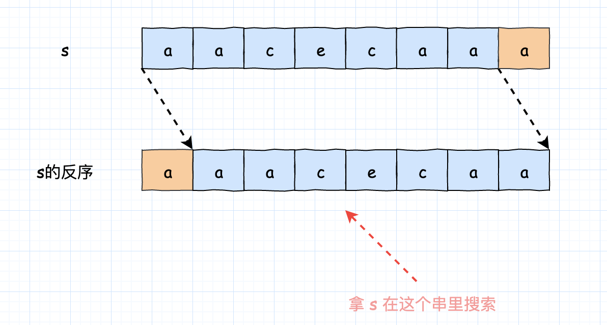

- [214. 最短回文串](#214-最短回文串)
  - [官方题解](#官方题解)
    - [方法一：字符串哈希](#方法一字符串哈希)
    - [方法二：KMP 算法](#方法二kmp-算法)


------------------------------

# 214. 最短回文串

给定一个字符串 s，你可以通过在字符串前面添加字符将其转换为回文串。找到并返回可以用这种方式转换的最短回文串。

示例 1:

```
输入: "aacecaaa"
输出: "aaacecaaa"
```

示例 2:

```
输入: "abcd"
输出: "dcbabcd"
```

- 来源：力扣（LeetCode）
- 链接：https://leetcode-cn.com/problems/shortest-palindrome
- 著作权归领扣网络所有。商业转载请联系官方授权，非商业转载请注明出处。

## 官方题解

> 链接：https://leetcode-cn.com/problems/shortest-palindrome/solution/zui-duan-hui-wen-chuan-by-leetcode-solution/

**前言**

我们需要在给定的字符串 $s$ 的前面添加字符串 $s'$，得到最短的回文串。这里我们用 $s'+s$ 表示得到的回文串。显然，这等价于找到最短的字符串 $s'$，使得 $s'+s$ 是一个回文串。

由于我们一定可以将 $s$ 去除第一个字符后得到的字符串反序地添加在 $s$ 的前面得到一个回文串，因此一定有 $|s'| < |s|$，其中 $|s|$ 表示字符串 $s$ 的长度。

> 例如当 $s = \text{abccda}$ 时，我们可以将 $\text{bccda}$ 的反序 $\text{adccb}$ 添加在前面得到回文串 $\text{adccbabccda}$。

这样一来，我们可以将 $s$ 分成两部分：

- 长度为 $|s| - |s'|$ 的前缀 $s_1$；(**就是 S 中去掉后面几个字符后最长的回文串**)
- 长度为 $|s'|$ 的后缀 $s_2$ 。(**就是 S 中去掉最长回文串后剩下的部分**)

由于 $s'+s$ 是一个回文串，那么 $s'$的反序就必然与 $s_2$ 相同，并且 $s_1$ 本身就是一个回文串。因此，要找到最短的 $s'$，等价于找到最长的 $s_1$ 。也就是说，我们**需要在字符串 $s$ 中找出一个最长的前缀 $s_1$ ，它是一个回文串**(这一步我也想到了，哈哈)。当我们找到 $s_1$ 后，剩余的部分即为 $s_2$ ，其反序即为 $s'$。

要想找到 $s_1$ ，最简单的方法就是暴力地枚举 $s_1$ 的结束位置，并判断其是否是一个回文串。但该方法的时间复杂度为 $O(|s|^2)$，无法通过本题。因此，我们需要使用更优秀的方法。


### 方法一：字符串哈希

**思路**

我们可以用 Rabin-Karp 字符串哈希算法来找出最长的回文串。

在该方法中，我们将字符串看成一个 $\textit{base}$ 进制的数，它对应的十进制值就是哈希值。显然，两个字符串的哈希值相等，当且仅当这两个字符串本身相同。然而如果字符串本身很长，其对应的十进制值在大多数语言中无法使用内置的整数类型进行存储。因此，我们会将十进制值对一个大质数 $\textit{mod}$ 进行取模。此时：

- 如果两个字符串的哈希值在取模后不相等，那么这两个字符串本身一定不相同；
- 如果两个字符串的哈希值在取模后相等，并不能代表这两个字符串本身一定相同。例如两个字符串的哈希值分别为 2 和 15，模数为 13，虽然 `2 ≡ 15 (mod 13)`，但它们不相同。

然而，我们在编码中使用的 $\textit{base}$ 和 $\textit{mod}$ 对于测试数据本身是「黑盒」的，也就是说，并不存在一组测试数据，使得对于任意的 $\textit{base}$ 和 $\textit{mod}$，都会产生哈希碰撞，导致错误的判断结果。因此，我们可以「投机取巧」地尝试不同的 $\textit{base}$ 和 $\textit{mod}$，使之可以通过所有的测试数据。

> 注意：在工程代码中，千万不能投机取巧。

一般来说，我们选取一个大于字符集大小（即字符串中可能出现的字符种类的数目）的质数作为 $\textit{base}$，再选取一个在字符串长度平方级别左右的质数作为 $\textit{mod}$，产生哈希碰撞的概率就会很低。

**算法**

一个字符串是回文串，当且仅当该字符串与它的反序相同。因此，我们仍然暴力地枚举 $s_1$ 的结束位置，并计算 $s_1$ 与 $s_1$ 反序的哈希值。如果这两个哈希值相等，说明我们找到了一个 $s$ 的前缀回文串。

在枚举 $s_1$ 的结束位置时，我们可以从小到大地进行枚举，这样就可以很容易地维护 $s_1$ 与 $s_1$ 反序的哈希值：

设当前枚举到的结束位置为 $i$，对应的 $s_1$ 记为 $s_1^i$ ，其反序记为 $\hat{s}_1^i$ 。我们可以通过递推的方式，在 $O(1)$ 的时间通过 $s_1^{i-1}$ 和 $\hat{s}_1^{i-1}$ 的哈希值得到 $s_1^i$ 和 $\hat{s}_1^i$ 的哈希值： 

- $\text{hash}(s_1^i) = \text{hash}(s_1^{i-1}) \times \textit{base} + \text{ASCII}(s[i])$
- $\text{hash}(\hat{s}_1^i) = \text{hash}(\hat{s}_1^{i-1}) + \text{ASCII}(s[i]) \times \text{base}^i$ (注意是反序，所以乘 base 的不同)

其中 $\text{ASCII}(x)$ 表示字符 $x$ 的 $\text{ASCII}$ 码。注意需要将结果对 $\textit{mod}$ 取模。

如果 $\text{hash}(s_1^i) = \text{hash}(\hat{s}_1^i)$，那么 $s_1^i$ 就是一个回文串。我们将最长的回文串作为最终的 $s_1$ 。

**代码**

```go
func shortestPalindrome(s string) string {
    n := len(s)
    base, mod := 131, 1000000007
    left, right, mul := 0, 0, 1
    best := -1
    for i := 0; i < n; i++ {
        left = (left * base + int(s[i] - '0')) % mod
        right = (right + mul * int(s[i] - '0')) % mod
        if left == right {
            best = i
        }
        mul = mul * base % mod
    }
    add := ""
    if best != n - 1 {
        add = s[best + 1:]
    }
    b := []byte(add)
    for i := 0; i < len(b) / 2; i++ {
        b[i], b[len(b) - 1 -i] = b[len(b) - 1 -i], b[i]
    }
    return string(b) + s
}
```

**复杂度分析**

- 时间复杂度：$O(|s|)$。
- 空间复杂度：$O(1)$。


### 方法二：KMP 算法

**思路与算法**

我们也可以不「投机取巧」，而是使用 KMP 字符串匹配算法来找出这个最长的前缀回文串。

具体地，记 $\hat{s}$ 为 $s$ 的反序，由于 $s_1$ 是 $s$ 的前缀，那么 $\hat{s}_1$ 就是 $\hat{s}$ 的后缀。

考虑到 $s_1$ 是一个回文串，因此 $s_1 = \hat{s}_1$，$s_1$ 同样是 $\hat{s}$ 的后缀。

这样一来，我们将 $s$ 作为模式串，$\hat{s}$ 作为查询串进行匹配。当遍历到 $\hat{s}$ 的末尾时，如果匹配到 $s$ 中的第 $i$ 个字符，那么说明 $s$ 的前 $i$ 个字符与 $\hat{s}$ 的后 $i$ 个字符相匹配（即相同），$s$ 的前 $i$ 个字符对应 $s_1$ ，$\hat{s}$ 的后 $i$ 个字符对应 $\hat{s}_1$ ，由于 $s_1 = \hat{s}_1$，因此 $s_1$ 就是一个回文串。



> 如果存在更长的回文串，那么 KMP 算法的匹配结果也会大于 $i$，因此 $s_1$ 就是最长的前缀回文串。

**代码**

```go
func shortestPalindrome(s string) string {
    n := len(s)
    fail := make([]int, n)
    for i := 0; i < n; i++ {
        fail[i] = -1
    }
    for i := 1; i < n; i++ {
        j := fail[i - 1]
        for j != -1 && s[j + 1] != s[i] {
            j = fail[j]
        }
        if s[j + 1] == s[i] {
            fail[i] = j + 1
        }
    }
    best := -1
    for i := n - 1; i >= 0; i-- {
        for best != -1 && s[best + 1] != s[i] {
            best = fail[best]
        }
        if s[best + 1] == s[i] {
            best++
        }
    }
    add := ""
    if best != n - 1 {
        add = s[best + 1:]
    }
    b := []byte(add)
    for i := 0; i < len(b) / 2; i++ {
        b[i], b[len(b) - 1 -i] = b[len(b) - 1 -i], b[i]
    }
    return string(b) + s
}
```

**复杂度分析**

- 时间复杂度：$O(|s|)$。
- 空间复杂度：$O(|s|)$。

**结语**

如果读者对 KMP 算法不熟悉，可以自行查阅资料进行学习。KMP 算法在笔试或面试中也是非常罕见的考点，读者可以参考[官方题解：459. 重复的子字符串](https://leetcode-cn.com/problems/repeated-substring-pattern/solution/zhong-fu-de-zi-zi-fu-chuan-by-leetcode-solution/)中的对应部分检验自己的学习成果。

本题也可以用 Manacher 算法找出回文串，但该方法已经达到竞赛难度，读者可以参考[官方题解：5. 最长回文子串](https://leetcode-cn.com/problems/longest-palindromic-substring/solution/zui-chang-hui-wen-zi-chuan-by-leetcode-solution/)中的对应部分汲取一些灵感，并尝试用该算法解决本题。
