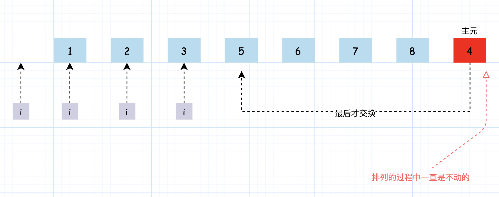
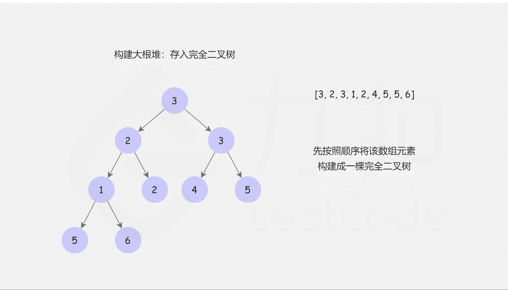

- [215. 数组中的第K个最大元素](#215-数组中的第k个最大元素)
  - [题目](#题目)
  - [题解](#题解)
    - [方法一：基于快速排序的选择方法](#方法一基于快速排序的选择方法)
    - [方法二：基于堆排序的选择方法](#方法二基于堆排序的选择方法)
    - [使用 rust 实现堆的解决方案](#使用-rust-实现堆的解决方案)

------------------------------

# 215. 数组中的第K个最大元素

## 题目

在未排序的数组中找到第 k 个最大的元素。请注意，你需要找的是数组排序后的第 k 个最大的元素，而不是第 k 个不同的元素。

示例 1:

```
输入: [3,2,1,5,6,4] 和 k = 2
输出: 5
```

示例 2:

```
输入: [3,2,3,1,2,4,5,5,6] 和 k = 4
输出: 4
```

说明: 你可以假设 k 总是有效的，且 1 ≤ k ≤ 数组的长度。

- 来源：力扣（LeetCode）
- 链接：https://leetcode-cn.com/problems/kth-largest-element-in-an-array
- 著作权归领扣网络所有。商业转载请联系官方授权，非商业转载请注明出处。

## 题解

算法导论中的快速排序是把主元放到最后一个位置，并且不移动主元的。而我是把第一个当作主元的，然后还移动了主元，这造成最后找不到主元了。。。


> 链接：https://leetcode-cn.com/problems/kth-largest-element-in-an-array/solution/shu-zu-zhong-de-di-kge-zui-da-yuan-su-by-leetcode-/

- 约定：假设这里数组的长度为 n。
- 题目分析：本题希望我们返回数组排序之后的倒数第 k 个位置。

### 方法一：基于快速排序的选择方法

**思路和算法**

我们可以用快速排序来解决这个问题，先对原数组排序，再返回倒数第 k 个位置，这样平均时间复杂度是 $O(n \log n)$, 但其实我们可以做的更快。

首先我们来回顾一下快速排序，这是一个典型的分治算法。我们对数组 $a[l \cdots r]$ 做快速排序的过程是（参考《算法导论》）：

- 分解： 将数组 $a[l \cdots r]$ 「划分」成两个子数组 $a[l \cdots q - 1]$、$a[q + 1 \cdots r]$，使得 $a[l \cdots q - 1]$ 中的每个元素小于等于 `a[q]`，且 `a[q]` 小于等于 $a[q + 1 \cdots r]$ 中的每个元素。其中，计算下标 q 也是「划分」过程的一部分。
- 解决： 通过递归调用快速排序，对子数组 $a[l \cdots q - 1]$ 和 $a[q + 1 \cdots r]$ 进行排序。
- 合并： 因为子数组都是原址排序的，所以不需要进行合并操作，$a[l \cdots r]$ 已经有序。
- 上文中提到的 「划分」 过程是：从子数组 $a[l \cdots r]$ 中选择任意一个元素 x 作为**主元**，调整子数组的元素使得左边的元素都小于等于它，右边的元素都大于等于它， x 的最终位置就是 q。

由此可以发现每次经过「划分」操作后，我们一定可以确定一个元素的最终位置，即 x 的最终位置为 q，并且保证 $a[l \cdots q - 1]$ 中的每个元素小于等于 `a[q]`，且 `a[q]` 小于等于 $a[q + 1 \cdots r]$ 中的每个元素。所以只要某次划分的 q 为倒数第 k 个下标的时候，我们就已经找到了答案。 我们只关心这一点，至于 $a[l \cdots q - 1]$ 和 $a[q+1 \cdots r]$ 是否是有序的，我们不关心。

因此我们可以改进快速排序算法来解决这个问题：在分解的过程当中，我们会对子数组进行划分，如果划分得到的 q 正好就是我们需要的下标，就直接返回 `a[q]`；否则，如果 q 比目标下标小，就递归右子区间，否则递归左子区间。这样就可以把原来递归两个区间变成只递归一个区间，提高了时间效率。这就是「快速选择」算法。

我们知道快速排序的性能和「划分」出的子数组的长度密切相关。直观地理解如果每次规模为 n 的问题我们都划分成 1 和 n−1，每次递归的时候又向 n−1 的集合中递归，这种情况是最坏的，时间代价是 $O(n ^ 2)$。我们可以引入**随机化**来加速这个过程，它的时间代价的期望是 $O(n)$，证明过程可以参考「《算法导论》9.2：期望为线性的选择算法」。

```go
func findKthLargest(nums []int, k int) int {
    rand.Seed(time.Now().UnixNano())
    return quickSelect(nums, 0, len(nums)-1, len(nums)-k)
}

func quickSelect(a []int, l, r, index int) int {
    q := randomPartition(a, l, r)
    if q == index {
        return a[q]
    } else if q < index {
        return quickSelect(a, q + 1, r, index)
    }
    return quickSelect(a, l, q - 1, index)
}

func randomPartition(a []int, l, r int) int {
    i := rand.Int() % (r - l + 1) + l
    a[i], a[r] = a[r], a[i]
    return partition(a, l, r)
}

func partition(a []int, l, r int) int {
    x := a[r]
    i := l - 1
    for j := l; j < r; j++ {
        if a[j] <= x {
            i++
            a[i], a[j] = a[j], a[i]
        }
    }
    a[i+1], a[r] = a[r], a[i+1]
    return i + 1
}
```

复杂度分析

- 时间复杂度：$O(n)$，如上文所述，证明过程可以参考「《算法导论》9.2：期望为线性的选择算法」。
- 空间复杂度：$O(\log n)$，递归使用栈空间的空间代价的期望为 $O(\log n)$。





### 方法二：基于堆排序的选择方法

**思路和算法**

我们也可以使用堆排序来解决这个问题——建立一个大根堆，做 k−1 次删除操作后堆顶元素就是我们要找的答案。在很多语言中，都有优先队列或者堆的的容器可以直接使用，但是在面试中，面试官更倾向于让更面试者自己实现一个堆。所以建议读者掌握这里大根堆的实现方法，在这道题中尤其要搞懂「建堆」、「调整」和「删除」的过程。

友情提醒：「堆排」在很多大公司的面试中都很常见，不了解的同学建议参考《算法导论》或者大家的数据结构教材，一定要学会这个知识点哦! ^_^



```go
func findKthLargest(nums []int, k int) int {
    // 这个堆的大小有点大呀。。。反正不用新分配内存是吧，因为只占用 nums 的内存。
    heapSize := len(nums)
    buildMaxHeap(nums, heapSize)
    for i := len(nums) - 1; i >= len(nums) - k + 1; i-- {
        nums[0], nums[i] = nums[i], nums[0] // 把堆顶元素删除（把最大的删除）
        heapSize--
        maxHeapify(nums, 0, heapSize)
    }
    return nums[0]
}

func buildMaxHeap(a []int, heapSize int) {
    for i := heapSize/2; i >= 0; i-- {
        maxHeapify(a, i, heapSize)
    }
}

func maxHeapify(a []int, i, heapSize int) {
    l, r, largest := i * 2 + 1, i * 2 + 2, i
    if l < heapSize && a[l] > a[largest] {
        largest = l
    }
    if r < heapSize && a[r] > a[largest] {
        largest = r
    }
    if largest != i {
        a[i], a[largest] = a[largest], a[i]
        maxHeapify(a, largest, heapSize)
    }
}
```

复杂度分析

- 时间复杂度：$O(n \log n)$，建堆的时间代价是 $O(n)$，删除的总代价是 $O(k \log n)$，因为 k < n，故渐进时间复杂为 $O(n + k \log n) = O(n \log n)$。
- 空间复杂度：$O(\log n)$，即递归使用栈空间的空间代价。


### 使用 rust 实现堆的解决方案

```rs
#[allow(dead_code)]
struct Heap<T>
where
    T: std::cmp::PartialOrd,
{
    heap: Vec<T>,
}

#[allow(dead_code)]
// 小顶堆实现
impl<T> Heap<T>
where
    T: std::cmp::PartialOrd,
{
    fn new(size: usize) -> Self {
        let heap = Vec::with_capacity(size);
        Self { heap }
    }

    fn peek(&self) -> Option<&T> {
        self.heap.get(0)
    }

    fn heapify_down(&mut self, mut index: usize) {
        let Self { heap, .. } = self;
        let length = heap.len();

        loop { // 没有用递归
            let mut pos = index;
            let left = index * 2 + 1;
            let right = index * 2 + 2;
            if right < length && heap[right] < heap[pos] { // 这里最小堆
                pos = right;
            }
            if left < length && heap[left] < heap[pos] {
                pos = left;
            }
            if pos == index {
                break;
            }
            heap.swap(index, pos);
            index = pos;
        }
    }

    fn heapify_up(&mut self, mut index: usize) {
        let Self { heap, .. } = self;

        while ((index - 1) / 2) as i32 >= 0 && heap[(index - 1) / 2] > heap[index] { // 父 > 子, 子上去
            heap.swap((index - 1) / 2, index);
            index = (index - 1) / 2;
        }
    }

    pub fn insert(&mut self, value: T) {
        self.heap.push(value);
        self.heapify_up(self.heap.len() - 1);
    }

    fn pop(&mut self) -> Option<T> {
        let length = self.heap.len();
        match self.heap.len() {
            0 => None,
            1 => self.heap.pop(),
            _ => {
                self.heap.swap(0, length - 1);
                let result = self.heap.pop();
                self.heapify_down(0);
                result
            }
        }
    }
}

#[allow(dead_code)]
impl Solution {
    pub fn find_kth_largest(nums: Vec<i32>, k: i32) -> i32 {
        let mut heap: Heap<i32> = Heap::new(k as usize);
        let length = nums.len();
        for i in 0..length {
            // 堆的大小只有 k。但额外占用了 k 的大小。
            if i < k as usize {
                heap.insert(nums[i])
            } else {
                let kth = heap.peek().unwrap();
                if &nums[i] > kth {
                    heap.pop();
                    heap.insert(nums[i])
                }
            }
        }
        heap.pop().unwrap()
    }
}
```
