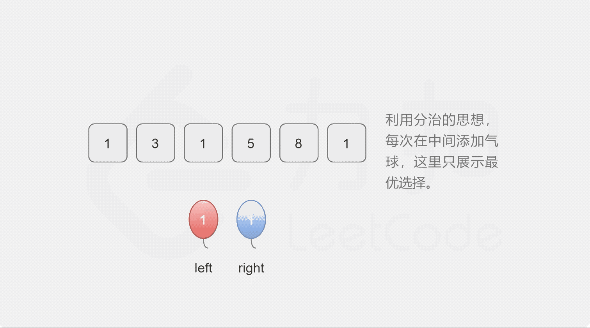

- [312. 戳气球](#312-戳气球)
  - [题目](#题目)
  - [题解](#题解)
    - [方法一：记忆化搜索](#方法一记忆化搜索)
    - [方法二：动态规划](#方法二动态规划)

------------------------------

# 312. 戳气球

## 题目

有 n 个气球，编号为 0 到 n-1，每个气球上都标有一个数字，这些数字存在数组 nums 中。

现在要求你戳破所有的气球。如果你戳破气球 i ，就可以获得 `nums[left] * nums[i] * nums[right]` 个硬币。 这里的 left 和 right 代表和 i 相邻的两个气球的序号。注意当你戳破了气球 i 后，气球 left 和气球 right 就变成了相邻的气球。

求所能获得硬币的最大数量。

说明:

- 你可以假设 `nums[-1] = nums[n] = 1`，但注意它们不是真实存在的所以并不能被戳破。
- `0 ≤ n ≤ 500, 0 ≤ nums[i] ≤ 100`

示例:

```
输入: [3,1,5,8]
输出: 167 
解释: nums = [3,1,5,8] --> [3,5,8] -->   [3,8]   -->  [8]  --> []
     coins =  3*1*5      +  3*5*8    +  1*3*8      + 1*8*1   = 167
```

- 来源：力扣（LeetCode）
- 链接：https://leetcode-cn.com/problems/burst-balloons
- 著作权归领扣网络所有。商业转载请联系官方授权，非商业转载请注明出处。


## 题解

> 我只能想到一种方法，就是暴力求解 😂。每次删掉一个元素，然后生成一个新的数组，再求这个新数组中硬币的最大数量。显然这种方式会很耗内存和时间。

--------------------

> 链接：https://leetcode-cn.com/problems/burst-balloons/solution/chuo-qi-qiu-by-leetcode-solution/

**写在前面**

为了方便处理，我们对 $\textit{nums}$ 数组稍作处理，将其两边各加上题目中假设存在的 $\textit{nums}[-1]$ 和 $\textit{nums}[n]$ ，并保存在 $\textit{val}$ 数组中，即 $\textit{val}[i]=\textit{nums}[i-1]$。之所以这样处理是为了处理 $\textit{nums}[-1]$，防止下标越界。

下文中的区间均指数组 $\textit{val}$ 上的区间。

### 方法一：记忆化搜索

**思路及算法**

我们观察戳气球的操作，发现这会导致两个气球从不相邻变成相邻，使得后续操作难以处理。于是我们倒过来看这些操作，将全过程看作是**每次添加一个气球**。

我们定义方法 $\textit{solve}$，令 $\textit{solve}(i,j)$ 表示将开区间 $(i,j)$ 内的位置全部填满气球能够得到的最多硬币数。由于是开区间，因此区间两端的气球的编号就是 $i$ 和 $j$，对应着 $\textit{val}[i]$ 和 $\textit{val}[j]$。

当 $i \geq j-1$ 时，开区间中没有气球，$\textit{solve}(i,j)$ 的值为 0；

当 $i < j-1$ 时，我们枚举开区间 $(i,j)$ 内的全部位置 $\textit{mid}$，令 $\textit{mid}$ 为当前区间第一个添加的气球，该操作能得到的硬币数为 $\textit{val}[i] \times \textit{val}[\textit{mid}] \times val[j]$。同时我们递归地计算分割出的两区间对 $\textit{solve}(i,j)$ 的贡献，这三项之和的最大值，即为 $\textit{solve}(i,j)$ 的值。这样问题就转化为求 $\textit{solve}(i,\textit{mid})$ 和 $\textit{solve}(\textit{mid},j)$，可以写出方程：

$$
\textit{solve}(i,j)= \begin{cases}{} \displaystyle \max_{\textit{mid} = i + 1}^{j - 1}val[i] \times \textit{val}[\textit{mid}] \times \textit{val}[j] + \textit{solve}(i, \textit{mid}) + \textit{solve}(\textit{mid}, j) ,&i < j - 1 \\ 0, & i \geq j - 1 \end{cases}
$$

为了防止重复计算，我们存储 $\textit{solve}$ 的结果，使用记忆化搜索的方法优化时间复杂度。



```go
func maxCoins(nums []int) int {
    n := len(nums)
    val := make([]int, n + 2)
    for i := 1; i <= n; i++ {
        val[i] = nums[i - 1]
    }
    val[0], val[n+1] = 1, 1
    // 缓存中间结果
    // rec[i][j] 就是上面提到的 solve(i, j)
    rec := make([][]int, n + 2)
    for i := 0; i < len(rec); i++ {
        rec[i] = make([]int, n + 2)
        for j := 0; j < len(rec[i]); j++ {
            rec[i][j] = -1
        }
    }
    return solve(0, n + 1, val, rec)
}

func solve(left, right int, val []int, rec [][]int) int {
    if left >= right - 1 {
        return 0
    }
    if rec[left][right] != -1 {
        return rec[left][right]
    }
    for i := left + 1; i < right; i++ {
        // 假设在 (left, right) 中间插入一个 val[i]
        sum := val[left] * val[i] * val[right]
        // 求左右区间的最大数
        sum += solve(left, i, val, rec) + solve(i, right, val, rec)
        // 如果插入 val[i] 后是最大值，更新 rec[left][right]
        rec[left][right] = max(rec[left][right], sum)
    }
    return rec[left][right]
}

func max(x, y int) int {
    if x > y {
        return x
    }
    return y
}
```

**复杂度分析**

- 时间复杂度：$O(n^3)$，其中 n 是气球数量。区间数为 $n^2$，区间迭代复杂度为 $O(n)$，最终复杂度为 $O(n^2 \times n) = O(n^3)$。
- 空间复杂度：$O(n^2)$，其中 n 是气球数量。缓存大小为区间的个数。


### 方法二：动态规划

**思路及算法**

按照方法一的思路，我们发现我们可以通过变换计算顺序，从「自顶向下」的记忆化搜索变为「自底向上」的动态规划。

令 $dp[i][j]$ 表示填满开区间 $(i,j)$ 能得到的最多硬币数，那么边界条件是 $i \geq j-1$，此时有 $dp[i][j]=0$。

可以写出状态转移方程：

$$
dp[i][j]= \begin{cases}{} \displaystyle \max_{k = i + 1}^{j - 1}val[i] \times val[k] \times val[j] + dp[i][k] + dp[k][j] ,&i < j - 1 \\ 0, & i \geq j - 1 \end{cases}
$$

最终答案即为 $dp[0][n+1]$。实现时要注意到动态规划的次序。

```go
func maxCoins(nums []int) int {
    n := len(nums)
    rec := make([][]int, n + 2)
    for i := 0; i < n + 2; i++ {
        rec[i] = make([]int, n + 2)
    }
    val := make([]int, n + 2)
    val[0], val[n+1] = 1, 1
    for i := 1; i <= n; i++ {
        val[i] = nums[i-1]
    }
    // i,j 是左右边界，i 从最大处开始，j 和 k 为什么不是递减的呢？
    for i := n - 1; i >= 0; i-- {
        // 为什么是 +2？如果加 1，那么 j 就紧邻着 i，但 (i, j) 是开区间，这样区间里就没有气球了。
        for j := i + 2; j <= n + 1; j++ {
            for k := i + 1; k < j; k++ {
                sum := val[i] * val[k] * val[j]
                // rec[i][j] 依赖于 [i][k] 和 [k][j]，所以要保证在计算 [i][j] 时它们俩已经计算完。
                // [i][k]: k 要比 j 小，所以 j 应该从小到大计算。
                // [k][j]: k 要比 i 大，所以 i 应该从大到小计算。
                sum += rec[i][k] + rec[k][j]
                rec[i][j] = max(rec[i][j], sum)
            }
        }
    }
    return rec[0][n+1]
}

func max(x, y int) int {
    if x > y {
        return x
    }
    return y
}
```

**复杂度分析**

- 时间复杂度：$O(n^3)$，其中 n 是气球数量。状态数为 $n^2$，状态转移复杂度为 $O(n)$，最终复杂度为 $O(n^2 \times n) = O(n^3)$。 
- 空间复杂度：$O(n^2)$，其中 n 是气球数量。
