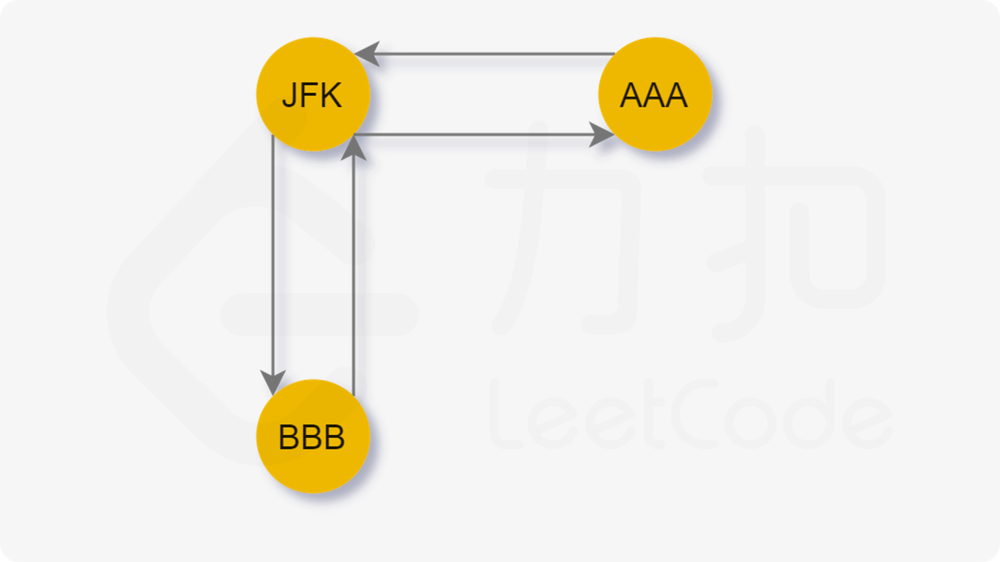

- [332. 重新安排行程](#332-重新安排行程)
  - [官方题解](#官方题解)
    - [方法一：Hierholzer 算法](#方法一hierholzer-算法)

------------------------------

# 332. 重新安排行程

给定一个机票的字符串二维数组 `[from, to]`，子数组中的两个成员分别表示飞机出发和降落的机场地点，对该行程进行重新规划排序。所有这些机票都属于一个从 JFK（肯尼迪国际机场）出发的先生，所以该行程必须从 JFK 开始。

说明:

- 如果存在多种有效的行程，你可以按字符自然**排序**返回最小的行程组合。例如，行程 `["JFK", "LGA"]` 与 `["JFK", "LGB"]` 相比就更小，排序更靠前
- 所有的机场都用三个大写字母表示（机场代码）。
- 假定所有机票至少存在一种合理的行程。

示例 1:

```
输入: [["MUC", "LHR"], ["JFK", "MUC"], ["SFO", "SJC"], ["LHR", "SFO"]]
输出: ["JFK", "MUC", "LHR", "SFO", "SJC"]
```

示例 2:

```
输入: [["JFK","SFO"],["JFK","ATL"],["SFO","ATL"],["ATL","JFK"],["ATL","SFO"]]
输出: ["JFK","ATL","JFK","SFO","ATL","SFO"]
解释: 另一种有效的行程是 ["JFK","SFO","ATL","JFK","ATL","SFO"]。但是它自然排序更大更靠后。
```

- 来源：力扣（LeetCode）
- 链接：https://leetcode-cn.com/problems/reconstruct-itinerary
- 著作权归领扣网络所有。商业转载请联系官方授权，非商业转载请注明出处。


## 官方题解

> 链接：https://leetcode-cn.com/problems/reconstruct-itinerary/solution/zhong-xin-an-pai-xing-cheng-by-leetcode-solution/

**前言**

本题和 [753. 破解保险箱](https://leetcode-cn.com/problems/cracking-the-safe/) 类似，是力扣平台上为数不多的求解**欧拉回路 / 欧拉通路**的题目。读者可以配合着进行练习。

我们化简本题题意：给定一个 n 个点 m 条边的图，要求从指定的顶点出发，经过所有的边恰好一次（可以理解为给定起点的「一笔画」问题），使得路径的字典序最小。

这种「一笔画」问题与欧拉图或者半欧拉图有着紧密的联系，下面给出定义：

- 通过图中所有边恰好一次且行遍所有顶点的通路称为欧拉通路。
- 通过图中所有边恰好一次且行遍所有顶点的回路称为欧拉回路。(通路和回路的区别是什么？)
- 具有欧拉回路的无向图称为欧拉图。
- 具有欧拉通路但不具有欧拉回路的无向图称为半欧拉图。

因为本题保证至少存在一种合理的路径，也就告诉了我们，这张图是一个欧拉图或者半欧拉图。我们只需要输出这条欧拉通路的路径即可。

如果没有保证至少存在一种合理的路径，我们需要判别这张图是否是欧拉图或者半欧拉图，具体地：

- 对于无向图 G，G 是欧拉图当且仅当 G 是连通的且没有奇度顶点。
- 对于无向图 G，G 是半欧拉图当且仅当 G 是连通的且 G 中恰有 22 个奇度顶点。
- 对于有向图 G，G 是欧拉图当且仅当 G 的所有顶点属于同一个强连通分量且每个顶点的入度和出度相同。
- 对于有向图 G，GG 是半欧拉图当且仅当 G 的所有顶点属于同一个强连通分量且
    - 恰有一个顶点的出度与入度差为 1；
    - 恰有一个顶点的入度与出度差为 1；
    - 所有其他顶点的入度和出度相同。

让我们考虑下面的这张图：



我们从起点 JFK 出发，合法路径有两条：

- JFK → AAA → JFK → BBB → JFK
- JFK → BBB → JFK → AAA → JFK

既然要求字典序最小，那么我们每次应该贪心地选择当前节点所连的节点中字典序最小的那一个，并将其入栈。最后栈中就保存了我们遍历的顺序。

为了保证我们能够快速找到当前节点所连的节点中字典序最小的那一个，我们可以使用**优先队列**存储当前节点所连到的点，每次我们 $O(1)$ 地找到最小字典序的节点，并 $O(\log m)$ 地删除它。(就是用堆喽。不一定是堆，数组排序的复杂度也是 log)

然后我们考虑一种特殊情况：


当我们先访问 AAA 时，我们无法回到 JFK，这样我们就无法访问剩余的边了。

也就是说，当我们贪心地选择字典序最小的节点前进时，我们可能先走入「死胡同」，从而导致无法遍历到其他还未访问的边。于是我们希望能够遍历完当前节点所连接的其他节点后再进入「死胡同」。

> 注意对于每一个节点，它**只有最多一个「死胡同」分支**(为什么呀？)。依据前言中对于半欧拉图的描述，**只有那个入度与出度差为 1 的节点会导致死胡同**。

### 方法一：Hierholzer 算法

**思路及算法**

Hierholzer 算法用于在连通图中寻找欧拉路径，其流程如下：

1. 从起点出发，进行深度优先搜索。
2. 每次沿着某条边从某个顶点移动到另外一个顶点的时候，都需要删除这条边。
3. 如果没有可移动的路径，则将所在节点加入到栈中，并返回。

当我们顺序地考虑该问题时，我们也许很难解决该问题，因为我们无法判断当前节点的哪一个分支是「死胡同」分支。

不妨倒过来思考。我们注意到只有那个入度与出度差为 1 的节点会导致死胡同。而该节点**必然是最后一个遍历到的节点**。我们可以改变入栈的规则，当我们遍历完一个节点所连的所有节点后，我们才将该节点入栈（即逆序入栈）。

对于当前节点而言，从它的每一个非「死胡同」分支出发进行深度优先搜索，都将会搜回到当前节点。而从它的「死胡同」分支出发进行深度优先搜索将不会搜回到当前节点。也就是说**当前节点的死胡同分支将会优先于其他非「死胡同」分支入栈**。

这样就能保证我们可以「一笔画」地走完所有边，最终的栈中逆序地保存了「一笔画」的结果。我们只要将栈中的内容反转，即可得到答案。

```go
func findItinerary(tickets [][]string) []string {
    var (
        m  = map[string][]string{}
        res []string
    )
    
    for _, ticket := range tickets {
        src, dst := ticket[0], ticket[1]
        m[src] = append(m[src], dst)
    }
    for key := range m {
        sort.Strings(m[key])
    }

    var dfs func(curr string)
    dfs = func(curr string) {
        for {
            if v, ok := m[curr]; !ok || len(v) == 0 {
                break
            }
            tmp := m[curr][0] // 选择一个字典序最小的终点
            m[curr] = m[curr][1:]
            dfs(tmp)
        }
        res = append(res, curr)
    }

    dfs("JFK")
    // 反转。
    for i := 0; i < len(res)/2; i++ {
        res[i], res[len(res) - 1 - i] = res[len(res) - 1 - i], res[i]
    }
    return res
}
```

**复杂度分析**

时间复杂度：$O(m \log m)$，其中 m 是边的数量。对于每一条边我们需要 $O(\log m)$ 地删除它，最终的答案序列长度为 m+1，而与 n 无关。
空间复杂度：$O(m)$，其中 m 是边的数量。我们需要存储每一条边。
