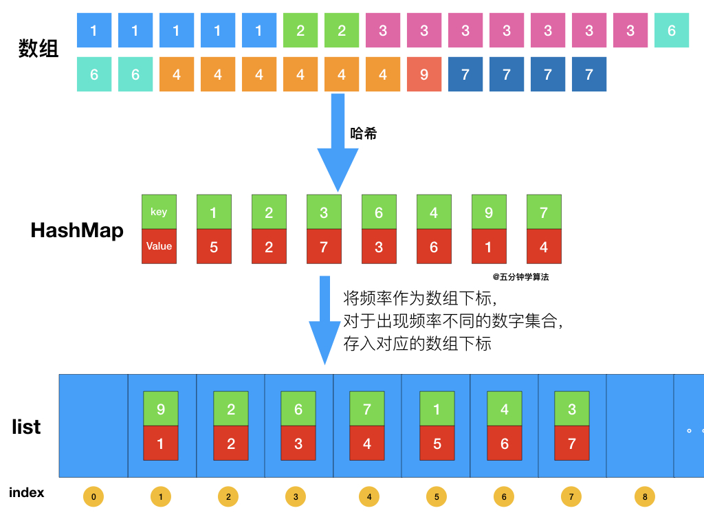

- [347. 前 K 个高频元素](#347-前-k-个高频元素)
  - [官方题解](#官方题解)
    - [方法一：堆](#方法一堆)
    - [方法二：基于快速排序](#方法二基于快速排序)
  - [桶排序](#桶排序)


------------------------------

# 347. 前 K 个高频元素

给定一个非空的整数数组，返回其中出现频率前 k 高的元素。

示例 1:

```
输入: nums = [1,1,1,2,2,3], k = 2
输出: [1,2]
```

示例 2:

```
输入: nums = [1], k = 1
输出: [1]
```
 

提示：

- 你可以假设给定的 k 总是合理的，且 1 ≤ k ≤ 数组中不相同的元素的个数。
- 你的算法的时间复杂度必须优于 $O(n log n)$, n 是数组的大小。
- 题目数据保证答案唯一，换句话说，数组中前 k 个高频元素的集合是唯一的。
- 你可以按任意顺序返回答案。

--------------------

- 来源：力扣（LeetCode）
- 链接：https://leetcode-cn.com/problems/top-k-frequent-elements
- 著作权归领扣网络所有。商业转载请联系官方授权，非商业转载请注明出处。


## 官方题解

> 链接：https://leetcode-cn.com/problems/top-k-frequent-elements/solution/qian-k-ge-gao-pin-yuan-su-by-leetcode-solution/

### 方法一：堆

**思路与算法**

首先遍历整个数组，并使用哈希表记录每个数字出现的次数，并形成一个「出现次数数组」。找出原数组的前 k 个高频元素，就相当于找出「出现次数数组」的前 k 大的值。

最简单的做法是给「出现次数数组」排序。但由于可能有 $O(N)$ 个不同的出现次数（其中 N 为原数组长度），故总的算法复杂度会达到 $O(N\log N)$，不满足题目的要求。

在这里，我们可以利用堆的思想：建立一个**小顶堆**，然后遍历「出现次数数组」：

- 如果堆的元素个数小于 k，就可以直接插入堆中。
- 如果堆的元素个数等于 k，则检查堆顶与当前出现次数的大小。**如果堆顶更大，说明至少有 k 个数字的出现次数比当前值大，故舍弃当前值**(这一步我漏掉了)；否则，就弹出堆顶，并将当前值插入堆中。

遍历完成后，堆中的元素就代表了「出现次数数组」中前 k 大的值。

```go
func topKFrequent(nums []int, k int) []int {
    occurrences := map[int]int{}
    for _, num := range nums {
        occurrences[num]++
    }
    h := &IHeap{}
    heap.Init(h)
    for key, value := range occurrences {
        // 这里也没有先检查堆顶元素呀？
        heap.Push(h, [2]int{key, value})
        if h.Len() > k {
            heap.Pop(h)
        }
    }
    ret := make([]int, k)
    for i := 0; i < k; i++ {
        ret[k - i - 1] = heap.Pop(h).([2]int)[0] // 倒序输出
    }
    return ret
}

type IHeap [][2]int

func (h IHeap) Len() int           { return len(h) }
func (h IHeap) Less(i, j int) bool { return h[i][1] < h[j][1] }
func (h IHeap) Swap(i, j int)      { h[i], h[j] = h[j], h[i] }

func (h *IHeap) Push(x interface{}) {
    *h = append(*h, x.([2]int))
}

func (h *IHeap) Pop() interface{} {
    old := *h
    n := len(old)
    x := old[n-1]
    *h = old[0 : n-1]
    return x
}
```

**复杂度分析**

- 时间复杂度：$O(N\log k)$，其中 N 为数组的长度。我们首先遍历原数组，并使用哈希表记录出现次数，每个元素需要 $O(1)$ 的时间，共需 $O(N)$ 的时间。随后，我们遍历「出现次数数组」，由于堆的大小至多为 k，因此每次堆操作需要 $O(\log k)$ 的时间，共需 $O(N\log k)$ 的时间。二者之和为 $O(N\log k)$。
- 空间复杂度：$O(N)$。哈希表的大小为 $O(N)$，而堆的大小为 $O(k)$，共计为 $O(N)$。


从 [这里](https://leetcode-cn.com/problems/top-k-frequent-elements/solution/leetcode-di-347-hao-wen-ti-qian-k-ge-gao-pin-yuan-/) 复制的图：


### 方法二：基于快速排序

**思路与算法**

我们可以使用基于快速排序的方法，求出「出现次数数组」的前 k 大的值。

在对数组 $\textit{arr}[l \ldots r]$ 做快速排序的过程中，我们首先将数组划分为两个部分 $\textit{arr}[i \ldots q-1]$ 与 $\textit{arr}[q+1 \ldots j]$，并使得 $\textit{arr}[i \ldots q-1]$ 中的每一个值都不超过 $\textit{arr}[q]$，且 $\textit{arr}[q+1 \ldots j]$ 中的每一个值都大于 $\textit{arr}[q]$。

于是，我们根据 k 与左侧子数组 $\textit{arr}[i \ldots q-1]$ 的长度（为 $q-i$）的大小关系：

- 如果 $k \le q-i$，则数组 $\textit{arr}[l \ldots r]$ 前 k 大的值，就等于子数组 $\textit{arr}[i \ldots q-1]$ 前 k 大的值。
- 否则，数组 $\textit{arr}[l \ldots r]$ 前 k 大的值，就等于左侧子数组全部元素(这些元素还得再排序吧？)，加上右侧子数组 $\textit{arr}[q+1 \ldots j]$ 中前 $k - (q - i)$ 大的值。

原版的快速排序算法的平均时间复杂度为 $O(N\log N)$。我们的算法中，每次只需在其中的一个分支递归即可，因此算法的平均时间复杂度降为 $O(N)$。

```go
func topKFrequent(nums []int, k int) []int {
    occurrences := map[int]int{}
    for _, num := range nums {
        occurrences[num]++
    }
    values := [][]int{}
    for key, value := range occurrences {
        values = append(values, []int{key, value})
    }
    ret := make([]int, k)
    qsort(values, 0, len(values) - 1, ret, 0, k)
    return ret
}

func qsort(values [][]int, start, end int, ret []int, retIndex, k int) {
    rand.Seed(time.Now().UnixNano())
    picked := rand.Int() % (end - start + 1) + start; // 随机选择一个主元。
    values[picked], values[start] = values[start], values[picked] // 主元放在开头位置。

    pivot := values[start][1] // 主元的频率
    index := start

    for i := start + 1; i <= end; i++ {
        // 如果频率大于等于主元的频率，就交换到 index+1 的位置。
        if values[i][1] >= pivot {
            values[index + 1], values[i] = values[i], values[index + 1]
            index++
        }
    }
    // 交换完后，[start, index] 是 <= 主元的，剩下的是 > 主元的。
    values[start], values[index] = values[index], values[start]
    if k <= index - start {
        // 在左边
        qsort(values, start, index - 1, ret, retIndex, k)
    } else {
        // 在右边
        // 把左边的元素都放到 ret 中。这是没有排序的。
        for i := start; i <= index; i++ {
            ret[retIndex] = values[i][0]
            retIndex++
        }
        if k > index - start + 1 {
            qsort(values, index + 1, end, ret, retIndex, k - (index - start + 1))
        }
    }
}
```

**复杂度分析**

- 时间复杂度：$O(N^2)$，其中 N 为数组的长度。

设处理长度为 N 的数组的时间复杂度为 $f(N)$。由于处理的过程包括一次遍历和一次子分支的递归，最好情况下，有 $f(N) = O(N) + f(N/2)$，根据 主定理，能够得到 $f(N) = O(N)$(不应该是 NlogN 吗？)。

最坏情况下，每次取的中枢数组的元素都位于数组的两端，时间复杂度退化为 $O(N^2)$。但由于我们在每次递归的开始会先随机选取中枢元素，故出现最坏情况的概率很低。

平均情况下，时间复杂度为 $O(N)$。

- 空间复杂度：$O(N)$。哈希表的大小为 $O(N)$，用于排序的数组的大小也为 $O(N)$，快速排序的空间复杂度最好情况为 $O(\log N)$，最坏情况为 $O(N)$。

**引申**

本题与 [215. 数组中的第K个最大元素](https://leetcode-cn.com/problems/kth-largest-element-in-an-array) 具有诸多相似之处。


## 桶排序



时间复杂度和空间复杂度都是 $O(n)$。

