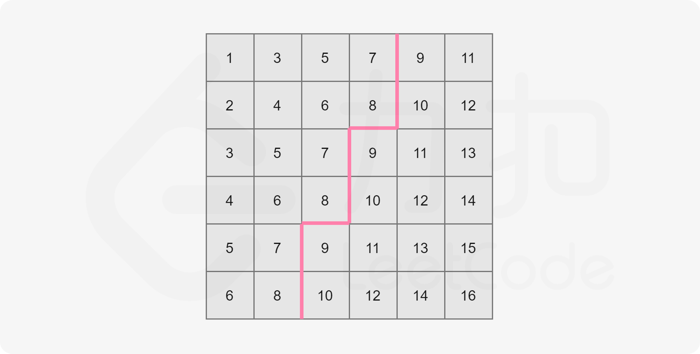

- [378. 有序矩阵中第K小的元素](#378-有序矩阵中第k小的元素)
  - [题目](#题目)
  - [题解](#题解)
    - [方法一：直接排序](#方法一直接排序)
    - [方法二：归并排序](#方法二归并排序)
    - [方法三：二分查找](#方法三二分查找)

------------------------------

# 378. 有序矩阵中第K小的元素

## 题目

给定一个 n x n 矩阵，其中每行和每列元素均按升序排序，找到矩阵中**第 k 小**的元素。

请注意，它是排序后的第 k 小元素，而不是第 k 个不同的元素。

示例：

```
matrix = [
   [ 1,  5,  9],
   [10, 11, 13],
   [12, 13, 15]
],
k = 8,

返回 13。
```
 

提示： 你可以假设 k 的值永远是有效的，1 ≤ k ≤ $n^2$ 。

- 来源：力扣（LeetCode）
- 链接：https://leetcode-cn.com/problems/kth-smallest-element-in-a-sorted-matrix
- 著作权归领扣网络所有。商业转载请联系官方授权，非商业转载请注明出处。

## 题解

> 链接：https://leetcode-cn.com/problems/kth-smallest-element-in-a-sorted-matrix/solution/you-xu-ju-zhen-zhong-di-kxiao-de-yuan-su-by-leetco/

### 方法一：直接排序

**思路及算法**

最直接的做法是将这个二维数组另存为为一维数组，并对该一维数组进行排序。最后这个一维数组中的第 k 个数即为答案。

```go
func kthSmallest(matrix [][]int, k int) int {
    rows, columns := len(matrix), len(matrix[0])
    sorted := make([]int, rows * columns)
    index := 0
    for _, row := range matrix {
        for _, num := range row {
            sorted[index] = num
            index++
        }
    }
    sort.Ints(sorted)
    return sorted[k-1]
}
```

**复杂度分析**

- 时间复杂度：$O(n^2\log{n})$, 对 $n^2$ 个数排序.
- 空间复杂度：$O(n^2)$


### 方法二：归并排序

**思路及算法**

由题目给出的性质可知，这个矩阵的每一行均为一个有序数组。问题即转化为从这 n 个有序数组中找**第 k 大的数**，可以想到利用归并排序的做法，归并到第 k 个数即可停止。

一般归并排序是两个数组归并，而本题是 n 个数组归并，所以需要用小根堆维护，以优化时间复杂度。

具体如何归并，可以参考力扣 [23. 合并K个排序链表](https://leetcode-cn.com/problems/merge-k-sorted-lists/)。

```go
func kthSmallest(matrix [][]int, k int) int {
    h := &IHeap{}
    // 把每行第一个元素放到最小堆里
    for i := 0; i < len(matrix); i++ {
        heap.Push(h, [3]int{matrix[i][0], i, 0})
    }

    // 弹出了 k-1 个元素，放进去了 **最多** k-1 个，怎么保证的堆里有 k 个元素？
	// 不需要保证堆里有 k 个元素，这是是把前 k-1 个最小的元素都弹出去了，再弹一次就是第 k 小的元素了。
    for i := 0; i < k - 1; i++ {
        now := heap.Pop(h).([3]int) // 弹出最小的那个
        if now[2] != len(matrix) - 1 {
            // 这一行下一列的数
            heap.Push(h, [3]int{matrix[now[1]][now[2]+1], now[1], now[2]+1})
        }
    }
    return heap.Pop(h).([3]int)[0]
}

type IHeap [][3]int

func (h IHeap) Len() int           { return len(h) }
func (h IHeap) Less(i, j int) bool { return h[i][0] < h[j][0] }
func (h IHeap) Swap(i, j int)      { h[i], h[j] = h[j], h[i] }

func (h *IHeap) Push(x interface{}) {
	*h = append(*h, x.([3]int))
}

func (h *IHeap) Pop() interface{} {
	old := *h
	n := len(old)
	x := old[n-1]
	*h = old[0 : n-1]
	return x
}
```

**复杂度分析**

- 时间复杂度：$O(k\log{n})$，归并 k 次，每次堆中插入和弹出的操作时间复杂度均为 $\log{n}$。
- 空间复杂度：$O(n)$，堆的大小始终为 n。

> 需要注意的是，k 在最坏情况下是 $n^2$ ，因此该解法最坏时间复杂度为 $O(n^2\log{n})$。


Rust 使用堆的方式：

```rs
// 链接：https://leetcode-cn.com/problems/kth-smallest-element-in-a-sorted-matrix/solution/rust-shuang-bai-by-qweytr_1/
impl Solution {
    // 把所有的元素都放到最大堆里洗一遍，每次弹出最大的，剩下的就是最小的k个。
    // 没有上面的高效啊。
    pub fn kth_smallest(matrix: Vec<Vec<i32>>, k: i32) -> i32 {
        let mut a = std::collections::BinaryHeap::with_capacity(k as usize + 1);
        for i in matrix {
            for j in i {
                a.push(j);
                if a.len() > k as usize {
                    a.pop();
                }
            }
        }
        a.pop().unwrap()
    }
}
```


### 方法三：二分查找

**思路及算法**

由题目给出的性质可知，这个矩阵内的元素是从左上到右下递增的（假设矩阵左上角为 `matrix[0][0]`）。以下图为例：


我们知道整个二维数组中 `matrix[0][0]` 为最小值，`matrix[n - 1][n - 1]` 为最大值，现在我们将其分别记作 l 和 r。

可以发现一个性质：任取一个数 `mid` 满足 $l\leq mid \leq r$，那么矩阵中不大于 `mid` 的数，肯定全部分布在矩阵的左上角。

例如下图，取 `mid=8`：



我们可以看到，矩阵中大于 `mid` 的数就和不大于 `mid` 的数分别形成了两个板块，沿着一条锯齿线将这个矩形分开。其中左上角板块的大小即为矩阵中不大于 `mid` 的数的数量。

读者也可以自己取一些 mid 值，通过画图以加深理解。

我们只要沿着这条锯齿线走一遍即可计算出这两个板块的大小，也自然就统计出了这个矩阵中不大于 mid 的数的个数了。

走法演示如下，依然取 `mid=8`：


可以这样描述走法：

- 初始位置在 `matrix[n - 1][0]`（即左下角）；
- 设当前位置为 `matrix[i][j]`。若 $matrix[i][j] \leq mid$，则将当前所在列的不大于 mid 的数的数量（即 `i + 1`）累加到答案中，并向右移动，否则向上移动；
- 不断移动直到走出格子为止。

我们发现这样的走法时间复杂度为 $O(n)$，即我们可以线性计算对于任意一个 `mid`，矩阵中有多少数不小于它。这满足了二分答案的性质。

不妨假设答案为 x，那么可以知道 $l\leq x\leq r$，这样就确定了二分答案的上下界。

每次对于「猜测」的答案 `mid`，计算矩阵中有多少数不大于 `mid` ：

- 如果数量不多于 k，那么说明最终答案 x 不小于 mid；
- 如果数量少于 k，那么说明最终答案 x 大于 mid。

这样我们就可以计算出最终的结果 x 了。

```go
func kthSmallest(matrix [][]int, k int) int {
    n := len(matrix)
    left, right := matrix[0][0], matrix[n-1][n-1]
    for left < right {
        mid := left + (right - left) / 2
        if check(matrix, mid, k, n) {
            right = mid
        } else {
            left = mid + 1
        }
    }
    return left
}

func check(matrix [][]int, mid, k, n int) bool {
    i, j := n - 1, 0
    num := 0
    for i >= 0 && j < n {
        if matrix[i][j] <= mid {
            // 累加的是这一列有多少 <= mid 的。
            num += i + 1
            j++
        } else {
            i--
        }
    }
    return num >= k
}
```

**复杂度分析**

- 时间复杂度：$O(n\log(r-l))$，二分查找进行次数为 $O(\log(r-l))$，每次操作时间复杂度为 $O(n)$。
- 空间复杂度：$O(1)$。

**写在最后**

上述三种解法，第一种没有利用矩阵的性质，所以时间复杂度最差；第二种解法只利用了一部分性质（每一列是一个有序数列，而忽视了行之间的关系）；第三种解法则利用了全部性质，所以时间复杂度最佳。

这也启示我们要认真把握题目中的条件与性质，更有利于我们解题。
