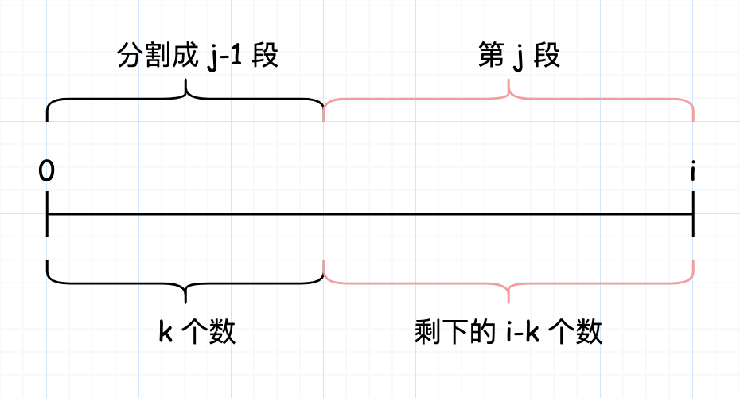
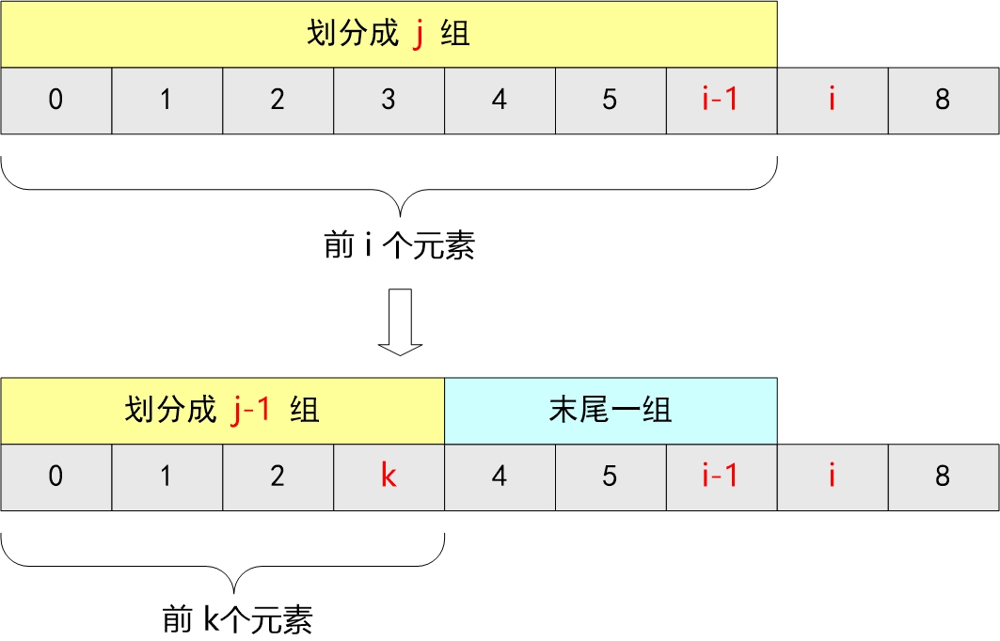

- [410. 分割数组的最大值](#410-分割数组的最大值)
  - [题目](#题目)
  - [题解](#题解)
    - [方法一：动态规划](#方法一动态规划)
    - [方法二：二分查找 + 贪心](#方法二二分查找--贪心)

------------------------------

# 410. 分割数组的最大值

## 题目

给定一个非负整数数组和一个整数 m，你需要将这个数组分成 m 个非空的连续子数组。设计一个算法使得这 m 个子数组各自和的最大值最小。

注意:

数组长度 n 满足以下条件:

- 1 ≤ n ≤ 1000
- 1 ≤ m ≤ min(50, n)

示例:

```
输入:
nums = [7,2,5,10,8]
m = 2

输出:
18

解释:
一共有四种方法将nums分割为2个子数组。
其中最好的方式是将其分为[7,2,5] 和 [10,8]，
因为此时这两个子数组各自的和的最大值为18，在所有情况中最小。
```

- 来源：力扣（LeetCode）
- 链接：https://leetcode-cn.com/problems/split-array-largest-sum
- 著作权归领扣网络所有。商业转载请联系官方授权，非商业转载请注明出处。

## 题解

> 链接：https://leetcode-cn.com/problems/split-array-largest-sum/solution/fen-ge-shu-zu-de-zui-da-zhi-by-leetcode-solution/

### 方法一：动态规划

**思路与算法**

「将数组分割为 m 段，求……」是动态规划题目常见的问法。

本题中，我们可以令 $f[i][j]$ 表示将数组的前 i 个数分割为 j 段所能得到的最大连续子数组和的最小值。在进行状态转移时，我们可以考虑第 j 段的具体范围，即我们可以枚举 k，其中前 k 个数被分割为 j-1 段，而第 k+1 到第 i 个数为第 j 段。此时，这 j 段子数组中和的最大值，就等于 $f[k][j-1]$ 与 $\textit{sub}(k+1, i)$ 中的较大值，其中 $\textit{sub}(i,j)$ 表示数组 $\textit{nums}$ 中下标落在区间 $[i,j]$ 内的数的和。



下面这张图是从[这里](https://leetcode-cn.com/problems/split-array-largest-sum/solution/c-dong-tai-gui-hua-qian-zhui-he-by-li-zhi-chao-4/)找到的。



由于我们要使得子数组中和的最大值最小，因此可以列出如下的状态转移方程：

$$
f[i][j] = \min_{k=0}^{i-1} \Big\{ \max(f[k][j-1], \textit{sub}(k+1,i)) \Big\}
$$

对于状态 $f[i][j]$，由于我们不能分出空的子数组，因此合法的状态必须有 $i \geq j$。对于不合法（$i < j$）的状态，由于我们的目标是求出最小值，因此可以将这些状态全部初始化为一个很大的数。在上述的状态转移方程中，一旦我们尝试从不合法的状态 $f[k][j-1]$ 进行转移，那么 $\max(\cdots)$ 将会是一个很大的数，就不会对最外层的 $\min\{\cdots\}$ 产生任何影响。

此外，我们还需要将 $f[0][0]$ 的值初始化为 0。在上述的状态转移方程中，当 $j=1$ 时，唯一的可能性就是前 i 个数被分成了一段。如果枚举的 $k=0$，那么就代表着这种情况；如果 $k \neq 0$，对应的状态 $f[k][0]$ 是一个不合法的状态，无法进行转移。因此我们需要令 $f[0][0] = 0$。

最终的答案即为 $f[n][m]$。

```go
func splitArray(nums []int, m int) int {
    n := len(nums)
    f := make([][]int, n + 1)
    sub := make([]int, n + 1) // sub 是为了求 i -> j 的和
    for i := 0; i < len(f); i++ {
        f[i] = make([]int, m + 1)
        for j := 0; j < len(f[i]); j++ {
            f[i][j] = math.MaxInt32
        }
    }
    for i := 0; i < n; i++ {
        sub[i + 1] = sub[i] + nums[i]
    }
    f[0][0] = 0
    for i := 1; i <= n; i++ { // 总的元素个数，0 没有意义
        for j := 1; j <= min(i, m); j++ { // 划分成 j 段，0 也没有意义，超过 m 段和超过 i 段也没有意义。
            for k := 0; k < i; k++ { // 前 k 个数划分 j-1 段，最后的元素归为第 j 段。
                f[i][j] = min(f[i][j], max(f[k][j - 1], sub[i] - sub[k]))
            }
        }
    }
    return f[n][m]
}

func min(x, y int) int {
    if x < y {
        return x
    }
    return y
}

func max(x, y int) int {
    if x > y {
        return x
    }
    return y
}
```

**复杂度分析**

- 时间复杂度：$O(n^2 \times m)$，其中 n 是数组的长度，m 是分成的非空的连续子数组的个数。总状态数为 $O(n \times m)$，状态转移时间复杂度 $O(n)$，所以总时间复杂度为 $O(n^2 \times m)$。 
- 空间复杂度：$O(n \times m)$，为动态规划数组的开销。


### 方法二：二分查找 + 贪心

**思路及算法**

「使……最大值尽可能小」是二分搜索题目常见的问法。

本题中，我们注意到：当我们选定一个值 x，我们可以线性地验证是否存在一种分割方案，满足其最大分割子数组和不超过 x。策略如下：

> 贪心地模拟分割的过程，从前到后遍历数组，用 sum 表示当前分割子数组的和，cnt 表示已经分割出的子数组的数量（包括当前子数组），那么每当 sum 加上当前值超过了 x，我们就把当前取的值作为新的一段分割子数组的开头，并将 cnt 加 1。遍历结束后验证是否 cnt 不超过 m。

这样我们可以用二分查找来解决。二分的上界为数组 nums 中所有元素的和，下界为数组 nums 中所有元素的最大值。通过二分查找，我们可以得到最小的最大分割子数组和，这样就可以得到最终的答案了。

--------------------

> 链接：https://leetcode-cn.com/problems/split-array-largest-sum/solution/er-fen-cha-zhao-by-coder233-2/

子数组的最大值是有范围的，即在区间 $[max(nums),sum(nums)]$ 之中。

令 $l=max(nums)，h=sum(nums)，mid=(l+h)/2$，**计算数组和最大值不大于mid对应的子数组个数 cnt**(这个是关键！)

如果 cnt>m，说明划分的子数组多了，即我们找到的 mid 偏小，故 $l=mid+1$；

否则，说明划分的子数组少了，即 mid 偏大(或者正好就是目标值)，故 $h=mid$。


```go
func splitArray(nums []int, m int) int {
    // left 是 max(nums), right 是 sum(nums)
    left, right := 0, 0
    for i := 0; i < len(nums); i++ {
        right += nums[i]
        if left < nums[i] {
            left = nums[i]
        }
    }
    for left < right {
        mid := (right - left) / 2 + left
        if check(nums, mid, m) {
            right = mid
        } else {
            left = mid + 1
        }
    }
    return left
}

func check(nums []int, x, m int) bool {
    sum, cnt := 0, 1
    for i := 0; i < len(nums); i++ {
        if sum + nums[i] > x {
            cnt++
            sum = nums[i]
        } else {
            sum += nums[i]
        }
    }
    return cnt <= m
}
```

**复杂度分析**

- 时间复杂度：$O(n \times \log(\textit{sum}-\textit{maxn}))$，其中 sum 表示数组 nums 中所有元素的和，maxn 表示数组所有元素的最大值。每次二分查找时，需要对数组进行一次遍历，时间复杂度为 $O(n)$，因此总时间复杂度是 $O(n \times \log(\textit{sum}-\textit{maxn}))$。
- 空间复杂度：$O(1)$。
