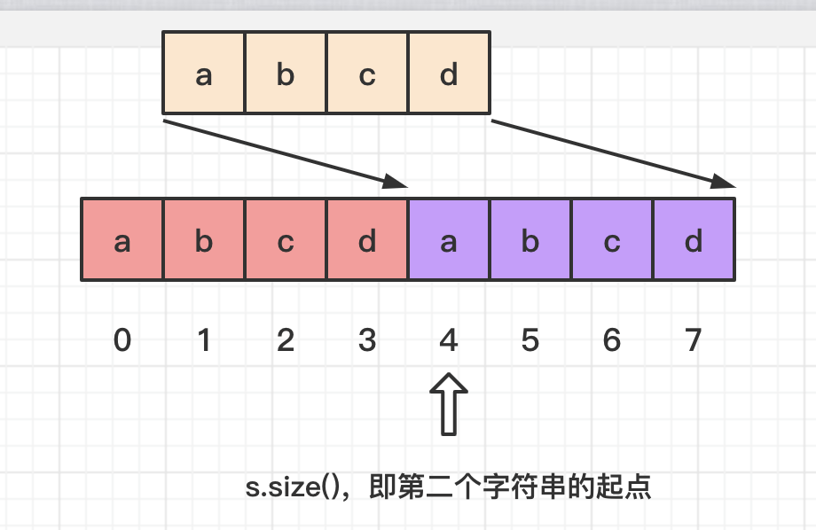

- [459. 重复的子字符串](#459-重复的子字符串)
  - [官方题解](#官方题解)
    - [方法一：枚举](#方法一枚举)
    - [方法二：字符串匹配](#方法二字符串匹配)
    - [方法三：KMP 算法](#方法三kmp-算法)
    - [正确性证明](#正确性证明)
    - [方法四：优化的 KMP 算法](#方法四优化的-kmp-算法)
  - [其它题解1](#其它题解1)


------------------------------

# 459. 重复的子字符串

给定一个非空的字符串，判断它是否可以由它的一个子串重复多次构成。给定的字符串只含有小写英文字母，并且长度不超过 10000。

示例 1:

```
输入: "abab"

输出: True

解释: 可由子字符串 "ab" 重复两次构成。
```

示例 2:

```
输入: "aba"

输出: False
```

示例 3:

```
输入: "abcabcabcabc"

输出: True

解释: 可由子字符串 "abc" 重复四次构成。 (或者子字符串 "abcabc" 重复两次构成。)
```

- 来源：力扣（LeetCode）
- 链接：https://leetcode-cn.com/problems/repeated-substring-pattern
- 著作权归领扣网络所有。商业转载请联系官方授权，非商业转载请注明出处。


## 官方题解

> 链接：https://leetcode-cn.com/problems/repeated-substring-pattern/solution/zhong-fu-de-zi-zi-fu-chuan-by-leetcode-solution/

### 方法一：枚举

**思路与算法**

如果一个长度为 $n$ 的字符串 $s$ 可以由它的一个长度为 $n'$ 的子串 $s'$ 重复多次构成，那么： 

- $n$ 一定是 $n'$ 的倍数；
- $s'$ 一定是 $s$ 的前缀；
- 对于任意的 $i \in [n', n)$，有 $s[i] = s[i-n']$。

也就是说，$s$ 中长度为 $n'$ 的前缀就是 $s'$ ，并且在这之后的每一个位置上的字符 $s[i]$，都需要与它之前的第 $n'$ 个字符 $s[i-n']$ 相同。

因此，我们可以从小到大枚举 $n'$ ，并对字符串 $s$ 进行遍历，进行上述的判断。注意到一个小优化是，因为子串至少需要重复一次，所以 $n'$ 不会大于 $n$ 的一半，我们只需要在 $[1, \frac{n}{2}]$ 的范围内枚举 $n'$ 即可。

```go
func repeatedSubstringPattern(s string) bool {
    n := len(s)
    for i := 1; i * 2 <= n; i++ { // i 表示子串的长度。
        if n % i == 0 {
            match := true
            // 每个位置都和相隔 i 的位置的字符相同。
            for j := i; j < n; j++ {
                if s[j] != s[j - i] {
                    match = false
                    break
                }
            }
            if match {
                return true
            }
        }
    }
    return false
}
```

**复杂度分析**

- 时间复杂度：$O(n^2)$，其中 $n$ 是字符串 $s$ 的长度。枚举 $i$ 的时间复杂度为 $O(n)$，遍历 $s$ 的时间复杂度为 $O(n)$，相乘即为总时间复杂度。
- 空间复杂度：$O(1)$。

### 方法二：字符串匹配

**思路与算法**

我们可以把字符串 $s$ 写成

$$
s's' \cdots s's'
$$

的形式，总计 $\frac{n}{n'}$ 个 $s'$。但我们如何在**不枚举 $n'$ 的情况下**，判断 $s$ 是否能写成上述的形式呢？

如果我们移除字符串 $s$ 的前 $n'$ 个字符（即一个完整的 $s'$），**再将这些字符保持顺序添加到剩余字符串的末尾，那么得到的字符串仍然是 $s$**。由于 $1 \leq n' < n$，那么如果将两个 $s$ 连在一起，并**移除第一个和最后一个字符**，那么得到的字符串一定包含 $s$，即 $s$ 是它的一个子串。

因此我们可以考虑这种方法：我们将两个 $s$ 连在一起，并移除第一个和最后一个字符。如果 $s$ 是该字符串的子串，那么 $s$ 就满足题目要求。

注意到我们证明的是如果 $s$ 满足题目要求，那么 $s$ 有这样的性质，而我们使用的方法却是如果 $s$ 有这样的性质，那么 $s$ 满足题目要求。因此，只证明了充分性是远远不够的，我们还需要证明必要性。

> 题解区的很多题解都忽略了这一点，但它是非常重要的。

证明需要使用一些同余运算的小技巧，可以见方法三之后的「正确性证明」部分。这里先假设我们已经完成了证明，这样就可以使用非常简短的代码完成本题。在下面的代码中，我们可以从位置 1 开始查询，并希望查询结果不为位置 n，这与移除字符串的第一个和最后一个字符是等价的。

```java
class Solution {
    public boolean repeatedSubstringPattern(String s) {
        return (s + s).indexOf(s, 1) != s.length();
    }
}
```

**复杂度分析**

由于我们使用了语言自带的字符串查找函数，因此这里不深入分析其时空复杂度。

### 方法三：KMP 算法

**思路与算法**

在方法二中，我们使用了语言自带的字符串查找函数。同样我们也可以自己实现这个函数，例如使用比较经典的 KMP 算法。

读者需要注意以下几点：

- KMP 算法虽然有着良好的理论时间复杂度上限，但大部分语言自带的字符串查找函数并不是用 KMP 算法实现的。这是因为在实现 API 时，我们需要在平均时间复杂度和最坏时间复杂度二者之间权衡。普通的暴力匹配算法以及优化的 BM 算法拥有比 KMP 算法更为优秀的平均时间复杂度；
- 学习 KMP 算法时，一定要理解其本质。如果放弃阅读晦涩难懂的材料（即使大部分讲解 KMP 算法的材料都包含大量的图，但图毕竟只能描述特殊而非一般情况）而是直接去阅读代码，是永远无法学会 KMP 算法的。读者甚至无法理解 KMP 算法关键代码中的任意一行。

由于本题就是在一个字符串中查询另一个字符串是否出现，可以直接套用 KMP 算法。因此这里对 KMP 算法本身不再赘述。读者可以自行查阅资料进行学习。这里留了三个思考题，读者可以在学习完毕后尝试回答这三个问题，检验自己的学习成果：

- 设查询串的的长度为 n，模式串的长度为 m，我们需要判断模式串是否为查询串的子串。那么使用 KMP 算法处理该问题时的时间复杂度是多少？在分析时间复杂度时使用了哪一种分析方法？
- 如果有多个查询串，平均长度为 n，数量为 k，那么总时间复杂度是多少？
- 在 KMP 算法中，对于模式串，我们需要预处理出一个 fail 数组（有时也称为 next 数组、π 数组等）。这个数组到底表示了什么？

```go
func repeatedSubstringPattern(s string) bool {
    return kmp(s + s, s)
}

func kmp(query, pattern string) bool {
    n, m := len(query), len(pattern)
    fail := make([]int, m)
    for i := 0; i < m; i++ {
        fail[i] = -1
    }
    for i := 1; i < m; i++ {
        j := fail[i - 1]
        for j != -1 && pattern[j + 1] != pattern[i] {
            j = fail[j]
        }
        if pattern[j + 1] == pattern[i] {
            fail[i] = j + 1
        }
    }
    match := -1
    for i := 1; i < n - 1; i++ {
        for match != -1 && pattern[match + 1] != query[i] {
            match = fail[match]
        }
        if pattern[match + 1] == query[i] {
            match++
            if match == m - 1 {
                return true
            }
        }
    }
    return false
}
```

**复杂度分析**

- 时间复杂度：$O(n)$，其中 n 是字符串 s 的长度。
- 空间复杂度：$O(n)$。


### 正确性证明

> 这个证明完全没看懂。

一方面，如果长度为 $n$ 的字符串 $s$ 是字符串 $t=s+s$ 的子串，并且 $s$ 在 $t$ 中的起始位置不为 $0$ 或 $n$，那么 $s$ 就满足题目的要求。证明过程如下：

我们设 $s$ 在 $t$ 中的起始位置为 $i，i \in (0, n)$。也就是说，$t$ 中从位置 $i$ 开始的 $n$ 个连续的字符，恰好就是字符串 $s$。那么我们有：

$$
s[0:n-1] = t[i:n+i-1]
$$

由于 $t$ 是由两个 $s$ 拼接而成的，我们可以将 $t[i:n+i-1]$ 分成位置 $n-1$ 左侧和右侧两部分：

$$
\left \{ \begin{aligned} s[0:n-i-1] &= t[i:n-1] \\ s[n-i:n-1] &= t[n:n+i-1] = t[0:i-1] \end{aligned} \right.
$$

每一部分都可以对应回 $s$：

$$
\left \{ \begin{aligned} s[0:n-i-1] &= s[i:n-1] \\ s[n-i:n-1] &= s[0:i-1] \end{aligned} \right.
$$

这说明，$s$ 是一个「可旋转」的字符串：将 $s$ 的前 $i$ 个字符保持顺序，移动到 $s$ 的末尾，得到的新字符串与 $s$ 相同。也就是说，在模 $n$ 的意义下，

$$
s[j] = s[j+i]
$$

对于任意的 $j$ 恒成立。

> 「在模 $n$ 的意义下」可以理解为，所有的加法运算的结果都需要对 $n$ 取模，使得结果保持在 $[0, n)$ 中，这样加法就自带了「旋转」的效果。

如果我们不断地连写这个等式：

$$
s[j] = s[j+i] = s[j+2i] = s[j+3i] = \cdots
$$

那么所有满足 $j_0 = j + k \cdot i$ 的位置 $j_0$ 都有 $s[j] = s[j_0]$，$j$ 和 $j_0$ 在模 $i$ 的意义下等价。由于我们已经在模 $n$ 的意义下讨论这个问题，因此 $j$ 和 $j_0$ 在模 $\mathrm{gcd}(n, i)$ 的意义下等价，其中 $\mathrm{gcd}$ 表示最大公约数。也就是说，字符串 $s$ 中的两个位置如果在模 $\mathrm{gcd}(n, i)$ 的意义下等价，那么它们对应的字符必然是相同的。

由于 $\mathrm{gcd}(n, i)$ 一定是 $n$ 的约数，那么字符串 $s$ 一定可以由其长度为 $\mathrm{gcd}(n, i)$ 的前缀重复 $\frac{n}{\mathrm{gcd}(n, i)}$ 次构成。

另一方面，如果 $s$ 满足题目的要求，那么 $s$ 包含若干个「部分」，$t=s+s$ 包含两倍数量的「部分」，因此 $s$ 显然是 $t$ 的子串，并且起始位置可以不为 $0$ 或 $n$：我们只需要选择 $t$ 中第一个「部分」的起始位置即可。

综上所述，我们证明了：长度为 $n$ 的字符串 $s$ 是字符串 $t=s+s$ 的子串，并且 $s$ 在 $t$ 中的起始位置不为 $0$ 或 $n$，当且仅当 $s$ 满足题目的要求。因此，

**思考题答案**

- 设查询串的的长度为 $n$，模式串的长度为 $m$，我们需要判断模式串是否为查询串的子串。那么使用 KMP 算法处理该问题时的时间复杂度是多少？在分析时间复杂度时使用了哪一种分析方法？
    - 时间复杂度为 $O(n+m)$，用到了均摊分析（摊还分析）的方法。
    - 具体地，无论在预处理过程还是查询过程中，虽然匹配失败时，指针会不断地根据 fail 数组向左回退，看似时间复杂度会很高。但考虑匹配成功时，指针会向右移动一个位置，这一部分对应的时间复杂度为 $O(n+m)$。又因为向左移动的次数不会超过向右移动的次数，因此总时间复杂度仍然为 $O(n+m)$。
- 如果有多个查询串，平均长度为 $n$，数量为 $k$，那么总时间复杂度是多少？
    - 时间复杂度为 $O(nk+m)$。模式串只需要预处理一次。
- 在 KMP 算法中，对于模式串，我们需要预处理出一个 fail 数组（有时也称为 next 数组、π 数组等）。这个数组到底表示了什么？
    - `fail[i]` 等于满足下述要求的 x 的最大值：`s[0:i]` 具有长度为 x+1 的完全相同的前缀和后缀。这也是 KMP 算法最重要的一部分。


### 方法四：优化的 KMP 算法

**思路与算法**

如果读者能够看懂「正确性证明」和「思考题答案」这两部分，那么一定已经发现了方法三中的 KMP 算法有可以优化的地方。即：

- 在「正确性证明」部分，如果我们设 $i$ 为最小的起始位置，那么一定有 $\mathrm{gcd}(n, i) = i$，即 $n$ 是 $i$ 的倍数。这说明字符串 $s$ 是由长度为 $i$ 的前缀重复 $\frac{n}{i}$ 次构成；
- 由于 $\textit{fail}[n-1]$ 表示 $s$ 具有长度为 $\textit{fail}[n-1]+1$ 的完全相同的（且最长的）前缀和后缀。那么对于满足题目要求的字符串，一定有 $\textit{fail}[n-1] = n-i-1$，即 $i = n - \textit{fail}[n-1] - 1$；
- 对于不满足题目要求的字符串，$n$ 一定不是 $n - \textit{fail}[n-1] - 1$ 的倍数。

> 上述所有的结论都可以很容易地使用反证法证出。

因此，我们在预处理出 $\textit{fail}$ 数组后，只需要判断 $n$ 是否为 $n - \textit{fail}[n-1] - 1$ 的倍数即可。

```go
func repeatedSubstringPattern(s string) bool {
    return kmp(s)
}

func kmp(pattern string) bool {
    n := len(pattern)
    fail := make([]int, n)
    for i := 0; i < n; i++ {
        fail[i] = -1
    }
    for i := 1; i < n; i++ {
        j := fail[i - 1]
        for (j != -1 && pattern[j + 1] != pattern[i]) {
            j = fail[j]
        }
        if pattern[j + 1] == pattern[i] {
            fail[i] = j + 1
        }
    }
    return fail[n - 1] != -1 && n % (n - fail[n - 1] - 1) == 0
}
```

**复杂度分析**

- 时间复杂度：$O(n)$，其中 $n$ 是字符串 $s$ 的长度。
- 空间复杂度：$O(n)$。


## 其它题解1

> https://leetcode-cn.com/problems/repeated-substring-pattern/solution/tu-jie-yi-xia-shuang-bei-zi-fu-chuan-de-jie-fa-by-/

图解双倍字符串的解法

如果 s 中没有循环节，那么 ss 中必然有且只有两个 s，此时从 `ss[1]` 处开始寻找 s ，必然只能找到第二个，所以此时返回值为 s.size()。



当 s 中有循环节时，设循环节为 r，其长度为 l，那么 ss 中必然有 `s.size()/l + 1` 个 s。
因为去掉了第一个 S 的第一个字符 (代码中，`(s+s).find(s, 1)`， 是从 `ss[1]` 处开始 find )
所以此时必回找到第二个 s 的起点。


