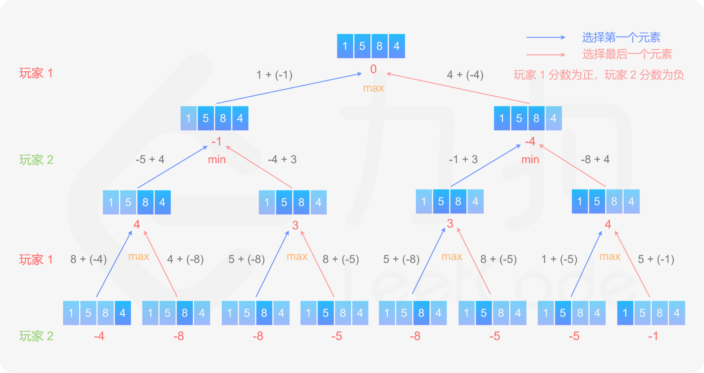
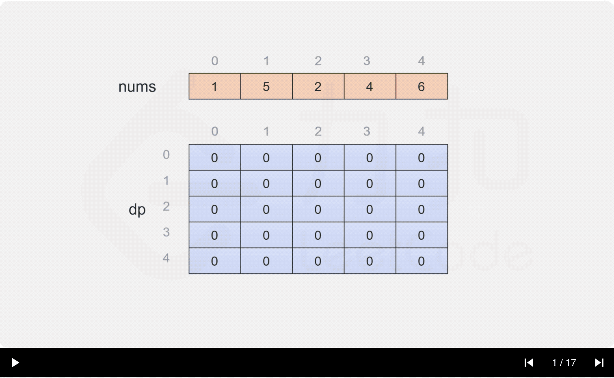

- [486. 预测赢家](#486-预测赢家)
  - [官方题解](#官方题解)
    - [方法一：递归](#方法一递归)
    - [方法二：动态规划](#方法二动态规划)

------------------------------

# 486. 预测赢家

给定一个表示分数的非负整数数组。 玩家 1 从数组**任意一端**拿取一个分数，随后玩家 2 继续从剩余数组任意一端拿取分数，然后玩家 1 拿，…… 。每次一个玩家只能拿取一个分数，分数被拿取之后不再可取。直到没有剩余分数可取时游戏结束。最终获得分数总和最多的玩家获胜。

给定一个表示分数的数组，预测玩家1是否会成为赢家。你可以假设每个玩家的玩法都会使他的分数最大化。
 

示例 1：

```
输入：[1, 5, 2]
输出：False
解释：一开始，玩家1可以从1和2中进行选择。
如果他选择 2（或者 1 ），那么玩家 2 可以从 1（或者 2 ）和 5 中进行选择。如果玩家 2 选择了 5 ，那么玩家 1 则只剩下 1（或者 2 ）可选。
所以，玩家 1 的最终分数为 1 + 2 = 3，而玩家 2 为 5 。
因此，玩家 1 永远不会成为赢家，返回 False 。
```

示例 2：

```
输入：[1, 5, 233, 7]
输出：True
解释：玩家 1 一开始选择 1 。然后玩家 2 必须从 5 和 7 中进行选择。无论玩家 2 选择了哪个，玩家 1 都可以选择 233 。
     最终，玩家 1（234 分）比玩家 2（12 分）获得更多的分数，所以返回 True，表示玩家 1 可以成为赢家。
```
 

提示：

- 1 <= 给定的数组长度 <= 20.
- 数组里所有分数都为非负数且不会大于 10000000 。
- 如果最终两个玩家的分数相等，那么玩家 1 仍为赢家。

--------------------

- 来源：力扣（LeetCode）
- 链接：https://leetcode-cn.com/problems/predict-the-winner
- 著作权归领扣网络所有。商业转载请联系官方授权，非商业转载请注明出处。

> 印象中记得做过这样的题，但是思路想不起来了。

## 官方题解

> 链接：https://leetcode-cn.com/problems/predict-the-winner/solution/yu-ce-ying-jia-by-leetcode-solution/

### 方法一：递归

为了判断哪个玩家可以获胜，需要计算一个总分，为先手得分与后手得分之差。当数组中的所有数字都被拿取时，如果总分大于或等于 0，则先手获胜，反之则后手获胜。

由于每次只能从数组的任意一端拿取数字，因此可以保证数组中剩下的部分一定是连续的。假设数组当前剩下的部分为下标 start 到下标 end，其中 `0 ≤ start ≤ end < nums.length`。如果 `start=end`，则只剩一个数字，当前玩家只能拿取这个数字。如果 `start<end`，则当前玩家可以选择 `nums[start]` 或 `nums[end]`，然后轮到另一个玩家在数组剩下的部分选取数字。这是一个递归的过程。

计算总分时，需要记录当前玩家是先手还是后手，判断当前玩家的得分应该记为正还是负。当数组中剩下的数字多于 1 个时，当前玩家会选择最优的方案，使得自己的分数最大化，因此对两种方案分别计算当前玩家可以得到的分数，其中的最大值为当前玩家最多可以得到的分数。



```go
func PredictTheWinner(nums []int) bool {
    return total(nums, 0, len(nums) - 1, 1) >= 0
}

func total(nums []int, start, end int, turn int) int {
    if start == end {
        return nums[start] * turn
    }
    scoreStart := nums[start] * turn + total(nums, start + 1, end, -turn)
    scoreEnd := nums[end] * turn + total(nums, start, end - 1, -turn)
    return max(scoreStart * turn, scoreEnd * turn) * turn
}

func max(x, y int) int {
    if x > y {
        return x
    }
    return y
}
```

**复杂度分析**

- 时间复杂度：$O(2^n)$，其中 n 是数组的长度。
- 空间复杂度：$O(n)$，其中 n 是数组的长度。空间复杂度取决于递归使用的栈空间。


### 方法二：动态规划

方法一使用递归，存在大量重复计算，因此时间复杂度很高。由于存在重复子问题，因此可以使用动态规划降低时间复杂度。

定义二维数组 `dp`，其行数和列数都等于数组的长度，`dp[i][j]` 表示当数组剩下的部分为下标 `i` 到下标 `j` 时，当前玩家与另一个玩家的分数之差的最大值，注意当前玩家不一定是先手。

只有当 `i <= j` 时，数组剩下的部分才有意义，因此当 `i > j` 时，`dp[i][j] = 0`。

当 `i = j` 时，只剩一个数字，当前玩家只能拿取这个数字，因此对于所有 `0 <= i < nums.length`，都有 `dp[i][i] = nums[i]`。

当 `i < j` 时，当前玩家可以选择 `nums[i]` 或 `nums[j]`，然后轮到另一个玩家在数组剩下的部分选取数字。在两种方案中，当前玩家会选择最优的方案，使得自己的分数最大化。因此可以得到如下状态转移方程：

$$
\textit{dp}[i][j]=\max(\textit{nums}[i] - \textit{dp}[i + 1][j], \textit{nums}[j] - \textit{dp}[i][j - 1])
$$

最后判断 `dp[0][nums.length−1]` 的值，如果大于或等于 0，则先手得分大于或等于后手得分，因此先手成为赢家，否则后手成为赢家。



```go
func PredictTheWinner(nums []int) bool {
    length := len(nums)
    dp := make([][]int, length)
    for i := 0; i < length; i++ {
        dp[i] = make([]int, length)
        dp[i][i] = nums[i]
    }
    for i := length - 2; i >= 0; i-- {
        for j := i + 1; j < length; j++ {
            dp[i][j] = max(nums[i] - dp[i + 1][j], nums[j] - dp[i][j - 1])
        }
    }
    return dp[0][length - 1] >= 0
}

func max(x, y int) int {
    if x > y {
        return x
    }
    return y
}
```

上述代码中使用了二维数组 `dp`。分析状态转移方程可以看到，`dp[i][j]` 的值只和 `dp[i+1][j]` 与 `dp[i][j−1]` 有关，即在计算 `dp` 的第 `i` 行的值时，只需要使用到 `dp` 的第 `i` 行和第 `i+1` 行的值，因此可以使用一维数组代替二维数组，对空间进行优化。

```go
func PredictTheWinner(nums []int) bool {
    length := len(nums)
    dp := make([]int, length)
    for i := 0; i < length; i++ {
        dp[i] = nums[i]
    }
    for i := length - 2; i >= 0; i-- {
        for j := i + 1; j < length; j++ {
            dp[j] = max(nums[i] - dp[j], nums[j] - dp[j - 1])
        }
    }
    return dp[length - 1] >= 0
}

func max(x, y int) int {
    if x > y {
        return x
    }
    return y
}
```

**复杂度分析**

- 时间复杂度：$O(n^2)$，其中 n 是数组的长度。需要计算每个子数组对应的 dp 的值，共有 $\frac{n(n+1)}{2}$ 个子数组。 
- 空间复杂度：$O(n)$，其中 n 是数组的长度。空间复杂度取决于额外创建的数组 dp，如果不优化空间，则空间复杂度是 $O(n^2)$，使用一维数组优化之后空间复杂度可以降至 $O(n)$。 

**拓展练习**

读者在做完这道题之后，可以做另一道类似的题：「[877. 石子游戏](https://leetcode-cn.com/problems/stone-game/)」。和这道题相比，第 877 题增加了两个限制条件：

- 数组的长度是偶数；
- 数组的元素之和是奇数，所以没有平局。

对于第 877 题，除了使用这道题的解法以外，能否利用上述两个限制条件进行求解？
