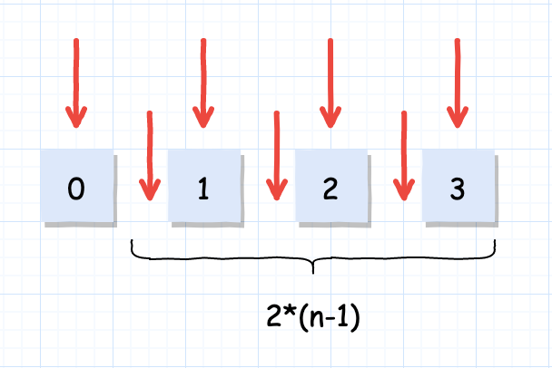

- [647. 回文子串](#647-回文子串)
  - [官方题解](#官方题解)
    - [方法一：中心拓展](#方法一中心拓展)
    - [方法二：Manacher 算法](#方法二manacher-算法)

------------------------------

# 647. 回文子串

给定一个字符串，你的任务是计算这个字符串中有多少个回文子串。

具有不同开始位置或结束位置的子串，即使是由相同的字符组成，也会被视作不同的子串。
 

示例 1：

```
输入："abc"
输出：3
解释：三个回文子串: "a", "b", "c"
```

示例 2：

```
输入："aaa"
输出：6
解释：6个回文子串: "a", "a", "a", "aa", "aa", "aaa"
```

- 来源：力扣（LeetCode）
- 链接：https://leetcode-cn.com/problems/palindromic-substrings
- 著作权归领扣网络所有。商业转载请联系官方授权，非商业转载请注明出处。

## 官方题解

> 链接：https://leetcode-cn.com/problems/palindromic-substrings/solution/hui-wen-zi-chuan-by-leetcode-solution/

### 方法一：中心拓展

**思路与算法**

计算有多少个回文子串的最朴素方法就是枚举出所有的回文子串，而枚举出所有的回文字串又有两种思路，分别是：

- 枚举出所有的子串，然后再判断这些子串是否是回文；
- 枚举每一个可能的**回文中心**，然后用两个指针分别向左右两边拓展，当两个指针指向的元素相同的时候就拓展，否则停止拓展。

假设字符串的长度为 n。我们可以看出前者会用 $O(n^2)$ 的时间枚举出所有的子串 $s[l_i \cdots r_i]$，然后再用 $O(r_i - l_i + 1)$ 的时间检测当前的子串是否是回文，整个算法的时间复杂度是 $O(n^3)$。而后者枚举回文中心的是 $O(n)$ 的，对于每个回文中心拓展的次数也是 $O(n)$ 的，所以时间复杂度是 $O(n^2)$。所以我们选择第二种方法来枚举所有的回文子串。

在实现的时候，我们需要处理一个问题，即如何**有序地枚举所有可能的回文中心**，我们需要考虑回文长度是奇数和回文长度是偶数的两种情况。如果回文长度是奇数，那么回文中心是一个字符；如果回文长度是偶数，那么中心是两个字符。当然你可以做两次循环来分别枚举奇数长度和偶数长度的回文，但是我们也可以用一个循环搞定。我们不妨写一组出来观察观察，假设 n = 4，我们可以把可能的回文中心列出来：


| 编号 $i$ | 回文中心左起始位置 $l_i$ | 回文中心右起始位置 $r_i$ |
| :------- | :----------------------- | :----------------------- |
| 0        | 0                        | 0                        |
| 1        | 0                        | 1                        |
| 2        | 1                        | 1                        |
| 3        | 1                        | 2                        |
| 4        | 2                        | 2                        |
| 5        | 2                        | 3                        |
| 6        | 3                        | 3                        |

由此我们可以看出长度为 n 的字符串会生成 $2n-1$ 组回文中心 $[l_i, r_i]$，其中 $l_i = \lfloor \frac{i}{2} \rfloor$，$r_i = l_i + (i \bmod 2)$。这样我们只要从 $0$ 到 $2n - 2$ 遍历 $i$，就可以得到所有可能的回文中心，这样就把奇数长度和偶数长度两种情况统一起来了。

画个图来解释下为什么是 $2n-1$:



```go
func countSubstrings(s string) int {
    n := len(s)
    ans := 0
    for i := 0; i < 2 * n - 1; i++ {
        l, r := i / 2, i / 2 + i % 2
        for l >= 0 && r < n && s[l] == s[r] {
            l--
            r++
            ans++
        }
    }
    return ans
}
```

**复杂度分析**

- 时间复杂度：$O(n^2)$。
- 空间复杂度：$O(1)$。


### 方法二：Manacher 算法

**思路与算法**

Manacher 算法是在线性时间内求解最长回文子串的算法。在本题中，我们要求解回文串的个数，为什么也能使用 Manacher 算法呢？这里我们就需要理解一下 Manacher 的基本原理。

Manacher 算法也会面临「方法一」中的奇数长度和偶数长度的问题，它的处理方式是在所有的相邻字符中间插入 `#`，比如 `abaa` 会被处理成 `#a#b#a#a#`，这样可以保证所有找到的回文串都是奇数长度的，以任意一个字符为回文中心，既可以包含原来的奇数长度的情况，也可以包含原来偶数长度的情况。假设原字符串为 S，经过这个处理之后的字符串为 s。

我们用 $f(i)$  来表示以 $s$  的第 $i$  位为回文中心，可以拓展出的最大回文半径，那么 $f(i) - 1$  就是以 $i$  为中心的最大回文串长度 （想一想为什么）。

Manacher 算法依旧需要枚举 $s$  的每一个位置并先假设它是回文中心，但是它会利用已经计算出来的状态来更新 $f(i)$ ，而不是向「中心拓展」一样盲目地拓展。具体地说，假设我们已经计算好了 $[1, i - 1]$  区间内所有点的 $f$ （即我们知道 $[1, i - 1]$  这些点作为回文中心时候的最大半径）， 那么我们也就知道了 $[1, i - 1]$  拓展出的回文达到最大半径时的回文右端点。例如 $i = 4$ 的时候 $f(i) = 5$，说明以第 4 个元素为回文中心，最大能拓展到的回文半径是 5，此时右端点为 $4 + 5 - 1 = 8$。所以当我们知道一个 $i$  对应的 $f(i)$  的时候，我们就可以很容易得到它的右端点为 $i + f(i) - 1$。

Manacher 算法如何通过已经计算出的状态来更新 $f(i)$  呢？Manacher 算法要求我们维护「当前最大的回文的右端点 $r_m$」以及这个回文右端点对应的回文中心 $i_m$。我们需要顺序遍历 $s$ ，假设当前遍历的下标为 $i$ 。我们知道在求解 $f(i)$ 之前我们应当已经得到了从 $[1, i - 1]$  所有的 $f$ ，并且当前已经有了一个最大回文右端点 $r_m$ 以及它对应的回文中心 $i_m$。

- 初始化 $f(i)$ 
    - 如果 $i \leq r_m$，说明 $i$  被包含在当前最大回文子串内，假设 $j$  是 $i$  关于这个最大回文的回文中心 $i_m$ 的对称位置（即 $j + i = 2 \times i_m$），我们可以得到 $f(i)$ 至少等于 $\min\{f(j), r_m - i + 1\}$。这里将 $f(j)$ 和 $r_m - i + 1$ 取小，是先要保证这个回文串在当前最大回文串内。（思考：为什么 $f(j)$ 有可能大于 $r_m - i + 1$？） 
    - 如果 $i > r_m$，那就先初始化 $f(i) = 1$。
- 中心拓展
    - 做完初始化之后，我们可以保证此时的 $s[i + f(i) - 1] = s[i - f(i) + 1]$，要继续拓展这个区间，我们就要继续判断 $s[i + f(i)]$ 和 $s[i - f(i)]$ 是否相等，如果相等将 $f(i)$ 自增；这样循环直到 $s[i + f(i)] \neq s[i - f(i)]$，以此类推。我们可以看出循环每次结束时都能保证 $s[i + f(i) - 1] = s[i - f(i) + 1]$，而循环继续（即可拓展的条件）一定是 $s[i + f(i)] = s[i - f(i)]$。 这个时候我们需要注意的是不能让下标越界，有一个很简单的办法，就是在开头加一个 `$`，并在结尾加一个 `!`，这样开头和结尾的两个字符一定不相等，循环就可以在这里终止。

这样我们可以得到 $s$  所有点为中心的最大回文半径，也就能够得到 $S$ 中所有可能的回文中心的的最大回文半径，把它们累加就可以得到答案。

> 为什么累加就可以得到答案？
> 半径是多少就是多少个回文子串。而 f(i) 和 f(j) 的子串不会重叠，因为中心点不一样。

```go
func countSubstrings(s string) int {
    n := len(s)
    t := "$#"
    for i := 0; i < n; i++ {
        t += string(s[i]) + "#"
    }
    n = len(t)
    t += "!"

    f := make([]int, n)
    iMax, rMax, ans := 0, 0, 0
    for i := 1; i < n; i++ {
        // 初始化 f[i]
        if i <= rMax {
            f[i] = min(rMax - i + 1, f[2 * iMax - i])
        } else {
            f[i] = 1
        }
        // 中心拓展
        for t[i + f[i]] == t[i - f[i]] {
            f[i]++
        }
        // 动态维护 iMax 和 rMax
        if i + f[i] - 1 > rMax {
            iMax = i
            rMax = i + f[i] - 1
        }
        // 统计答案, 当前贡献为 (f[i] - 1) / 2 上取整
        ans += f[i] / 2
    }
    return ans
}

func min(x, y int) int {
    if x < y {
        return x
    }
    return y
}
```

**复杂度分析**

- 时间复杂度：$O(n)$。即 Manacher 算法的时间复杂度，由于最大回文右端点 $r_m$ 只会增加而不会减少，故中心拓展进行的次数最多为 $O(n)$，此外我们只会遍历字符串一次，故总复杂度为 $O(n)$。
- 空间复杂度：$O(n)$。
