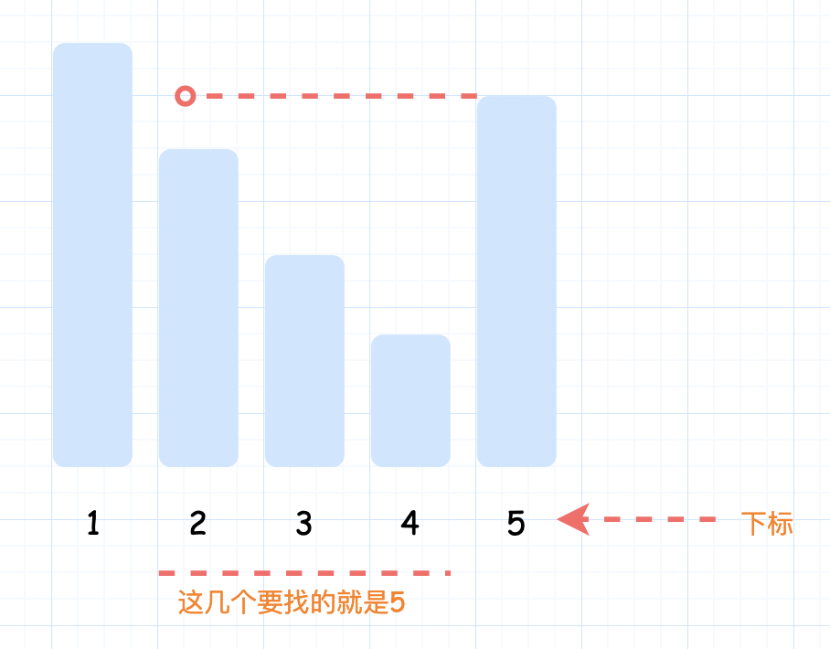

- [每日温度](#每日温度)
  - [题目](#题目)
  - [题解](#题解)
    - [单调栈](#单调栈)

------------------------------

# 每日温度

## 题目

根据每日 气温 列表，请重新生成一个列表，对应位置的输出是需要再等待多久温度才会升高超过该日的天数。如果之后都不会升高，请在该位置用 0 来代替。

例如，给定一个列表 `temperatures = [73, 74, 75, 71, 69, 72, 76, 73]`，你的输出应该是 `[1, 1, 4, 2, 1, 1, 0, 0]`。

提示：气温 列表长度的范围是 `[1, 30000]`。每个气温的值的均为华氏度，都是在 `[30, 100]` 范围内的整数。

- 来源：力扣（LeetCode）
- 链接：https://leetcode-cn.com/problems/daily-temperatures
- 著作权归领扣网络所有。商业转载请联系官方授权，非商业转载请注明出处。

## 题解

### 单调栈

可以维护一个存储下标的单调栈，从栈底到栈顶的下标对应的温度列表中的温度依次递减。如果一个下标在单调栈里，则表示尚未找到下一次温度更高的下标。

正向遍历温度列表。对于温度列表中的每个元素 `T[i]`，如果栈为空，则直接将 `i` 进栈，如果栈不为空，则比较栈顶元素 `prevIndex` 对应的温度 `T[prevIndex]` 和当前温度 `T[i]`，如果 `T[i] > T[prevIndex]`，则将 `prevIndex` 移除，并将 `prevIndex` 对应的等待天数赋为 `i - prevIndex`，重复上述操作直到栈为空或者栈顶元素对应的温度小于等于当前温度，然后将 `i` 进栈。

```go
func dailyTemperatures(T []int) []int {
    length := len(T)
    ans := make([]int, length)
    stack := []int{}
    for i := 0; i < length; i++ {
        temperature := T[i]
        for len(stack) > 0 && temperature > T[stack[len(stack)-1]] {
            prevIndex := stack[len(stack)-1]
            stack = stack[:len(stack)-1]
            ans[prevIndex] = i - prevIndex
        }
        stack = append(stack, i)
    }
    return ans
}
```

复杂度分析

- 时间复杂度：$O(n)$，其中 n 是温度列表的长度。正向遍历温度列表一遍，对于温度列表中的每个下标，最多有一次进栈和出栈的操作。
- 空间复杂度：$O(n)$，其中 n 是温度列表的长度。需要维护一个单调栈存储温度列表中的下标。

