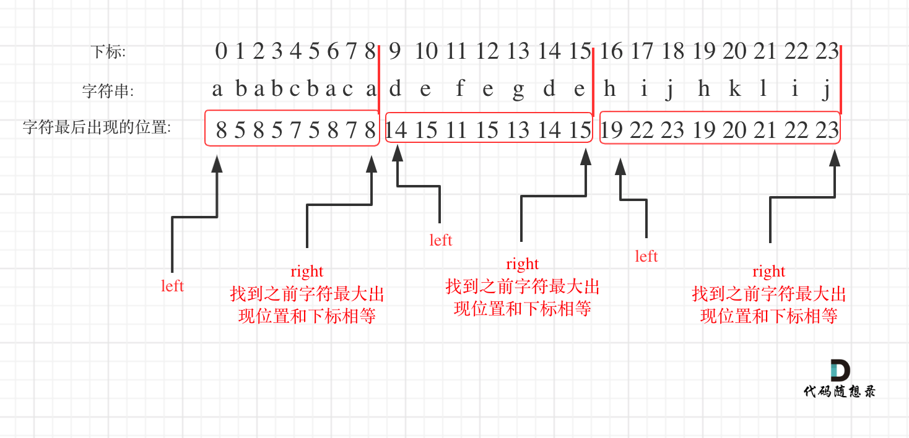

- [763. 划分字母区间](#763-划分字母区间)
  - [官方题解](#官方题解)
    - [方法一：贪心算法 + 双指针](#方法一贪心算法--双指针)

------------------------------

# 763. 划分字母区间

字符串 S 由小写字母组成。我们要把这个字符串划分为尽可能多的片段，同一个字母只会出现在其中的一个片段。返回一个表示每个字符串片段的长度的列表。
 

示例 1：

```
输入：S = "ababcbacadefegdehijhklij"
输出：[9,7,8]
解释：
划分结果为 "ababcbaca", "defegde", "hijhklij"。
每个字母最多出现在一个片段中。
像 "ababcbacadefegde", "hijhklij" 的划分是错误的，因为划分的片段数较少。
```
 

提示：

- S的长度在[1, 500]之间。
- S只包含小写字母 'a' 到 'z' 。

--------------------

- 来源：力扣（LeetCode）
- 链接：https://leetcode-cn.com/problems/partition-labels
- 著作权归领扣网络所有。商业转载请联系官方授权，非商业转载请注明出处。

## 官方题解

> 链接：https://leetcode-cn.com/problems/partition-labels/solution/hua-fen-zi-mu-qu-jian-by-leetcode-solution/

### 方法一：贪心算法 + 双指针

由于同一个字母只能出现在同一个片段，显然同一个字母的第一次出现的下标位置和最后一次出现的下标位置必须出现在同一个片段。因此需要遍历字符串，得到每个字母最后一次出现的下标位置。

在得到每个字母最后一次出现的下标位置之后，可以使用贪心算法和双指针的方法将字符串划分为尽可能多的片段，具体做法如下。

- 从左到右遍历字符串，遍历的同时维护当前片段的开始下标 `start` 和结束下标 `end`，初始时 `start=end=0`。
- 对于每个访问到的字母 c，得到当前字母的最后一次出现的下标位置 $\textit{end}_c$，则当前片段的结束下标一定不会小于 $\textit{end}_c$，因此令 $\textit{end}=\max(\textit{end},\textit{end}_c)$。
- 当访问到下标 `end` 时，当前片段访问结束，当前片段的下标范围是 `[start,end]`，长度为 `end−start+1`，将当前片段的长度添加到返回值，然后令 `start=end+1`，继续寻找下一个片段。
- 重复上述过程，直到遍历完字符串。

上述做法使用贪心的思想寻找每个片段可能的最小结束下标，因此可以保证每个片段的长度一定是符合要求的最短长度，如果取更短的片段，则一定会出现同一个字母出现在多个片段中的情况。由于每次取的片段都是符合要求的最短的片段，因此得到的片段数也是最多的。

由于每个片段访问结束的标志是访问到下标 `end`，因此对于每个片段，可以保证当前片段中的每个字母都一定在当前片段中，不可能出现在其他片段，可以保证同一个字母只会出现在同一个片段。

```go
func partitionLabels(s string) (partition []int) {
    lastPos := [26]int{}
    for i, c := range s {
        lastPos[c-'a'] = i
    }
    start, end := 0, 0
    for i, c := range s {
        if lastPos[c-'a'] > end {
            end = lastPos[c-'a']
        }
        if i == end {
            partition = append(partition, end-start+1)
            start = end + 1
        }
    }
    return
}
```

复杂度分析

- 时间复杂度：$O(n)$，其中 n 是字符串的长度。需要遍历字符串两次，第一次遍历时记录每个字母最后一次出现的下标位置，第二次遍历时进行字符串的划分。
- 空间复杂度：$O(\Sigma)$，其中 $\Sigma$ 是字符串中的字符集大小。这道题中，字符串只包含小写字母，因此 $\Sigma=26$。


从[这个答案](https://leetcode-cn.com/problems/partition-labels/solution/763-hua-fen-zi-mu-qu-jian-ji-lu-zui-yuan-wei-zhi-y/)中找到的图：

