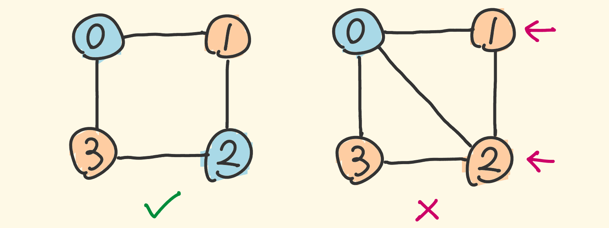

- [785. 判断二分图](#785-判断二分图)
  - [题目](#题目)
  - [题解](#题解)
    - [方法一：深度优先搜索](#方法一深度优先搜索)
    - [方法二：广度优先搜索](#方法二广度优先搜索)

------------------------------

# 785. 判断二分图

## 题目

给定一个无向图graph，当这个图为二分图时返回true。

如果我们能将一个图的节点集合分割成两个独立的子集A和B，并使图中的每一条边的两个节点一个来自A集合，一个来自B集合，我们就将这个图称为二分图。

graph将会以邻接表方式给出，`graph[i]` 表示图中**与节点 i 相连的所有节点**。每个节点都是一个在 0 到 graph.length-1 之间的整数。这图中没有自环和平行边： `graph[i]` 中不存在 i，并且 `graph[i]` 中没有重复的值。


示例 1:

```
输入: [[1,3], [0,2], [1,3], [0,2]]
输出: true
解释: 
无向图如下:
0----1
|    |
|    |
3----2
我们可以将节点分成两组: {0, 2} 和 {1, 3}。
```

示例 2:

```
输入: [[1,2,3], [0,2], [0,1,3], [0,2]]
输出: false
解释: 
无向图如下:
0----1
| \  |
|  \ |
3----2
我们不能将节点分割成两个独立的子集。
```

注意:

- graph 的长度范围为 `[1, 100]`。
- `graph[i]` 中的元素的范围为 `[0, graph.length - 1]`。
- `graph[i]` 不会包含 i 或者有重复的值。
- 图是无向的: 如果 j 在 `graph[i]` 里边, 那么 i 也会在 `graph[j]` 里边。

--------------------

- 来源：力扣（LeetCode）
- 链接：https://leetcode-cn.com/problems/is-graph-bipartite
- 著作权归领扣网络所有。商业转载请联系官方授权，非商业转载请注明出处。

## 题解

> 链接：https://leetcode-cn.com/problems/is-graph-bipartite/solution/pan-duan-er-fen-tu-by-leetcode-solution/

**前言**

对于图中的任意两个节点 u 和 v，如果它们之间有一条边直接相连，那么 u 和 v 必须属于不同的集合。

如果给定的无向图连通，那么我们就可以任选一个节点开始，给它**染成红色**。随后我们对整个图进行遍历，将该节点直接相连的所有节点染成绿色，表示这些节点不能与起始节点属于同一个集合。我们再将这些绿色节点直接相连的所有节点染成红色，以此类推，直到无向图中的每个节点均被染色。

如果我们能够成功染色，那么红色和绿色的节点各属于一个集合，这个无向图就是一个二分图；如果我们未能成功染色，即**在染色的过程中，某一时刻访问到了一个已经染色的节点，并且它的颜色与我们将要给它染上的颜色不相同**，也就说明这个无向图不是一个二分图。

算法的流程如下：

- 我们任选一个节点开始，将其染成红色，并从该节点开始对整个无向图进行遍历；
- 在遍历的过程中，如果我们通过节点 u 遍历到了节点 v（即 u 和 v 在图中有一条边直接相连），那么会有两种情况：
    - 如果 v 未被染色，那么我们将其染成与 u 不同的颜色，并对 v 直接相连的节点进行遍历；
    - 如果 v 被染色，并且颜色与 u 相同，那么说明给定的无向图不是二分图。我们可以直接退出遍历并返回 False 作为答案。
- 当遍历结束时，说明给定的无向图是二分图，返回 True 作为答案。

图从 https://leetcode-cn.com/problems/is-graph-bipartite/solution/shou-hua-tu-jie-bfs-si-lu-by-hyj8/ 复制过来的。



我们可以使用「**深度优先搜索**」或「**广度优先搜索**」对无向图进行遍历，下文分别给出了这两种搜索对应的代码。

注意：题目中给定的无向图**不一定保证连通**，因此我们需要进行多次遍历，**直到每一个节点都被染色**，或确定答案为 False 为止。每次遍历开始时，我们任选一个未被染色的节点，将所有与该节点直接或间接相连的节点进行染色。

### 方法一：深度优先搜索

```go
var (
    UNCOLORED, RED, GREEN = 0, 1, 2
    color []int
    valid bool
)

func isBipartite(graph [][]int) bool {
    n := len(graph)
    valid = true
    color = make([]int, n)
    for i := 0; i < n && valid; i++ {
        if color[i] == UNCOLORED {
            dfs(i, RED, graph)
        }
    }
    return valid
}

func dfs(node, c int, graph [][]int) {
    color[node] = c
    cNei := RED
    if c == RED {
        cNei = GREEN
    }
    for _, neighbor := range graph[node] {
        if color[neighbor] == UNCOLORED {
            dfs(neighbor, cNei, graph)
            if !valid {
                return 
            }
        } else if color[neighbor] != cNei {
            valid = false
            return
        }
    }
}
```

**复杂度分析**

- 时间复杂度：$O(N+M)$，其中 N 和 M 分别是无向图中的点数和边数。
- 空间复杂度：$O(N)$，存储节点颜色的数组需要 $O(N)$ 的空间，并且在深度优先搜索的过程中，栈的深度最大为 N，需要 $O(N)$ 的空间。


### 方法二：广度优先搜索

```go
var (
    UNCOLORED, RED, GREEN = 0, 1, 2
)

func isBipartite(graph [][]int) bool {
    n := len(graph)
    color := make([]int, n)
    for i := 0; i < n; i++ {
        if color[i] == UNCOLORED {
            queue := []int{}
            queue = append(queue, i)
            color[i] = RED
            for i := 0; i < len(queue); i++ {
                node := queue[i]
                cNei := RED
                if color[node] == RED {
                    cNei = GREEN
                }
                for _, neighbor := range graph[node] {
                    if color[neighbor] == UNCOLORED {
                        queue = append(queue, neighbor)
                        color[neighbor] = cNei
                    } else if color[neighbor] != cNei {
                        return false
                    } 
                }
            }
        }
    }
    return true
}
```

**复杂度分析**

- 时间复杂度：$O(N+M)$，其中 N 和 M 分别是无向图中的点数和边数。
- 空间复杂度：$O(N)$，存储节点颜色的数组需要 $O(N)$ 的空间，并且在广度优先搜索的过程中，队列中最多有 $N-1$ 个节点，需要 $O(N)$ 的空间。
