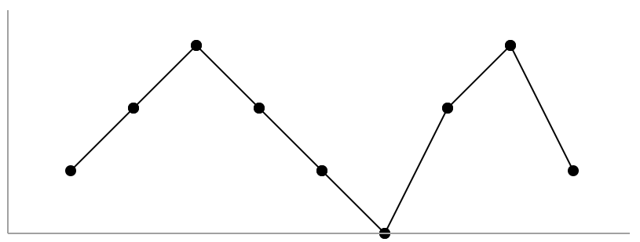

- [845. 数组中的最长山脉](#845-数组中的最长山脉)
  - [官方题解](#官方题解)
    - [方法一：枚举山顶](#方法一枚举山顶)
    - [方法二：枚举山脚](#方法二枚举山脚)

------------------------------

# 845. 数组中的最长山脉

我们把数组 A 中符合下列属性的任意连续子数组 B 称为 “山脉”：

- `B.length >= 3`
- 存在 `0 < i < B.length - 1` 使得 `B[0] < B[1] < ... B[i-1] < B[i] > B[i+1] > ... > B[B.length - 1]`

（注意：B 可以是 A 的任意子数组，包括整个数组 A。）

给出一个整数数组 A，返回最长 “山脉” 的长度。

如果不含有 “山脉” 则返回 0。

示例 1：

```
输入：[2,1,4,7,3,2,5]
输出：5
解释：最长的 “山脉” 是 [1,4,7,3,2]，长度为 5。
```

示例 2：

```
输入：[2,2,2]
输出：0
解释：不含 “山脉”。
```
 
提示：

- 0 <= A.length <= 10000
- 0 <= `A[i]` <= 10000

--------------------

- 来源：力扣（LeetCode）
- 链接：https://leetcode-cn.com/problems/longest-mountain-in-array
- 著作权归领扣网络所有。商业转载请联系官方授权，非商业转载请注明出处。


## 官方题解

> 链接：https://leetcode-cn.com/problems/longest-mountain-in-array/solution/shu-zu-zhong-de-zui-chang-shan-mai-by-leetcode-sol/

### 方法一：枚举山顶

对于一座「山脉」，我们称首元素 $B[0]$ 和尾元素 $B[\text{len}(B)-1]$ 为「山脚」，满足题目要求 $B[i-1] < B[i] > B[i+1]$ 的元素 $B[i]$ 为「山顶」。为了找出数组 $A$ 中最长的山脉，我们可以考虑枚举山顶，再从山顶向左右两侧扩展找到山脚。

由于从左侧山脚到山顶的序列是**严格单调递增**的，而从山顶到右侧山脚的序列是**严格单调递减**的，因此我们可以使用动态规划（也可以理解为递推）的方法，计算出从任意一个元素开始，向左右两侧最多可以扩展的元素数目。

我们用 $\textit{left}[i]$ 表示 $A[i]$ 向左侧最多可以扩展的元素数目。如果 $A[i-1] < A[i]$，那么 $A[i]$ 可以向左扩展到 $A[i-1]$，再扩展 $\textit{left}[i]$ 个元素，因此有

$$
\textit{left}[i] = \textit{left}[i-1] + 1
$$

如果 $A[i-1] \geq A[i]$，那么 $A[i]$ 无法向左扩展，因此有

$$
\textit{left}[i] = 0
$$

特别地，当 $i=0$ 时，$A[i]$ 为首元素，无法向左扩展，因此同样有

$$
\textit{left}[0] = 0
$$

同理，我们用 $\textit{right}[i]$ 表示 $A[i]$ 向右侧最多可以扩展的元素数目，那么有类似的状态转移方程（递推式）

$$
\textit{right}[i] = \begin{cases} \textit{right}[i+1]+1, & A[i] > A[i+1] \\ 0, & A[i] \leq A[i+1] ~或~ i=n-1 \end{cases}
$$
 

其中 $n$ 是数组 $A$ 的长度。

在计算出所有的 $\textit{left}[]$ 以及 $\textit{right}[]$ 之后，我们就可以枚举山顶。需要注意的是，只有当 $\textit{left}[i]$ 和 $\textit{right}[i]$ 均大于 0 时，$A[i]$ 才能作为山顶，并且山脉的长度为 $\textit{left}+\textit{right}[i]+1$。

在所有的山脉中，最长的即为答案。

```go
func longestMountain(a []int) (ans int) {
    n := len(a)
    left := make([]int, n)
    for i := 1; i < n; i++ {
        if a[i-1] < a[i] {
            left[i] = left[i-1] + 1
        }
    }
    right := make([]int, n)
    for i := n - 2; i >= 0; i-- {
        if a[i+1] < a[i] {
            right[i] = right[i+1] + 1
        }
    }
    for i, l := range left {
        r := right[i]
        if l > 0 && r > 0 && l+r+1 > ans {
            ans = l + r + 1
        }
    }
    return
}
```

- 时间复杂度：$O(n)$，其中 $n$ 是数组 $A$ 的长度。
- 空间复杂度：$O(n)$，即为数组 $\textit{left}$ 和 $\textit{right}$ 需要使用的空间。

### 方法二：枚举山脚

我们也可以枚举山脚。例如当我们从左向右遍历整个数组 $A$ 时，可以使用双指针的方法，一个指针枚举左侧山脚，另一个指针不断向右移动到右侧山脚。



具体地，我们使用指针 $\textit{left}$ 指向左侧山脚，它的初始值为 0。每次当我们固定 $\textit{left}$ 时：

- 我们首先需要保证 $\textit{left} + 2 < n$，这是因为山脉的长度至少为 3；其次我们需要保证 $A[\textit{left}] < A[\textit{left} + 1]$，否则 $\textit{left}$ 对应的不可能时左侧山脚；
- 我们将右侧山脚的 $\textit{right}$ 的初始值置为 $\textit{left}+1$，随后不断地向右移动 $\textit{right}$，直到不满足 $A[\textit{right}] < A[\textit{right} + 1]$ 为止，此时：
    - 如果 $\textit{right} = n-1$，说明我们已经移动到了数组末尾，已经无法形成山脉了；
    - 否则，$\textit{right}$ 指向的可能是山顶。我们需要额外判断是有满足 $A[\textit{right}] > A[\textit{right} + 1]$，这是因为如果两者相等，那么 $\textit{right}$ 指向的就不是山顶了。
- 如果 $\textit{right}$ 指向的确实是山顶，那么我们使用类似的方法，不断地向右移动 $\textit{right}$，直到不满足 $A[\textit{right}] > A[\textit{right} + 1]$ 为止，此时，$\textit{right}$ 指向右侧山脚，$A[\textit{left}]$ 到 $A[\textit{right}]$ 就对应着一座山脉；
- 需要注意的是，右侧山脚有可能是下一个左侧山脚，因此我们需要将 $\textit{right}$ 的值赋予 $\textit{left}$，以便与进行下一次枚举。在其它所有不满足要求的情况下，$\textit{right}$ 对应的位置都不可能是下一个左侧山脚，因此可以将 $\textit{right} + 1$ 的值赋予 $\textit{left}$。

在下面的代码中，当不满足要求时，我们立即将 $\textit{right}$ 的值加 1。这样一来，我们就可以统一在下一次枚举左侧山脚之前，将 $\textit{right}$ 的值赋予 $\textit{left}$ 了。

```go
func longestMountain(a []int) (ans int) {
    n := len(a)
    left := 0
    for left+2 < n {
        right := left + 1
        if a[left] < a[left+1] { // 向上的趋势
            // 用 right 找山顶。
            for right+1 < n && a[right] < a[right+1] {
                right++
            }
            if right < n-1 && a[right] > a[right+1] {
                // 用 right 找山脚
                for right+1 < n && a[right] > a[right+1] {
                    right++
                }
                if right-left+1 > ans {
                    ans = right - left + 1
                }
            } else {
                right++
            }
        }
        left = right
    }
    return
}
```

- 时间复杂度：$O(n)$，其中 $n$ 是数组 $A$ 的长度。
- 空间复杂度：$O(1)$。
